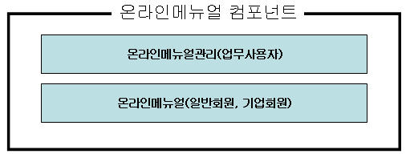
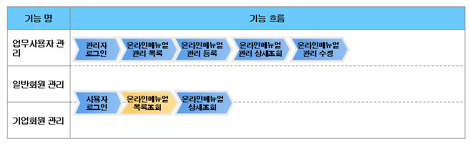
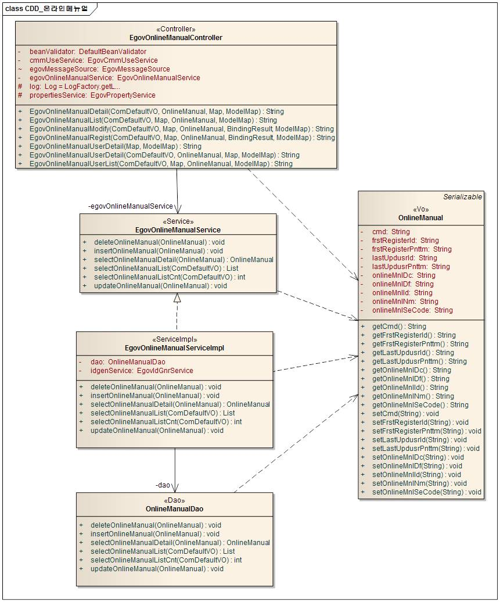
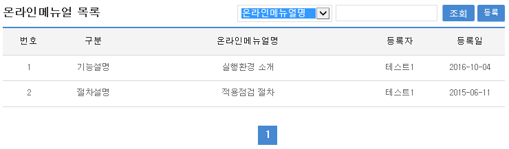
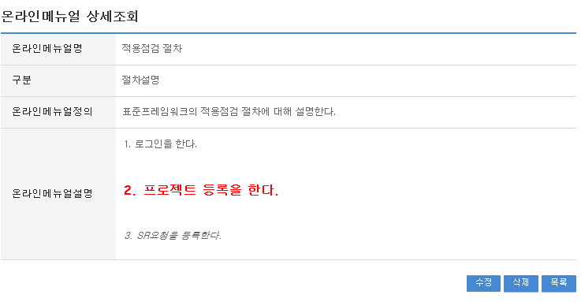
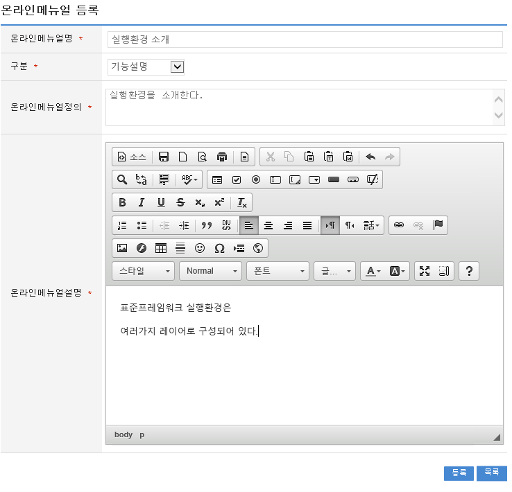
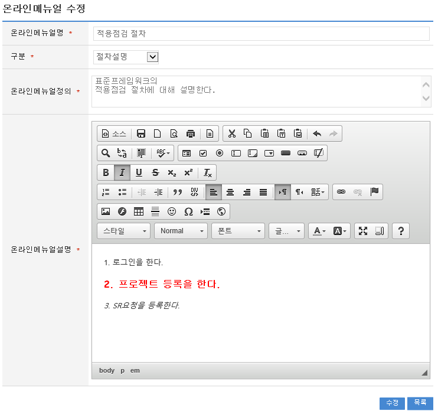

# 온라인매뉴얼

## 개요

 응용 프로그램의 온라인 매뉴얼을 등록하고 조회 할 수 있는 기능을 제공한다.
 컴포넌트 구성

 

 기능흐름

 

## 설명

### 패키지 참조 관계

 온라인매뉴얼 패키지는 요소기술의 공통 패키지(cmm)에 대해서만 직접적인 함수적 참조 관계를 가진다. 하지만, 컴포넌트 배포 시 오류 없이 실행되기 위하여 패키지 간의 참조관계에 따라 포맷/날짜/계산, 웹에디터 패키지들과 함께 배포 파일을 구성한다.
 패키지 간 참조 관계 : [사용자지원 Package Dependency](../intro/package-reference.md/#사용자지원)

### 관련소스

| 유형 | 대상소스명 | 비고 |
| --- | --- | --- |
| Controller | egovframework.com.uss.olh.omm.web.EgovOnlineManualController.java | 온라인매뉴얼관리 Controller Class |
| Service | egovframework.com.uss.olh.omm.service.EgovOnlineManualService.java | 온라인매뉴얼관리 Service Class |
| ServiceImpl | egovframework.com.uss.olh.omm.service.impl.EgovOnlineManualServiceImpl.java | 온라인매뉴얼관리 ServiceImpl Class |
| Model | egovframework.com.uss.olh.omm.service.OnlineManualVO.java | 온라인매뉴얼관리 Model Class |
| DAO | egovframework.com.uss.olh.omm.service.impl.EgovOnlineManualDAO.java | 온라인매뉴얼관리 Dao Class |
| JSP | /WEB-INF/jsp/egovframework/com/uss/olh/omm/EgovOnlineManualList.jsp | 온라인매뉴얼관리 목록조회 페이지 |
| JSP | /WEB-INF/jsp/egovframework/com/uss/olh/omm/EgovOnlineManualRegist.jsp | 온라인매뉴얼관리 등록 페이지 |
| JSP | /WEB-INF/jsp/egovframework/com/uss/olh/omm/EgovOnlineManualUpdt.jsp | 온라인매뉴얼관리 수정 페이지 |
| JSP | /WEB-INF/jsp/egovframework/com/uss/olh/omm/EgovOnlineManualDetail.jsp | 온라인매뉴얼관리 상세조회 페이지 |
| JSP | /WEB-INF/jsp/egovframework/com/uss/olh/omm/EgovOnlineManualUserList.jsp | 사용자온라인매뉴얼 목록조회 페이지 |
| JSP | /WEB-INF/jsp/egovframework/com/uss/olh/omm/EgovOnlineManualUserDetail.jsp | 사용자온라인매뉴얼 상세조회 페이지 |
| Query XML | resources/egovframework/mapper/com/uss/olh/omm/EgovOnlineManual\_SQL\_altibase.xml | 온라인매뉴얼관리를 위한 Altibase용 Query XML |
| Query XML | resources/egovframework/mapper/com/uss/olh/omm/EgovOnlineManual\_SQL\_cubrid.xml | 온라인매뉴얼관리를 위한 Cubrid용 Query XML |
| Query XML | resources/egovframework/mapper/com/uss/olh/omm/EgovOnlineManual\_SQL\_maria.xml | 온라인매뉴얼관리를 위한 MariaDB용 Query XML |
| Query XML | resources/egovframework/mapper/com/uss/olh/omm/EgovOnlineManual\_SQL\_mysql.xml | 온라인매뉴얼관리를 위한 MySQL용 Query XML |
| Query XML | resources/egovframework/mapper/com/uss/olh/omm/EgovOnlineManual\_SQL\_oracle.xml | 온라인매뉴얼관리를 위한 Oracle용 Query XML |
| Query XML | resources/egovframework/mapper/com/uss/olh/omm/EgovOnlineManual\_SQL\_postgres.xml | 온라인매뉴얼관리를 위한 PostgreSQL용 Query XML |
| Query XML | resources/egovframework/mapper/com/uss/olh/omm/EgovOnlineManual\_SQL\_tibero.xml | 온라인매뉴얼관리를 위한 Tibero용 Query XML |
| Query XML | resources/egovframework/mapper/com/uss/olh/omm/EgovOnlineManual\_SQL\_goldilocks.xml | 온라인매뉴얼관리를 위한 Goldilocks용 Query XML |
| Message properties | resources/egovframework/message/com/uss/olh/omm/message\_ko.properties | 온라인매뉴얼관리를 위한 Message properties(한글) |
| Message properties | resources/egovframework/message/com/uss/olh/omm/message\_en.properties | 온라인매뉴얼관리를 위한 Message properties(영문) |
| Idgen XML | resources/egovframework/spring/com/idgn/context-idgn-OnlineMenual.xml | 온라인매뉴얼관리 Id생성 Idgen XML |

### 클래스 다이어그램

 

### 관련코드

| 코드분류 | 코드분류명 | 코드ID | 코드명 |
| --- | --- | --- | --- |
| COM041 | 온라인매뉴얼구분 | 001 | 절차설명 |
| COM041 | 온라인매뉴얼구분 | 002 | 기능설명 |
| COM041 | 온라인매뉴얼구분 | 003 | 기타설명 |

### ID Generation

#### ID Generation 관련 DDL 및 DML

 ID Generation Service를 활용하기 위해서 Sequence 저장테이블인  COMTECOPSEQ에 ONLINE_MUL_ID 항목을 추가해야 한다.

```sql
CREATE TABLE COMTECOPSEQ ( table_name varchar(16) NOT NULL, 
  		   next_id DECIMAL(30) NOT NULL,
  		   PRIMARY KEY (table_name));
  INSERT INTO COMTECOPSEQ VALUES('ONLINE_MUL_ID','0');
```

#### ID Generation 환경설정(context-idgn-OnlineMenual.xml)

```xml
<bean name="egovOnlineMenualIdGnrService"
		class="egovframework.rte.fdl.idgnr.impl.EgovTableIdGnrService"
		destroy-method="destroy">
		<property name="dataSource" ref="egov.dataSource" />
		<property name="strategy" ref="onlineMenualMsgtrategy" />
		<property name="blockSize" 	value="1"/>
		<property name="table"	   	value="COMTECOPSEQ"/>
		<property name="tableName"	value="ONLINE_MUL_ID"/>
	</bean>
	<bean name="onlineMenualMsgtrategy"
		class="egovframework.rte.fdl.idgnr.impl.strategy.EgovIdGnrStrategyImpl">
		<property name="prefix" value="OMUL_" />
		<property name="cipers" value="15" />
		<property name="fillChar" value="0" />
	</bean>
```

### 관련테이블

| 테이블명 | 테이블명(영문) | 비고 |
| --- | --- | --- |
| 온라인매뉴얼관리 | COMTNONLINEMANUAL | 온라인매뉴얼을 관리한다. |

## 관련기능

 온라인매뉴얼관리기능은 크게 온라인매뉴얼관리 목록조회, 온라인매뉴얼관리 상세조회, 온라인매뉴얼관리 내용등록, 온라인매뉴얼관리 내용수정기능으로 구성되어 있다.

### 온라인매뉴얼관리 목록조회

#### 비즈니스 규칙

 관리자가 기(記) 등록된 온라인메뉴얼관리 정보를 리스트 형태로 조회 할 수 있고, 등록버튼을 클릭하여 등록화면으로 이동할 수 있다.

#### 관련코드

 N/A

#### 관련화면 및 수행매뉴얼

| Action | URL | Controller method | SQL Namespace | SQL QueryID |
| --- | --- | --- | --- | --- |
| 목록조회 | /uss/olh/omm/selectOnlineManualList.do | selectOnlineManualList | "OnlineManual" | "selectOnlineManualList" |
|  |  |  | "OnlineManual" | "selectOnlineManualListCnt" |

 

 등록: 등록하기 위해서는 상단의 등록 버튼을 통해서 온라인메뉴얼관리 등록 화면으로 이동한다.
 목록 온라인메뉴얼명: 온라인메뉴얼관리 상세조회 화면으로 이동한다

### 온라인매뉴얼관리 상세조회

#### 비즈니스 규칙

 온라인매뉴얼관리 목록에서 목록 클릭 시 이동되는 화면으로 온라인매뉴얼관리에 대한 상세정보를 보여준다.

#### 관련코드

 N/A

#### 관련화면 및 수행매뉴얼

| Action | URL | Controller method | SQL Namespace | SQL QueryID |
| --- | --- | --- | --- | --- |
| 상세조회 | /uss/olh/omm/selectOnlineManualDetail.do | selectOnlineManualDetail | "OnlineManual" | "selectOnlineManualDetail" |
| 삭제 | /uss/olh/omm/deleteOnlineManual.do | deleteOnlineManual | "OnlineManual" | "deleteOnlineManual" |

 

 삭제: 삭제버튼 클릭 시 삭제여부를 확인하는 메시지를 보여주고 삭제처리를 할 수 있다.
 목록: 온라인매뉴얼관리 목록 화면으로 이동한다.
 수정: 수정버튼 클릭 시 온라인매뉴얼관리 수정 화면으로 이동한다.

### 온라인매뉴얼관리 내용등록

#### 비즈니스 규칙

 온라인매뉴얼관리에 관한 기본정보를 입력 저장처리한다. 입력명 우측의 빨간* 표시는 반드시 입력해야할 항목을 표시한다.

#### 관련코드

 N/A

#### 관련화면 및 수행매뉴얼

| Action | URL | Controller method | SQL Namespace | SQL QueryID |
| --- | --- | --- | --- | --- |
| 등록화면 | /uss/olh/omm/insertOnlineManualView.do | insertOnlineManualView |  |  |
| 등록 | /uss/olh/omm/insertOnlineManual.do | insertOnlineManual | "OnlineManual" | "insertOnlineManual" |

 

 목록: 온라인메뉴얼관리 목록 화면으로 이동한다.
 저장: 입력한 온라인매뉴얼관리 정보들이 저장 처리된다.

### 온라인매뉴얼관리 내용수정

#### 비즈니스 규칙

 입력명 우측의 빨간* 표시는 수정 시 반드시 입력해야 할 항목을 표시한다.

#### 관련코드

 N/A

#### 관련화면 및 수행매뉴얼

| Action | URL | Controller method | SQL Namespace | SQL QueryID |
| --- | --- | --- | --- | --- |
| 수정화면 | /uss/olh/omm/updateOnlineManualView.do | updateOnlineManualView | "OnlineManual" | "selectOnlineManualDetail" |
| 수정 | /uss/olh/omm/updateOnlineManual.do | updateOnlineManual | "OnlineManual" | "updateOnlineManual" |

 

 저장: 수정된 정보들이 저장 처리된다.
 목록: 온라인매뉴얼관리 목록 화면으로 이동한다.

## 참고자료

 실행환경 참조 : ID Generation Service
