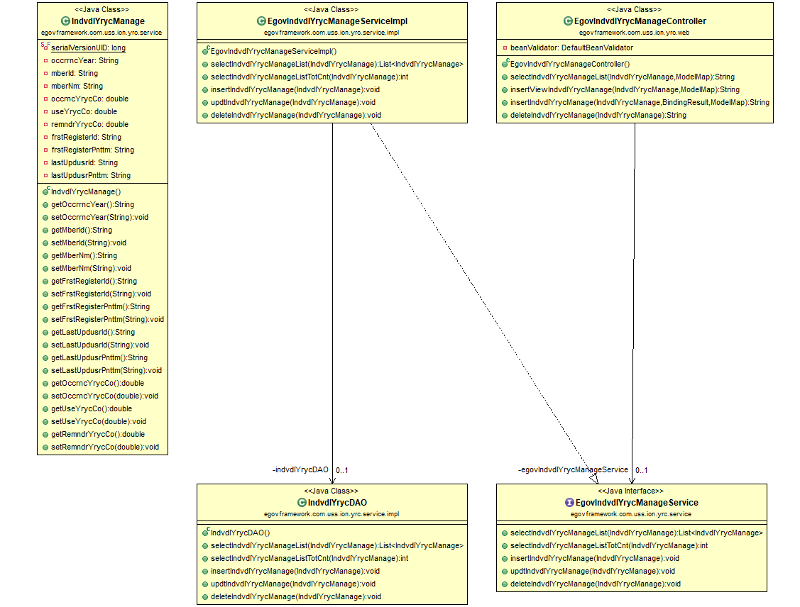

# 개인연차관리

## 개요

 개인연차관리는 시스템에서 개인의 연차정보를 관리하는 기능으로 연차 조회, 등록, 수정하는 기능을 제공한다.

## 설명

 개인연차관리는 개인연차를 등록하기 위한 목적으로 연차 등록, 수정, 삭제, 목록조회 기능을 수반한다.

```text
  ① 연차관리목록 : 연차관리 정보를 조회하고, 그 결과 목록을 화면에 반영한다.
  ② 여차등록 : 연차정보를 등록하고, 등록 결과를 조회한다.
  ③ 연차수정 : 기 등록된 연차정보의 항목들을 수정한다.
  ④ 연차삭제 : 기 등록된 연차정보를 삭제한다.
```

#### 관련소스

| 유형 | 대상소스명 | 비고 |
| --- | --- | --- |
| Controller | egovframework.com.uss.ion.yrc.web.EgovIndvdlYrycManageController.java | 연차 관리를 위한 컨트롤러 클래스 |
| Service | egovframework.com.uss.ion.yrc.service.EgovIndvdlYrycManageService.java | 연차 관리를 위한 서비스 인터페이스 |
| ServiceImpl | egovframework.com.uss.ion.yrc.service.impl.EgovIndvdlYrycManageServiceImpl.java | 연차 관리를 위한 서비스 구현 클래스 |
| DAO | egovframework.com.uss.ion.yrc.service.impl.IndvdlYrycDAO.java | 연차 관리를 위한 데이터처리 클래스 |
| VO | egovframework.com.uss.ion.yrc.service.IndvdlYrycManage.java | 연차 관리를 위한 VO 클래스 |
| JSP | /WEB-INF/jsp/egovframework/com/uss/ion/yrc/EgovIndvdlYrycManageList.jsp | 연차 목록조회를 위한 jsp페이지 |
| JSP | /WEB-INF/jsp/egovframework/com/uss/ion/yrc/EgovIndvdlYrycRegist.jsp | 연차 등록/수정를 위한 jsp페이지 |
| XML | resources/egovframework/mapper/com/uss/ion/yrc/EgovIndvdlYrycManage\_SQL\_altibase.xml | 연차관리 QUERY Altibase XML |
| XML | resources/egovframework/mapper/com/uss/ion/yrc/EgovIndvdlYrycManage\_SQL\_cubrid.xml | 연차관리 QUERY Cubrid XML |
| XML | resources/egovframework/mapper/com/uss/ion/yrc/EgovIndvdlYrycManage\_SQL\_maria.xml | 연차관리 QUERY MariaDB XML |
| XML | resources/egovframework/mapper/com/uss/ion/yrc/EgovIndvdlYrycManage\_SQL\_mysql.xml | 연차관리 QUERY MySQL XML |
| XML | resources/egovframework/mapper/com/uss/ion/yrc/EgovIndvdlYrycManage\_SQL\_oracle.xml | 연차관리 QUERY Oracle XML |
| XML | resources/egovframework/mapper/com/uss/ion/yrc/EgovIndvdlYrycManage\_SQL\_postgres.xml | 연차관리 QUERY PostgreSQL XML |
| XML | resources/egovframework/mapper/com/uss/ion/yrc/EgovIndvdlYrycManage\_SQL\_tibero.xml | 연차관리 QUERY Tibero XML |
| XML | resources/egovframework/mapper/com/uss/ion/yrc/EgovIndvdlYrycManage\_SQL\_goldilocks.xml | 연차관리 QUERY Goldilocks XML |
| Message properties | resources/egovframework/message/com/uss/ion/yrc/message\_ko.properties | 연차관리 Message properties |
| Message properties | resources/egovframework/message/com/uss/ion/yrc/message\_en.properties | 연차관리 Message properties |

#### 클래스 다이어그램

 

#### 관련테이블

| 테이블명 | 테이블명(영문) | 비고 |
| --- | --- | --- |
| 개인별연차관리 | COMTNINDVDLYRYCMANAGE | 개인별 연차를 관리하기 위한 속성정보를 정의하고, 관리한다. |

## 관련화면 및 수행메뉴얼

#### 연차관리 목록조회

| Action | URL | Controller method | QueryID |
| --- | --- | --- | --- |
| 조회 | /uss/ion/yrc/EgovIndvdlYrycManageList.do | selectIndvdlYrycManageList | "indvdlYrycDAO.selectIndvdlYrycManageList" |
| 조회 | /uss/ion/yrc/EgovIndvdlYrycManageList.do | selectIndvdlYrycManageList | "indvdlYrycDAO.selectIndvdlYrycManageListTotCnt" |

 

 조회 : 기 등록된 연차관리의 목록을 조회한다.
 등록 : 신규 연차을 등록하기 위해서는 상단의 등록 버튼을 통해서 연차 등록 화면으로 이동한다.
 수정 : 등록된 연차가 존재하면 상단의 수정 버튼을 통해서  연차 수정 화면으로 이동한다.

#### 연차 등록

| Action | URL | Controller method | QueryID |
| --- | --- | --- | --- |
| 등록 | /uss/ion/yrc/EgovIndvdlYrycRegist.do | insertIndvdlYrycManage | "indvdlYrycDAO.insertIndvdlYrycManage" |

 연차의 속성(발생연차, 사용연차)정보를 입력한 뒤 등록한다.
 잔여연차는 발생연차에서 사용연차를 제외한 남은연차로 자동 계산되어 저장된다.
 연차등록 및 수정은 개인계정에 한하여 등록이 가능하며, 등록/수정 시 발생연도는 해당연도로 변경되어 저장됨

 

 등록 : 신규 연차을 등록하기 위해서는 휴가 속성을 입력한 뒤 상단의 등록 버튼을 통해서 연차을 등록한다.
 목록 : 연차 목록조회 화면으로 이동한다.

#### 연차 수정

| Action | URL | Controller method | QueryID |
| --- | --- | --- | --- |
| 수정 | /uss/ion/yrc/EgovIndvdlYrycRegist.do | insertIndvdlYrycManage | "indvdlYrycDAO.updtIndvdlYrycManage" |

 연차의 속성정보를 변경한 후 저장한다.

 

 저장 : 기 등록된 연차 속성을 수정한 뒤 상단의 수정 버튼을 통해서 연차 정보를 수정한다.
 삭제 : 기 등록된 연차에 대해 삭제 버튼을 통해서 연차 정보를 삭제한다.
 목록 : 휴가 목록조회 화면으로 이동한다.
