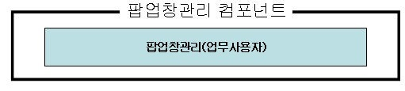
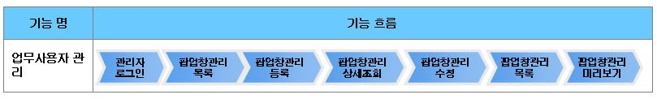
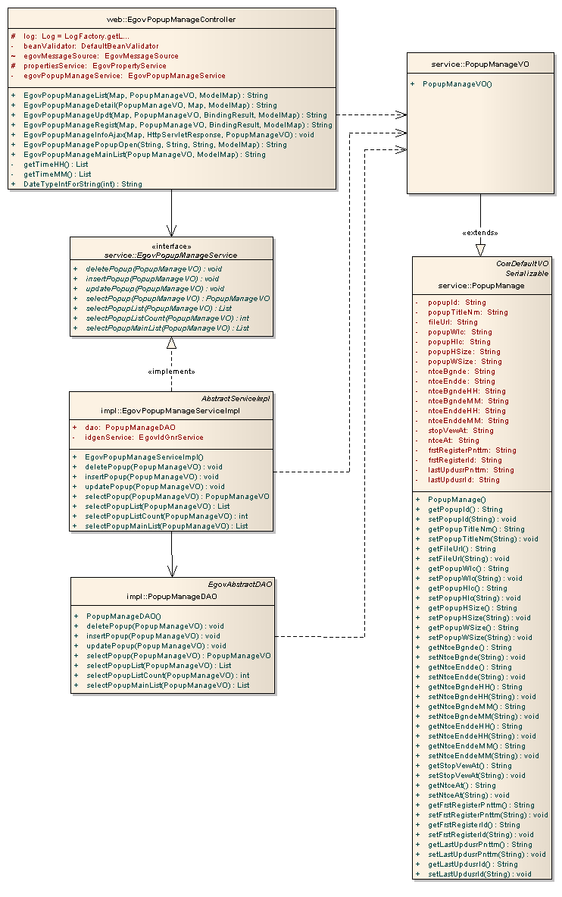
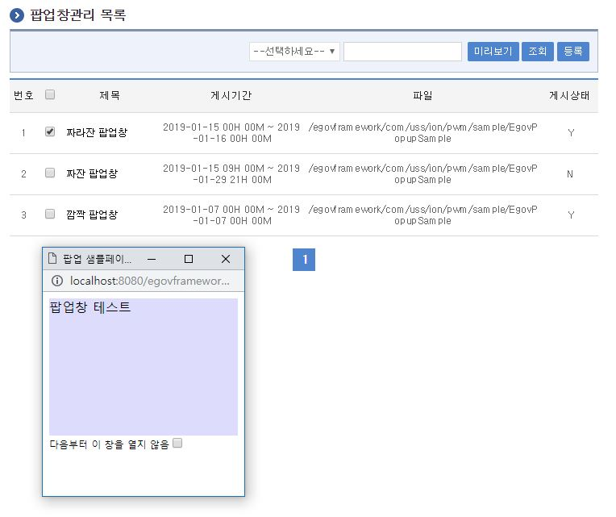
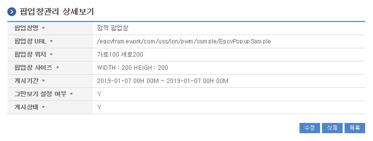
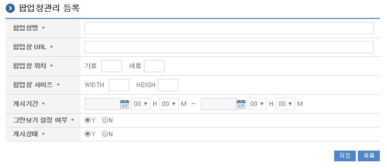
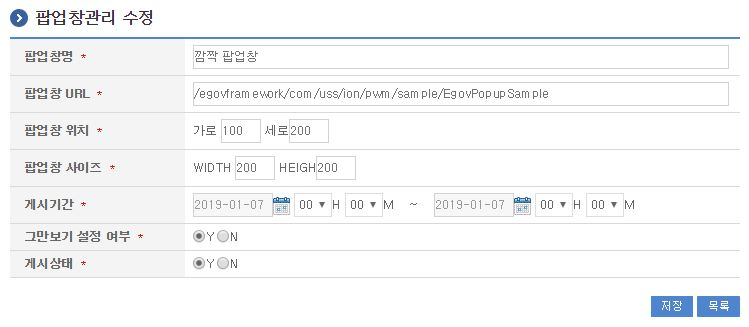

# 팝업창관리

## 개요

 관리자가 초기화면에서 나타날 팝업창을 등록하고 사용자가 접속하면 나타나게 하는 기능을 제공한다.
 컴포넌트 구성

 

 기능흐름

 

## 설명

### 패키지 참조 관계

 팝업창관리 패키지는 요소기술의 공통 패키지(cmm)에 대해서만 직접적인 함수적 참조 관계를 가진다. 하지만, 컴포넌트 배포 시 오류 없이 실행되기 위하여 패키지 간의 참조관계에 따라 달력 패키지와 함께 배포 파일을 구성한다.
 패키지 간 참조 관계 : [사용자지원 Package Dependency](../intro/package-reference.md#사용자지원)

### 관련소스

| 유형 | 대상소스명 | 비고 |
| --- | --- | --- |
| Controller | egovframework.com.uss.ion.pwm.web.EgovPopupManageController.java | 팝업창관리 Controller Class |
| Service | egovframework.com.uss.ion.pwm.service.EgovPopupManageService.java | 팝업창관리 Service Class |
| ServiceImpl | egovframework.com.uss.ion.pwm.service.impl.EgovPopupManageServiceImpl.java | 팝업창관리 ServiceImpl Class |
| VO | egovframework.com.uss.ion.pwm.service.PopupManageVO.java | 팝업창관리 VO Class |
| VO | egovframework.com.cmm.ComDefaultVO.java | 검색 VO Class |
| DAO | egovframework.com.uss.ion.pwm.service.impl.PopupManageDAO.java | 팝업창관리 Dao Class |
| JSP | /WEB-INF/jsp/egovframework/com/uss/ion/pwm/EgovPopupList.jsp | 팝업창관리 목록조회 페이지 |
| JSP | /WEB-INF/jsp/egovframework/com/uss/ion/pwm/EgovPopupRegist.jsp | 팝업창관리 등록 페이지 |
| JSP | /WEB-INF/jsp/egovframework/com/uss/ion/pwm/EgovPopupUpdt.jsp | 팝업창관리 수정 페이지 |
| JSP | /WEB-INF/jsp/egovframework/com/uss/ion/pwm/EgovPopupDetail.jsp | 팝업창관리 상세조회 페이지 |
| QUERY XML | resources/egovframework/mapper/com/uss/ion/pwm/PopupManage\_SQL\_altibase.xml | 팝업창관리 Altibase용 QUERY XML |
| QUERY XML | resources/egovframework/mapper/com/uss/ion/pwm/PopupManage\_SQL\_cubrid.xml | 팝업창관리 Cubrid용 QUERY XML |
| QUERY XML | resources/egovframework/mapper/com/uss/ion/pwm/PopupManage\_SQL\_maria.xml | 팝업창관리 Maria용 QUERY XML |
| QUERY XML | resources/egovframework/mapper/com/uss/ion/pwm/PopupManage\_SQL\_mysql.xml | 팝업창관리 MySQL용 QUERY XML |
| QUERY XML | resources/egovframework/mapper/com/uss/ion/pwm/PopupManage\_SQL\_oracle.xml | 팝업창관리 Oracle용 QUERY XML |
| QUERY XML | resources/egovframework/mapper/com/uss/ion/pwm/PopupManage\_SQL\_postgres.xml | 팝업창관리 Postgres용 QUERY XML |
| QUERY XML | resources/egovframework/mapper/com/uss/ion/pwm/PopupManage\_SQL\_tibero.xml | 팝업창관리 Tibero용 QUERY XML |
| QUERY XML | resources/egovframework/mapper/com/uss/ion/pwm/PopupManage\_SQL\_goldilocks.xml | 팝업창관리 Goldilocks용 QUERY XML |
| Message properties | resources/egovframework/message/com/uss/ion/pwm/message\_ko.properties | 팝업창관리 Message properties(한글) |
| Message properties | resources/egovframework/message/com/uss/ion/pwm/message\_en.properties | 팝업창관리 Message properties(영문) |
| Idgen XML | resources/egovframework/spring/com/idgn/context-idgn-PopupManage.xml | 팝업창관리 Id생성 Idgen XML |

### 클래스 다이어그램

 

### ID Generation

#### ID Generation 관련 DDL 및 DML

 ID Generation Service를 활용하기 위해서 Sequence 저장테이블인  COMTECOPSEQ에 POPUP_ID 항목을 추가해야 한다.

```sql
CREATE TABLE COMTECOPSEQ( TABLE_NAME VARCHAR(20) NOT NULL,
	                  NEXT_ID    NUMERIC(30) NULL,
	                  PRIMARY KEY (TABLE_NAME));
 
  INSERT INTO COMTECOPSEQ ( TABLE_NAME, NEXT_ID ) VALUES ('POPUP_ID', 1);
```

#### ID Generation 환경설정(context-idgn-PopupManage.xml)

```xml
<bean name="egovPopupManageIdGnrService" class="egovframework.rte.fdl.idgnr.impl.EgovTableIdGnrServiceImpl" destroy-method="destroy">
		<property name="dataSource"     ref="egov.dataSource" />
		<property name="strategy"       ref="egovPopupManageIdMsgtrategy" />
		<property name="blockSize" 	value="10"/>
		<property name="table"	   	value="COMTECOPSEQ"/>
		<property name="tableName"	value="POPUP_ID"/>
	</bean>
	<bean name="egovPopupManageIdMsgtrategy" class="egovframework.rte.fdl.idgnr.impl.strategy.EgovIdGnrStrategyImpl">
		<property name="prefix" value="POPUP_" />
		<property name="cipers" value="14" />
		<property name="fillChar" value="0" />
	</bean>
```

### 관련테이블

| 테이블명 | 테이블명(영문) | 비고 |
| --- | --- | --- |
| 팝업창관리 | COMTNPOPUPMANAGE | 팝업창정보를 관리 한다. |

## 관련기능

 팝업창관리기능은 크게 팝업창관리 목록조회, 팝업창관리 상세조회, 팝업창관리 내용등록, 팝업창관리 내용수정, 팝업창 미리보기 기능으로 구성되어 있다.

### 팝업창관리 목록조회

#### 비즈니스 규칙

 관리자가 기(記) 등록된 팝업창관리 정보를 리스트 형태로 조회할 수 있고, 등록버튼을 클릭하여 등록화면으로 이동할 수 있다.

#### 관련코드

 N/A

#### 관련화면 및 수행매뉴얼

| Action | URL | Controller method | SQL Namespace | SQL QueryID |
| --- | --- | --- | --- | --- |
| 목록조회 | /uss/ion/pwm/listPopup.do | egovPopupManageList | "PopupManage" | "selectPopupManage", |
|  |  |  | "PopupManage" | "selectPopupManageCnt" |

 

 등록: 등록하기 위해서는 상단의 등록 버튼을 통해서 팝업창관리 등록 화면으로 이동한다.
 목록(제목): 팝업창관리 상세조회 화면으로 이동한다.
 미리보기: 작성한 팝업창을 미리보기 할 수 있는 기능(자바스크립트를 실행하여 새창 형태로 미리보기 되는 기능을 제공한다.)

### 팝업창관리 상세조회

#### 비즈니스 규칙

 팝업창관리 목록에서 목록 클릭 시 이동되는 화면으로 팝업창관리에 대한 상세정보를 보여준다.

#### 관련코드

 N/A

#### 관련화면 및 수행매뉴얼

| Action | URL | Controller method | SQL Namespace | SQL QueryID |
| --- | --- | --- | --- | --- |
| 상세조회 | /uss/ion/pwm/detailPopup.do | egovPopupManageDetail | "PopupManage" | "selectPopupManageDetail" |
| 삭제 | /uss/ion/pwm/detailPopup.do | egovPopupManageDetail | "PopupManage" | "deletePopupManage" |

 

 수정: 수정버튼 클릭시 팝업창관리 수정 화면으로 이동한다.
 삭제: 삭제버튼 클릭시 삭제여부를 확인하는 메시지를 보여주고 삭제처리를 할 수 있다.
 목록: 팝업창관리 목록 화면으로 이동한다.

### 팝업창관리 등록

#### 비즈니스 규칙

 팝업창관리에 관한 기본정보를 입력 저장처리한다. 입력명 우측의 빨간* 표시는 반드시 입력해야할 항목을 표시한다.

#### 관련코드

 N/A

#### 관련화면 및 수행매뉴얼

| Action | URL | Controller method | SQL Namespace | SQL QueryID |
| --- | --- | --- | --- | --- |
| 등록 | /uss/ion/pwm/registPopup.do | egovPopupManageRegist | "PopupManage" | "insertPopupManage" |

 

 저장: 입력한 팝업창관리 정보들이 저장 처리된다.
 목록: 팝업창관리 목록 화면으로 이동한다.

### 팝업창관리 수정

#### 비즈니스 규칙

 수정된 팝업창관리 정보를 저장 처리한다. 입력명 우측의 빨간* 표시는 수정 시 반드시 입력해야 할 항목을 표시한다.

#### 관련코드

 N/A

#### 관련화면 및 수행매뉴얼

| Action | URL | Controller method | SQL Namespace | SQL QueryID |
| --- | --- | --- | --- | --- |
| 수정 | /uss/ion/pwm/updtPopup.do | egovPopupManageUpdt | "PopupManage" | "updatePopupManage" |

 

 저장: 수정된 정보들이 저장 처리된다.
 목록: 팝업창관리 목록 화면으로 이동한다.

## 참고자료

 실행환경 참조 : ID Generation Service
