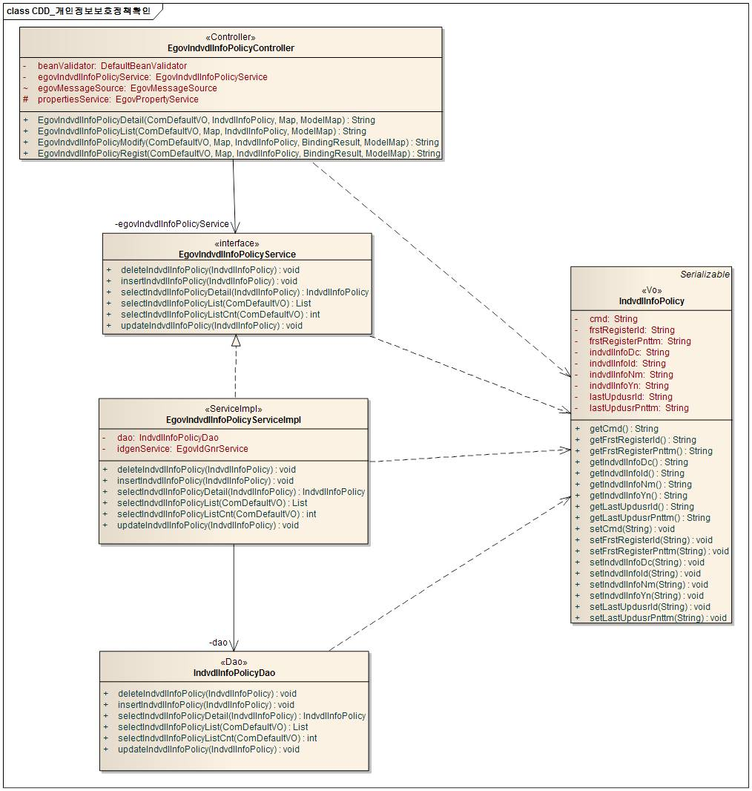
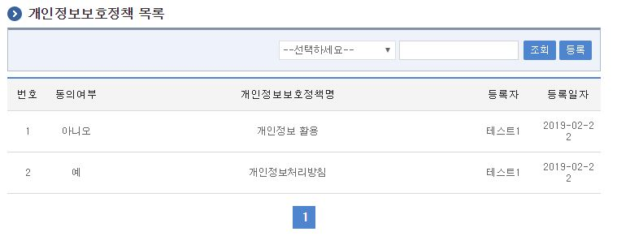
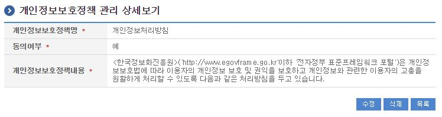
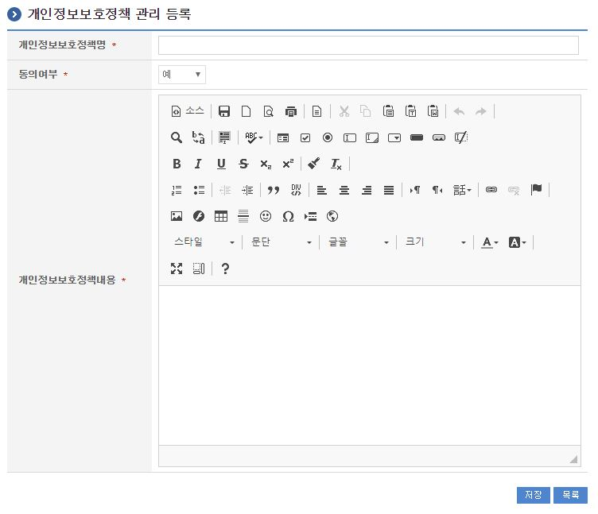
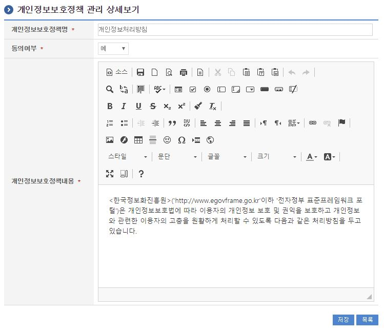

# 개인정보보호정책확인

## 개요

 회원가입 및 이용안내시 개인정보보호정책을 확인하는 기능을 제공한다.

## 설명

### 패키지 참조 관계

 개인정보보호정책확인 패키지는 요소기술의 공통 패키지(cmm)에 대해서만 직접적인 함수적 참조 관계를 가진다. 하지만, 컴포넌트 배포 시 오류 없이 실행되기 위하여 패키지 간의 참조관계에 따라 포맷/날짜/계산, 웹에디터 패키지들과 함께 배포 파일을 구성한다.
- 패키지 간 참조 관계 : [사용자지원 Package Dependency](../intro/package-reference.md/#사용자지원)

### 관련소스

| 유형 | 대상소스명 | 비고 |
| --- | --- | --- |
| Controller | egovframework.com.uss.sam.ipm.web.EgovIndvdlInfoPolicyController.java | 개인정보보호정책확인 Controller Class |
| Service | egovframework.com.uss.sam.ipm.service.EgovIndvdlInfoPolicyService.java | 개인정보보호정책확인 Service Class |
| ServiceImpl | egovframework.com.uss.sam.ipm.service.impl.EgovIndvdlInfoPolicyServiceImpl.java | 개인정보보호정책확인 ServiceImpl Class |
| Model | egovframework.com.uss.sam.ipm.service.IndvdlInfoPolicy.java | 개인정보보호정책확인 Model Class |
| VO | egovframework.com.cmm.ComDefaultVO.java | 검색 VO Class |
| DAO | egovframework.com.uss.sam.ipm.service.impl.IndvdlInfoPolicyDao.java | 개인정보보호정책확인 Dao Class |
| JSP | /WEB-INF/jsp/egovframework/com/uss/sam/ipm/EgovIndvdlInfoPolicyList.jsp | 개인정보보호정책확인 목록조회 페이지 |
| JSP | /WEB-INF/jsp/egovframework/com/uss/sam/ipm/EgovIndvdlInfoPolicyRegist.jsp | 개인정보보호정책확인 등록 페이지 |
| JSP | /WEB-INF/jsp/egovframework/com/uss/sam/ipm/EgovIndvdlInfoPolicyUpdt.jsp | 개인정보보호정책확인 수정 페이지 |
| JSP | /WEB-INF/jsp/egovframework/com/uss/sam/ipm/EgovIndvdlInfoPolicyDetail.jsp | 개인정보보호정책확인 상세조회 페이지 |
| QUERY XML | resources/egovframework/mapper/com/uss/sam/ipm/EgovIndvdlInfoPolicy\_SQL\_altibase.xml | 개인정보보호정책확인 Altibase용 QUERY XML |
| QUERY XML | resources/egovframework/mapper/com/uss/sam/ipm/EgovIndvdlInfoPolicy\_SQL\_cubrid.xml | 개인정보보호정책확인 Cubrid용 QUERY XML |
| QUERY XML | resources/egovframework/mapper/com/uss/sam/ipm/EgovIndvdlInfoPolicy\_SQL\_maria.xml | 개인정보보호정책확인 Maria용 QUERY XML |
| QUERY XML | resources/egovframework/mapper/com/uss/sam/ipm/EgovIndvdlInfoPolicy\_SQL\_mysql.xml | 개인정보보호정책확인 MySQL용 QUERY XML |
| QUERY XML | resources/egovframework/mapper/com/uss/sam/ipm/EgovIndvdlInfoPolicy\_SQL\_oracle.xml | 개인정보보호정책확인 Oracle용 QUERY XML |
| QUERY XML | resources/egovframework/mapper/com/uss/sam/ipm/EgovIndvdlInfoPolicy\_SQL\_postgres.xml | 개인정보보호정책확인 Postgres용 QUERY XML |
| QUERY XML | resources/egovframework/mapper/com/uss/sam/ipm/EgovIndvdlInfoPolicy\_SQL\_tibero.xml | 개인정보보호정책확인 Tibero용 QUERY XML |
| QUERY XML | resources/egovframework/mapper/com/uss/sam/ipm/EgovIndvdlInfoPolicy\_SQL\_goldilocks.xml | 개인정보보호정책확인 Goldilocks용 QUERY XML |
| Message properties | resources/egovframework/message/com/uss/sam/ipm/message\_ko.properties | 개인정보보호정책확인 Message properties(한글) |
| Message properties | resources/egovframework/message/com/uss/sam/ipm/message\_en.properties | 개인정보보호정책확인 Message properties(영문) |
| Idgen XML | resources/egovframework/spring/com/idgn/context-idgn-IndvdlInfoPolicy.xml | 개인정보보호정책확인 Id생성 Idgen XML |

### 클래스 다이어그램

 

### ID Generation

#### ID Generation 관련 DDL 및 DML

 ID Generation Service를 활용하기 위해서 Sequence 저장테이블인  COMTECOPSEQ에 INDVDL_INFO_ID 항목을 추가해야 한다.

```sql
CREATE TABLE COMTECOPSEQ
(
    TABLE_NAME            VARCHAR(20) NOT NULL,
    NEXT_ID               NUMERIC(30) NULL,
     PRIMARY KEY (TABLE_NAME)
)
;
INSERT INTO COMTECOPSEQ ( TABLE_NAME, NEXT_ID ) VALUES ('INDVDL_INFO_ID', 1);
```

#### ID Generation 환경설정(context-idgn-IndvdlInfoPolicy.xml)

```xml
    <bean name="egovIndvdlInfoPolicyIdGnrService" class="egovframework.rte.fdl.idgnr.impl.EgovTableIdGnrServiceImpl" destroy-method="destroy">
        <property name="dataSource" ref="egov.dataSource" />
        <property name="strategy"   ref="indvdlInfoPolicyIdMsgtrategy" />
        <property name="blockSize"  value="10"/>
        <property name="table"      value="COMTECOPSEQ"/>
        <property name="tableName"  value="INDVDL_INFO_ID"/>
    </bean>
    <bean name="indvdlInfoPolicyIdMsgtrategy" class="egovframework.rte.fdl.idgnr.impl.strategy.EgovIdGnrStrategyImpl">
        <property name="prefix"   value="INDVDL_" />
        <property name="cipers"   value="13" />
        <property name="fillChar" value="0" />
    </bean>
```

### 관련테이블

| 테이블명 | 테이블명(영문) | 비고 |
| --- | --- | --- |
| 개인정보보호정책확인 | COMTNINDVDLINFOPOLICY | 개인정보보호정책을 관리한다. |

## 관련기능

 개인정보보호정책확인기능은 크게 개인정보보호정책확인 목록조회, 개인정보보호정책확인 상세조회, 개인정보보호정책확인 내용등록, 개인정보보호정책확인 내용수정기능으로 구성되어 있다.

### 개인정보보호정책확인 목록조회

#### 비즈니스 규칙

 관리자가 기(記) 등록된 개인정보보호정책확인 정보를 리스트 형태로 조회 할 수 있고, 등록버튼을 클릭하여 등록화면으로 이동할수있다.

#### 관련코드

 N/A

#### 관련화면 및 수행얼메뉴얼

| Action | URL | Controller method | SQL Namespace | SQL QueryID |
| --- | --- | --- | --- | --- |
| 목록조회 | /uss/sam/ipm/listIndvdlInfoPolicy.do | EgovIndvdlInfoPolicyList | "IndvdlInfoPolicy" | "selectIndvdlInfoPolicy", |
|  |  |  | "IndvdlInfoPolicy" | "selectIndvdlInfoPolicyCnt" |

 

 등록: 등록하기 위해서는 상단의 등록 버튼을 통해서 개인정보보호정책확인 등록 화면으로 이동한다.
 목록 최근검색어명 선택: 개인정보보호정책확인 상세조회 화면으로 이동한다

### 개인정보보호정책확인 상세조회

#### 비즈니스 규칙

 개인정보보호정책확인 목록에서 목록 클릭시 이동되는 화면으로 개인정보보호정책확인에 대한 상세정보를 보여준다.

#### 관련코드

 N/A

#### 관련화면 및 수행메뉴얼

| Action | URL | Controller method | SQL Namespace | SQL QueryID |
| --- | --- | --- | --- | --- |
| 상세조회 | /uss/sam/ipm/detailIndvdlInfoPolicy.do | EgovIndvdlInfoPolicyDetail | "IndvdlInfoPolicy" | "selectIndvdlInfoPolicyDetail" |
| 삭제 | /uss/sam/ipm/detailIndvdlInfoPolicy.do | EgovIndvdlInfoPolicyDetail | "IndvdlInfoPolicy" | "deleteIndvdlInfoPolicy" |

 

 수정: 수정버튼 클릭시 개인정보보호정책확인 수정 화면으로 이동한다.
 삭제: 삭제버튼 클릭 시 삭제여부를 확인하는 메시지를 보여주고 삭제처리를 할 수 있다.
 목록: 개인정보보호정책확인 목록 화면으로 이동한다.

### 개인정보보호정책확인 내용등록

#### 비즈니스 규칙

 개인정보보호정책확인에 관한 기본정보를 입력 저장처리한다. 입력명 우측의 빨간* 표시는 반드시 입력해야할 항목을 표시한다.

#### 관련코드

 N/A

#### 관련화면 및 수행메뉴얼

| Action | URL | Controller method | SQL Namespace | SQL QueryID |
| --- | --- | --- | --- | --- |
| 등록 | /uss/sam/ipm/registIndvdlInfoPolicy.do | EgovIndvdlInfoPolicyRegist | "IndvdlInfoPolicy" | "insertIndvdlInfoPolicy" |

 

 저장: 입력한 개인정보보호정책확인 정보들이 저장 처리된다.
 목록: 개인정보보호정책확인 목록 화면으로 이동한다.

### 개인정보보호정책확인 내용수정

#### 비즈니스 규칙

 수정된 개인정보보호정책 내용을 저장한다. 입력명 우측의 빨간* 표시는 수정 시 반드시 입력해야 할 항목을 표시한다.

#### 관련코드

 N/A

#### 관련화면 및 수행메뉴얼

| Action | URL | Controller method | SQL Namespace | SQL QueryID |
| --- | --- | --- | --- | --- |
| 수정 | /uss/sam/ipm/updtIndvdlInfoPolicy.do | EgovIndvdlInfoPolicyModify | "IndvdlInfoPolicy" | "updateIndvdlInfoPolicy" |

 

 저장: 수정된 정보들이 저장 처리된다.
 목록: 개인정보보호정책확인 목록 화면으로 이동한다.
