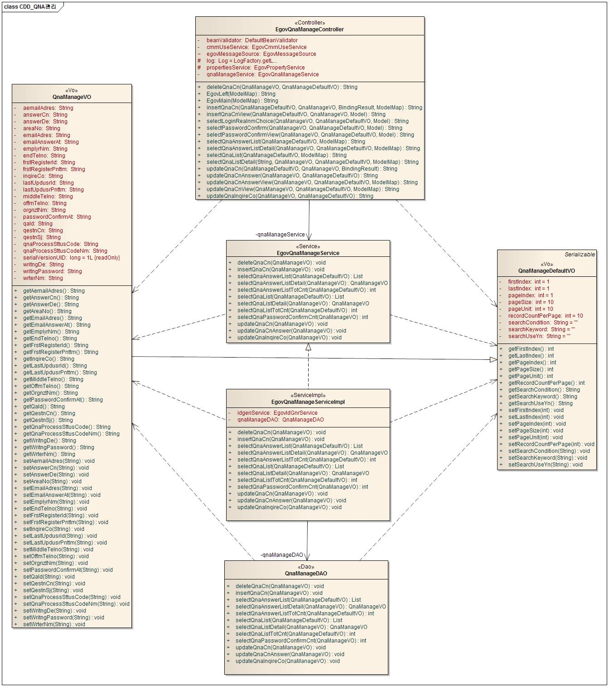
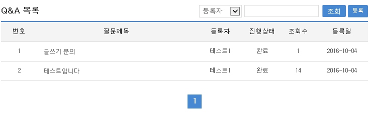
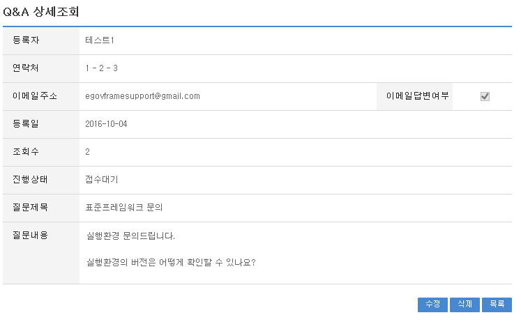
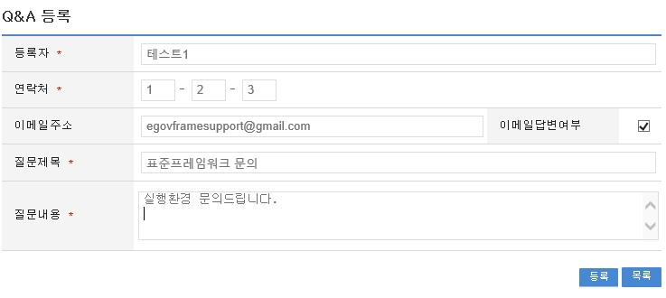
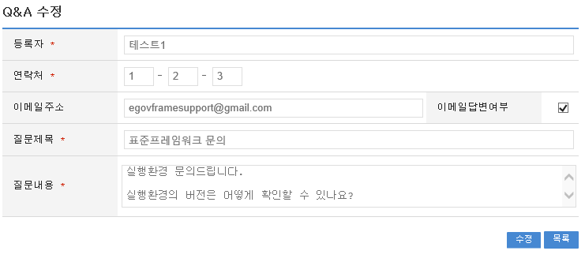
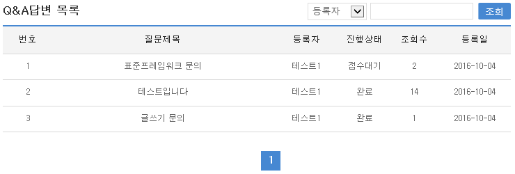
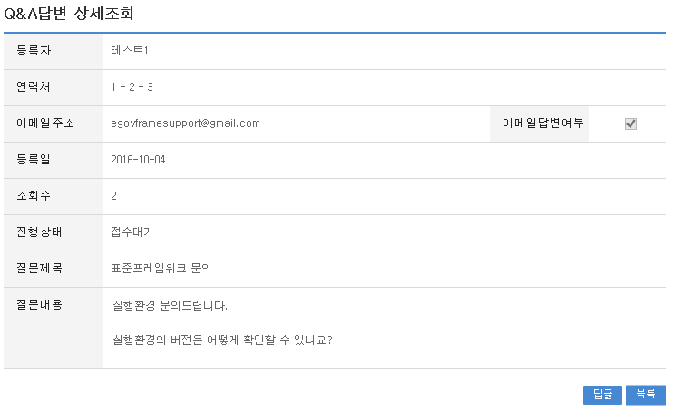
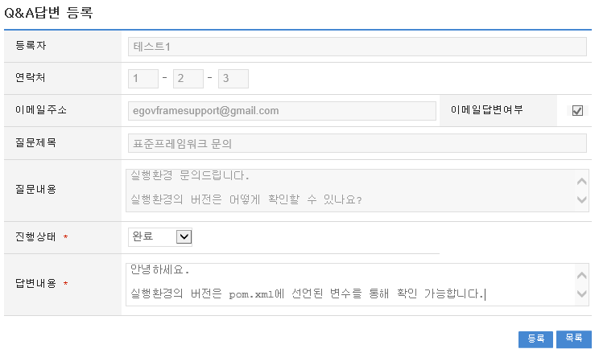

# Q&A관리

## 개요

 Q&A 내역 및 조치처리 관리기능으로 일반사용자가 Q&A내역을 등록하는 기능 및 관리자가 답변글을 등록하는 기능으로 구성되어 있다

## 설명

### 패키지 참조 관계

 Q&A관리 패키지는 요소기술의 공통 패키지(cmm)와 시스템 패키지(sim)에 대해서만 직접적인 함수적 참조 관계를 가진다. 하지만, 컴포넌트 배포 시 오류 없이 실행되기 위하여 패키지 간의 참조관계에 따라 포맷/날짜/계산 패키지와 함께 배포 파일을 구성한다.
- 패키지 간 참조 관계 : [사용자지원 Package Dependency](../intro/package-reference.md#사용자지원)

### 관련소스

| 유형 | 대상소스명 | 비고 |
| --- | --- | --- |
| Controller | egovframework.com.uss.olh.qna.web.EgovQnaController.java | Q&A관리를 위한 컨트롤러 클래스 |
| Service | egovframework.com.uss.olh.qna.service.EgovQnaService.java | Q&A관리를 위한 서비스 인터페이스 |
| ServiceImpl | egovframework.com.uss.olh.qna.service.impl.EgovQnaServiceImpl.java | Q&A관리를 위한 서비스 구현 클래스 |
| VO | egovframework.com.uss.olh.qna.service.QnaVO.java | Q&A관리를 위한 VO 클래스 |
| VO | egovframework.com.uss.olh.qna.service.QnaDefaultVO.java | Q&A관리를 위한 SearchVO 클래스 |
| DAO | egovframework.com.uss.olh.qna.service.impl.EgovQnaDAO.java | Q&A 관리를 위한 데이터처리 클래스 |
| JSP | /WEB-INF/jsp/egovframework/com/uss/olh/qna/EgovQnaList.jsp | Q&A관리를 위한 목록조회 페이지 |
| JSP | /WEB-INF/jsp/egovframework/com/uss/olh/qna/EgovQnaDetail.jsp | Q&A관리를 위한 상세조회 페이지 |
| JSP | /WEB-INF/jsp/egovframework/com/uss/olh/qna/EgovQnaRegist.jsp | Q&A관리를 위한 등록 페이지 |
| JSP | /WEB-INF/jsp/egovframework/com/uss/olh/qna/EgovQnaUpdt.jsp | Q&A관리를 위한 수정 페이지 |
| JSP | /WEB-INF/jsp/egovframework/com/uss/olh/qna/EgovQnaAnswerList.jsp | Q&A관리를 위한 답변목록조회 페이지 |
| JSP | /WEB-INF/jsp/egovframework/com/uss/olh/qna/EgovQnaAnswerDetail.jsp | Q&A관리를 위한 답변상세조회 페이지 |
| JSP | /WEB-INF/jsp/egovframework/com/uss/olh/qna/EgovQnaAnswerUpdt.jsp | Q&A관리를 위한 답변등록/수정 페이지 |
| Query XML | resources/egovframework/mapper/com/uss/olh/qna/EgovQnaManage\_SQL\_altibase.xml | Q&A관리를 위한 Altibase용 Query XML |
| Query XML | resources/egovframework/mapper/com/uss/olh/qna/EgovQnaManage\_SQL\_cubrid.xml | Q&A관리를 위한 Cubrid용 Query XML |
| Query XML | resources/egovframework/mapper/com/uss/olh/qna/EgovQnaManage\_SQL\_maria.xml | Q&A관리를 위한 MariaDB용 Query XML |
| Query XML | resources/egovframework/mapper/com/uss/olh/qna/EgovQnaManage\_SQL\_mysql.xml | Q&A관리를 위한 MySQL용 Query XML |
| Query XML | resources/egovframework/mapper/com/uss/olh/qna/EgovQnaManage\_SQL\_oracle.xml | Q&A관리를 위한 Oracle용 Query XML |
| Query XML | resources/egovframework/mapper/com/uss/olh/qna/EgovQnaManage\_SQL\_postgres.xml | Q&A관리를 위한 PostgreSQL용 Query XML |
| Query XML | resources/egovframework/mapper/com/uss/olh/qna/EgovQnaManage\_SQL\_tibero.xml | Q&A관리를 위한 Tibero용 Query XML |
| Query XML | resources/egovframework/mapper/com/uss/olh/qna/EgovQnaManage\_SQL\_goldilocks.xml | Q&A관리를 위한 Goldilocks용 Query XML |
| Message properties | resources/egovframework/message/com/uss/olh/qna/message\_ko.properties | Q&A관리를 위한 Message properties(한글) |
| Message properties | resources/egovframework/message/com/uss/olh/qna/message\_en.properties | Q&A관리를 위한 Message properties(영문) |
| Idgen XML | resources/egovframework/spring/com/idgn/context-idgn-QnaManage.xml | Q&A등록을 위한 Id생성 Idgen XML |

### 클래스다이어그램

 

### ID Generation

#### ID Generation 관련 DDL 및 DML

 ID Generation Service를 활용하기 위해서 Sequence 저장테이블인  COMTECOPSEQ에 QA_ID 항목을 추가해야 한다.

```sql
  CREATE TABLE COMTECOPSEQ ( table_name varchar(16) NOT NULL, 
  		   next_id DECIMAL(30) NOT NULL,
  		   PRIMARY KEY (table_name));
 
  INSERT INTO COMTECOPSEQ VALUES('QA_ID','0');
```

#### ID Generation 환경설정(context-idgn-QnaManage.xml)

```xml
	<bean name="egovQnaManageIdGnrService"
		class="egovframework.rte.fdl.idgnr.impl.EgovTableIdGnrService"
		destroy-method="destroy">
		<property name="dataSource" ref="egov.dataSource" />
		<property name="strategy"   ref="qnaManageStrategy" />
		<property name="blockSize" 	value="10"/>
		<property name="table"	   	value="COMTECOPSEQ"/>
		<property name="tableName"	value="QA_ID"/>
	</bean>
 
	<bean name="qnaManageStrategy"
		class="egovframework.rte.fdl.idgnr.impl.strategy.EgovIdGnrStrategyImpl">
		<property name="prefix" value="QA_" />
		<property name="cipers" value="17" />
		<property name="fillChar" value="0" />
	</bean>
```

### 관련테이블

| 테이블명 | 테이블명(영문) | 비고 |
| --- | --- | --- |
| QA정보 | COMTNQAINFO | 질문과 답변을 관리한다. |

## 관련기능

 Q&A관리기능은 크게 일반사용자가 사용하는 Q&A목록조회, Q&A상세조회, Q&A내용등록, Q&A내용수정 기능 및 관리자가 사용하는 Q&A답변목록조회, Q&A답변상세조회, Q&A답변작성/수정 기능으로 분류된다.

### Q&A목록조회

#### 비즈니스 규칙

 조회조건으로 목록조회를 할 수 있고, 등록버튼을 클릭하여 Q&A등록 화면으로 이동하여 Q&A를 등록 처리 할 수 있다.

#### 관련코드

 N/A

#### 관련화면 및 수행매뉴얼

| Action | URL | Controller method | SQL Namespace | SQL QueryID |
| --- | --- | --- | --- | --- |
| 목록조회 | /uss/olh/qna/selectQnaList.do | selectQnaList | "QnaManage" | "selectQnaList" |
|  |  |  | "QnaManage" | "selectQnaListCnt" |

 Q&A 목록은 페이지 당 10건씩 조회되며 페이징은 10페이지씩 이루어진다.
 검색조건은 작성자명, Q&A제목에 대해서 수행된다.
 페이지 당 검색 범위를 변경하고자 하는 경우
 context-properties.xml 파일의 pageUnit, pageSize를 변경한다.(단 해당 설정은 전체 공통서비스 기능에 영향을 미친다.)

 

 조회: Q&A를 조회하기 위해서는 상단의 검색조건을 선택 후 해당하는 검색문자를 입력 후 조회 버튼을 클릭한다.
 등록: Q&A를 등록하기 위해서는 상단의 등록 버튼을 통해서 Q&A등록 화면으로 이동한다.
 목록클릭: Q&A상세조회 화면으로 이동한다.

### Q&A상세조회

#### 비즈니스 규칙

 Q&A목록조회에서 목록 클릭 시 이동되는 화면으로 Q&A에 대한 상세정보를 보여준다.

#### 관련코드

 N/A

#### 관련화면 및 수행매뉴얼

| Action | URL | Controller method | SQL Namespace | SQL QueryID |
| --- | --- | --- | --- | --- |
| 상세조회 | /uss/olh/qna/selectQnaDetail.do | selectQnaDetail | "QnaManage" | "selectQnaDetail" |
| 삭제 | /uss/olh/qna/deleteQna.do | deleteQna | "QnaManage" | "deleteQna" |

 Q&A 상세조회화면은 Q&A내역수정, Q&A내역삭제, Q&A목록조회를 할 수 있다.

 

 수정: 수정버튼 클릭 시 Q&A를 수정할 수 있는 화면으로 이동한다.
 삭제: 삭제버튼 클릭 시 삭제여부를 확인하는 메시지를 보여주고 삭제처리를 할 수 있다.
 목록: Q&A목록조회 화면으로 이동한다.

### Q&A내역등록

#### 비즈니스 규칙

 Q&A에 관한 기본정보를 입력 저장처리한다. 입력명 우측의 빨간* 표시는 반드시 입력해야할 항목을 표시한다.

#### 관련코드

 N/A

#### 관련화면 및 수행매뉴얼

| Action | URL | Controller method | SQL Namespace | SQL QueryID |
| --- | --- | --- | --- | --- |
| 등록화면 | /uss/olh/qna/insertQnaView.do | insertQnaView |  |  |
| 등록 | /uss/olh/qna/insertQna.do | insertQna | "QnaManage" | "insertQna" |

 

 목록: Q&A목록조회 화면으로 이동한다.
 저장: 입력한 Q&A정보들이 저장 처리된다.

### Q&A내역수정

#### 비즈니스 규칙

 입력한 Q&A정보들을 저장 처리한다. 입력명 우측의 빨간* 표시는 수정 시 반드시 입력해야 할 항목을 표시한다.

#### 관련코드

 N/A

#### 관련화면 및 수행매뉴얼

| Action | URL | Controller method | SQL Namespace | SQL QueryID |
| --- | --- | --- | --- | --- |
| 수정화면 | /uss/olh/qna/updateQnaView.do | updateQnaView | "QnaManage" | "selectQnaDetail" |
| 수정 | /uss/olh/qna/updateQna.do | updateQna | "QnaManage" | "updateQna" |

 

 수정: 수정 입력한 Q&A정보들이 저장 처리된다.
 목록: Q&A목록조회 화면으로 이동한다.

### Q&A답변목록조회

#### 비즈니스 규칙

 관리자가 답변글을 관리하기 위한 기능으로 조회조건으로 목록조회를 할 수 있고, 등록버튼을 클릭하여 Q&A등록 화면으로 이동하여 Q&A를 등록 처리 할 수 있다.

#### 관련코드

 N/A

#### 관련화면 및 수행매뉴얼

| Action | URL | Controller method | SQL Namespace | SQL QueryID |
| --- | --- | --- | --- | --- |
| 목록조회 | /uss/olh/qna/selectQnaAnswerList.do | selectQnaAnswerList | "QnaManage" | "selectQnaAnswerList" |
|  |  |  | "QnaManage" | "selectQnaAnswerListCnt" |

 Q&A 목록은 페이지 당 10건씩 조회되며 페이징은 10페이지씩 이루어진다.
 검색조건은 작성자명, 진행상태에 대해서 수행된다.
 페이지 당 검색 범위를 변경하고자 하는 경우
 context-properties.xml 파일의 pageUnit, pageSize를 변경한다.(단 해당 설정은 전체 공통서비스 기능에 영향을 미친다.)

 

 조회: Q&A를 조회하기 위해서는 상단의 검색조건을 선택 후 해당하는 검색문자를 입력 후 조회 버튼을 클릭한다.
 목록클릭: Q&A상세조회 화면으로 이동한다.

### Q&A답변상세조회

#### 비즈니스 규칙

 관리자가 작성자정보 및 답변내용상세정보를 보여준다.

#### 관련코드

 N/A

#### 관련화면 및 수행매뉴얼

| Action | URL | Controller method | SQL Namespace | SQL QueryID |
| --- | --- | --- | --- | --- |
| 상세조회 | /uss/olh/qna/selectQnaAnswerDetail.do | selectQnaAnswerDetail | "QnaManage" | "selectQnaAnswerDetail" |

 Q&A답변상세조회화면은 Q&A내용답변수정, Q&A답변목록조회를 할 수 있다.

 

 수정: 수정버튼 클릭 시 Q&A를 수정할 수 있는 화면으로 이동한다.
 삭제: 삭제버튼 클릭 시 삭제여부를 확인하는 메시지를 보여주고 삭제처리를 할 수 있다.
 목록: Q&A답변목록조회 화면으로 이동한다.

### Q&A내역답변수정

#### 비즈니스 규칙

 입력한 Q&A정보들을 저장 처리한다. 작성자 정보는 참고만 할 수 있고, 하단의 답변내용만 입력 가능하도록 구성되어 있습니다.

#### 관련코드

 Q&A관리에서 사용되는 코드 및 그에 따른 설정 값의 반영사항은 다음과 같다.

| 코드분류 | 코드분류명 | 코드ID | 코드명 |
| --- | --- | --- | --- |
| COM028 | 질의응답처리상태 | 1 | 접수대기 |
| COM028 | 질의응답처리상태 | 2 | 접수 |
| COM028 | 질의응답처리상태 | 3 | 완료 |

 질의응답처리상태코드를 추가하여 사용 할 수 있다.

#### 관련화면 및 수행매뉴얼

| Action | URL | Controller method | SQL Namespace | SQL QueryID |
| --- | --- | --- | --- | --- |
| 수정화면 | /uss/olh/qna/updateQnaAnswerView.do | updateQnaAnswerView | "QnaManage" | "selectQnaDetail" |
| 수정 | /uss/olh/qna/updateQnaAnswer.do | updateQnaAnswer | "QnaManage" | "updateQnaAnswer" |

 

 수정: 수정 입력한 Q&A정보들이 저장 처리된다.
 목록: Q&A목록조회 화면으로 이동한다.
