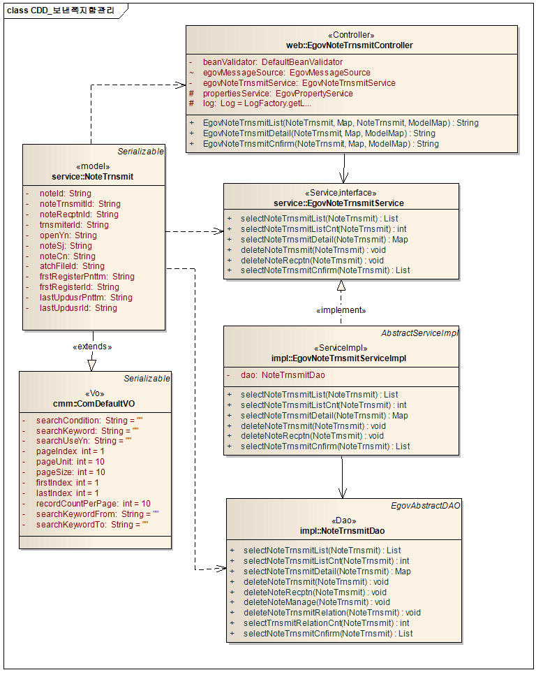
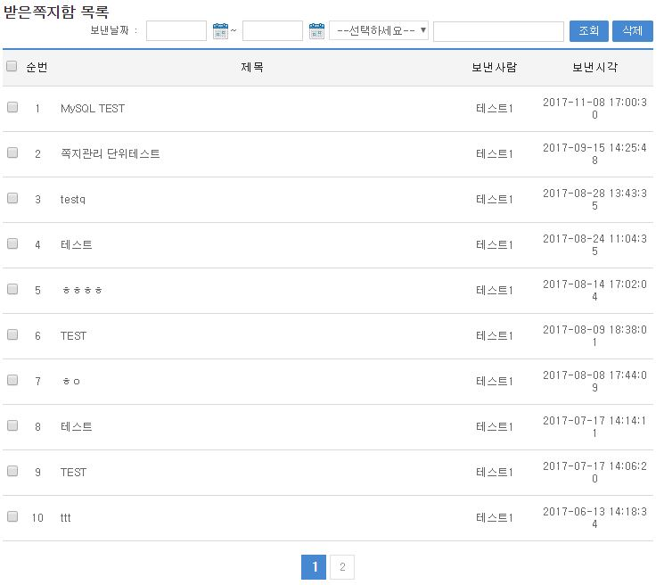
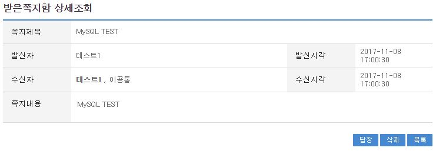

# 받은쪽지함관리

## 개요

 받은쪽지함관리는 다른사용자가 보낸쪽지를 수신 받아 관리 하기위해 위한 기능을 제공한다.

## 설명

 받은쪽지함관리는 목록조회, 상세조회, 삭제의 기능을 수반한다.

 ① 받은쪽지함관리 목록 : 받은쪽지함관리 정보를 최근 등록 순서대로 조회, 삭제 하고, 그 결과 목록을 화면에 반영한다.
 ② 받은쪽지함관리 상세조회 : 등록된 받은쪽지함관리 정보를 상세정보를 조회하고 삭제기능을 제공한다.

### 관련소스

| 유형 | 대상소스명 | 비고 |
| --- | --- | --- |
| Controller | egovframework.com.uss.ion.ntr.web.EgovNoteRecptnController.java | 받은쪽지함관리를 위한 컨트롤러 클래스 |
| Service | egovframework.com.uss.ion.ntr.service.EgovNoteRecptnService.java | 받은쪽지함관리를 위한  서비스 인터페이스 |
| ServiceImpl | egovframework.com.uss.ion.ntr.service.impl.EgovNoteRecptnServiceImpl.java | 받은쪽지함관리를 위한 서비스 구현 클래스 |
| DAO | egovframework.com.uss.ion.ntr.service.impl.NoteRecptnDao.java | 받은쪽지함관리를 위한 데이터처리 클래스 |
| Model | egovframework.com.uss.ion.ntr.service.NoteRecptn.java | 받은쪽지함관리를 위한 Model 클래스 |
| JSP | /WEB-INF/jsp/egovframework/com/uss/ion/ntr/EgovNoteRecptnList.jsp | 받은쪽지함관리 목록조회를 위한 jsp페이지 |
| JSP | /WEB-INF/jsp/egovframework/com/uss/ion/ntr/EgovNoteRecptnDetail.jsp | 받은쪽지함관리 상세조회를 위한 jsp페이지 |
| Mapper | resources/egovframework/mapper/com/uss/ion/ntr/EgovNoteRecptn\_SQL\_*.xml | 받은쪽지함관리 QUERY XML |
| Idgnr | resources/egovframework/spring/com/idgn/context-idgn-NoteManage.xml | 받은쪽지함관리를 위한 Idgn |
| Properties | resources/egovframework/message/com/uss/ion/ntr/message\_*.properties | 받은쪽지함관리 국제화 |

 받은쪽지함관리 QUERY XML의 경우 MySQL, Oracle, Cubrid, Altibase, Tibero, MariaDB, PostgreSQL, Goldilocks 지원하며, globals.properties에서 설정 가능
 국제화의 경우 한국어(ko)/영어(en) 2개국어 지원

### 클래스 다이어그램

 

### 관련테이블

| 테이블명 | 테이블명(영문) | 비고 |
| --- | --- | --- |
| 쪽지관리 | COMTNNOTE | 쪽지정보를 관리하기 위한 속성정보를 정의하고, 관리한다. |
| 받은쪽지함관리 | COMTNNOTERECPTN | 받은쪽지함을 관리하기 위한 속성정보를 정의하고, 관리한다. |
| 보낸쪽지함관리 | COMTNNOTETRNSMIT | 보낸쪽지함을을 관리하기 위한 속성정보를 정의하고, 관리한다. |

### ID Generation

 ID Generation Service를 활용하기 위해서 Sequence 저장테이블인  COMTECOPSEQ에 NOTE_ID, NOTE_TRNSMIT_ID, NOTE_RECPTN_ID 항목을 추가한다.

```sql
INSERT INTO COMTECOPSEQ VALUES('NOTE_ID',0);
INSERT INTO COMTECOPSEQ VALUES('NOTE_TRNSMIT_ID',0);
INSERT INTO COMTECOPSEQ VALUES('NOTE_RECPTN_ID',0);
```

## 관련화면 및 수행매뉴얼

### 받은쪽지함관리 목록조회

| Action | URL | Controller method | QueryID |
| --- | --- | --- | --- |
| 목록조회 | /uss/ion/ntr/listNoteRecptn.do | EgovNoteRecptnList | "NoteRecptn.selectNoteRecptn" |
|  |  |  | "NoteRecptn.selectNoteRecptnCnt" |
|  |  |  | "NoteRecptn.deleteNoteRecptn" |
|  |  |  | "NoteRecptn.deleteNoteTrnsmit" |
|  |  |  | "NoteRecptn.deleteNoteManage" |

 받은쪽지함 목록을 조회 하고, 조회 목록은 10건 기준으로 출력한다.

 

 조회 : 보낸날짜, 검색조건, 검색명으로 조회를 요청한다.
 삭제 : 선택된 받은쪽지정보를 삭제한다.
 목록 제목 클릭 :  받은쪽지함관리 상세조회 화면으로 이동한다.

### 받은쪽지함관리 상세조회

| Action | URL | Controller method | QueryID |
| --- | --- | --- | --- |
| 상세조회 | /uss/ion/ntr/detailNoteRecptn.do | EgovNoteRecptnDetail | "NoteRecptn.selectNoteRecptnDetail" |
|  |  |  | "NoteRecptn.updateNoteRecptnRelationOpenYn" |
|  |  |  | "NoteRecptn.deleteNoteRecptn" |
|  |  |  | "NoteRecptn.deleteNoteTrnsmit" |
|  |  |  | "NoteRecptn.deleteNoteManage" |

 받은쪽지함 목록에서 선택한 받은쪽지함 정보를 상세조회 한다.
 답장 버튼 클릭시 답장을 보낼 수 있는 페이지로 이동하고 보낸사람의 쪽지내용이 자동 입력된다.

 

 답장 :  선택된 받은쪽지 정보의 답장을 작성한다.
 삭제 : 선택된 받은쪽지 정보를 삭제 요청한다.
 목록 : 받은쪽지함관리 목록조회 화면으로 이동한다.
