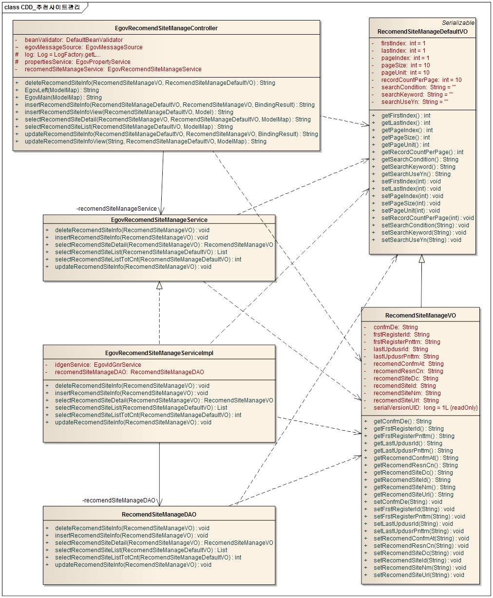
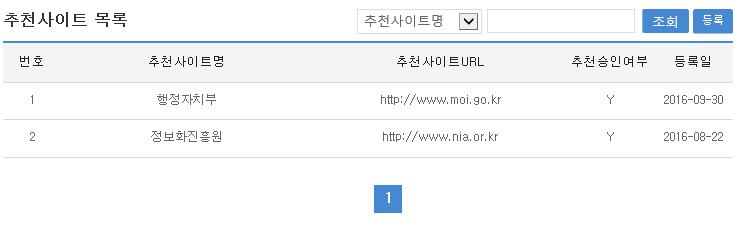
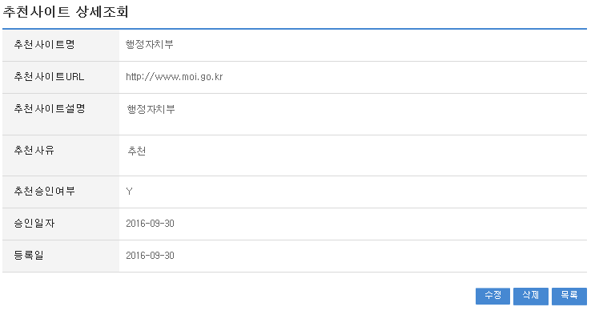
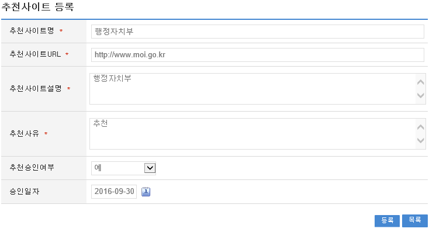
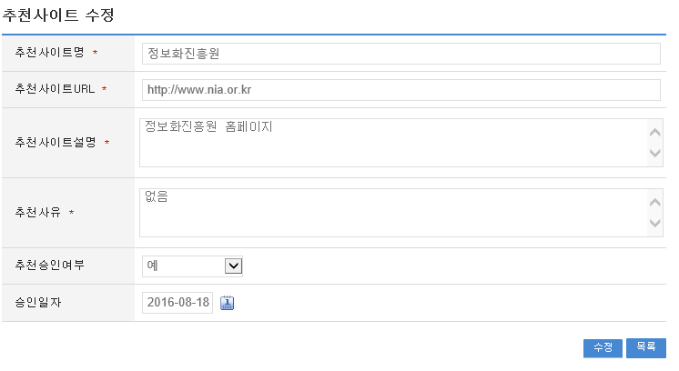

# 추천사이트관리

## 개요

 공공기관에서 업무진행에 필요한 사이트를 추천받아 관리자의 승인을 거쳐 등록하는 추천사이트관리 기능을 제공한다.

## 설명

### 패키지 참조 관계

 추천사이트관리 패키지는 요소기술의 공통 패키지(cmm)에 대해서만 직접적인 함수적 참조 관계를 가진다. 하지만, 컴포넌트 배포 시 오류 없이 실행되기 위하여 패키지 간의 달력 패키지와 함께 배포 파일을 구성한다.
 패키지 간 참조 관계 : [사용자지원 Package Dependency](../intro/package-reference.md/#사용자지원)

### 관련소스

| 유형 | 대상소스명 | 비고 |
| --- | --- | --- |
| Controller | egovframework.com.uss.ion.rec.web.EgovRecomendSiteController.java | 추천사이트관리를 위한 컨트롤러 클래스 |
| Service | egovframework.com.uss.ion.rec.service.EgovRecomendSiteService.java | 추천사이트관리를 위한 서비스 인터페이스 |
| ServiceImpl | egovframework.com.uss.ion.rec.service.impl.EgovRecomendSiteServiceImpl.java | 추천사이트관리를 위한 서비스 구현 클래스 |
| VO | egovframework.com.uss.ion.rec.service.RecomendSiteVO.java | 추천사이트관리를 위한 VO 클래스 |
| VO | egovframework.com.uss.ion.rec.service.RecomendSiteVO.java | 추천사이트관리를 위한 SearchVO 클래스 |
| DAO | egovframework.com.uss.ion.rec.service.impl.EgovRecomendSiteDAO.java | 추천사이트 관리를 위한 데이터처리 클래스 |
| JSP | /WEB-INF/jsp/egovframework/com/uss/ion/rec/EgovRecomendSiteList.jsp | 추천사이트관리를 위한 목록조회 페이지 |
| JSP | /WEB-INF/jsp/egovframework/com/uss/ion/rec/EgovRecomendSiteDetail.jsp | 추천사이트관리를 위한 상세조회 페이지 |
| JSP | /WEB-INF/jsp/egovframework/com/uss/ion/rec/EgovRecomendSiteRegist.jsp | 추천사이트관리를 위한 등록 페이지 |
| JSP | /WEB-INF/jsp/egovframework/com/uss/ion/rec/EgovRecomendSiteUpdt.jsp | 추천사이트관리를 위한 수정 페이지 |
| Query XML | resources/egovframework/mapper/com/uss/ion/rec/EgovRecomendSite\_SQL\_altibase.xml | 추천사이트관리를 위한 Altibase용 Query XML |
| Query XML | resources/egovframework/mapper/com/uss/ion/rec/EgovRecomendSite\_SQL\_cubrid.xml | 추천사이트관리를 위한 Cubrid용 Query XML |
| Query XML | resources/egovframework/mapper/com/uss/ion/rec/EgovRecomendSite\_SQL\_maria.xml | 추천사이트관리를 위한 MariaDB용 Query XML |
| Query XML | resources/egovframework/mapper/com/uss/ion/rec/EgovRecomendSite\_SQL\_mysql.xml | 추천사이트관리를 위한 MySQL용 Query XML |
| Query XML | resources/egovframework/mapper/com/uss/ion/rec/EgovRecomendSite\_SQL\_oracle.xml | 추천사이트관리를 위한 Oracle용 Query XML |
| Query XML | resources/egovframework/mapper/com/uss/ion/rec/EgovRecomendSite\_SQL\_postgres.xml | 추천사이트관리를 위한 PostgreSQL용 Query XML |
| Query XML | resources/egovframework/mapper/com/uss/ion/rec/EgovRecomendSite\_SQL\_tibero.xml | 추천사이트관리를 위한 Tibero용 Query XML |
| Query XML | resources/egovframework/mapper/com/uss/ion/rec/EgovRecomendSite\_SQL\_goldilocks.xml | 추천사이트관리를 위한 Goldilocks용 Query XML |
| Message properties | resources/egovframework/message/com/uss/ion/rec/message\_ko.properties | 추천사이트관리를 위한 Message properties(한글) |
| Message properties | resources/egovframework/message/com/uss/ion/rec/message\_en.properties | 추천사이트관리를 위한 Message properties(영문) |
| Idgen XML | resources/egovframework/spring/com/idgn/context-idgn-RecomendSiteManage.xml | 추천사이트등록을 위한 Id생성 Idgen XML |

### 클래스다이어그램

 

### ID Generation

#### ID Generation 관련 DDL 및 DML

 ID Generation Service를 활용하기 위해서 Sequence 저장테이블인  COMTECOPSEQ에 RECOMEND_SITE_ID 항목을 추가해야 한다.

```sql
CREATE TABLE COMTECOPSEQ ( table_name varchar(16) NOT NULL, 
                               next_id DECIMAL(30) NOT NULL,
                               PRIMARY KEY (table_name)
    );
 
    INSERT INTO COMTECOPSEQ VALUES ('RECOMEND_SITE_ID','0');
```

#### ID Generation 환경설정(context-idgn-RecomendSiteManage.xml)

```xml
<bean name="egovRecomendSiteManageIdGnrService" class="egovframework.rte.fdl.idgnr.impl.EgovTableIdGnrServiceImpl" destroy-method="destroy">
        <property name="dataSource" ref="egov.dataSource" />
        <property name="strategy"   ref="recomendSiteManageStrategy" />
        <property name="blockSize"  value="10"/>
        <property name="table"      value="COMTECOPSEQ"/>
        <property name="tableName"  value="RECOMEND_SITE_ID"/>
    </bean>
    <bean name="recomendSiteManageStrategy" class="egovframework.rte.fdl.idgnr.impl.strategy.EgovIdGnrStrategyImpl">
        <property name="prefix"   value="RECOMEND_" />
        <property name="cipers"   value="11" />
        <property name="fillChar" value="0" />
    </bean>
```

### 관련테이블

| 테이블명 | 테이블명(영문) | 비고 |
| --- | --- | --- |
| 추천사이트정보 | COMTNRECOMENDSITEINFO | 추천 웹사이트에 대한 관리한다. |

## 관련기능

 추천사이트관리기능은 크게 추천사이트목록조회, 추천사이트상세조회, 추천사이트등록, 추천사이트수정 기능으로 구성되어 있다.

### 추천사이트목록조회

#### 비즈니스 규칙

 일반사용자가 아닌 관리자가 사용하는 화면으로 조회조건으로 목록조회를 할 수 있고, 등록버튼을 클릭하여 추천사이트등록 화면으로 이동하여 추천사이트를 등록 처리 할 수 있다.

#### 관련코드

 N/A

#### 관련화면 및 수행매뉴얼

| Action | URL | Controller method | SQL Namespace | SQL QueryID |
| --- | --- | --- | --- | --- |
| 목록조회 | /uss/ion/rec/selectRecomendSiteList.do | selectRecomendSiteList | "RecomendSite" | "selectRecomendSiteList" |
|  |  |  | "RecomendSite" | "selectRecomendSiteListCnt" |

 추천사이트 목록은 페이지 당 10건씩 조회되며 페이징은 10페이지씩 이루어진다.
 검색조건은 추천사이트명, 추천사이트URL에 대해서 수행된다.
 페이지 당 검색 범위를 변경하고자 하는 경우
 context-properties.xml 파일의 pageUnit, pageSize를 변경한다.(단 해당 설정은 전체 공통서비스 기능에 영향을 미친다.)

 

 조회: 추천사이트를 조회하기 위해서는 상단의 검색조건을 선택 후 해당하는 검색문자를 입력 후 조회 버튼을 클릭한다.
 등록: 추천사이트를 등록하기 위해서는 상단의 등록 버튼을 통해서 추천사이트등록 화면으로 이동한다.
 목록클릭: 추천사이트상세조회 화면으로 이동한다.

### 추천사이트상세조회

#### 비즈니스 규칙

 일반사용자가 아닌 관리자가 사용하는 화면으로 추천사이트목록조회에서 목록 클릭 시 이동되는 화면으로 추천사이트에 대한 상세정보를 보여준다.

#### 관련코드

 N/A

#### 관련화면 및 수행매뉴얼

| Action | URL | Controller method | SQL Namespace | SQL QueryID |
| --- | --- | --- | --- | --- |
| 상세조회 | /uss/ion/rec/selectRecomendSiteDetail.do | selectRecomendSiteList | "RecomendSite" | "selectRecomendSiteDetail" |
| 삭제 | /uss/ion/rec/deleteRecomendSite.do | deleteRecomendSite | "RecomendSite" | "deleteRecomendSite" |

 추천사이트 상세조회화면은 추천사이트수정, 추천사이트삭제, 추천사이트목록조회를 할 수 있다.

 

 수정: 수정버튼 클릭 시 추천사이트를 수정할 수 있는 화면으로 이동한다.
 삭제: 삭제버튼 클릭 시 삭제여부를 확인하는 메시지를 보여주고 삭제처리를 할 수 있다.
 목록: 추천사이트목록조회 화면으로 이동한다.

### 추천사이트등록

#### 비즈니스 규칙

 추천사이트에 관한 기본정보(추천사이트명, URL, 추천설명, 추천사유, 승인여부 등)를 입력 저장처리한다. 입력명 우측의 빨간* 표시는 반드시 입력해야할 항목을 표시한다.

#### 관련코드

 N/A

#### 관련화면 및 수행매뉴얼

| Action | URL | Controller method | SQL Namespace | SQL QueryID |
| --- | --- | --- | --- | --- |
| 등록화면 | /uss/ion/rec/insertRecomendSiteView.do | insertRecomendSiteView |  |  |
| 등록 | /uss/ion/rec/insertRecomendSite.do | insertRecomendSite | "RecomendSite" | "insertRecomendSite" |

 

 승인일자 옆의 달력이미지를 클릭하면 날짜를 선택할 수 있는 화면이 활성화 된다.
 저장: 입력한 추천사이트정보들이 저장 처리된다.
 목록: 추천사이트목록조회 화면으로 이동한다.

### 추천사이트수정

#### 비즈니스 규칙

 입력한 추천사이트들을 저장 처리한다. 입력명 우측의 빨간* 표시는 수정 시 반드시 입력해야 할 항목을 표시한다.

#### 관련코드

 N/A

#### 관련화면 및 수행매뉴얼

| Action | URL | Controller method | SQL Namespace | SQL QueryID |
| --- | --- | --- | --- | --- |
| 수정화면 | /uss/ion/rec/updateRecomendSiteView.do | updateRecomendSiteView | "RecomendSite" | "selectRecomendSiteDetail" |
| 수정 | /uss/ion/rec/updateRecomendSite.do | updateRecomendSite | "RecomendSite" | "updateRecomendSite" |

 

 승인일자 옆의 달력이미지를 클릭하면 날짜를 선택할 수 있는 화면이 활성화 된다.
 수정: 수정 입력한 추천사이트정보들이 저장 처리된다.
 목록: 추천사이트목록조회 화면으로 이동한다.
