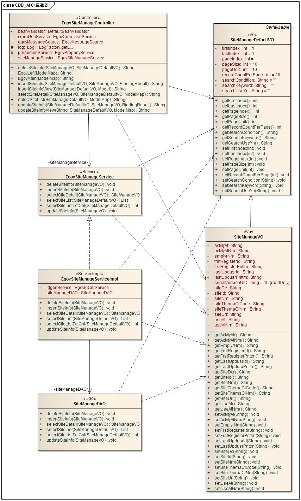
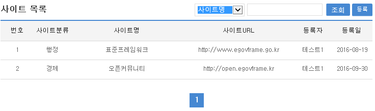
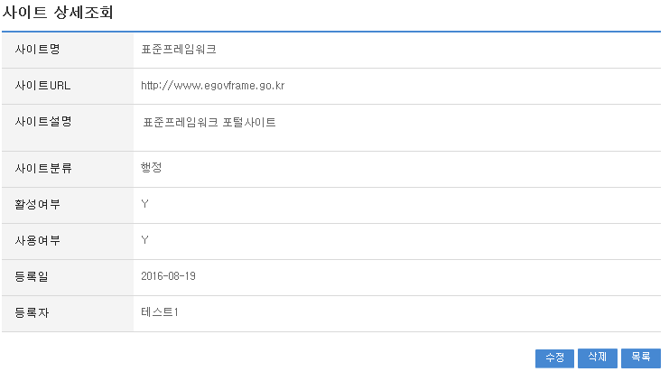
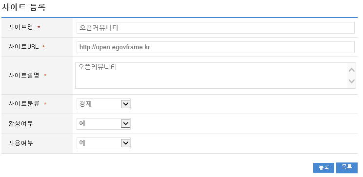
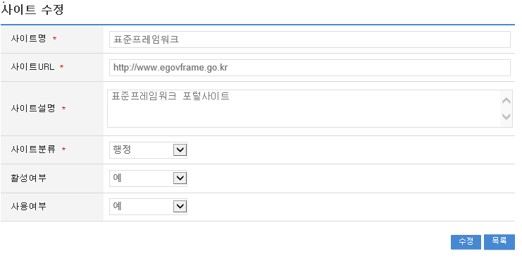

# 사이트관리

## 개요

 주제 및 유형별로 사이트를 등록하며 주기적으로 DeadLink를 체크하여 사이트URL정보를 등록/수정/보완할 수 있도록 구성되어 있다.

## 설명

### 패키지 참조 관계

 사이트관리 패키지는 요소기술의 공통 패키지(cmm)에 대해서만 직접적인 함수적 참조 관계를 가진다.
 패키지 간 참조 관계 : [사용자지원 Package Dependency](../intro/package-reference.md#사용자지원)

### 관련소스

| 유형 | 대상소스명 | 비고 |
| --- | --- | --- |
| Controller | egovframework.com.uss.ion.sit.web.EgovSiteController.java | 사이트관리를 위한 컨트롤러 클래스 |
| Service | egovframework.com.uss.ion.sit.service.EgovSiteService.java | 사이트관리를 위한 서비스 인터페이스 |
| ServiceImpl | egovframework.com.uss.ion.sit.service.impl.EgovSiteServiceImpl.java | 사이트관리를 위한 서비스 구현 클래스 |
| VO | egovframework.com.uss.ion.sit.service.SiteVO.java | 사이트관리를 위한 VO 클래스 |
| VO | egovframework.com.uss.ion.sit.service.SiteVO.java | 사이트관리를 위한 SearchVO 클래스 |
| DAO | egovframework.com.uss.ion.sit.service.impl.EgovSiteDAO.java | 사이트 관리를 위한 데이터처리 클래스 |
| JSP | /WEB-INF/jsp/egovframework/com/uss/ion/sit/EgovSiteList.jsp | 사이트관리를 위한 목록조회 페이지 |
| JSP | /WEB-INF/jsp/egovframework/com/uss/ion/sit/EgovSiteDetail.jsp | 사이트관리를 위한 상세조회 페이지 |
| JSP | /WEB-INF/jsp/egovframework/com/uss/ion/sit/EgovSiteRegist.jsp | 사이트관리를 위한 등록 페이지 |
| JSP | /WEB-INF/jsp/egovframework/com/uss/ion/sit/EgovSiteUpdt.jsp | 사이트관리를 위한 수정 페이지 |
| Query XML | resources/egovframework/mapper/com/uss/ion/sit/EgovSite\_SQL\_altibase.xml | 사이트관리를 위한 Altibase용 Query XML |
| Query XML | resources/egovframework/mapper/com/uss/ion/sit/EgovSite\_SQL\_cubrid.xml | 사이트관리를 위한 Cubrid용 Query XML |
| Query XML | resources/egovframework/mapper/com/uss/ion/sit/EgovSite\_SQL\_maria.xml | 사이트관리를 위한 MariaDB용 Query XML |
| Query XML | resources/egovframework/mapper/com/uss/ion/sit/EgovSite\_SQL\_mysql.xml | 사이트관리를 위한 MySQL용 Query XML |
| Query XML | resources/egovframework/mapper/com/uss/ion/sit/EgovSite\_SQL\_oracle.xml | 사이트관리를 위한 Oracle용 Query XML |
| Query XML | resources/egovframework/mapper/com/uss/ion/sit/EgovSite\_SQL\_postgres.xml | 사이트관리를 위한 PostgreSQL용 Query XML |
| Query XML | resources/egovframework/mapper/com/uss/ion/sit/EgovSite\_SQL\_tibero.xml | 사이트관리를 위한 Tibero용 Query XML |
| Query XML | resources/egovframework/mapper/com/uss/ion/sit/EgovSite\_SQL\_goldilocks.xml | 사이트관리를 위한 Goldilocks용 Query XML |
| Message properties | resources/egovframework/message/com/uss/ion/sit/message\_ko.properties | 사이트관리를 위한 Message properties(한글) |
| Message properties | resources/egovframework/message/com/uss/ion/sit/message\_en.properties | 사이트관리를 위한 Message properties(영문) |
| Idgen XML | resources/egovframework/spring/com/idgn/context-idgn-SiteManage.xml | 사이트등록을 위한 Id생성 Idgen XML |

### 클래스다이어그램

 

### ID Generation

#### ID Generation 관련 DDL 및 DML

 ID Generation Service를 활용하기 위해서 Sequence 저장테이블인  COMTECOPSEQ에 SITE_ID 항목을 추가해야 한다.

```sql
CREATE TABLE COMTECOPSEQ ( table_name varchar(16) NOT NULL, 
  		   next_id DECIMAL(30) NOT NULL,
  		   PRIMARY KEY (table_name));
  INSERT INTO COMTECOPSEQ VALUES('SITE_ID','0');
```

#### ID Generation 환경설정(context-idgn-SiteManage.xml)

```xml
<bean name="egovSiteManageIdGnrService"
		class="egovframework.rte.fdl.idgnr.impl.EgovTableIdGnrService"
		destroy-method="destroy">
		<property name="dataSource" ref="egov.dataSource" />
		<property name="strategy"   ref="siteManageStrategy" />
		<property name="blockSize" 	value="10"/>
		<property name="table"	   	value="COMTECOPSEQ"/>
		<property name="tableName"	value="SITE_ID"/>
	</bean>
 
	<bean name="siteManageStrategy"
		class="egovframework.rte.fdl.idgnr.impl.strategy.EgovIdGnrStrategyImpl">
		<property name="prefix" value="SITE_" />
		<property name="cipers" value="15" />
		<property name="fillChar" value="0" />
	</bean>
```

### 관련테이블

| 테이블명 | 테이블명(영문) | 비고 |
| --- | --- | --- |
| 사이트목록 | COMTNSITELIST | 사이트정보를 관리한다. |

## 관련기능

 사이트관리기능은 크게 사이트목록조회, 사이트상세조회, 사이트등록, 사이트수정 기능으로 구성되어 있다.

### 사이트목록조회

#### 비즈니스 규칙

 일반사용자가 아닌 관리자가 사용하는 화면으로 조회조건으로 목록조회를 할 수 있고, 등록버튼을 클릭하여 사이트등록 화면으로 이동하여 사이트를 등록 처리 할 수 있다.

#### 관련코드

 N/A

#### 관련화면 및 수행매뉴얼

| Action | URL | Controller method | SQL Namespace | SQL QueryID |
| --- | --- | --- | --- | --- |
| 목록조회 | /uss/ion/sit/selectSiteList.do | selectSiteList | "SiteManage" | "selectSiteList" |
|  |  |  | "SiteManage" | "selectSiteListCnt" |

 추천사이트 상세조회화면은 추천사이트수정, 추천사이트삭제, 추천사이트목록조회를 할 수 있다.
 사이트 목록은 페이지 당 10건씩 조회되며 페이징은 10페이지씩 이루어진다.
 검색조건은 사이트명, 사이트URL에 대해서 수행된다.
 페이지 당 검색 범위를 변경하고자 하는 경우
 context-properties.xml 파일의 pageUnit, pageSize를 변경한다.(단 해당 설정은 전체 공통서비스 기능에 영향을 미친다.)

 

 조회: 사이트를 조회하기 위해서는 상단의 검색조건을 선택 후 해당하는 검색문자를 입력 후 조회 버튼을 클릭한다.
 등록: 사이트를 등록하기 위해서는 상단의 등록 버튼을 통해서 사이트등록 화면으로 이동한다.
 목록클릭: 사이트상세조회 화면으로 이동한다.

### 사이트상세조회

#### 비즈니스 규칙

 일반사용자가 아닌 관리자가 사용하는 화면으로 사이트목록조회에서 목록 클릭 시 이동되는 화면으로 사이트에 대한 상세정보를 보여준다.

#### 관련코드

 사이트관리에서 사용되는 코드 및 그에 따른 설정 값의 반영사항은 다음과 같다.

| 코드분류 | 코드분류명 | 코드ID | 코드명 |
| --- | --- | --- | --- |
| COM023 | 사이트주제분류 | 01 | 경제 |
| COM023 | 사이트주제분류 | 02 | 전산 |
| COM023 | 사이트주제분류 | 03 | 행정 |

 사이트주제분류 코드를 추가하여 사용 할 수 있다.

#### 관련화면 및 수행매뉴얼

| Action | URL | Controller method | SQL Namespace | SQL QueryID |
| --- | --- | --- | --- | --- |
| 상세조회 | /uss/ion/sit/selectSiteDetail.do | selectSiteDetail | "SiteManage" | "selectSiteDetail" |
| 삭제 | /uss/ion/sit/deleteSite.do | deleteSite | "SiteManage" | "deleteSite" |

 사이트 상세조회화면은 사이트목록조회에서 목록클릭 시 상세조회화면으로 이동된다.

 

 수정: 수정버튼 클릭 시 사이트를 수정할 수 있는 화면으로 이동한다.
 삭제: 삭제버튼 클릭 시 삭제여부를 확인하는 메시지를 보여주고 삭제처리를 할 수 있다.
 목록: 사이트목록조회 화면으로 이동한다.

### 사이트정보등록

#### 비즈니스 규칙

 사이트에 관한 기본정보를 입력 저장처리한다. 입력명 우측의 빨간* 표시는 반드시 입력해야할 항목을 표시한다.

#### 관련코드

 사이트관리에서 사용되는 코드 및 그에 따른 설정 값의 반영사항은 다음과 같다.

| 코드분류 | 코드분류명 | 코드ID | 코드명 |
| --- | --- | --- | --- |
| COM023 | 사이트주제분류 | 01 | 경제 |
| COM023 | 사이트주제분류 | 02 | 전산 |
| COM023 | 사이트주제분류 | 03 | 행정 |

 사이트주제분류 코드를 추가하여 사용 할 수 있다.

#### 관련화면 및 수행매뉴얼

| Action | URL | Controller method | SQL Namespace | SQL QueryID |
| --- | --- | --- | --- | --- |
| 등록화면 | /uss/ion/sit/insertSiteView.do | insertSiteView |  |  |
| 등록 | /uss/ion/sit/insertSite.do | insertSite | "SiteManage" | "insertSite" |

 

 목록: 사이트목록조회 화면으로 이동한다.
 저장: 입력한 사이트정보들이 저장 처리된다.

### 사이트정보수정

#### 비즈니스 규칙

 입력한 사이트정보들을 저장 처리한다. 입력명 우측의 빨간* 표시는 수정 시 반드시 입력해야 할 항목을 표시한다.

#### 관련코드

 사이트관리에서 사용되는 코드 및 그에 따른 설정 값의 반영사항은 다음과 같다.

| 코드분류 | 코드분류명 | 코드ID | 코드명 |
| --- | --- | --- | --- |
| COM023 | 사이트주제분류 | 01 | 경제 |
| COM023 | 사이트주제분류 | 02 | 전산 |
| COM023 | 사이트주제분류 | 03 | 행정 |

 사이트주제분류 코드를 추가하여 사용 할 수 있다.

#### 관련화면 및 수행매뉴얼

| Action | URL | Controller method | SQL Namespace | SQL QueryID |
| --- | --- | --- | --- | --- |
| 수정화면 | /uss/ion/sit/updateSiteView.do | updateSiteView | "SiteManage" | "selectSiteDetail" |
| 수정 | /uss/ion/sit/updateSite.do | updateSite | "SiteManage" | "updateSite" |

 

 수정: 수정 입력한 사이즈정보들이 저장 처리된다.
 목록: 사이트목록조회 화면으로 이동한다.
