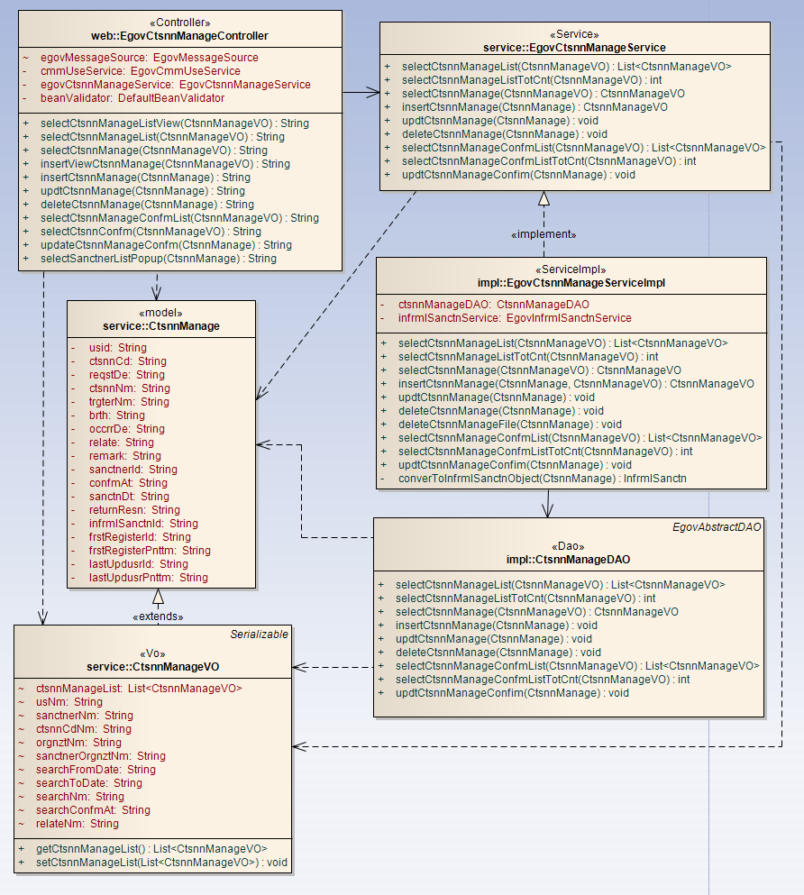
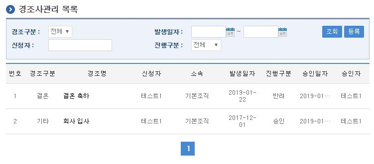
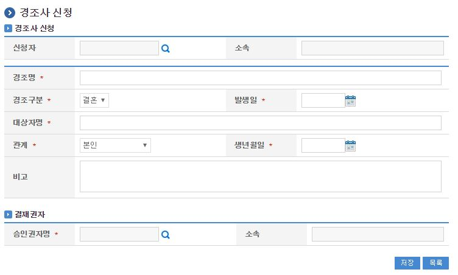
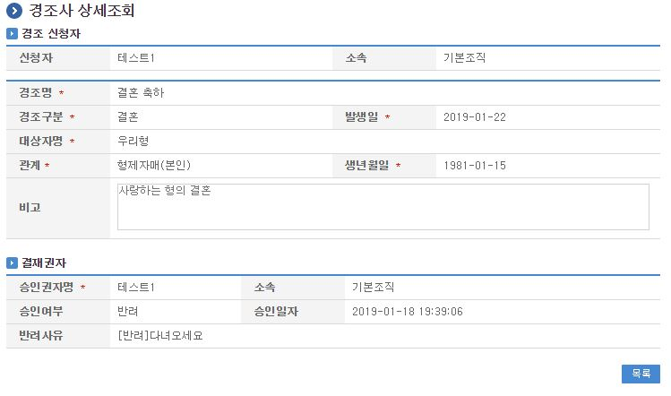
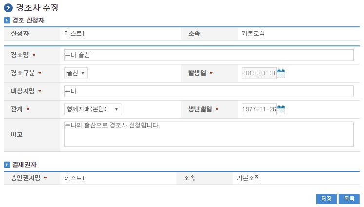

# 경조사관리

## 개요

 경조사관리는 시스템에서 임직원 경조사를 관리하는 기능으로 임직원 경조사 정보를 관리하는 기능을 제공한다.

## 설명

 경조사관리는 임직원 경조사를 관리하기 위한 목적으로 경조사 등록, 수정, 삭제, 조회, 목록조회, 경조사승인 기능을 수반한다.

```text
  ① 경조사관리목록 : 경조사관리 정보를 최근 등록 순서대로 조회하고, 그 결과 목록을 화면에 반영한다.
  ② 경조사등록 : 경조사 정보를 등록하고, 등록 결과를 조회한다.
  ③ 경조사수정 : 기 등록된 경조사 정보의 항목들을 수정한다.
  ④ 경조사삭제 : 기 등록된 경조사 정보를 삭제한다.
  ⑤ 경조사상세조회 : 등록된 경조사 상세정보를 조회한다.
  ⑥ 경조사승인목록 : 승인권한자가 경조사관리 정보를 최근 등록 순서대로 조회 그 결과는 목록 화면에 반영한다.
  ⑦ 경조사승인 : 승인권한자가 등록된 경조사정보의 승인을 처리한다.
```

### 관련소스

| 유형 | 대상소스명 | 비고 |
| --- | --- | --- |
| Controller | egovframework.com.uss.ion.ctn.web.EgovCtsnnManageController.java | 경조사 관리를 위한 컨트롤러 클래스 |
| Service | egovframework.com.uss.ion.ctn.service.EgovCtsnnManageService.java | 경조사 관리를 위한 서비스 인터페이스 |
| ServiceImpl | egovframework.com.uss.ion.ctn.service.impl.EgovCtsnnManageServiceImpl.java | 경조사 관리를 위한 서비스 구현 클래스 |
| DAO | egovframework.com.uss.ion.ctn.service.impl.CtsnnManageDAO.java | 경조사 관리를 위한 데이터처리 클래스 |
| VO | egovframework.com.uss.ion.ctn.service.CtsnnManageVO.java | 경조사 관리를 위한 VO 클래스 |
| JSP | /WEB-INF/jsp/egovframework/com/uss/ion/ctn/EgovCtsnnManageList.jsp | 경조사 목록조회를 위한 jsp페이지 |
| JSP | /WEB-INF/jsp/egovframework/com/uss/ion/ctn/EgovCtsnnRegist.jsp | 경조사 등록를 위한 jsp페이지 |
| JSP | /WEB-INF/jsp/egovframework/com/uss/ion/ctn/EgovCtsnnDetail.jsp | 등록된 경조사를 상세조회/반영하기 위한 jsp페이지 |
| JSP | /WEB-INF/jsp/egovframework/com/uss/ion/ctn/EgovCtsnnUpdt.jsp | 경조사 수정를 위한 jsp페이지 |
| JSP | /WEB-INF/jsp/egovframework/com/uss/ion/ctn/EgovCtsnnConfmList.jsp | 경조사 승인목록조회를 위한 jsp페이지 |
| JSP | /WEB-INF/jsp/egovframework/com/uss/ion/ctn/EgovCtsnnConfm.jsp | 경조사 승인처리를 위한 jsp페이지 |
| Query XML | resources/egovframework/mapper/com/uss/ion/ctn/EgovCtsnnManage\_SQL\_altibase.xml | 경조사관리 Altibase XML |
| Query XML | resources/egovframework/mapper/com/uss/ion/ctn/EgovCtsnnManage\_SQL\_cubrid.xml | 경조사관리 Cubrid XML |
| Query XML | resources/egovframework/mapper/com/uss/ion/ctn/EgovCtsnnManage\_SQL\_mysql.xml | 경조사관리 MySQL XML |
| Query XML | resources/egovframework/mapper/com/uss/ion/ctn/EgovCtsnnManage\_SQL\_maria.xml | 경조사관리 MariaDB XML |
| Query XML | resources/egovframework/mapper/com/uss/ion/ctn/EgovCtsnnManage\_SQL\_tibero.xml | 경조사관리 Tibero XML |
| Query XML | resources/egovframework/mapper/com/uss/ion/ctn/EgovCtsnnManage\_SQL\_postgres.xml | 경조사관리 PostgreSQL XML |
| Query XML | resources/egovframework/mapper/com/uss/ion/ctn/EgovCtsnnManage\_SQL\_oracle.xml | 경조사관리 Oracle XML |
| Query XML | resources/egovframework/mapper/com/uss/ion/ctn/EgovCtsnnManage\_SQL\_goldilocks.xml | 경조사관리 Goldilocks XML |
| Message properties | resources/egovframework/message/com/uss/ion/ctn/message\_ko.properties | 경조사 관리 Message properties |
| Message properties | resources/egovframework/message/com/uss/ion/ctn/message\_en.properties | 경조사 관리 Message properties |
| Idgen XML | resources/egovframework/spring/com/idgn/context-idgn-CtsnnManage.xml | 경조사관리를 위한 Id생성 Idgen XML |

### 클래스 다이어그램

 

### 관련테이블

| 테이블명 | 테이블명(영문) | 비고 |
| --- | --- | --- |
| 경조사정보 | COMTNCTSNNMANAGE | 경조사정보를 관리하기 위한 속성정보를 정의하고, 관리한다. |

#### ID Generation 관련 DDL 및 DML

 ID Generation Service를 활용하기 위해서 Sequence 저장테이블인  COMTECOPSEQ에 CTSNN_ID 항목을 추가해야 한다.

```sql
    CREATE TABLE COMTECOPSEQ ( table_name varchar(16) NOT NULL, 
                               next_id DECIMAL(30) NOT NULL,
                               PRIMARY KEY (table_name)
    );
 
    INSERT INTO COMTECOPSEQ VALUES ('CTSNN_ID','0');
```

#### ID Generation 환경설정(context-idgn-CtsnnManage.xml)

```xml
    <bean name="egovCtsnnManageIdGnrService" class="egovframework.rte.fdl.idgnr.impl.EgovTableIdGnrServiceImpl" destroy-method="destroy">
        <property name="dataSource" ref="egov.dataSource" />
        <property name="strategy"   ref="ctsnnManageIdStrategy" />
        <property name="blockSize"  value="10"/>
        <property name="table"      value="COMTECOPSEQ"/>
        <property name="tableName"  value="CTSNN_ID"/>
    </bean>
    <bean name="ctsnnManageIdStrategy" class="egovframework.rte.fdl.idgnr.impl.strategy.EgovIdGnrStrategyImpl">
        <property name="prefix"     value="CTSNN_" />
        <property name="cipers"     value="14" />
        <property name="fillChar"   value="0" />
    </bean>
```

## 관련화면 및 수행메뉴얼

### 경조사관리 목록조회

| Action | URL | Controller method | QueryID |
| --- | --- | --- | --- |
| 조회 | /uss/ion/ctn/selectCtsnnManageList.do | selectCtsnnManageList | "ctsnnManageDAO.selectCtsnnManageList" |
| 조회 | /uss/ion/ctn/selectCtsnnManageList.do | selectCtsnnManageList | "ctsnnManageDAO.selectCtsnnManageListTotCnt" |

 경조사관리 목록은 페이지당 10건씩 조회되며 페이징은 10페이지씩 이루어진다.
 검색조건은 경조구분, 신청기간, 신청자에 대해서 수행된다.

 

 조회 : 기 등록된 경조사관리의 목록을 조회한다.
 등록 : 신규 경조을 등록하기 위해서는 상단의 등록 버튼을 통해서 경조사 등록 화면으로 이동한다.
 상세조회: 등록된 경조사 목록(경조명)을 클릭하면 상세정보 화면으로 이동한다.

### 경조사 등록

| Action | URL | Controller method | QueryID |
| --- | --- | --- | --- |
| 등록 | /uss/ion/ctn/insertCtsnnManage.do | insertCtsnnManage | "ctsnnManageDAO.insertCtsnnManage" |

 경조사의 속성정보를 입력한 뒤 등록한다.

 

 등록 : 신규 경조사을 등록하기 위해서는 경조 속성을 입력한 뒤 상단의 등록 버튼을 통해서 경조사을 등록한다.
 목록 : 경조사 목록조회 화면으로 이동한다.

### 경조사 상세

| Action | URL | Controller method | QueryID |
| --- | --- | --- | --- |
| 상세조회 | /uss/ion/ctn/EgovCtsnnManageDetail.do | selectCtsnnManage | "ctsnnManageDAO.selectCtsnnManage" |
| 삭제 | /uss/ion/ctn/deleteCtsnnManage.do | deleteCtsnnManage | "ctsnnManageDAO.deleteCtsnnManage" |

 경조사의 상세조회화면이다. 수정 버튼을 통해서 수정화면으로 이동하고, 삭제 버튼을 통해서 경조사를 삭제한다.

 

 수정 : 경조사 수정 화면으로 이동한다.
 삭제 : 삭제 버튼을 통해서 기 등록된 경조정보를 삭제한다.
 목록 : 경조사 목록조회 화면으로 이동한다.

### 경조사 수정

| Action | URL | Controller method | QueryID |
| --- | --- | --- | --- |
| 수정 | /uss/ion/ctn/updtCtsnnManage.do | updtCtsnnManage | "ctsnnManageDAO.updtCtsnnManage" |
| 상세조회 | /uss/ion/ctn/EgovCtsnnManageDetail.do | selectCtsnnManage | "ctsnnManageDAO.selectCtsnnManage" |

 경조사의 속성정보를 변경한 후 저장한다. 다음 화면은 경조사 상세조회 화면과 동일하다.

 

 수정 : 기 등록된 경조 속성을 수정한 뒤 상단의 수정 버튼을 통해서 경조 정보를 수정한다.
 목록 : 경조사 목록조회 화면으로 이동한다.

