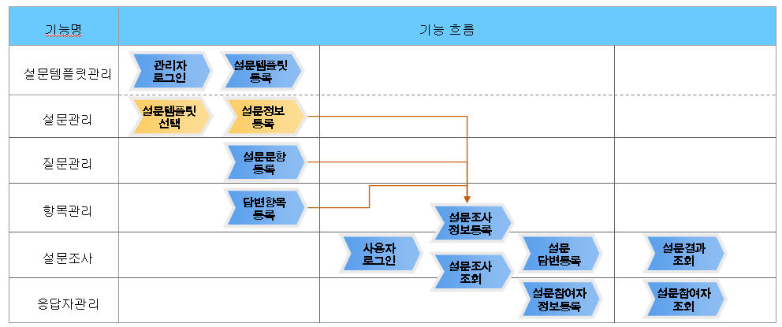
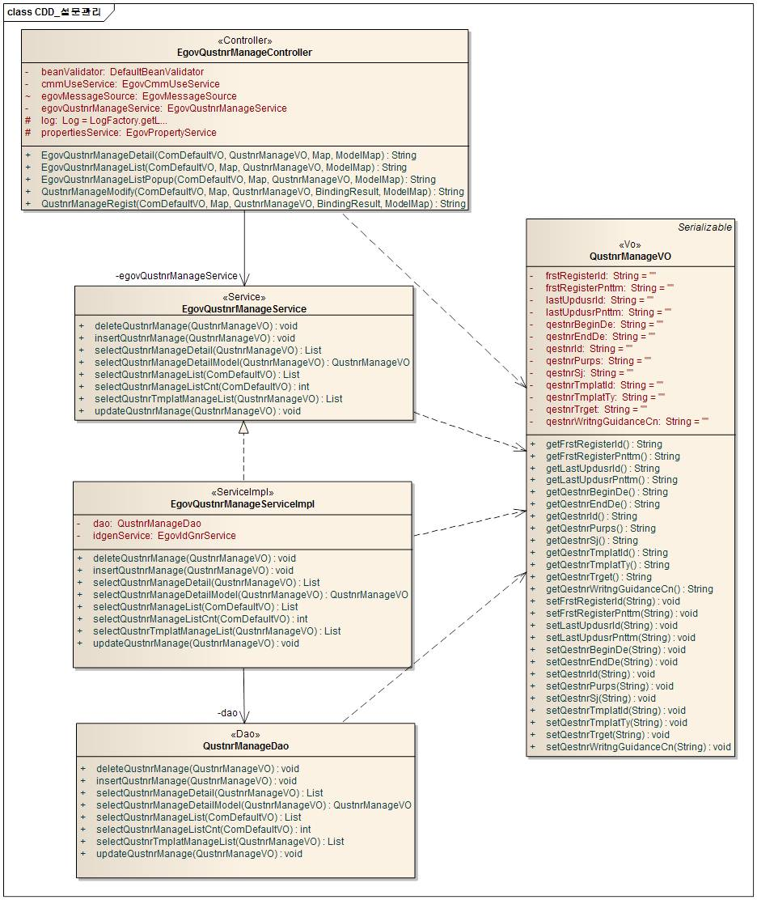
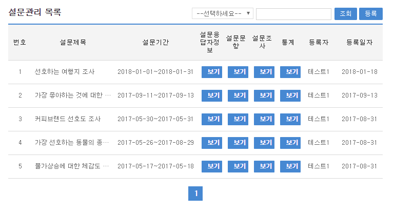
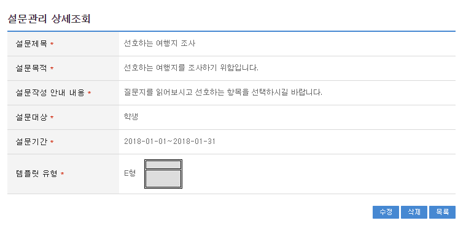
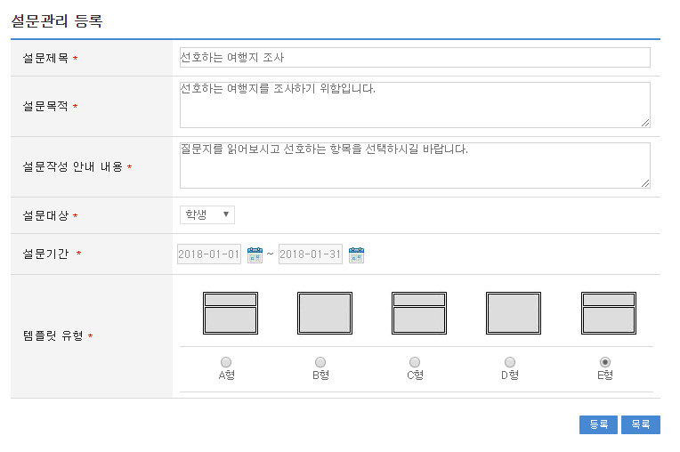
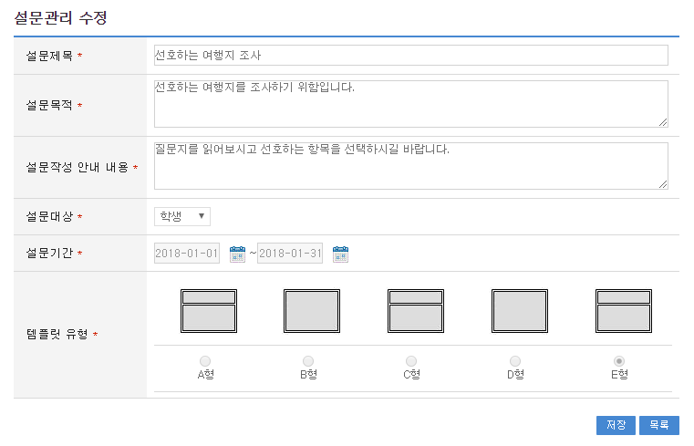

# 설문관리

## 개요

 설문관리 시스템 구축시 사용되는 관리 기능과 조사 기능으로  기본적인 관리와 조사 PROCESS는 다음과 같다.
 기능흐름

 

### 1. 설문템플릿등록

 설문템플릿 기본정보 입력후 등록한다. / 설문참여 양식 결정
 설문템플릿관리

### 2. 설문지등록(설문등록)

 설문템플릿선택하고 설문지 기본정보 입력후 등록한다.
 설문관리

### 3. 설문문항등록

 설문지정보를 선택하고 설문문항 기본정보 입력후 등록한다.
 설문질문관리

### 4. 설문항목등록

 설문지정보, 설문문항정보 선택하고 설문항목 입력후 등록한다.
 설문항목관리

### 5. 설문참여

 설문참여 등록에서 설문조사에 응한다.
 설문참여 통계를 이용하여 설문참여결과를 확인한다.
 설문참여

### 관련소스

| 유형 | 대상소스명 | 비고 |
| --- | --- | --- |
| Controller | egovframework.com.uss.olp.qmc.web.EgovQustnrManageController.java | 설문관리 Controller Class |
| Service | egovframework.com.uss.olp.qmc.service.EgovQustnrManageService.java | 설문관리 Service Class |
| ServiceImpl | egovframework.com.uss.olp.qmc.service.impl.EgovQustnrManageServiceImpl.java | 설문관리 ServiceImpl Class |
| VO | egovframework.com.uss.olp.qmc.service.QustnrManageVO.java | 설문관리  VO Class |
| VO | egovframework.com.cmm.ComDefaultVO.java | 검색 VO Class |
| DAO | egovframework.com.uss.olp.qmc.service.impl.QustnrManageDao.java | 설문관리 Dao Class |
| JSP | /WEB-INF/jsp/egovframework/com/uss/olp/qmc/EgovQustnrManageList.jsp | 설문관리 목록조회 페이지 |
| JSP | /WEB-INF/jsp/egovframework/com/uss/olp/qmc/EgovQustnrManageListPopup.jsp | 설문관리 목록 페이지 |
| JSP | /WEB-INF/jsp/egovframework/com/uss/olp/qmc/EgovQustnrManageRegist.jsp | 설문관리 등록 페이지 |
| JSP | /WEB-INF/jsp/egovframework/com/uss/olp/qmc/EgovQustnrManageModify.jsp | 설문관리 수정 페이지 |
| JSP | /WEB-INF/jsp/egovframework/com/uss/olp/qmc/EgovQustnrManageDetail.jsp | 설문관리 상세조회 페이지 |
| QUERY XML | resources/egovframework/mapper/com/uss/olp/qmc/EgovQustnrManage\_SQL\_mysql.xml | 설문관리 MySQL용 QUERY XML |
| QUERY XML | resources/egovframework/mapper/com/uss/olp/qmc/EgovQustnrManage\_SQL\_oracle.xml | 설문관리 Oracle용 QUERY XML |
| QUERY XML | resources/egovframework/mapper/com/uss/olp/qmc/EgovQustnrManage\_SQL\_tibero.xml | 설문관리 Tibero용 QUERY XML |
| QUERY XML | resources/egovframework/mapper/com/uss/olp/qmc/EgovQustnrManage\_SQL\_altibase.xml | 설문관리 Altibase용 QUERY XML |
| QUERY XML | resources/egovframework/mapper/com/uss/olp/qmc/EgovQustnrManage\_SQL\_cubrid.xml | 설문관리 Cubrid용 QUERY XML |
| QUERY XML | resources/egovframework/mapper/com/uss/olp/qmc/EgovQustnrManage\_SQL\_maria.xml | 설문관리 MariaDB용 QUERY XML |
| QUERY XML | resources/egovframework/mapper/com/uss/olp/qmc/EgovQustnrManage\_SQL\_postgres.xml | 설문관리 PostgreSQL용 QUERY XML |
| QUERY XML | resources/egovframework/mapper/com/uss/olp/qmc/EgovQustnrManage\_SQL\_goldilocks.xml | 설문관리 Goldilocks용 QUERY XML |
| Message properties | resources/egovframework/message/com/uss/olp/qmc/message\_ko.properties | 설문관리를 위한 Message properties(한글) |
| Message properties | resources/egovframework/message/com/uss/olp/qmc/message\_en.properties | 설문관리를 위한 Message properties(영문) |
| Idgen XML | resources/egovframework/spring/com/idgn/context-idgn-QustnrManage.xml | 설문관리 Id생성 Idgen XML |

### 클래스 다이어그램

 

### ID Generation

#### ID Generation 관련 DDL 및 DML

 ID Generation Service를 활용하기 위해서 Sequence 저장 테이블인 COMTECOPSEQ에 QUSTNRTMPLA_ID 항목을 추가해야 한다.

```sql
CREATE TABLE COMTECOPSEQ ( 
  		   TABLE_NAME varchar(16) NOT NULL, 
  		   NEXT_ID NUMERIC(30) NULL,
  		   PRIMARY KEY (TABLE_NAME));
 
  INSERT INTO COMTECOPSEQ VALUES('QUSTNRTMPLA_ID', 1);
```

#### ID Generation 환경설정(context-idgn-QustnrManage.xml)

```xml
<bean name="egovQustnrManageIdGnrService"
		class="egovframework.rte.fdl.idgnr.impl.EgovTableIdGnrService"
		destroy-method="destroy">
		<property name="dataSource" ref="egov.dataSource" />
		<property name="strategy" ref="QustnrManageInfotrategy" />
		<property name="blockSize" 	value="10"/>
		<property name="table"	   	value="COMTECOPSEQ"/>
		<property name="tableName"	value="QUSTNRTMPLA_ID"/>
	</bean>
	<bean name="QustnrManageInfotrategy"
		class="egovframework.rte.fdl.idgnr.impl.strategy.EgovIdGnrStrategyImpl">
		<property name="prefix" value="QMANAGE_" />
		<property name="cipers" value="12" />
		<property name="fillChar" value="0" />
	</bean>
```

### 관련테이블

| 테이블명 | 테이블명(영문) | 비고 |
| --- | --- | --- |
| 설문관리 | COMTNQESTNRINFO | 설문제목 등록자를 관리한다. |

## 관련기능

 설문관리기능은 크게 설문관리 목록조회,  설문관리 상세조회, 설문관리 등록, 설문관리 수정 기능으로 구성되어 있다.

### 설문관리 목록조회

#### 비즈니스 규칙

 관리자가 기(記) 등록된 설문관리 정보를 리스트 형태로 조회 할 수 있고, 등록버튼을 클릭하여 등록화면으로 이동할수있다.

#### 관련코드

 N/A

#### 관련화면 및 수행매뉴얼

| Action | URL | Controller method | QueryID |
| --- | --- | --- | --- |
| 목록조회 | /uss/olp/qmc/EgovQustnrManageList.do | egovQustnrManageList | "QustnrManage.selectQustnrManage", |
|  |  |  | "QustnrManage.selectQustnrManageCnt" |

 설문관리 목록은 페이지 당 10건씩 조회되며 페이징은 10페이지씩 이루어진다.
 검색조건은 설문제목, 등록자 대해서 수행된다.
 페이지 당 검색 범위를 변경하고자 하는 경우
 context-properties.xml 파일의 pageUnit, pageSize를 변경한다.(단 해당 설정은 전체 공통서비스 기능에 영향을 미친다.)

 

 조회: 조회하기 위해서는 상단의 검색조건을 선택 후 해당하는 검색문자를 입력 후 조회 버튼을 클릭한다.
 등록: 등록하기 위해서는 상단의 등록 버튼을 통해서 설문관리등록 화면으로 이동한다.
 목록(설문제목)클릭: 설문관리상세조회 화면으로 이동한다.
 목록(설문응답자정보)클릭: 설문응답자정보 목록 화면으로 이동한다.
 목록(설문문항)클릭: 설문문항 목록 화면으로 이동한다.
 목록(설문조사)클릭: 설문조사 목록 화면으로 이동한다.
 목록(통계)클릭: 설문지별통계 화면으로 이동한다.

### 설문관리 상세조회

#### 비즈니스 규칙

 설문관리 목록에서 목록 클릭 시 이동되는 화면으로 설문관리에 대한 상세정보를 보여준다.

#### 관련코드

 N/A

#### 관련화면 및 수행매뉴얼

| Action | URL | Controller method | QueryID |
| --- | --- | --- | --- |
| 상세조회 | /uss/olp/qmc/EgovQustnrManageDetail.do | egovQustnrManageDetail | "QustnrManage.selectQustnrManageDetailModel" |
| 설문응답자 삭제 | /uss/olp/qmc/EgovQustnrManageDetail.do | egovQustnrManageDetail | "QustnrManage.deleteQustnrRespondManage" |
| 설문조사 삭제 | /uss/olp/qmc/EgovQustnrManageDetail.do | egovQustnrManageDetail | "QustnrManage.deleteQustnrRespondInfo" |
| 설문항목 삭제 | /uss/olp/qmc/EgovQustnrManageDetail.do | egovQustnrManageDetail | "QustnrManage.deleteQustnrItemManage" |
| 설문질문 삭제 | /uss/olp/qmc/EgovQustnrManageDetail.do | egovQustnrManageDetail | "QustnrManage.deleteQustnrQestnManage" |
| 설문관리 삭제 | /uss/olp/qmc/EgovQustnrManageDetail.do | egovQustnrManageDetail | "QustnrManage.deleteQustnrManage" |

 

 수정: 수정버튼 클릭 시 설문관리 수정 화면으로 이동한다.
 삭제: 삭제버튼 클릭 시 삭제여부를 확인하는 메시지를 보여주고 삭제처리를 할 수 있다.
 목록: 설문관리 목록 화면으로 이동한다.

### 설문관리 등록

#### 비즈니스 규칙

 설문관리에 관한 기본정보를 입력 저장처리한다. 입력명 우측의 빨간* 표시는 반드시 입력해야할 항목을 표시한다.

#### 관련코드

 N/A

#### 관련화면 및 수행매뉴얼

| Action | URL | Controller method | QueryID |
| --- | --- | --- | --- |
| 등록 | /uss/olp/qmc/EgovQustnrManageRegist.do | qustnrManageRegist | "QustnrManage.insertQustnrManage" |

 

 목록: 설문관리목록 화면으로 이동한다.
 등록: 입력한 설문관리 정보들이 등록 처리된다.

### 설문관리 수정

#### 비즈니스 규칙

 입력한 설문관리 정보를 저장 처리한다. 입력명 우측의 빨간* 표시는 수정 시 반드시 입력해야 할 항목을 표시한다.

#### 관련코드

 N/A

#### 관련화면 및 수행매뉴얼

| Action | URL | Controller method | QueryID |
| --- | --- | --- | --- |
| 저장 | /uss/olp/qmc/EgovQustnrManageModify.do | qustnrManageModify | "QustnrManage.updateQustnrManage" |

 

 저장: 수정된 정보들이 저장 처리된다.
 목록: 설문관리목록 화면으로 이동한다.
