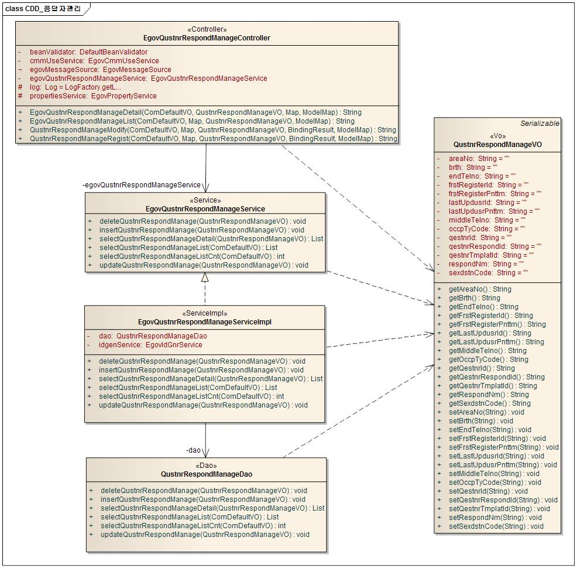
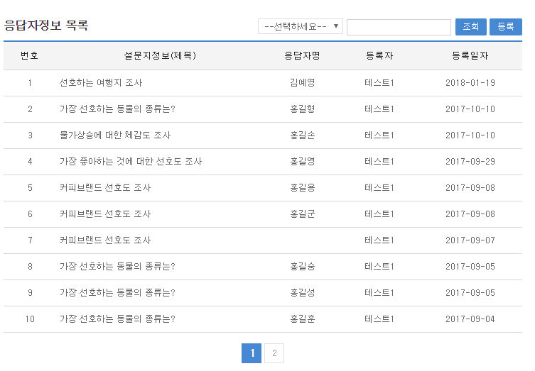
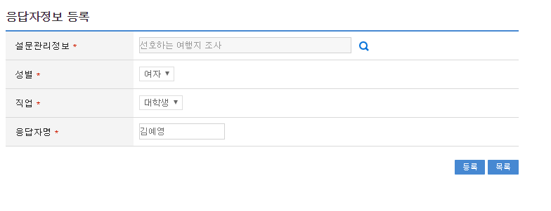
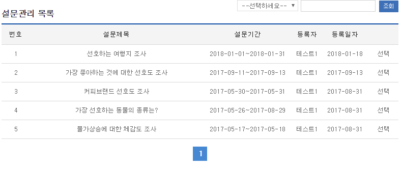
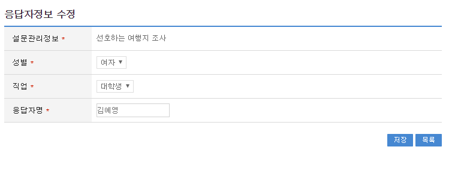
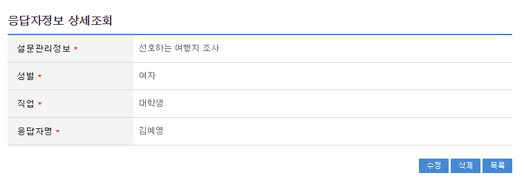

# 설문응답자관리

## 개요

 설문관리 시스템 구축시 사용되는 응답자정보 기능을 제공하며, 설문참여자 가 설문참여 시 응답자정보를 기본으로 입력하게 되어 있다.

## 설명

### 패키지 참조 관계

 설문응답자관리 패키지는 요소기술의 공통 패키지(cmm)에 대해서만 직접적인 함수적 참조 관계를 가진다. 하지만, 컴포넌트 배포 시 오류 없이 실행되기 위하여 패키지 간의 참조관계에 따라 설문조사, 설문관리, 설문템플릿관리, 설문질문관리, 설문항목관리, 달력 패키지와 함께 배포 파일을 구성한다.
 패키지 간 참조 관계 : [사용자지원 Package Dependency](../intro/package-reference.md#사용자지원)

### 관련소스

| 유형 | 대상소스명 | 비고 |
| --- | --- | --- |
| Controller | egovframework.com.uss.olp.qrm.web.EgovQustnrRespondManageController.java | 응답자정보 Controller Class |
| Service | egovframework.com.uss.olp.qrm.service.EgovQustnrRespondManageService.java | 응답자정보 Service Class |
| ServiceImpl | egovframework.com.uss.olp.qrm.service.impl.EgovQustnrRespondManageServiceImpl.java | 응답자정보 ServiceImpl Class |
| VO | egovframework.com.uss.olp.qrm.service.QustnrRespondManageVO.java | 응답자정보  VO Class |
| VO | egovframework.com.cmm.ComDefaultVO.java | 검색 VO Class |
| DAO | egovframework.com.uss.olp.qrm.service.impl.QustnrRespondManageDao.java | 응답자정보 Dao Class |
| JSP | /WEB-INF/jsp/egovframework/com/uss/olp/qrm/EgovQustnrRespondManageList.jsp | 응답자정보 목록조회 페이지 |
| JSP | /WEB-INF/jsp/egovframework/com/uss/olp/qrm/EgovQustnrRespondManageRegist.jsp | 응답자정보 등록 페이지 |
| JSP | /WEB-INF/jsp/egovframework/com/uss/olp/qrm/EgovQustnrRespondManageModify.jsp | 응답자정보 수정 페이지 |
| JSP | /WEB-INF/jsp/egovframework/com/uss/olp/qrm/EgovQustnrRespondManageDetail.jsp | 응답자정보 상세조회 페이지 |
| QUERY XML | resources/egovframework/mapper/com/uss/olp/qrm/EgovQustnrRespondManage\_SQL\_mysql.xml | 응답자정보 MySQL용 QUERY XML |
| QUERY XML | resources/egovframework/mapper/com/uss/olp/qrm/EgovQustnrRespondManage\_SQL\_oracle.xml | 응답자정보 Oracle용 QUERY XML |
| QUERY XML | resources/egovframework/mapper/com/uss/olp/qrm/EgovQustnrRespondManage\_SQL\_tibero.xml | 응답자정보 Tibero용 QUERY XML |
| QUERY XML | resources/egovframework/mapper/com/uss/olp/qrm/EgovQustnrRespondManage\_SQL\_altibase.xml | 응답자정보 Altibase용 QUERY XML |
| QUERY XML | resources/egovframework/mapper/com/uss/olp/qrm/EgovQustnrRespondManage\_SQL\_cubrid.xml | 응답자정보 Cubrid용 QUERY XML |
| QUERY XML | resources/egovframework/mapper/com/uss/olp/qrm/EgovQustnrRespondManage\_SQL\_maria.xml | 응답자정보 MariaDB용 QUERY XML |
| QUERY XML | resources/egovframework/mapper/com/uss/olp/qrm/EgovQustnrRespondManage\_SQL\_postgres.xml | 응답자정보 PostgreSQL용 QUERY XML |
| QUERY XML | resources/egovframework/mapper/com/uss/olp/qrm/EgovQustnrRespondManage\_SQL\_goldilocks.xml | 응답자정보 Goldilocks용 QUERY XML |
| Message properties | resources/egovframework/message/com/uss/olp/qrm/message\_ko.properties | 설문응답자관리를 위한 Message properties(한글) |
| Message properties | resources/egovframework/message/com/uss/olp/qrm/message\_en.properties | 설문응답자관리를 위한 Message properties(영문) |
| Idgen XML | resources/egovframework/spring/com/idgn/context-idgn-qustnrRespondManage.xml | 응답자정보 Id생성 Idgen XML |

### 클래스 다이어그램

 

### ID Generation

#### ID Generation 관련 DDL 및 DML

 ID Generation Service를 활용하기 위해서 Sequence 저장 테이블인 COMTECOPSEQ에 QESTNR_RPD_ID 항목을 추가해야 한다.

```sql
CREATE TABLE COMTECOPSEQ ( 
  		   TABLE_NAME VARCHAR(20) NOT NULL, 
  		   NEXT_ID NUMERIC(30) NULL,
  		   PRIMARY KEY (TABLE_NAME));
 
  INSERT INTO COMTECOPSEQ VALUES('QESTNR_RPD_ID', 1);
```

#### ID Generation 환경설정(context-idgn-qustnrRespondManage.xml)

```xml
<bean name="qustnrRespondManageIdGnrService"
		class="egovframework.rte.fdl.idgnr.impl.EgovTableIdGnrService"
		destroy-method="destroy">
		<property name="dataSource" ref="egov.dataSource" />
		<property name="strategy" ref="QustnrRespondManageInfotrategy" />
		<property name="blockSize" 	value="10"/>
		<property name="table"	   	value="COMTECOPSEQ"/>
		<property name="tableName"	value="QESTNR_RPD_ID"/>
	</bean>
	<bean name="QustnrRespondManageInfotrategy"
		class="egovframework.rte.fdl.idgnr.impl.strategy.EgovIdGnrStrategyImpl">
		<property name="prefix" value="QRPD_" />
		<property name="cipers" value="15" />
		<property name="fillChar" value="0" />
	</bean>
```

### 관련테이블

| 테이블명 | 테이블명(영문) | 비고 |
| --- | --- | --- |
| 설문관리 | COMTNQESTNRINFO | 설문관리를(을) 조회 한다. |
| 설문응답자정보 | COMTNQUSTNRRESPONDINFO | 설문응답자정보를(을) 관리 한다. |

### 관련코드

 응답자정보에서 사용되는 코드 및 그에 따른 설정 값의 반영사항은 다음과 같다.

| 코드분류 | 코드분류명 | 코드ID | 코드명 |
| --- | --- | --- | --- |
| COM014 | 성별코드 | M | 기능설명 |
| COM014 | 성별코드 | F | 절차설명 |
| COM034 | 작업유형코드 | 1 | 학생 |
| COM034 | 작업유형코드 | 2 | 대학생 |
| COM034 | 작업유형코드 | 3 | 군인 |
| COM034 | 작업유형코드 | 4 | 교사 |
| COM034 | 작업유형코드 | 5 | 기타 |

## 관련기능

 설문응답자관리는 응답자정보 목록조회, 응답자정보 등록, 응답자정보 수정, 응답자정보 상세조회 기능으로 구성되어 있다.

### 응답자정보 목록조회

#### 비즈니스 규칙

 관리자가 기(記) 등록된 응답자정보 정보를 리스트 형태로 조회 할 수 있고, 등록버튼을 클릭하여 등록화면으로 이동할 수 있다.

#### 관련코드

 N/A

#### 관련화면 및 수행매뉴얼

| Action | URL | Controller method | QueryID |
| --- | --- | --- | --- |
| 목록조회 | /uss/olp/qrm/EgovQustnrRespondManageList.do | egovQustnrRespondManageList | "QustnrRespondManage.selectQustnrRespondManage", |
|  |  |  | "QustnrRespondManage.selectQustnrRespondManageCnt" |

 응답자정보 목록은 페이지 당 10건씩 조회되며 페이징은 10페이지씩 이루어진다.
 검색조건은 등록자, 설문항목에 대해서 수행된다.
 페이지 당 검색 범위를 변경하고자 하는 경우
 context-properties.xml 파일의 pageUnit, pageSize를 변경한다.(단 해당 설정은 전체 공통서비스 기능에 영향을 미친다.)

 

 조회: 조회하기 위해서는 상단의 검색조건을 선택 후 해당하는 검색문자를 입력 후 조회 버튼을 클릭한다.
 등록: 등록하기 위해서는 상단의 등록 버튼을 통해서 응답자정보 등록 화면으로 이동한다.
 목록클릭: 응답자정보 상세조회 화면으로 이동한다.

### 응답자정보 등록

#### 비즈니스 규칙

 응답자정보에 관한 기본정보를 입력 저장처리한다. 입력명 우측의 빨간* 표시는 반드시 입력해야할 항목을 표시한다.

#### 관련코드

 N/A

#### 관련화면 및 수행매뉴얼

##### 1. 응답자정보 등록

| Action | URL | Controller method | QueryID |
| --- | --- | --- | --- |
| 등록 | /uss/olp/qrm/EgovQustnrRespondManageRegist.do | qustnrRespondManageRegist | "QustnrRespondManage.insertQustnrRespondManage" |

 

 목록: 응답자정보 목록 화면으로 이동한다.
 등록: 입력한 응답자정보 정보들이 등록 처리된다.
 설문지정보: 설문지정보 팝업창 열린다.

##### 2. 설문정보 등록 팝업

 

 선택: 선택한 설문지 정보 가 자동입력된다.

### 응답자정보 수정

#### 비즈니스 규칙

 입력한 응답자정보 정보를(을) 저장 처리한다. 입력명 우측의 빨간* 표시는 수정 시 반드시 입력해야 할 항목을 표시한다.

#### 관련코드

 N/A

#### 관련화면 및 수행매뉴얼

| Action | URL | Controller method | QueryID |
| --- | --- | --- | --- |
| 수정 | /uss/olp/qrm/EgovQustnrRespondManageModify.do | qustnrRespondManageModify | "QustnrRespondManage.updateQustnrRespondManage" |

 

 저장: 수정된 정보들이 저장 처리된다.
 목록: 응답자정보 목록 화면으로 이동한다.

### 응답자정보 상세조회

#### 비즈니스 규칙

 응답자정보 목록에서 목록 클릭 시 이동되는 화면으로 응답자정보에 대한 상세정보를 보여준다.

#### 관련코드

 N/A

#### 관련화면 및 수행매뉴얼

| Action | URL | Controller method | QueryID |
| --- | --- | --- | --- |
| 상세조회 | /uss/olp/qrm/EgovQustnrRespondManageDetail.do | egovQustnrRespondManageDetail | "QustnrRespondManage.selectQustnrRespondManageDetail" |
| 삭제 | /uss/olp/qrm/EgovQustnrRespondManageDetail.do | egovQustnrRespondManageDetail | "QustnrRespondManage.deleteQustnrRespondManage" |

 

 수정: 수정버튼 클릭 시 응답자정보 수정 화면으로 이동한다.
 삭제: 삭제버튼 클릭 시 삭제여부를 확인하는 메시지를 보여주고 삭제처리를 할 수 있다.
 목록: 응답자정보 목록 화면으로 이동한다.
