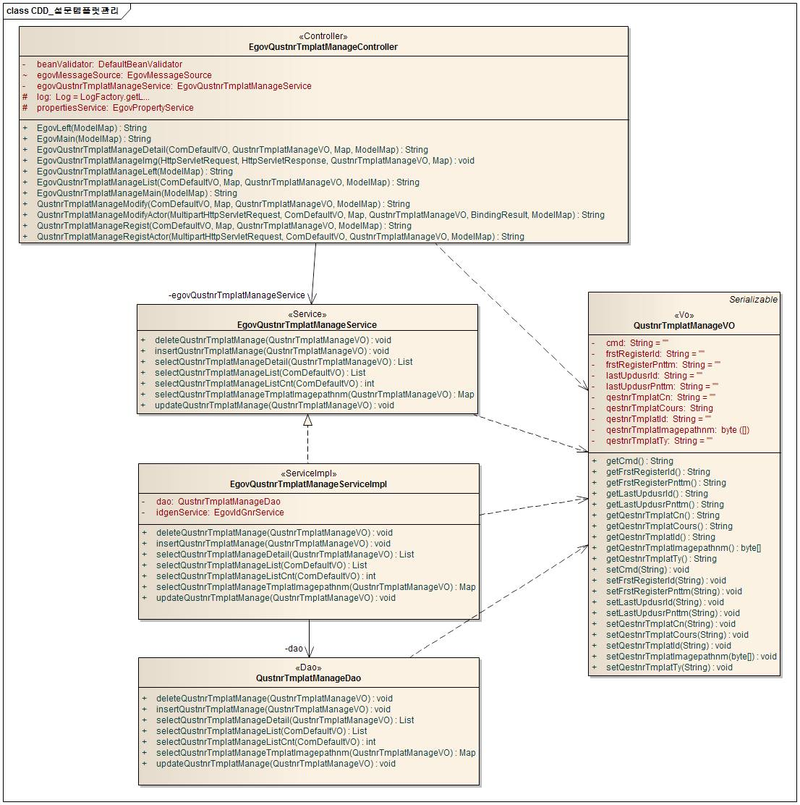
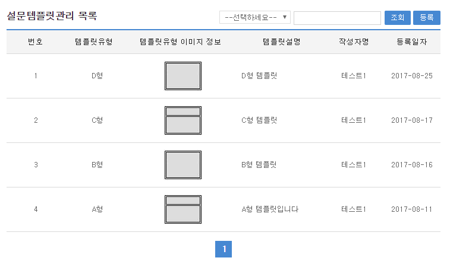
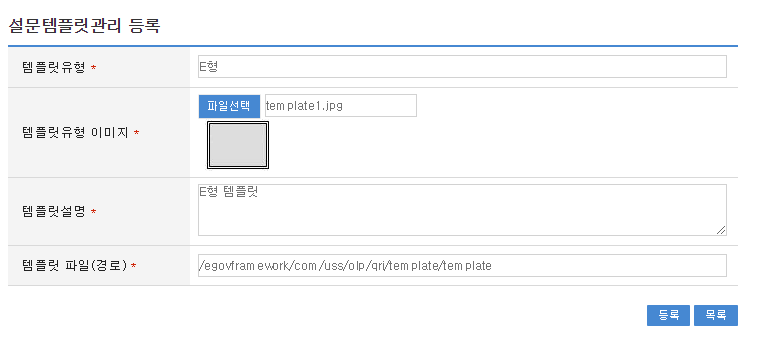
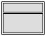
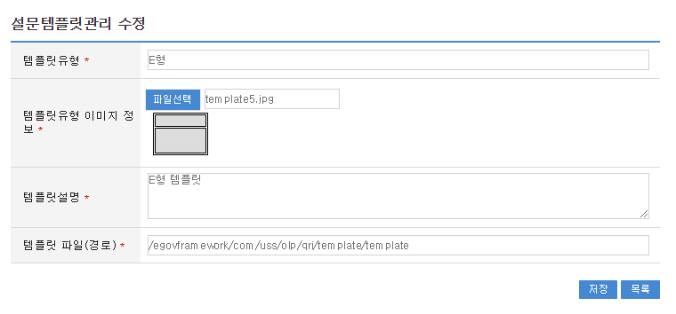
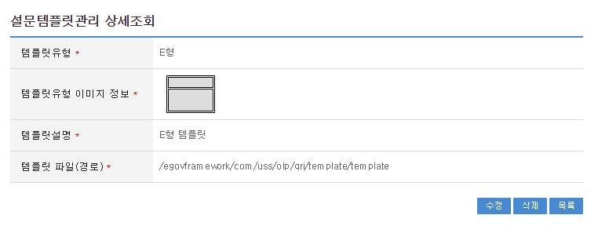

# 설문템플릿관리

## 개요

 설문관리 시스템 구축시 사용되는 설문템플릿관리 기능을 제공하며 설문템플릿관리기능은 설문참여에서 사용되는 디자인 템플릿을 관리를 담당한다.

## 설명

 설문템플릿관리는 설문 템플릿을 관리하기 위한 목적으로 등록, 수정, 삭제, 조회, 목록조회의 기능을 수반한다.

 ① 설문템플릿관리 목록 : 기(記) 등록된 설문템플릿관리 정보를 리스트 형태로 조회한다..
 ② 설문템플릿관리 등록 : 설문템플릿관리 등록 화면에서 입력하여 입력항목의 정합성을 체크하고 데이터베이스에 기(記) 등록한다.
 ③ 설문템플릿관리 수정 : 화면에 조회된 사용자 설문템플릿관리를 수정하여 항목의 정당(正當)한지 체크하고 수정된 데이터를 데이터베이스에 반영한다.
 ④ 설문템플릿관리 상세조회 : 기(記) 등록된 설문템플릿관리 정보를 조회한다.
 ⑤ 설문템플릿관리 삭제: 기(記) 등록된 설문템플릿관리 정보를 화면에 조회하여 데이터베이스에서 삭제한다.

### 패키지 참조 관계

 설문템플릿관리 패키지는 요소기술의 공통 패키지(cmm)에 대해서만 직접적인 함수적 참조 관계를 가진다. 하지만, 컴포넌트 배포 시 오류 없이 실행되기 위하여 패키지 간의 참조관계에 따라 설문관리, 설문조사, 설문응답자관리, 설문질문관리, 설문항목관리, 달력 패키지와 함께 배포 파일을 구성한다.
 패키지 간 참조 관계 : [사용자지원 Package Dependency](../intro/package-reference.md/#사용자지원)

### 관련소스

| 유형 | 대상소스명 | 비고 |
| --- | --- | --- |
| Controller | egovframework.com.uss.olp.qtm.web.EgovQustnrTmplatManageController.java | 설문템플릿 Controller Class |
| Service | egovframework.com.uss.olp.qtm.service.EgovQustnrTmplatManageService.java | 설문템플릿 Service Class |
| ServiceImpl | egovframework.com.uss.olp.qtm.service.impl.EgovQustnrTmplatManageServiceImpl.java | 설문템플릿 ServiceImpl Class |
| VO | egovframework.com.uss.olp.qtm.service.QustnrTmplatManageVO.java | 설문템플릿  VO Class |
| VO | egovframework.com.cmm.ComDefaultVO.java | 검색 VO Class |
| DAO | egovframework.com.uss.olp.qtm.service.impl.QustnrTmplatManageDao.java | 설문템플릿 Dao Class |
| JSP | /WEB-INF/jsp/egovframework/com/uss/olp/qtm/EgovQustnrTmplatManageList.jsp | 설문템플릿 목록조회 페이지 |
| JSP | /WEB-INF/jsp/egovframework/com/uss/olp/qtm/EgovQustnrTmplatManageRegist.jsp | 설문템플릿 등록 페이지 |
| JSP | /WEB-INF/jsp/egovframework/com/uss/olp/qtm/EgovQustnrTmplatManageModify.jsp | 설문템플릿 수정 페이지 |
| JSP | /WEB-INF/jsp/egovframework/com/uss/olp/qtm/EgovQustnrTmplatManageDetail.jsp | 설문템플릿 상세조회 페이지 |
| QUERY XML | resources/egovframework/mapper/com/uss/olp/qtm/EgovQustnrTmplatManage\_SQL\_mysql.xml | 설문템플릿 MySQL용 QUERY XML |
| QUERY XML | resources/egovframework/mapper/com/uss/olp/qtm/EgovQustnrTmplatManage\_SQL\_oracle.xml | 설문템플릿 Oracle용 QUERY XML |
| QUERY XML | resources/egovframework/mapper/com/uss/olp/qtm/EgovQustnrTmplatManage\_SQL\_tibero.xml | 설문템플릿 Tibero용 QUERY XML |
| QUERY XML | resources/egovframework/mapper/com/uss/olp/qtm/EgovQustnrTmplatManage\_SQL\_altibase.xml | 설문템플릿 Altibase용 QUERY XML |
| QUERY XML | resources/egovframework/mapper/com/uss/olp/qtm/EgovQustnrTmplatManage\_SQL\_cubrid.xml | 설문템플릿 Cubrid용 QUERY XML |
| QUERY XML | resources/egovframework/mapper/com/uss/olp/qtm/EgovQustnrTmplatManage\_SQL\_maria.xml | 설문템플릿 MariaDB용 QUERY XML |
| QUERY XML | resources/egovframework/mapper/com/uss/olp/qtm/EgovQustnrTmplatManage\_SQL\_postgres.xml | 설문템플릿 PostgreSQL용 QUERY XML |
| QUERY XML | resources/egovframework/mapper/com/uss/olp/qtm/EgovQustnrTmplatManage\_SQL\_goldilocks.xml | 설문템플릿 Goldilocks용 QUERY XML |
| Message properties | resources/egovframework/message/com/uss/olp/qtm/message\_ko.properties | 설문템플릿관리를 위한 Message properties(한글) |
| Message properties | resources/egovframework/message/com/uss/olp/qtm/message\_en.properties | 설문템플릿관리를 위한 Message properties(영문) |
| Idgen XML | resources/egovframework/spring/com/idgn/context-idgn-QustnrTmplatManage.xml | 설문템플릿 Id생성 Idgen XML |

### 클래스 다이어그램

 

### ID Generation

#### ID Generation 관련 DDL 및 DML

 ID Generation Service를 활용하기 위해서 Sequence 저장 테이블인 COMTECOPSEQ에  QUSTNRTMPLA_ID  항목을 추가해야 한다.

```sql
CREATE TABLE COMTECOPSEQ ( 
  		   table_name varchar(20) NOT NULL, 
  		   NEXT_ID NUMERIC(30) NULL,
  		   PRIMARY KEY (TABLE_NAME));
 
  INSERT INTO COMTECOPSEQ VALUES('QUSTNRTMPLA_ID', 1);
```

#### ID Generation 환경설정(context-idgn-QustnrTmplatManage.xml)

```xml
<bean name="egovQustnrTmplatManageIdGnrService"
		class="egovframework.rte.fdl.idgnr.impl.EgovTableIdGnrService"
		destroy-method="destroy">
		<property name="dataSource" ref="egov.dataSource" />
		<property name="strategy" ref="QustnrTmplatManageInfotrategy" />
		<property name="blockSize" 	value="10"/>
		<property name="table"	   	value="COMTECOPSEQ"/>
		<property name="tableName"	value="QUSTNRTMPLA_ID"/>
	</bean>
	<bean name="QustnrTmplatManageInfotrategy"
		class="egovframework.rte.fdl.idgnr.impl.strategy.EgovIdGnrStrategyImpl">
		<property name="prefix" value="QTMPLA_" />
		<property name="cipers" value="13" />
		<property name="fillChar" value="0" />
	</bean>
```

### 관련테이블

| 테이블명 | 테이블명(영문) | 비고 |
| --- | --- | --- |
| 설문템플릿 | COMTNQUSTNRTMPLAT | 설문 템플릿을 관리한다. |

## 관련기능

 설문템플릿관리는 설문템플릿관리 목록조회, 설문템플릿 등록, 설문템플릿 수정, 설문템플릿 상세조회 기능으로 구성되어 있다.

### 설문템플릿관리 목록조회

#### 비즈니스 규칙

 관리자가 기(記) 등록된 설문템플릿관리 정보를 리스트 형태로 조회 할 수 있고, 등록버튼을 클릭하여 등록화면으로 이동할 수 있다.

#### 관련코드

 N/A

#### 관련화면 및 수행매뉴얼

| Action | URL | Controller method | QueryID |
| --- | --- | --- | --- |
| 조회 | /uss/olp/qtm/EgovQustnrTmplatManageList.do | egovQustnrTmplatManageList | "QustnrTmplatManage.selectQustnrTmplatManage", |
|  |  |  | "QustnrTmplatManage.selectQustnrTmplatManageCnt" |

 설문템플릿관리 목록은 페이지 당 10건씩 조회되며 페이징은 10페이지씩 이루어진다.
 검색조건은 템플릿설명, 템플릿유형에 대해서 수행된다.
 페이지 당 검색 범위를 변경하고자 하는 경우
 context-properties.xml 파일의 pageUnit, pageSize를 변경한다.(단 해당 설정은 전체 공통서비스 기능에 영향을 미친다.)

 

 조회: 조회하기 위해서는 상단의 검색조건을 선택 후 해당하는 검색문자를 입력 후 조회 버튼을 클릭한다.
 등록: 등록하기 위해서는 상단의 등록 버튼을 통해서 설문템플릿등록 화면으로 이동한다.
 목록클릭: 설문템플릿상세조회 화면으로 이동한다.

### 설문템플릿관리 등록

#### 비즈니스 규칙

 설문템플릿에 관한 기본정보를 입력 저장처리한다. 입력명 우측의 빨간* 표시는 반드시 입력해야할 항목을 표시한다.

#### 관련코드

 N/A

#### 관련화면 및 수행매뉴얼

| Action | URL | Controller method | QueryID |
| --- | --- | --- | --- |
| 등록화면 | /uss/olp/qtm/EgovQustnrTmplatManageRegist.do | qustnrTmplatManageRegist |  |
| 등록 | /uss/olp/qtm/EgovQustnrTmplatManageRegistActor.do | qustnrTmplatManageRegistActor | "QustnrTmplatManage.insertQustnrTmplatManage" |

 

##### 제공 템플릿(egovframework 에서 제공하는 기본 템플릿은 배포 파일에 포함 되 있고 템플릿파일(경로)를 아래와 같이 입력해주세요.)

 템플릿파일(경로) : /egovframework/com/uss/olp/qri/template/template

##### 제공 템플릿 이미지

 

 

 등록: 입력한 설문템플릿 정보들이 등록 처리된다.
 목록: 설문템플릿 화면으로 이동한다.

### 설문템플릿관리 수정

#### 비즈니스 규칙

 설문문항 목록에서 목록 클릭 시 이동되는 화면으로 설문문항에 대한 상세정보를 보여준다.

#### 관련코드

 N/A

#### 관련화면 및 수행매뉴얼

| Action | URL | Controller method | QueryID |
| --- | --- | --- | --- |
| 수정화면 | /uss/olp/qtm/EgovQustnrTmplatManageModify.do | qustnrTmplatManageModify | "QustnrTmplatManage.selectQustnrTmplatManageDetail" |
| 수정 | /uss/olp/qtm/EgovQustnrTmplatManageModifyActor.do | qustnrTmplatManageModifyActor | "QustnrTmplatManage.updateQustnrTmplatManage" |

 

 저장: 저장버튼 클릭 시 설문문항 수정 화면이 저장처리된다.
 목록: 설문문항 목록 화면으로 이동한다.

### 설문템플릿관리 상세조회

#### 비즈니스 규칙

 설문템플릿 목록에서 목록 클릭 시 이동되는 화면으로 설문템플릿에 대한 상세정보를 보여준다.

#### 관련코드

 N/A

#### 관련화면 및 수행매뉴얼

| Action | URL | Controller method | QueryID |
| --- | --- | --- | --- |
| 상세조회 | /uss/olp/qtm/EgovQustnrTmplatManageDetail.do | egovQustnrTmplatManageDetail | "QustnrTmplatManage.selectQustnrTmplatManageDetail" |
| 설문응답자 삭제 | /uss/olp/qtm/EgovQustnrTmplatManageDetail.do | egovQustnrTmplatManageDetail | "QustnrTmplatManage.deleteQustnrRespondManage" |
| 설문조사 삭제 | /uss/olp/qtm/EgovQustnrTmplatManageDetail.do | egovQustnrTmplatManageDetail | "QustnrTmplatManage.deleteQustnrRespondInfo" |
| 설문항목 삭제 | /uss/olp/qtm/EgovQustnrTmplatManageDetail.do | egovQustnrTmplatManageDetail | "QustnrTmplatManage.deleteQustnrItemManage" |
| 설문질문 삭제 | /uss/olp/qtm/EgovQustnrTmplatManageDetail.do | egovQustnrTmplatManageDetail | "QustnrTmplatManage.deleteQustnrQestnManage" |
| 설문관리 삭제 | /uss/olp/qtm/EgovQustnrTmplatManageDetail.do | egovQustnrTmplatManageDetail | "QustnrTmplatManage.deleteQustnrManage" |
| 설문템플릿 삭제 | /uss/olp/qtm/EgovQustnrTmplatManageDetail.do | egovQustnrTmplatManageDetail | "QustnrTmplatManage.deleteQustnrTmplatManage" |

 

 수정: 수정버튼 클릭 시 설문템플릿 수정 화면으로 이동한다.
 삭제: 삭제버튼 클릭 시 삭제여부를 확인하는 메시지를 보여주고 삭제처리를 할 수 있다.
 목록: 설문템플릿목록 화면으로 이동한다.
