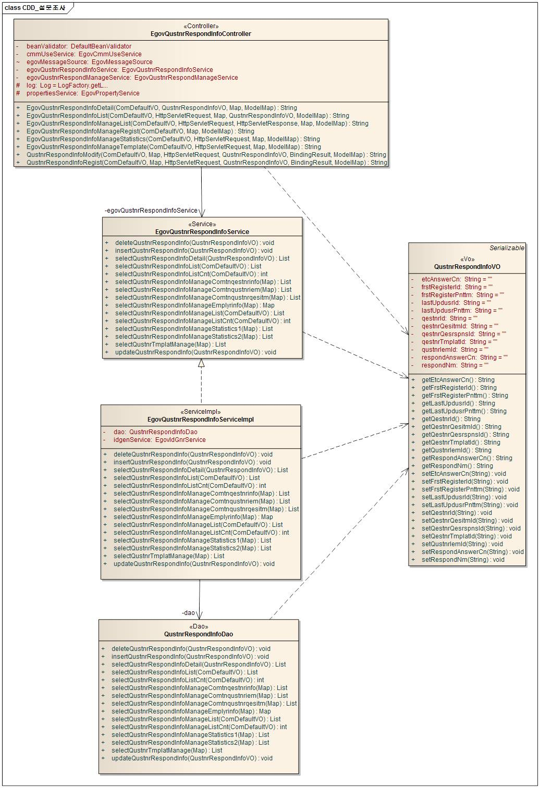
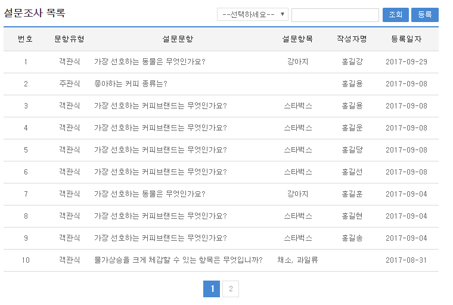
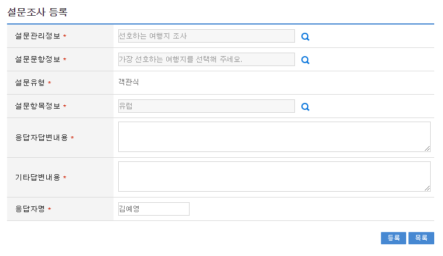
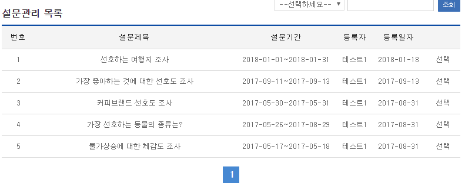
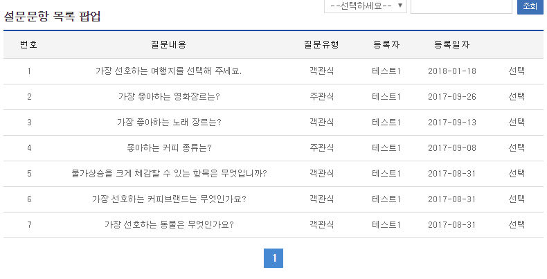
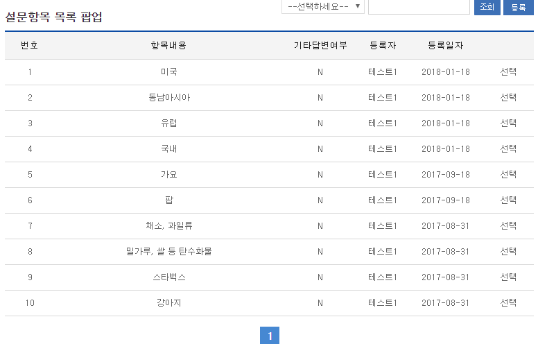
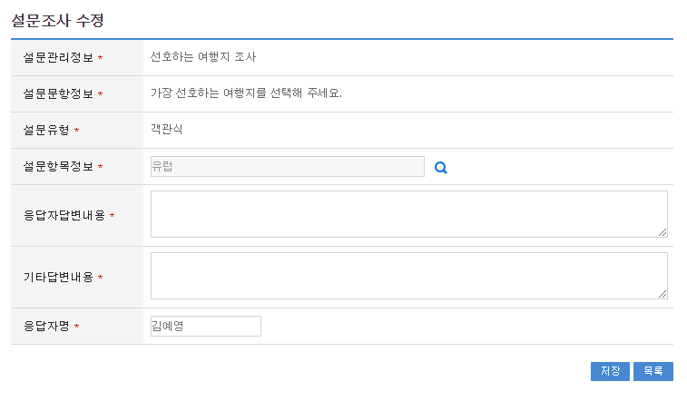
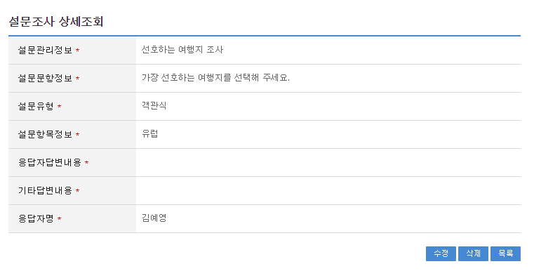
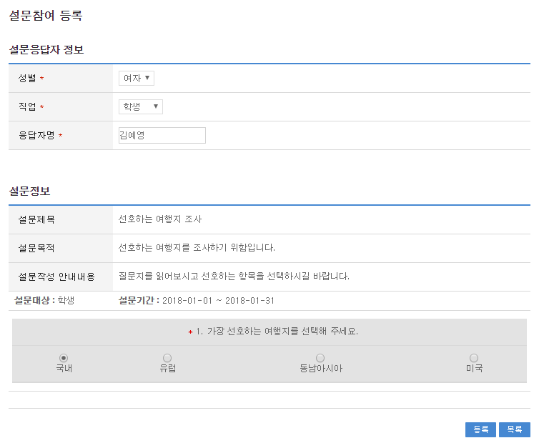
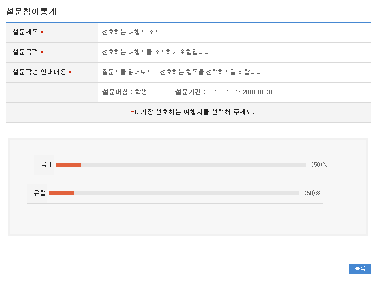

# 설문조사

## 개요

 설문관리 시스템 구축시 사용되는 설문조사 기능을 제공하며, 기본으로 관리자가 설문조사를 관리 할수 있으며, 설문참여자가 설문참여 시 설문조사(설문응답결과)를 자동으로 등록 되로록 설계 되어 있다.

## 설명

### 패키지 참조 관계

 설문조사 패키지는 요소기술의 공통 패키지(cmm)와 설문응답자관리 패키지에 대해서 직접적인 함수적 참조 관계를 가진다. 하지만, 컴포넌트 배포 시 오류 없이 실행되기 위하여 패키지 간의 참조관계에 따라 설문관리, 설문템플릿관리, 설문질문관리, 설문항목관리, 달력 패키지와 함께 배포 파일을 구성한다.
 패키지 간 참조 관계 : [사용자지원 Package Dependency](../intro/package-reference.md/#사용자지원)

### 관련소스

| 유형 | 대상소스명 | 비고 |
| --- | --- | --- |
| Controller | egovframework.com.uss.olp.qri.web.EgovQustnrRespondInfoController.java | 설문조사 Controller Class |
| Service | egovframework.com.uss.olp.qri.service.EgovQustnrRespondInfoService.java | 설문조사 Service Class |
| ServiceImpl | egovframework.com.uss.olp.qri.service.impl.EgovQustnrRespondInfoServiceImpl.java | 설문조사 ServiceImpl Class |
| VO | egovframework.com.uss.olp.qri.service.QustnrRespondInfoVO.java | 설문조사  VO Class |
| VO | egovframework.com.cmm.ComDefaultVO.java | 검색 VO Class |
| DAO | egovframework.com.uss.olp.qri.service.impl.QustnrRespondInfoDao.java | 설문조사 Dao Class |
| JSP | /WEB-INF/jsp/egovframework/com/uss/olp/qri/EgovQustnrRespondInfoList.jsp | 설문조사 목록조회 페이지 |
| JSP | /WEB-INF/jsp/egovframework/com/uss/olp/qri/EgovQustnrRespondInfoRegist.jsp | 설문조사 등록 페이지 |
| JSP | /WEB-INF/jsp/egovframework/com/uss/olp/qri/EgovQustnrRespondInfoModify.jsp | 설문조사 수정 페이지 |
| JSP | /WEB-INF/jsp/egovframework/com/uss/olp/qri/EgovQustnrRespondInfoDetail.jsp | 설문조사 상세조회 페이지 |
| QUERY XML | resources/egovframework/mapper/com/uss/olp/qri/EgovQustnrRespondInfo\_SQL\_mysql.xml | 설문조사 MySQL용 QUERY XML |
| QUERY XML | resources/egovframework/mapper/com/uss/olp/qri/EgovQustnrRespondInfo\_SQL\_oracle.xml | 설문조사 Oracle용 QUERY XML |
| QUERY XML | resources/egovframework/mapper/com/uss/olp/qri/EgovQustnrRespondInfo\_SQL\_tibero.xml | 설문조사 Tibero용 QUERY XML |
| QUERY XML | resources/egovframework/mapper/com/uss/olp/qri/EgovQustnrRespondInfo\_SQL\_altibase.xml | 설문조사 Altibase용 QUERY XML |
| QUERY XML | resources/egovframework/mapper/com/uss/olp/qri/EgovQustnrRespondInfo\_SQL\_cubrid.xml | 설문조사 Cubrid용 QUERY XML |
| QUERY XML | resources/egovframework/mapper/com/uss/olp/qri/EgovQustnrRespondInfo\_SQL\_maria.xml | 설문조사 MariaDB용 QUERY XML |
| QUERY XML | resources/egovframework/mapper/com/uss/olp/qri/EgovQustnrRespondInfo\_SQL\_postgres.xml | 설문조사 PostgreSQL용 QUERY XML |
| QUERY XML | resources/egovframework/mapper/com/uss/olp/qri/EgovQustnrRespondInfo\_SQL\_goldilocks.xml | 설문조사 Goldilocks용 QUERY XML |
| Message properties | resources/egovframework/message/com/uss/olp/qri/message\_ko.properties | 설문조사를 위한 Message properties(한글) |
| Message properties | resources/egovframework/message/com/uss/olp/qri/message\_en.properties | 설문조사를 위한 Message properties(영문) |
| Idgen XML | resources/egovframework/spring/com/idgn/context-idgn-qustnrRespondInfo.xml | 설문조사 Id생성 Idgen XML |

### 클래스 다이어그램

 

### ID Generation

#### ID Generation 관련 DDL 및 DML

 ID Generation Service를 활용하기 위해서 Sequence 저장 테이블인 COMTECOPSEQ에 QESRSPNS_ID 항목을 추가해야 한다.

```sql
CREATE TABLE COMTECOPSEQ ( 
  		   TABLE_NAME VARCHAR(20) NOT NULL, 
  		   NEXT_ID NUMERIC(30) NULL,
  		   PRIMARY KEY (TABLE_NAME));
 
  INSERT INTO COMTECOPSEQ VALUES('QESRSPNS_ID', 1);
```

#### ID Generation 환경설정(context-idgn-qustnrRespondInfo.xml)

```xml
<bean name="qustnrRespondInfoIdGnrService"
		class="egovframework.rte.fdl.idgnr.impl.EgovTableIdGnrService"
		destroy-method="destroy">
		<property name="dataSource" ref="egov.dataSource" />
		<property name="strategy" ref="QustnrRespondInfotrategy" />
		<property name="blockSize" 	value="10"/>
		<property name="table"	   	value="COMTECOPSEQ"/>
		<property name="tableName"	value="QESRSPNS_ID"/>
	</bean>
	<bean name="QustnrRespondInfotrategy"
		class="egovframework.rte.fdl.idgnr.impl.strategy.EgovIdGnrStrategyImpl">
		<property name="prefix" value="QRSPNS_" />
		<property name="cipers" value="13" />
		<property name="fillChar" value="0" />
	</bean>
```

### 관련테이블

| 테이블명 | 테이블명(영문) | 비고 |
| --- | --- | --- |
| 설문관리 | COMTNQESTNRINFO | 설문관리를(을) 조회 한다. |
| 설문문항 | COMTNQUSTNRQESITM | 설문문항를(을) 조회 한다. |
| 설문항목 | COMTNQUSTNRIEM | 설문항목를(을) 조회 한다. |
| 설문응답결과 | COMTNQUSTNRRSPNSRESULT | 설문응답결과를 관리한다. |

## 관련기능

 설문조사는 설문조사 목록조회, 설문조사 등록, 설문조사 수정, 설문조사 상세조회, 설문참여 등록, 설문통계 기능으로 구성되어 있다.

### 설문조사 목록조회

#### 비즈니스 규칙

 관리자가 기(記) 등록된 설문조사 정보를 리스트 형태로 조회 할 수 있고, 등록버튼을 클릭하여 등록화면으로 이동할수있다.

#### 관련코드

 N/A

#### 관련화면 및 수행매뉴얼

| Action | URL | Controller method | QueryID |
| --- | --- | --- | --- |
| 목록조회 | /uss/olp/qri/EgovQustnrRespondInfoList.do | egovQustnrRespondInfoList | "QustnrRespondInfo.selectQustnrRespondInfo", |
|  |  |  | "QustnrRespondInfo.selectQustnrRespondInfoCnt" |

 설문조사 목록은 페이지 당 10건씩 조회되며 페이징은 10페이지씩 이루어진다.
 검색조건은 등록자, 설문항목에 대해서 수행된다.
 페이지 당 검색 범위를 변경하고자 하는 경우 context-properties.xml 파일의 pageUnit, pageSize를 변경한다.(단 해당 설정은 전체 공통서비스 기능에 영향을 미친다.)

 

 조회: 조회하기 위해서는 상단의 검색조건을 선택 후 해당하는 검색문자를 입력 후 조회 버튼을 클릭한다.
 등록: 등록하기 위해서는 상단의 등록 버튼을 통해서 설문조사 등록 화면으로 이동한다.
 목록클릭: 설문조사 상세조회 화면으로 이동한다.

### 설문조사 등록

#### 비즈니스 규칙

 설문조사에 관한 기본정보를 입력 저장처리한다. 입력명 우측의 빨간* 표시는 반드시 입력해야할 항목을 표시한다.

#### 관련코드

 N/A

#### 관련화면 및 수행매뉴얼

| Action | URL | Controller method | QueryID |
| --- | --- | --- | --- |
| 등록 | /uss/olp/qri/EgovQustnrRespondInfoRegist.do | qustnrRespondInfoRegist | "QustnrRespondInfo.insertQustnrRespondInfo" |

 

 목록: 설문조사 목록 화면으로 이동한다.
 등록: 입력한 설문조사 정보들이 등록 처리된다.
 설문지정보: 설문지정보 팝업창 열린다.
 설문문항정보: 설문문항정보 팝업창 열린다.
 설문항목정보: 설문항목정보 팝업창 열린다.

##### 2. 설문정보 등록 팝업

 

 선택: 선택한 설문지 정보 가 자동입력된다.

##### 3. 설문문항정보 등록 팝업

 

 선택: 선택한 설문문항정보 정보 가 자동입력된다.

##### 4. 설문항목정보 등록 팝업

 

 선택: 선택한 설문항목정보 정보 가 자동입력된다.

### 설문조사 수정

#### 비즈니스 규칙

 입력한 설문조사 정보를(을) 저장 처리한다. 입력명 우측의 빨간* 표시는 수정 시 반드시 입력해야 할 항목을 표시한다.

#### 관련코드

 N/A

#### 관련화면 및 수행매뉴얼

| Action | URL | Controller method | QueryID |
| --- | --- | --- | --- |
| 수정 | /uss/olp/qri/EgovQustnrRespondInfoModify.do | qustnrRespondInfoModify | "QustnrRespondInfo.updateQustnrRespondInfo" |

 

 저장: 수정된 정보들이 저장 처리된다.
 목록: 설문조사 목록 화면으로 이동한다.

### 설문조사 상세조회

#### 비즈니스 규칙

 설문조사 목록에서 목록 클릭 시 이동되는 화면으로 설문조사에 대한 상세정보를 보여준다.

#### 관련코드

 N/A

#### 관련화면 및 수행매뉴얼

| Action | URL | Controller method | QueryID |
| --- | --- | --- | --- |
| 상세조회 | /uss/olp/qri/EgovQustnrRespondInfoDetail.do | egovQustnrRespondInfoDetail | "QustnrRespondInfo.selectQustnrRespondInfoDetail" |
| 삭제 | /uss/olp/qri/EgovQustnrRespondInfoDetail.do | egovQustnrRespondInfoDetail | "QustnrRespondInfo.deleteQustnrRespondInfo" |

 

 수정: 수정버튼 클릭 시 설문조사 수정 화면으로 이동한다.
 삭제: 삭제버튼 클릭 시 삭제여부를 확인하는 메시지를 보여주고 삭제처리를 할 수 있다.
 목록: 설문조사 목록 화면으로 이동한다.

### 설문참여 등록

#### 비즈니스 규칙

 설문참여에 관한 기본정보를 입력 저장처리한다. 입력명 우측의 빨간* 표시는 반드시 입력해야할 항목을 표시한다.

#### 관련코드

 N/A

#### 관련화면 및 수행매뉴얼

| Action | URL | Controller method | QueryID |
| --- | --- | --- | --- |
| 등록 | /uss/olp/qnn/EgovQustnrRespondInfoManageRegist.do | egovQustnrRespondInfoManageRegist | "QustnrRespondInfo.insertQustnrRespondInfo" |

 

 목록: 설문참여 목록 화면으로 이동한다.
 등록: 입력한 설문참여 정보들이 등록 처리된다.

### 설문통계

#### 비즈니스 규칙

 설문참여에서 선택한 설문지별 통계를 보여준다.

#### 관련코드

 N/A

#### 관련화면 및 수행매뉴얼

| Action | URL | Controller method | QueryID |
| --- | --- | --- | --- |
| 통계조회 | /uss/olp/qnn/EgovQustnrRespondInfoManageStatistics.do | egovQustnrRespondInfoManageStatistics |  |
| 설문정보 | /uss/olp/qnn/EgovQustnrRespondInfoManageStatistics.do | egovQustnrRespondInfoManageStatistics | "QustnrRespondInfo.selectQustnrRespondInfoManageComtnqestnrinfo" |
| 질문정보 | /uss/olp/qnn/EgovQustnrRespondInfoManageStatistics.do | egovQustnrRespondInfoManageStatistics | "QustnrRespondInfo.selectQustnrRespondInfoManageComtnqustnrqesitm" |
| 항목정보 | /uss/olp/qnn/EgovQustnrRespondInfoManageStatistics.do | egovQustnrRespondInfoManageStatistics | "QustnrRespondInfo.selectQustnrRespondInfoManageComtnqustnriem" |
| 객관식통계답안 | /uss/olp/qnn/EgovQustnrRespondInfoManageStatistics.do | egovQustnrRespondInfoManageStatistics | "QustnrRespondInfo.selectQustnrRespondInfoManageStatistics1" |
| 주관식통계답안 | /uss/olp/qnn/EgovQustnrRespondInfoManageStatistics.do | egovQustnrRespondInfoManageStatistics | "QustnrRespondInfo.selectQustnrRespondInfoManageStatistics2" |

 

 목록: 설문참여 목록 화면으로 이동한다.
