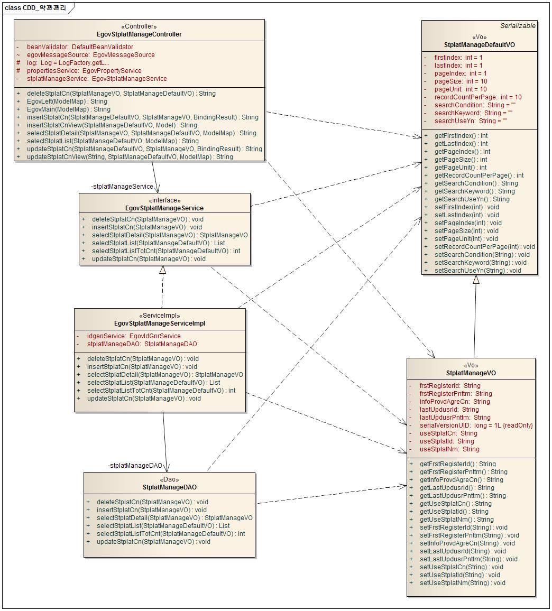
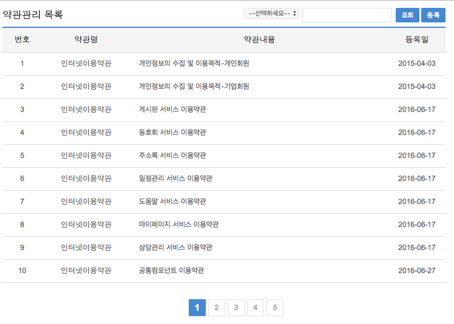
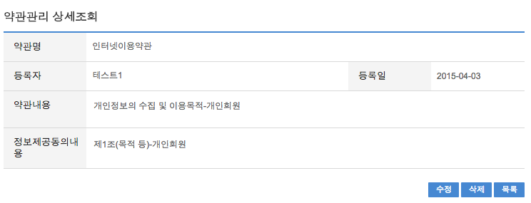
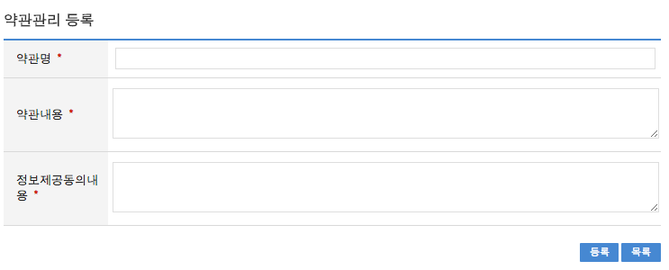
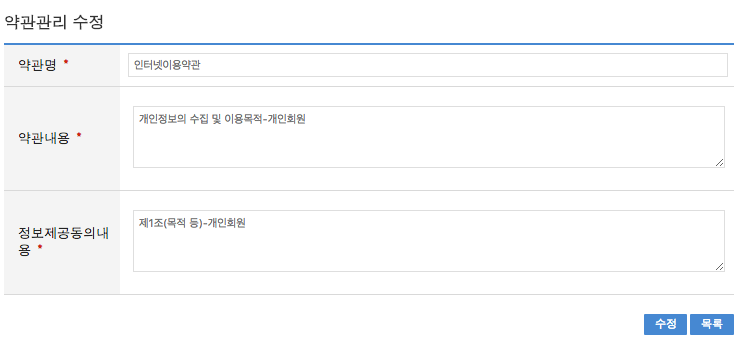

# 약관관리

## 개요

 회원가입 시 회원약관 및 정보공유 동의여부를 확인할때 제공되는 약관정보 및 정보공유내용을 관리 할 수 있다.

## 설명

### 패키지 참조 관계

 약관관리 패키지는 요소기술의 공통 패키지(cmm)에 대해서만 직접적인 함수적 참조 관계를 가진다.
- 패키지 간 참조 관계 : [사용자지원 Package Dependency](../intro/package-reference.md/#사용자지원)

### 관련소스

| 유형 | 대상소스명 | 비고 |
| --- | --- | --- |
| Controller | egovframework.com.uss.sam.stp.web.EgovStplatManageController.java | 약관관리를 위한 컨트롤러 클래스 |
| Service | egovframework.com.uss.sam.stp.service.EgovStplatManageService.java | 약관관리를 위한 서비스 인터페이스 |
| ServiceImpl | egovframework.com.uss.sam.stp.service.impl.EgovStplatManageServiceImpl.java | 약관관리를 위한 서비스 구현 클래스 |
| VO | egovframework.com.uss.sam.stp.service.StplatManageVO.java | 약관관리를 위한 VO 클래스 |
| VO | egovframework.com.uss.sam.stp.service.StplatManageDefaultVO.java | 약관관리를 위한 SearchVO 클래스 |
| DAO | egovframework.com.uss.sam.stp.service.impl.StplatManageDAO.java | 약관 관리를 위한 데이터처리 클래스 |
| JSP | /WEB-INF/jsp/egovframework/com/uss/sam/stp/EgovStplatListInqire.jsp | 약관관리를 위한 목록조회 페이지 |
| JSP | /WEB-INF/jsp/egovframework/com/uss/sam/stp/EgovStplatDetailInqire.jsp | 약관관리를 위한 상세조회 페이지 |
| JSP | /WEB-INF/jsp/egovframework/com/uss/sam/stp/EgovStplatCnRegist.jsp | 약관관리를 위한 등록 페이지 |
| JSP | /WEB-INF/jsp/egovframework/com/uss/sam/stp/EgovStplatCnUpdt.jsp | 약관관리를 위한 수정 페이지 |
| Query XML | resources/egovframework/mapper/com/uss/sam/stp/EgovStplatManage\_SQL\_altibase.xml | 약관관리를 위한 Altibase용 Query XML |
| Query XML | resources/egovframework/mapper/com/uss/sam/stp/EgovStplatManage\_SQL\_cubrid.xml | 약관관리를 위한 Cubrid용 Query XML |
| Query XML | resources/egovframework/mapper/com/uss/sam/stp/EgovStplatManage\_SQL\_maria.xml | 약관관리를 위한 MariaDB용 Query XML |
| Query XML | resources/egovframework/mapper/com/uss/sam/stp/EgovStplatManage\_SQL\_mysql.xml | 약관관리를 위한 MySQL용 Query XML |
| Query XML | resources/egovframework/mapper/com/uss/sam/stp/EgovStplatManage\_SQL\_oracle.xml | 약관관리를 위한 Oracle용 Query XML |
| Query XML | resources/egovframework/mapper/com/uss/sam/stp/EgovStplatManage\_SQL\_postgres.xml | 약관관리를 위한 PostgreSQL용 Query XML |
| Query XML | resources/egovframework/mapper/com/uss/sam/stp/EgovStplatManage\_SQL\_tibero.xml | 약관관리를 위한 Tibero용 Query XML |
| Query XML | resources/egovframework/mapper/com/uss/sam/stp/EgovStplatManage\_SQL\_goldilocks.xml | 약관관리를 위한 Goldilocks용 Query XML |
| Message properties | resources/egovframework/message/com/uss/sam/stp/message\_ko.properties | 약관관리를 위한 Message properties(한글) |
| Message properties | resources/egovframework/message/com/uss/sam/stp/message\_en.properties | 약관관리를 위한 Message properties(영문) |
| Idgen XML | resources/egovframework/spring/com/idgn/context-idgn-StplatManage.xml | 약관등록을 위한 Id생성 Idgen XML |

### 클래스 다이어그램

 

### ID Generation

#### ID Generation 관련 DDL 및 DML

 ID Generation Service를 활용하기 위해서 Sequence 저장테이블인  COMTECOPSEQ에 USE_STPLAT_ID 항목을 추가해야 한다.

```sql
  CREATE TABLE COMTECOPSEQ ( table_name varchar(16) NOT NULL, 
  		   next_id DECIMAL(30) NOT NULL,
  		   PRIMARY KEY (table_name));
 
  INSERT INTO COMTECOPSEQ VALUES('USE_STPLAT_ID','0');
```

#### ID Generation 환경설정(context-idgn-StplatManage.xml)

```xml
	<bean name="egovStplatManageIdGnrService"
		class="egovframework.rte.fdl.idgnr.impl.EgovTableIdGnrService"
		destroy-method="destroy">
		<property name="dataSource" ref="egov.dataSource" />
		<property name="strategy"   ref="stplatManageStrategy" />
		<property name="blockSize" 	value="10"/>
		<property name="table"	   	value="COMTECOPSEQ"/>
		<property name="tableName"	value="USE_STPLAT_ID"/>
	</bean>
 
	<bean name="stplatManageStrategy"
		class="egovframework.rte.fdl.idgnr.impl.strategy.EgovIdGnrStrategyImpl">
		<property name="prefix" value="STPLAT_" />
		<property name="cipers" value="13" />
		<property name="fillChar" value="0" />
	</bean>
```

### 관련테이블

| 테이블명 | 테이블명(영문) | 비고 |
| --- | --- | --- |
| 약관정보 | COMTNSTPLATINFO | 회원가입에 따른 이용약관 및 개인정보제공동의내용을 관리한다. |

## 관련기능

 약관관리기능은 크게 약관관리목록, 약관관리조회, 약관관리등록, 약관관리수정 기능으로 구성되어 있다.

### 약관관리 목록

#### 비즈니스 규칙

 조회조건으로 목록조회를 할 수 있고, 등록버튼을 클릭하여 약관등록 화면으로 이동하여 약관를 등록 처리 할 수 있다.

#### 관련코드

 N/A

#### 관련화면 및 수행매뉴얼

| Action | URL | Controller method | SQL Namespace | SQL QueryID |
| --- | --- | --- | --- | --- |
| 목록조회 | /uss/sam/stp/StplatListInqire.do | selectStplatList | "StplatManage" | "selectStplatList" |
|  |  | selectStplatListTotCnt | "StplatManage" | "selectStplatListTotCnt" |

 약관 목록은 페이지 당 10건씩 조회되며 페이징은 10페이지씩 이루어진다.
 검색조건은 이용약관명, 이용약관내용에 대해서 수행된다.
 페이지 당 검색 범위를 변경하고자 하는 경우
 context-properties.xml 파일의 pageUnit, pageSize를 변경한다.(단 해당 설정은 전체 공통서비스 기능에 영향을 미친다.)

 

 조회: 약관를 조회하기 위해서는 상단의 검색조건을 선택 후 해당하는 검색문자를 입력 후 조회 버튼을 클릭한다.
 등록: 약관를 등록하기 위해서는 상단의 등록 버튼을 통해서 약관등록 화면으로 이동한다.
 목록클릭: 약관관리조회 화면으로 이동한다.

### 약관관리 상세조회

#### 비즈니스 규칙

 약관관리목록에서 목록 클릭 시 이동되는 화면으로 약관에 대한 상세정보를 보여준다.

#### 관련코드

 N/A

#### 관련화면 및 수행매뉴얼

| Action | URL | Controller method | SQL Namespace | SQL QueryID |
| --- | --- | --- | --- | --- |
| 상세조회 | /uss/sam/stp/StplatDetailInqire.do | selectStplatDetail | "StplatManage" | "selectStplatDetail" |

 약관 상세조회화면은 약관관리수정, 약관내용삭제, 약관관리조회를 할 수 있다.

 

 수정: 수정버튼 클릭 시 약관를 수정할 수 있는 화면으로 이동한다.
 삭제: 삭제버튼 클릭 시 삭제여부를 확인하는 메시지를 보여주고 삭제처리를 할 수 있다.
 목록: 약관관리조회 화면으로 이동한다.

### 약관관리 등록

#### 비즈니스 규칙

 약관에 관한 기본정보를 입력 저장처리한다.
 입력명 우측의 빨간* 표시는 반드시 입력해야할 항목을 표시한다.

#### 관련코드

 N/A

#### 관련화면 및 수행매뉴얼

| Action | URL | Controller method | SQL Namespace | SQL QueryID |
| --- | --- | --- | --- | --- |
| 등록화면 | /uss/sam/stp/StplatCnRegistView.do | insertStplatCnView |  |  |
| 등록 | /uss/sam/stp/StplatCnRegist.do | insertStplatCn | "StplatManage" | "insertStplatCn" |

 

 목록: 약관관리조회 화면으로 이동한다.
 등록: 입력한 약관정보들이 저장 처리된다.

### 약관관리 수정

#### 비즈니스 규칙

 입력한 약관정보들을 저장 처리한다.입력명 우측의 빨간* 표시는 수정 시 반드시 입력해야 할 항목을 표시한다.

#### 관련코드

 N/A

#### 관련화면 및 수행매뉴얼

| Action | URL | Controller method | SQL Namespace | SQL QueryID |
| --- | --- | --- | --- | --- |
| 수정 | /uss/sam/stp/StplatCnUpdt.do | updateStplatCn | "StplatManage" | "updateStplatCn" |

 

 수정: 수정 입력한 약관정보들이 저장 처리된다.
 목록: 약관관리조회 화면으로 이동한다.
