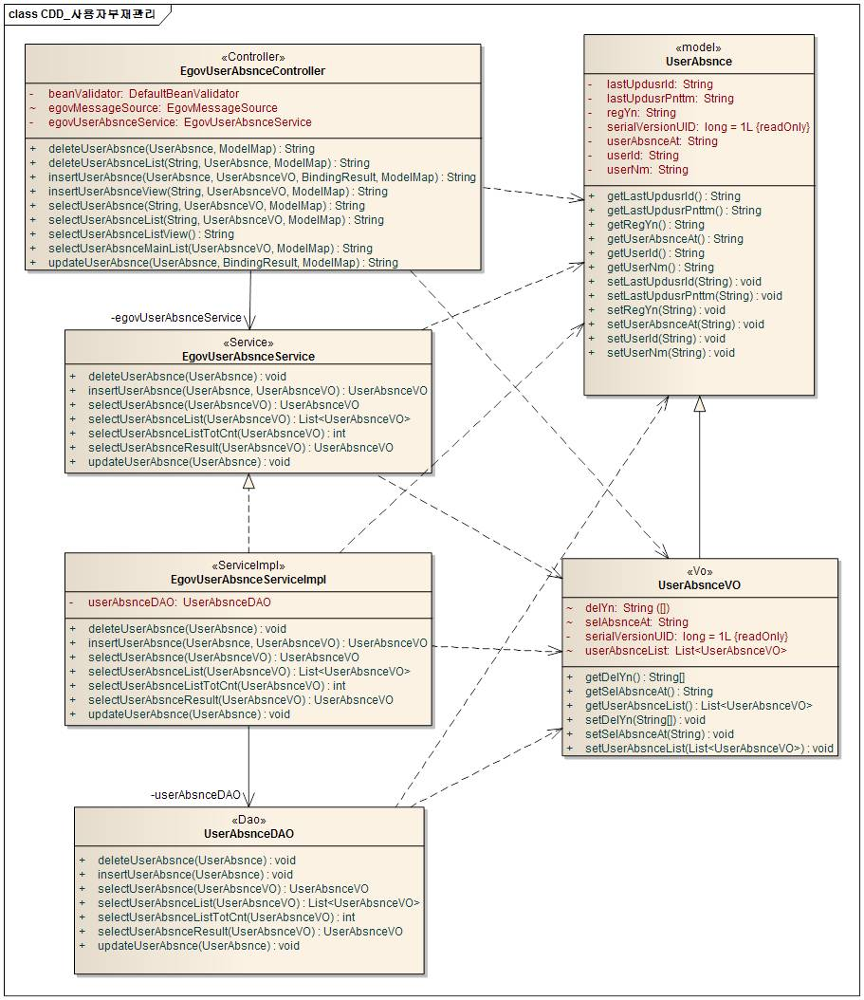
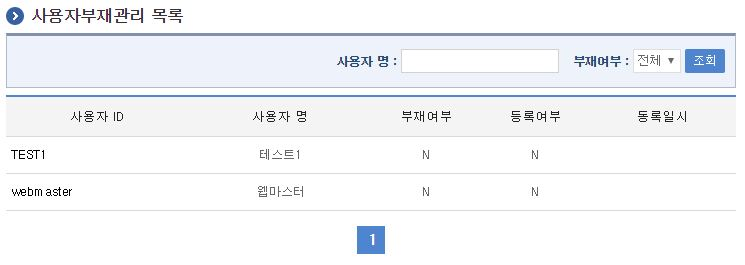
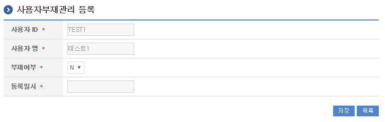
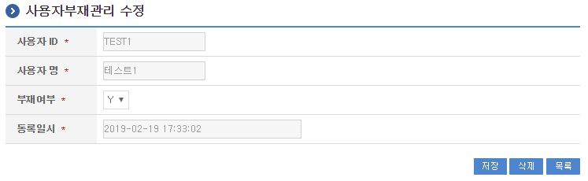

# 사용자부재 관리

## 개요

 사용자부재관리는 사용자 부재여부를 등록하여 해당 사용자가 부재중인지 여부를 조회하는 기능을 제공한다.
 사용자부재관리 기능을 구현하기 위해서 사용자관리 서비스(업무사용자관리)가 필요함.(해당서비스에서 등록된 사용자 정보를 기준으로 부재관리 서비스 제공)

## 설명

 사용자부재관리는 사용자부재정보를 등록하여 모든 사용자의 부재여부를 파악하기 위한  목적으로 사용자부재정보의 등록, 수정, 삭제, 조회, 목록조회, 부재중사용자조회의 기능을 수반한다.

```text
  ① 사용자부재목록조회 : 사용자부재 정보를 최근 등록 순서대로 조회하고, 그 결과 목록을 화면에 반영한다.
  ② 사용자부재등록 : 사용자 부재정보를 등록하고, 등록 결과를 조회한다.
  ③ 사용자부재수정 : 기 등록된 사용자 부재정보의 항목들을 수정한다.
  ④ 사용자부재삭제 : 기 등록된 사용자 부재정보를 삭제한다.
  ⑤ 부재중사용자조회 : 부재중인 사용자정보 목록이 조회된다.
```

### 패키지 참조 관계

 사용자부재관리 패키지는 요소기술의 공통 패키지(cmm)에 대해서만 직접적인 함수적 참조 관계를 가진다.
- 패키지 간 참조 관계 : [사용자지원 Package Dependency](../intro/package-reference.md/#사용자지원)

### 관련소스

| 유형 | 대상소스명 | 비고 |
| --- | --- | --- |
| Controller | egovframework.com.uss.ion.uas.web.EgovUserAbsnceController.java | 사용자부재 관리를 위한 컨트롤러 클래스 |
| Service | egovframework.com.uss.ion.uas.service.EgovUserAbsnceService.java | 사용자부재 관리를 위한 서비스 인터페이스 |
| ServiceImpl | egovframework.com.uss.ion.uas.service.impl.EgovUserAbsnceServiceImpl.java | 사용자부재 관리를 위한 서비스 구현 클래스 |
| VO | egovframework.com.uss.ion.uas.service.UserAbsnceVO.java | 사용자부재 관리를 위한 VO 클래스 |
| DAO | egovframework.com.uss.ion.uas.service.impl.UserAbsnceDAO.java | 사용자부재 관리를 위한 데이터처리 클래스 |
| JSP | /WEB-INF/jsp/egovframework/com/uss/ion/uas/EgovUserAbsnceList.jsp | 사용자부재 목록조회를 위한 jsp페이지 |
| JSP | /WEB-INF/jsp/egovframework/com/uss/ion/uas/EgovUserAbsnceRegist.jsp | 사용자부재 등록를 위한 jsp페이지 |
| JSP | /WEB-INF/jsp/egovframework/com/uss/ion/uas/EgovUserAbsnceUpdt.jsp | 사용자부재 수정를 위한 jsp페이지 |
| JSP | /WEB-INF/jsp/egovframework/com/uss/ion/uas/EgovUserAbsnceMainList.jsp | 등록된 사용자부재 정보를 반영하기 위한 jsp페이지 |
| QUERY XML | resources/egovframework/mapper/com/uss/ion/uas/EgovUserAbsnce\_SQL\_altibase.xml | 사용자부재 Altibase용 QUERY XML |
| QUERY XML | resources/egovframework/mapper/com/uss/ion/uas/EgovUserAbsnce\_SQL\_cubrid.xml | 사용자부재 Cubrid용 QUERY XML |
| QUERY XML | resources/egovframework/mapper/com/uss/ion/uas/EgovUserAbsnce\_SQL\_maria.xml | 사용자부재 Maria용 QUERY XML |
| QUERY XML | resources/egovframework/mapper/com/uss/ion/uas/EgovUserAbsnce\_SQL\_mysql.xml | 사용자부재 MySQL용 QUERY XML |
| QUERY XML | resources/egovframework/mapper/com/uss/ion/uas/EgovUserAbsnce\_SQL\_oracle.xml | 사용자부재 Oracle용 QUERY XML |
| QUERY XML | resources/egovframework/mapper/com/uss/ion/uas/EgovUserAbsnce\_SQL\_postgres.xml | 사용자부재 Postgres용 QUERY XML |
| QUERY XML | resources/egovframework/mapper/com/uss/ion/uas/EgovUserAbsnce\_SQL\_tibero.xml | 사용자부재 Tibero용 QUERY XML |
| QUERY XML | resources/egovframework/mapper/com/uss/ion/uas/EgovUserAbsnce\_SQL\_goldilocks.xml | 사용자부재 Goldilocks용 QUERY XML |
| Message properties | resources/egovframework/message/com/uss/ion/uas/message\_ko.properties | 사용자부재를 위한 Message properties(한글) |
| Message properties | resources/egovframework/message/com/uss/ion/uas/message\_en.properties | 사용자부재를 위한 Message properties(영문) |

### 클래스 다이어그램

 

### 관련테이블

| 테이블명 | 테이블명(영문) | 비고 |
| --- | --- | --- |
| 사용자부재 | COMTNUSERABSNCE | 사용자 부재여부를 등록하여 해당 사용자가 부재중인지 여부를 조회하는 기능을 제공하기 위한 속성을 관리한다. |

## 관련기능

 사용자부재관리기능은 크게 사용자부재 목록조회, 사용자부재 등록, 사용자부재 수정 기능으로 구성되어 있다.

### 사용자부재 목록조회

#### 비즈니스 규칙

 사용자부재 목록은 페이지당 10건씩 조회되며 페이징은 10페이지씩 이루어진다.
 검색조건은 사용자명 대해서 수행된다.

#### 관련코드

 N/A

#### 관련화면 및 수행메뉴얼

| Action | URL | Controller method | SQL Namespace | SQL QueryID |
| --- | --- | --- | --- | --- |
| 목록조회 | /uss/ion/uas/selectUserAbsnceList.do | selectUserAbsnceList | "userAbsnceDAO" | "selectUserAbsnceList", |
|  |  |  | "userAbsnceDAO" | "selectUserAbsnceListTotCnt" |

 

 조회 : 기 등록된 사용자부재 목록을 조회한다.
 등록 : 신규 사용자부재를 등록하기 위해서는 등록여부가 'N'인 사용자ID를 선택하여 사용자부재 등록 화면으로 이동한다.

### 사용자부재 등록

#### 비즈니스 규칙

 사용자부재의 속성정보를 입력한 뒤 등록한다.

#### 관련코드

 N/A

#### 관련화면 및 수행메뉴얼

| Action | URL | Controller method | SQL Namespace | SQL QueryID |
| --- | --- | --- | --- | --- |
| 등록 | /uss/ion/uas/addUserAbsnce.do | insertUserAbsnce | "userAbsnceDAO" | "insertUserAbsnce" |

 

 등록 : 신규 사용자부재를 등록하기 위해서는 사용자부재 속성을 입력한 뒤 저장 버튼을 통해서 사용자부재를 등록한다.
 목록 : 목록 버튼을 선택하여 사용자부재 목록조회 화면으로 이동한다.

### 사용자부재 수정

#### 비즈니스 규칙

 사용자부재의 속성정보를 변경한 후 저장한다.

#### 관련코드

 N/A

#### 관련화면 및 수행메뉴얼

| Action | URL | Controller method | SQL Namespace | SQL QueryID |
| --- | --- | --- | --- | --- |
| 수정 | /uss/ion/uas/updtUserAbsnce.do | updateUserAbsnce | "userAbsnceDAO" | "updateUserAbsnce" |
| 상세조회 | /uss/ion/uas/getUserAbsnce.do | selectUserAbsnce | "userAbsnceDAO" | "selectUserAbsnce" |
| 삭제 | /uss/ion/uas/removeUserAbsnce.do | deleteUserAbsnce | "userAbsnceDAO" | "deleteUserAbsnce" |

 다음 화면은 사용자부재 상세조회 화면과 동일하다.

 

 수정 : 기 등록된 사용자부재 속성을 수정한 뒤 저장 버튼을 통해서 사용자부재정보를 수정한다.
 삭제 : 삭제 버튼을 선택하여 기 등록된 사용자부재정보를 삭제한다.
 목록 : 목록 버튼을 선택하여 사용자부재 목록조회 화면으로 이동한다.

