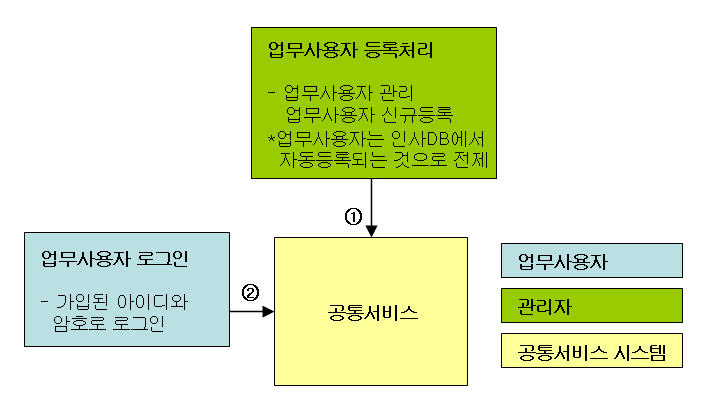
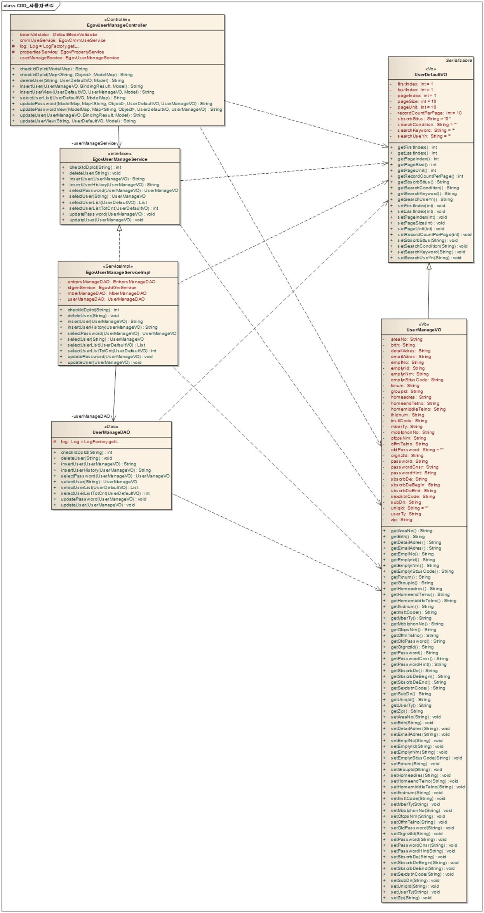
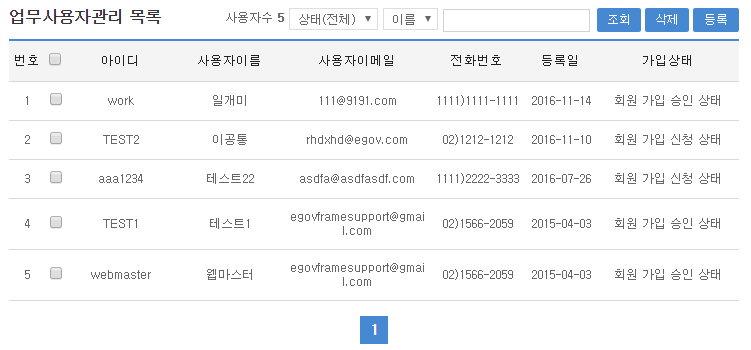
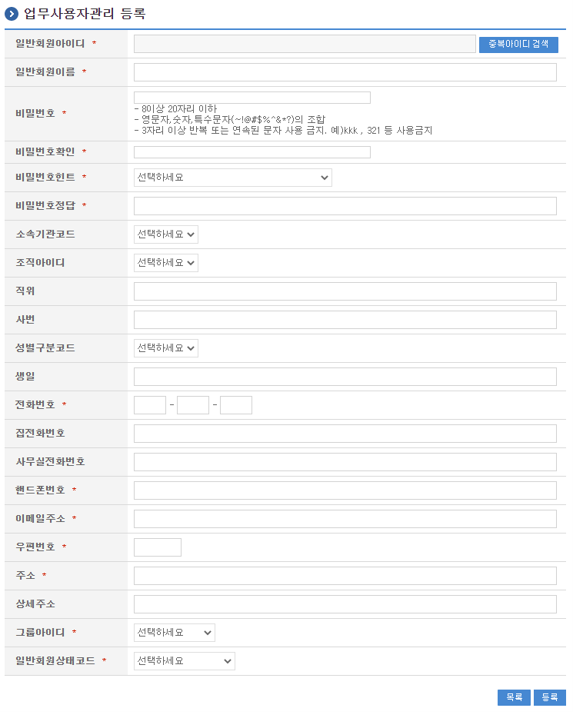
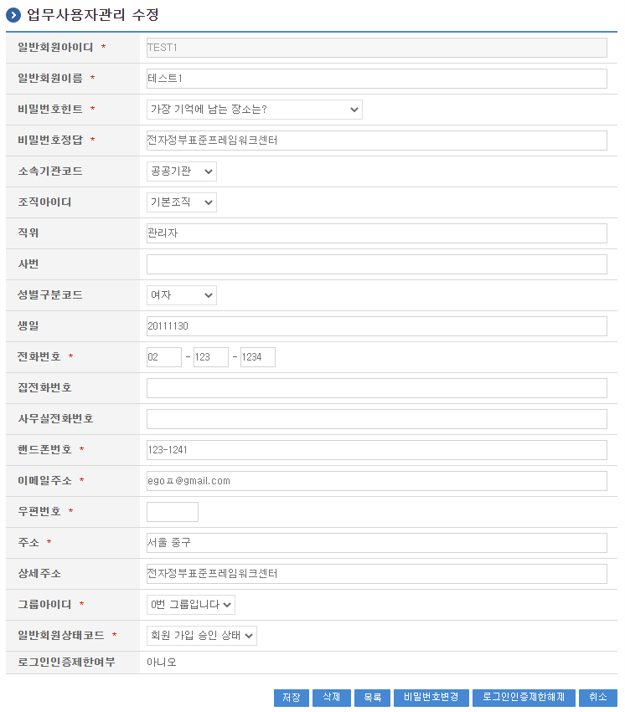
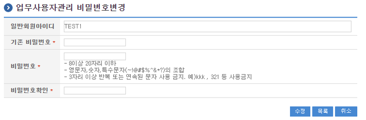

# 사용자관리

## 개요

 사용자관리는 사용자목록 조회기능과 신규등록기능, 상세조회기능, 사용자정보수정기능, 사용자암호수정기능, 사용자정보삭제기능을 제공한다.
 기능흐름

| 기능명 | 기능 흐름 |
| --- | --- |
| 사용자 등록 및 시스템 사용 | ①관리자에 의한 사용자 등록 → ②사용자 아이디 또는 인증서를 통한 시스템 로그인 |

 

## 설명

### 패키지 참조 관계

 사용자, 기업회원, 회원 패키지는 요소기술의 공통 패키지(cmm)와 직접적인 함수적 참조 관계를 가진다.
- 패키지 간 참조 관계 : [사용자지원 Package Dependency](../intro/package-reference.md#사용자지원)

### 관련소스

| 유형 | 대상소스명 | 비고 |
| --- | --- | --- |
| Controller | egovframework.com.uss.umt.web.EgovEmplyrManageController.java | 사용자 관리를 위한 컨트롤러 클래스 |
| Service | egovframework.com.uss.umt.service.EgovEmplyrManageService.java | 사용자 관리를 위한 서비스 인터페이스 |
| ServiceImpl | egovframework.com.uss.umt.service.impl.EgovEmplyrManageServiceImpl.java | 사용자 관리를 위한 서비스 구현 클래스 |
| VO | egovframework.com.uss.umt.service.EmplyrManageVO.java | 사용자 관리를 위한 모델 클래스 |
| VO | egovframework.com.uss.umt.service.UserDefaultVO.java | 사용자 관리를 위한 검색조건용 VO 클래스 |
| DAO | egovframework.com.uss.umt.service.impl.EmplyrManageDAO.java | 사용자 관리를 위한 데이터처리 클래스 |
| JSP | /WEB-INF/jsp/egovframework/com/uss/umt/EgovEmplyrInsert.jsp | 사용자 등록을 위한 jsp페이지 |
| JSP | /WEB-INF/jsp/egovframework/com/uss/umt/EgovEmplyrSelectUpdt.jsp | 사용자 상세조회 및 수정을 위한 jsp페이지 |
| JSP | /WEB-INF/jsp/egovframework/com/uss/umt/EgovEmplyrPasswordUpdt.jsp | 사용자 암호수정을 위한 jsp페이지 |
| JSP | /WEB-INF/jsp/egovframework/com/uss/umt/EgovEmplyrManage.jsp | 사용자 목록조회를 위한 jsp페이지 |
| JSP | /WEB-INF/jsp/egovframework/com/uss/umt/EgovIdDplctCnfirm.jsp | 중복아이디 확인을 위한 jsp페이지 |
| Query XML | resources/egovframework/mapper/com/uss/umt/EgovEmplyrManage\_SQL\_altibase.xml | 사용자 관리를 위한 Altibase용 Query XML |
| Query XML | resources/egovframework/mapper/com/uss/umt/EgovEmplyrManage\_SQL\_cubrid.xml | 사용자 관리를 위한 Cubrid용 Query XML |
| Query XML | resources/egovframework/mapper/com/uss/umt/EgovEmplyrManage\_SQL\_maria.xml | 사용자 관리를 위한 MariaDB용 Query XML |
| Query XML | resources/egovframework/mapper/com/uss/umt/EgovEmplyrManage\_SQL\_mysql.xml | 사용자 관리를 위한 MySQL용 Query XML |
| Query XML | resources/egovframework/mapper/com/uss/umt/EgovEmplyrManage\_SQL\_oracle.xml | 사용자 관리를 위한 Oracle용 Query XML |
| Query XML | resources/egovframework/mapper/com/uss/umt/EgovEmplyrManage\_SQL\_postgres.xml | 사용자 관리를 위한 PostgreSQL용 Query XML |
| Query XML | resources/egovframework/mapper/com/uss/umt/EgovEmplyrManage\_SQL\_tibero.xml | 사용자 관리를 위한 Tibero용 Query XML |
| Query XML | resources/egovframework/mapper/com/uss/umt/EgovEmplyrManage\_SQL\_goldilocks.xml | 사용자 관리를 위한 Goldilocks용 Query XML |
| Idgen XML | resources/egovframework/spring/com/idgn/context-idgn-UsrCnfrm.xml | 사용자 관리 Id생성 Idgen XML |
| Message properties | resources/egovframework/message/com/uss/umt/message\_ko.properties | 사용자 관리를 위한 Message properties(한글) |
| Message properties | resources/egovframework/message/com/uss/umt/message\_en.properties | 사용자 관리를 위한 Message properties(영문) |

### 클래스 다이어그램

 

### ID Generation

#### ID Generation 관련 DDL 및 DML

 ID Generation Service를 활용하기 위해서 Sequence 저장테이블인  COMTECOPSEQ에 USRCNFRM_ID 항목을 추가해야 한다.
 테이블이 생성되어 있는 경우라면 INSERT 구문만을 수행한다.(본시스템의 기능 중에서 회원, 기업회원관리에서도 USRCNFRM_ID항목을 사용하여 고유아이디를 생성한다.)

```sql
  CREATE TABLE COMTECOPSEQ ( TABLE_NAME VARCHAR(20) NOT NULL, 
  		             NEXT_ID NUMERIC(30) NULL,
  		             PRIMARY KEY (TABLE_NAME));
 
  INSERT INTO COMTECOPSEQ VALUES('SCHDUL_ID','1');
```

#### ID Generation 환경설정(context-idgn-UsrCnfrm.xml)

```xml
    <bean name="egovUsrCnfrmIdGnrService" class="egovframework.rte.fdl.idgnr.impl.EgovTableIdGnrServiceImpl" destroy-method="destroy">
        <property name="dataSource" ref="egov.dataSource" />
        <property name="strategy"   ref="usrCnfrmStrategy" />
        <property name="blockSize"  value="10"/>
        <property name="table"      value="COMTECOPSEQ"/>
        <property name="tableName"  value="USRCNFRM_ID"/>
    </bean>
    <bean name="usrCnfrmStrategy" class="egovframework.rte.fdl.idgnr.impl.strategy.EgovIdGnrStrategyImpl">
        <property name="prefix"   value="USRCNFRM_" />
        <property name="cipers"   value="11" />
        <property name="fillChar" value="0" />
    </bean>
```

### 관련테이블

| 테이블명 | 테이블명(영문) | 비고 |
| --- | --- | --- |
| 사용자정보 | COMTNEMPLYRINFO | 사용자 정보를 관리한다. |

### 관련코드

 사용자관리에서 사용되는 코드 및 그에 따른 설정 값의 반영사항은 다음과 같다.

| 코드분류 | 코드분류명 | 코드ID | 코드명 | 설정반영사항 |
| --- | --- | --- | --- | --- |
| COM012 | 사용자유형 | USR01 | 일반회원 | 일반회원 유형 |
|  | 사용자유형 | USR02 | 기업회원 | 기업회원 유형 |
|  | 사용자유형 | USR03 | 사용자 | 사용자유형 |
| COM013 | 사용자상태 | A | 가입신청 | 회원가입신청상태 |
|  | 사용자상태 | P | 가입승인 | 회원가입승인상태 |
|  | 사용자상태 | D | 가입삭제 | 회원가입삭제상태 |
| COM014 | 성별구분 | F | 여자 | 여자 |
|  | 성별구분 | M | 남자 | 남자 |
| COM022 | 패스워드힌트 | 동적으로생성함 | 힌트 | 패스워드힌트 |
| COM025 | 소속기관코드 | 동적으로생성함 | 소속기관 | 소속기관정보 |
| 우편번호코드 | COMTCZIP 테이블에 등록된 우편번호정보 | 우편번호 |  |  |
| 권한그룹코드 | COMTNAUTHORGROUPINFO 테이블에 동적으로 생성된 권한그룹레코드정보 | 사용자별 권한그룹 |  |  |
| 조직정보 | COMTNORGNZTINFO 테이블에 동적으로 생성된 조직(부서)정보 | 사용자별 조직(부서)정보 |  |  |

## 관련기능

 사용자관리는 크게 사용자 목록조회, 사용자 등록, 사용자 상세조회(수정), 사용자 암호변경 기능으로 분류된다.

### 사용자 목록조회

#### 비즈니스 규칙

 검색조건은 사용자상태조건, 사용자아이디, 사용자명에 대해서 수행된다. 검색조건으로 사용자아이디를 사용하는 경우는 EQUAL검색(동일한 아이디인 경우를 검색), 사용자명을 사용하는 경우는 LIKE(근접한 사용자명인 경우를 검색)검색을 수행한다.

#### 관련코드

 N/A

#### 관련화면 및 수행 매뉴얼

| Action | URL | Controller method | SQL Namespace | SQL QueryID |
| --- | --- | --- | --- | --- |
| 목록조회 | /uss/umt/EgovEmplyrManage.do | selectUserList | "userManageDAO" | "selectUserList\_S", |
|  |  |  | "userManageDAO" | "selectUserListTotCnt\_S" |
| 삭제 | /uss/umt/EgovEmplyrDelete.do | deleteUser | "userManageDAO" | "deleteUser\_S" |

 사용자목록은 페이지 당 10건씩 조회되며 페이징은 10페이지씩 이루어진다.
 페이지 당 검색 범위를 변경하고자 하는 경우 context-properties.xml 파일의 pageUnit, pageSize를 변경한다.(단 해당 설정은 전체 공통서비스 기능에 영향을 미친다.)

 

 조회 : 사용자 목록을 검색조건을 지정하여 조회하기 위해서는 검색조건을 설정한 후 상단의 검색 버튼을 통해서 해당되는 사용자를 검색한다.
 삭제 : 기존 사용자를 삭제하고자 하는 경우, 사용자 상태정보를 회원 가입 삭제 상태로 변경하여 처리한다. 완전삭제가 필요한 경우, 체크박스를 선택한 후 상단의 삭제버튼을 통해서 Database상에서 삭제할 수 있다.  (단, 삭제 시는 해당사용자와 관련된 설정정보들이 우선 삭제되어야 한다)
 등록 : 신규 사용자를 등록하기 위해서는 상단의 등록버튼을 통해서  사용자 등록 화면으로 이동한다.
 상세조회(수정) : 기존 사용자의 등록정보를 수정하고자 하는 경우는 해당 아이디를 클릭하여 상세 조회 및 수정기능을 제공하는 사용자 상세조회(수정) 화면으로 이동한다.

### 사용자 등록

#### 비즈니스 규칙

 사용자 정보를 입력하여 신규등록한다. 등록이 성공적으로 종료되면 사용자 목록조회 화면으로 이동한다.

#### 관련코드

 N/A

#### 관련화면 및 수행 매뉴얼

| Action | URL | Controller method | SQL Namespace | SQL QueryID |
| --- | --- | --- | --- | --- |
| 등록 | /uss/umt/EgovEmplyrInsert.do | insertUser | "userManageDAO" | "insertUser\_S" |

 

 목록 : 사용자 목록조회화면으로 다시 이동하기 위해서는 하단의 목록버튼을 통해서  사용자 목록조회 화면으로 이동한다.
 등록 : 신규 사용자 정보를 입력한후 하단의 등록버튼을 통해서 Database상에 신규 사용자 정보를 저장한다. 입력항목 중에서 필수항목(*표시)은 모두 입력해야 하며 사용자 아이디는 팝업화면을 호출하여 선택한다.

### 사용자 상세조회(수정)

#### 비즈니스 규칙

 사용자 목록의 상세조회 및 수정 기능을 제공한다.

#### 관련코드

 N/A

#### 관련화면 및 수행 매뉴얼

| Action | URL | Controller method | SQL Namespace | SQL QueryID |
| --- | --- | --- | --- | --- |
| 상세조회 | /uss/umt/EgovEmplyrSelectUpdtView.do | updateUserView | "userManageDAO" | "selectUser\_S" |
| 수정 | /uss/umt/EgovEmplyrSelectUpdt.do | updateUser | "userManageDAO" | "updateUser\_S" |
| 삭제 | /uss/umt/EgovEmplyrDelete.do | deleteUser | "userManageDAO" | "deleteUser\_S" |

 

 저장 : 기존 사용자 정보를 수정입력한 후 하단의 저장버튼을 통해서 Database상에 수정된 사용자 정보를 저장한다. 입력항목 중에서 필수항목(*표시)은 모두 입력된 상태여야 하며 사용자 아이디는 변경할 수 없다.
 삭제 : 기존 사용자를 삭제하고자 하는 경우는 사용자 상태정보를 가입승인탈퇴로 변경하여 처리한다. 특수한 경우 완전삭제가 필요한 경우는 하단의 삭제버튼을 통해서 Database상에서 삭제할 수 있다.(단, 삭제 시는 해당사용자와 관련된 설정정보들이 우선 삭제되어야 한다)
 목록 : 사용자 목록조회화면으로 다시 이동하기 위해서는 하단의 목록버튼을 통해서  사용자 목록조회 화면으로 이동한다.
 비밀번호변경 : 사용자 암보변경화면으로 이동하기 위해서는 하단의 암호변경버튼을 통해서  사용자 암호변경 화면으로 이동한다.
 취소 : 기존 사용자 정보의 수정입력도중 입력된 내용을 수정하기 전상태로 초기화하기 위해서는 하단의 취소 버튼을 통해서 상세정보를 최초 상태로 복원한다.
 로그인인증제한해제 : 비밀번호 입력 횟수 초과로 인증이 제한된 계정에 대해 로그인인증제한해제 버튼을 통해 인증 제한을 해제한다.

### 사용자 비밀번호변경

#### 비즈니스 규칙

 사용자의 비밀번호를 수정한다. 수정이 성공적으로 종료되면 요청에 대한 처리결과를 화면상에 메시지로 출력한다.

#### 관련코드

 N/A

#### 관련화면 및 수행 매뉴얼

| Action | URL | Controller method | SQL Namespace | SQL QueryID |
| --- | --- | --- | --- | --- |
| 비밀번호수정화면 | /uss/umt/EgovEmplyrPasswordUpdtView.do | updatePasswordView |  |  |
| 비밀번호수정 | /uss/umt/EgovEmplyrPasswordUpdt.do | updatePassword | "userManageDAO" | "updatePassword\_S" |
|  |  |  | "userManageDAO" | "selectPassword\_S" |

 

 수정 : 기존의 비밀번호와 수정할 암호, 수정할 암호 확인을 입력한 후 하단의 수정버튼을 통해서 Database상에 수정된 비밀번호 정보를 저장한다. 기존의 비밀번호가 틀린경우는 수정되지 않는다.
 목록 : 사용자 목록조회화면으로 다시 이동하기 위해서는 하단의 목록버튼을 통해서  사용자 목록조회 화면으로 이동한다.
 취소 : 비밀번호 수정입력도중 입력했던 내용을 초기화하기 위해서는 하단의 취소 버튼을 통해서 최초 상태로 클리어한다.
