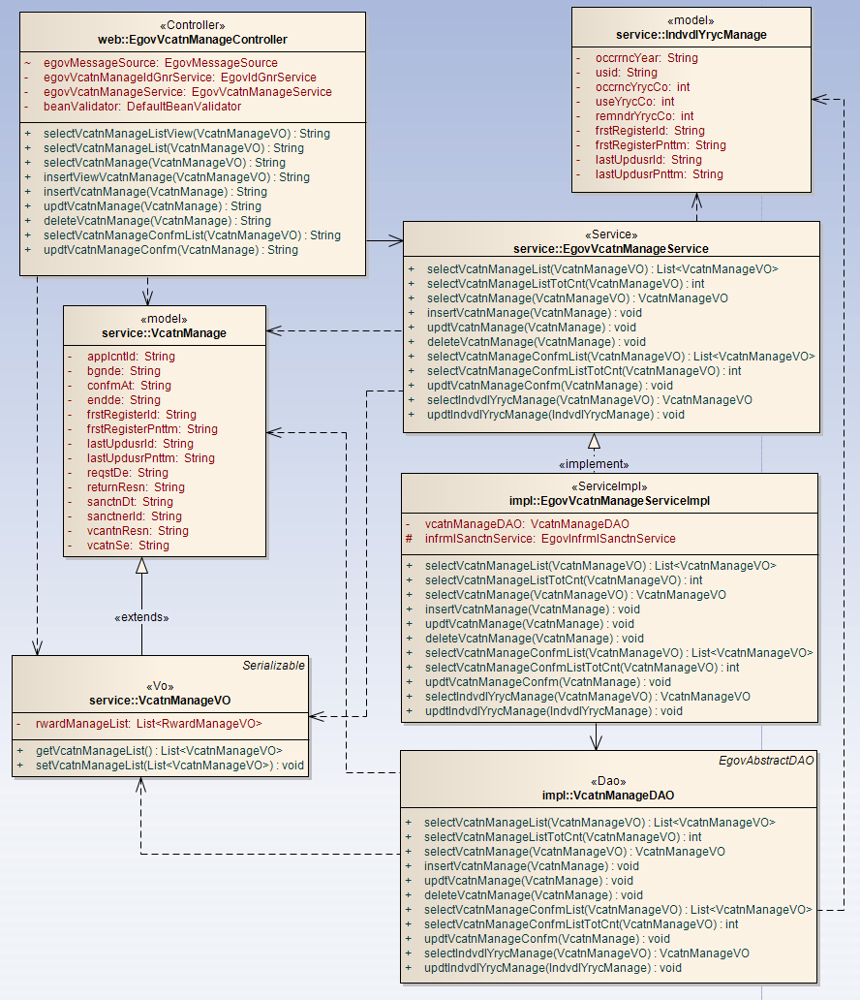
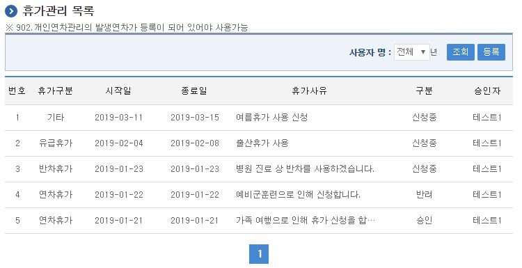
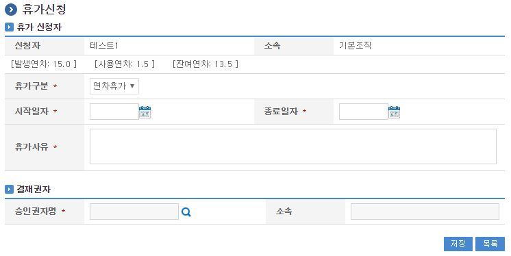
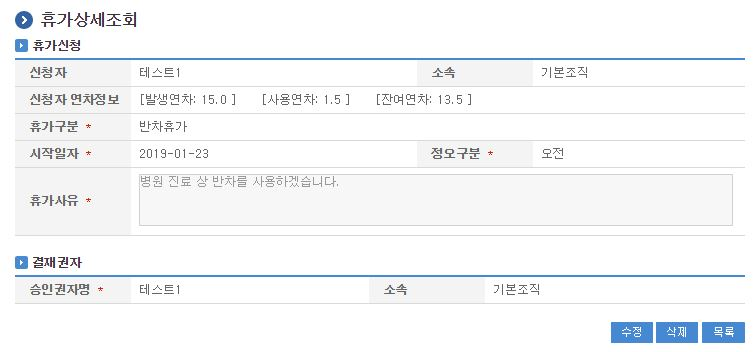
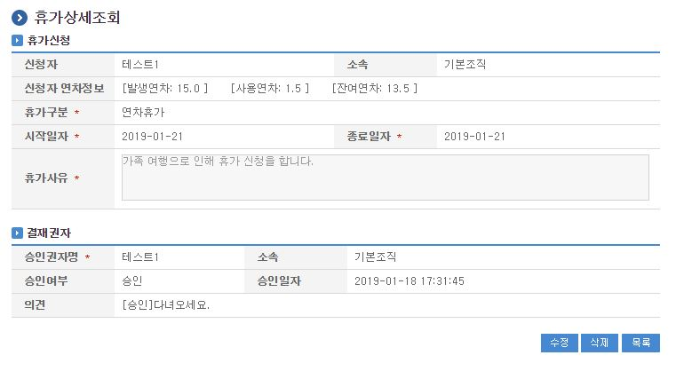

# 휴가관리

## 개요

 휴가관리는 시스템에서 개인의 휴가정보를 관리하는 기능으로 휴가 이용정보와 반차, 연차정보, 무급휴가등을 관리하는 기능을 제공한다.

## 설명

 휴가관리는 휴가을 등록하기 위한 목적으로 휴가 등록, 수정, 삭제, 조회, 목록조회, 승인처리 기능을 수반한다.

 ① 휴가관리목록 : 휴가관리 정보를 최근 등록 순서대로 조회하고, 그 결과 목록을 화면에 반영한다.
 ② 휴가등록 : 휴가정보를 등록하고, 등록 결과를 조회한다.
 ③ 휴가수정 : 기 등록된 휴가정보의 항목들을 수정한다.
 ④ 휴가삭제 : 기 등록된 휴가정보를 삭제한다.
 ⑤ 휴가상세조회 : 등록된 휴가 상세정보를 조회한다.
 ⑥ 휴가승인목록 : 휴가승인 목록을 최근 등록 순서대로 조회하고, 그 결과 목록을 화면에 반영한다.
 ⑦ 휴가승인 : 등록된 휴가 승인/반려 처리를 한다.

### 관련소스

| 유형 | 대상소스명 | 비고 |
| --- | --- | --- |
| Controller | egovframework.com.uss.ion.vct.web.EgovVcatnManageController.java | 휴가 관리를 위한 컨트롤러 클래스 |
| Service | egovframework.com.uss.ion.vct.service.EgovVcatnManageService.java | 휴가 관리를 위한  서비스 인터페이스 |
| ServiceImpl | egovframework.com.uss.ion.vct.service.impl.EgovVcatnManageServiceImpl.java | 휴가 관리를 위한 서비스 구현 클래스 |
| DAO | egovframework.com.uss.ion.vct.service.impl.VcatnManageDAO.java | 휴가 관리를 위한 데이터처리 클래스 |
| VO | egovframework.com.uss.ion.vct.service.VcatnManageVO.java | 휴가 관리를 위한 VO 클래스 |
| Model | egovframework.com.uss.ion.yrc.service.IndvdlYrycManage.java | 연도별 연차 관리를 위한 Model 클래스 |
| JSP | /WEB-INF/jsp/egovframework/com/uss/ion/vct/EgovVcatnManageList.jsp | 휴가 목록조회를 위한 jsp페이지 |
| JSP | /WEB-INF/jsp/egovframework/com/uss/ion/vct/EgovVcatnRegist.jsp | 휴가 등록를 위한 jsp페이지 |
| JSP | /WEB-INF/jsp/egovframework/com/uss/ion/vct/EgovVcatnDetail.jsp | 등록된 휴가를 상세조회/반영하기 위한 jsp페이지 |
| JSP | /WEB-INF/jsp/egovframework/com/uss/ion/vct/EgovVcatnUpdt.jsp | 휴가 수정를 위한 jsp페이지 |
| JSP | /WEB-INF/jsp/egovframework/com/uss/ion/vct/EgovVcatnConfmList.jsp | 휴가 승인 목록조회를 위한 jsp페이지 |
| JSP | /WEB-INF/jsp/egovframework/com/uss/ion/vct/EgovVcatnConfm.jsp | 휴가 승인/반려처리를 위한 jsp페이지 |
| Query XML | resources/egovframework/mapper/com/uss/ion/vct/EgovVcatnManage\_SQL\_altibase.xml | 휴가관리 Altibase XML |
| Query XML | resources/egovframework/mapper/com/uss/ion/vct/EgovVcatnManage\_SQL\_cubrid.xml | 휴가관리 Cubrid XML |
| Query XML | resources/egovframework/mapper/com/uss/ion/vct/EgovVcatnManage\_SQL\_mysql.xml | 휴가관리 MySQL XML |
| Query XML | resources/egovframework/mapper/com/uss/ion/vct/EgovVcatnManage\_SQL\_maria.xml | 휴가관리 MariaDB XML |
| Query XML | resources/egovframework/mapper/com/uss/ion/vct/EgovVcatnManage\_SQL\_tibero.xml | 휴가관리 Tibero XML |
| Query XML | resources/egovframework/mapper/com/uss/ion/vct/EgovVcatnManage\_SQL\_postgres.xml | 휴가관리 PostgreSQL XML |
| Query XML | resources/egovframework/mapper/com/uss/ion/vct/EgovVcatnManage\_SQL\_oracle.xml | 휴가관리 Oracle XML |
| Query XML | resources/egovframework/mapper/com/uss/ion/vct/EgovVcatnManage\_SQL\_goldilocks.xml | 휴가관리 Goldilocks XML |
| Message properties | resources/egovframework/message/com/uss/ion/vct/message\_ko.properties | 휴가 관리  Message properties |
| Message properties | resources/egovframework/message/com/uss/ion/vct/message\_en.properties | 휴가 관리  Message properties |

### 클래스 다이어그램

 

### 관련테이블

| 테이블명 | 테이블명(영문) | 비고 |
| --- | --- | --- |
| 휴가관리 | COMTNVCATNMANAGE | 휴가정보를 관리하기 위한 속성정보를 정의하고, 관리한다. |
| 개인별연차관리 | COMTNINDVDLYRYCMANAGE | 개인별 연차를 관리하기 위한 속성정보를 정의하고, 관리한다. |

## 관련화면 및 수행메뉴얼

### 휴가관리 목록조회

| Action | URL | Controller method | QueryID |
| --- | --- | --- | --- |
| 조회 | /uss/ion/vct/EgovVcatnManageList.do | selectVcatnManageList | "vcatnManageDAO.selectVcatnManageList" |
| 조회 | /uss/ion/vct/EgovVcatnManageList.do | selectVcatnManageList | "vcatnManageDAO.selectVcatnManageListTotCnt" |

 사용자 개인의 휴가정보로 목록은 페이지당 10건씩 조회되며 페이징은 10페이지씩 이루어진다.
 검색조건은 휴가년도에 대해서 수행된다.

 

 조회 : 기 등록된 휴가관리의 목록을 조회한다.
 등록 : 신규 휴가을 등록하기 위해서는 상단의 등록 버튼을 통해서 휴가 등록 화면으로 이동한다.
 상세조회: 등록된 휴가 목록(휴가사유)을 클릭하면 상세정보 화면으로 이동한다.

### 휴가 등록

| Action | URL | Controller method | QueryID |
| --- | --- | --- | --- |
| 등록 | /uss/ion/vct/insertVcatnManage.do | insertVcatnManage | "vcatnManageDAO.insertVcatnManage" |

 휴가의 속성(연차,반차,무급,유급,대체)정보를 입력한 뒤 등록한다.
 연차,반차휴가는 당해년도 연차 휴가신청만 가능하며, 연차/반차 신청 시 사용연차는 증가되고(잔여연차는 감소됨)
 신청취소 또는 반려처리시 차감된 연차는 환원된다.
 연차휴가 신청 시 잔여(사용가능)연차를 초과할 수 없다.

 

 등록 : 신규 휴가을 등록하기 위해서는 휴가 속성을 입력한 뒤 하단의 휴가 버튼을 통해서 휴가을 등록한다.
 목록 : 휴가 목록조회 화면으로 이동한다.

### 휴가 상세

| Action | URL | Controller method | QueryID |
| --- | --- | --- | --- |
| 상세조회 | /uss/ion/vct/EgovVcatnManageDetail.do | selectVcatnManage | "vcatnManageDAO.selectVcatnManage" |
| 삭제 | /uss/ion/vct/deleteVcatnManage.do | deleteVcatnManage | "vcatnManageDAO.deleteVcatnManage" |

 휴가의 상세조회화면이다. 수정 버튼을 통해서 수정화면으로 이동하고, 삭제 버튼을 통해서 휴가을 삭제한다.

 

 수정 : 휴가 수정 화면으로 이동한다.
 삭제 : 삭제 버튼을 통해서 기 등록된 휴가정보를 삭제한다.
 목록 : 휴가 목록조회 화면으로 이동한다.

### 휴가 수정

| Action | URL | Controller method | QueryID |
| --- | --- | --- | --- |
| 수정 | /uss/ion/vct/updtVcatnManage.do | updtVcatnManage | "vcatnManageDAO.updtVcatnManage" |
| 상세조회 | /uss/ion/vct/EgovVcatnManageDetail.do | selectVcatnManage | "vcatnManageDAO.selectVcatnManage" |

 휴가의 속성정보를 변경한 후 저장한다. 다음 화면은 휴가 상세조회 화면과 동일하다.

 

 저장 : 기 등록된 휴가 속성을 수정한 뒤 하단의 수정 버튼을 통해서 휴가 정보를 수정한다.
 목록 : 휴가 목록조회 화면으로 이동한다.
