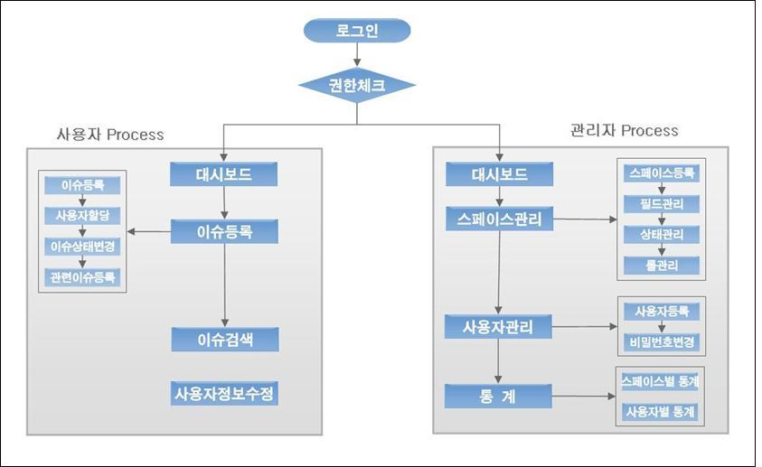

# Change Management 개요

## 개요

Change Management는 프로젝트(또는 복수의 프로젝트)에서 개발자간의 커뮤니케이션을 돕고 체계적인 이슈(버그)를 관리하는 시스템을 의미한다.

## Feature

Change Management는 이슈를 체계적으로 관리하기 위해 스페이스관리, 이슈관리, 통계, 대시보드등 다양한 기능을 제공한다.

| Feature                     | 설명                                                                                              |
| --------------------------- | ------------------------------------------------------------------------------------------------- |
| Easy to Install             | 별도의 Customizing이 필요 없이 제공된 war의 디플로이를 통한 간단한 설치메커니즘을 제공한다.       |
| Eclipse Integration         | 이클립스의 형상연계 Plug-in과의 연계를 통해 커밋 시 이슈와 연계할 수 있고, 이슈를 조회할 수 있다. |
| E-Mail Integration          | 사용자등록, 이슈등록 및 상태 수정시에 할당된 담당자에게 해당 내용을 E-Mail로 전송할 수 있다.      |
| Cross Referencing of Issues | 등록된 이슈간에 상호 참조를 할 수 있으며, 이를 통해 연관된 이슈와의 통합이 가능하다.              |
| Custom Fields / Status      | 스페이스의 효율적인 관리를 위해 스페이스의 필드와 이슈의 상태를 정의할 수 있다.                   |
| Detailed History View       | 등록된 이슈의 등록자, 담당자, 상태, 과거 변경내역을 조회할 수 있다.                               |
| Statistics                  | 등록된 스페이스와 사용자별 통계를 통해 전체 이슈와 사용자의 진행상황을 한눈에 파악할 수 있다.     |
| Search                      | 다양한 검색조건(삭제된 이슈검색 포함)을 제공하여 빠른 시간에 원하는 이슈를 검색할 수 있다.        |
| Dashboard                   | 해당 사용자별로 자신에게 등록된 스페이스, 등록한 이슈, 할당된 이슈등을 한눈에 파악할 수 있다.     |
| Administration Management   | 사용자관리, 스페이스 관리, 설정관리, 통계, 이슈관리등 강력한 관리기능을 제공한다.                 |

## Process

Change Management는 관리자기능인 스페이스관리(필드, 상태)와 사용자관리등을 통해 이슈 관리 환경을 구성하고,
일반사용자는 설정된 환경에서 이슈를 관리하는 프로세스로 구성된다.



#### 필드 관리

필드는 스페이스의 항목을 의미한다.
즉, 필드 관리는 스페이스에 사용자 정의필드를 등록하고 관리할 수 기능을 제공한다.
예를 들어, 이슈 관리하는 기본 항목(제목, 내용, 담당자, 등록자, 등록일시)외에 추가로 중요도와 우선순위 등을 관리하고 싶다면
필드관리에서 중요도와 우선순위를 추가하여 이슈를 등록할 때 중요도와 우선순위도 등록할 수 있다.

* 필드타입 : Priority(Drop Down), Severity(Drop Down), 선택박스(Drop Down List), 숫자(Decimal Number), 텍스트(Free Text Field),
  날짜(Date Field)
* 필드옵션 : Priority, Severity, Drop Down List의 경우에는 옵션을 추가해야만하며, 옵션간의 우선순위 조정이 가능하다.

#### 상태 관리

상태는 이슈의 현재상태를 의미한다.
이슈의 등록, 할당, 해결, 삭제등의 상태를 임의로 추가하여 관리할 수 있다.
상태의 관리를 통해 이슈를 좀 더 체계적으로 관리할 수 있게 된다.

* 기본 상태 : NEW, OPEN, CLOSED
* 예상 상태 : ASSIGNED, SOLVED, REJECTED등의 상태를 등록하여 이슈를 좀 더 체계적으로 관리할 수 있다.

#### 롤 관리

롤은 스페이스에 할당된 사용자의 담당 역할을 의미한다.
스페이스에 할당된 사용자에게 롤을 부여하면 사용자는 등록된 롤을 기반으로 스페이스의 이슈를 관리할 수 있다. Change Management에서는 롤을 등록하여 관리할 수 있는 기능을 제공한다.

* 기본 롤 : DEFAULT(스페이스 생성시 기본적으로 등록된 롤), ROLE_ADMIN(스페이스 생성시 기본적으로 등록되는 관리자 롤)
* 예상 롤 : PROJECT MANAGER, ARCHITECT, MODELLER, PMO등의 롤을 등록하여 사용자의 롤을 구분할 수 있다.

## 주요기능

Change Management는 크게 스페이스관리, 이슈관리, 사용자관리, 설정관리를 할 수 있는 기능으로 구성되어 있다.

### 관리자 기능

| 메뉴(1Level) | 메뉴(2Level)    | 설명                                                                                          |
| ------------ | --------------- | --------------------------------------------------------------------------------------------- |
| 대시보드     |                 | 해당 사용자별로 자신에게 등록된 스페이스, 등록한 이슈, 할당된 이슈등을 한눈에 파악할 수 있다. |
| 개인정보수정 |                 | ID 및 이름을 제외한 개인정보를 수정할 수 있다.                                                |
| 스페이스관리 | 스페이스관리    | 스페이스를 구분하여 스페이스별로 이슈를 관리할 수 있도록 한다.                                |
|              | 필드관리        | 이슈의 효율적인 관리를 위해 스페이스별로 필드를 정의할 수 있다.                               |
|              | 롤관리          | 사용자의 권한을 의미하는 롤을 관리할 수 있다.                                                 |
|              | 상태관리        | 스페이스별로 이슈의 상태를 관리할 수 있다.                                                    |
| 사용자관리   |                 | 사용자 정보를 관리하고, 사용자의 스페이스별 롤을 관리할 수 있다.                              |
| 이슈관리     |                 | 스페이스별 이슈 및 이력을 관리하고, 관련이슈들을 참조하고, 메일을 보내는 기능을 제공한다.     |
| 이슈검색     |                 | 다양한 검색조건(삭제된 이슈검색 포함)을 제공하여 빠른 시간에 원하는 이슈를 검색할 수 있다.    |
| 검색인덱싱   |                 | 이슈 검색를 검색하기 위한 인덱스를 생성할 수 있다.                                            |
| 통계         | 스페이스별 통계 | 등록된 스페이스별 통계를 통해 전체 이슈와 사용자의 진행상황을 한눈에 파악할 수 있다.          |
|              | 사용자별 통계   | 등록된 사용자별 통계를 통해 전체 이슈와 사용자의 진행상황을 한눈에 파악할 수 있다.            |
| 설정관리     | 메일 설정       | 메일 HOST 정보, 서버 ID,PW 등을 설정할 수 있다.                                               |
|              | SMS 설정        | SMS HOST 정보, 서버 ID,PW 등을 설정할 수 있다.                                                |
|              | 환경 설정       | 파일 업로드 경로, 인덱스 경로 설정를 설정할 수 있다.                                          |

### 사용자 기능

| 메뉴         | 설명                                                                                          |
| ------------ | --------------------------------------------------------------------------------------------- |
| 대시보드     | 해당 사용자별로 자신에게 등록된 스페이스, 등록한 이슈, 할당된 이슈등을 한눈에 파악할 수 있다. |
| 개인정보수정 | ID 및 이름을 제외한 개인정보를 수정할 수 있다.                                                |
| 이슈관리     | 스페이스별 이슈 및 이력을 관리하고, 관련이슈들을 참조하고, 메일을 보내는 기능을 제공한다.     |
| 이슈검색     | 다양한 검색조건(삭제된 이슈검색 포함)을 제공하여 빠른 시간에 원하는 이슈를 검색할 수 있다.    |

## 설치

Change Management는 Java 5.X 이상에서 실행되며, JDK 다운로드는 [http://www.java.com/download](http://www.java.com/download)를 이용하면 된다.
Change Management의 설치는 WAR file을 프로젝트 환경에 맞춰 설정파일을 변경하고, 프로젝트에 설치되어 있는 WAS 서버에 deploy를 하면 된다.

### 설치순서

##### WAR File을 deploy

1. WAR File을 다운로드 받는다.
   * URL : [http://www.egovframe.go.kr/](http://www.egovframe.go.kr/)
   * 메뉴 : [ 다운로드 > 개발환경 ]
   * 파일명 : egovframework-dev-isu.war
2. WAR File 압축을 해제한 후 설정파일을 수정한다.
   * [DBMS별 어플리케이션 설정파일 수정](#dbms-설정파일-수정)
   * [검색엔진 lucene 설정파일 수정](#lucene-설정파일-수정)
3. WAR File을 WAS 서버에 deploy 한다.

##### 테이블 생성

1. 테이블 생성 스크립트를 다운로드 받는다.
   * My SQL : [issue_mysql.script](https://www.egovframe.go.kr/wiki/lib/exe/fetch.php?media=egovframework:dev2:isu:issue_mysql.script.zip)
   * Oracle : [issue_oracle.script](https://www.egovframe.go.kr/wiki/lib/exe/fetch.php?media=egovframework:dev2:isu:issue_oracle.script.zip)
   * Altibase : [issue_altibase.script](https://www.egovframe.go.kr/wiki/lib/exe/fetch.php?media=egovframework:dev2:isu:issue_altibase.script.zip)
   * Tibero : [issue_tibero.script](https://www.egovframe.go.kr/wiki/lib/exe/fetch.php?media=egovframework:dev2:isu:issue_tibero.script.zip)
2. 스크립트를 실행하여 테이블을 생성한다.

##### 설치 완료 후 테스트

1. web-browser에서 '[http://domain:port/egovframework-dev-isu](http://domain:port/egovframework-dev-isu)'를 연다.
2. 아이디 :  **“admin”** , 비밀번호 : **“admin123”** 으로 로그인 하여 설치를 확인한다.

##### 환경설정을 수정

1. Change Management의 [설정관리 > 메일설정] 메뉴에서 **메일발송 환경을 설정**한다.
2. Change Management의 [설정관리 > SMS설정] 메뉴에서 **SMS발송 환경을 설정**한다.
3. Change Management의 [설정관리 > 환경설정] 메뉴에서 **파일 업로드 경로와, 인덱스 생성결과 경로를 설정**한다.

* 관련하여 메일, SMS 설정 없이 사용할경우, 해당 기능에서 메일/sms 전송 시 오류가 발생할 수 있다.

## 환경설정

### DBMS 설정파일 수정

#### [ My SQL DBMS ]

##### 1. context-hibernate.xml

경로 : \egovframework-dev-isu\WEB-INF\config\spring\context-hibernate.xml

```xml
<prop key="hibernate.dialect">org.hibernate.dialect.MySQLDialect</prop>
```

##### 2. context-datasource.xml

경로 : \egovframework-dev-isu\WEB-INF\config\spring\context-datasource.xml
url을 프로젝트 내 url에 맞게 변경한다.

```xml
<property name="driverClassName" value="com.mysql.jdbc.Driver"/>
<property name="url" value="jdbc:mysql://192.168.200.24:1621/dev"/>
```

##### 3. jtrac.hbm.xml

경로 : \egovframework-dev-isu\WEB-INF\classes\hibernate\jtrac.hbm.xml
아래 file을 다운로드 하여 My SQL 버전으로 교체
[jtrac.hbm.xml](https://www.egovframe.go.kr/wiki/lib/exe/fetch.php?media=egovframework:dev2:isu:jtrac.hbm.xml_mysql.zip)

##### 4. issue_mysql.script

아래 file을 다운로드 받아 오라클 DDL(issue_mysql.script)로 테이블 생성
[issue_mysql.script](https://www.egovframe.go.kr/wiki/lib/exe/fetch.php?media=egovframework:dev2:isu:issue_mysql.script.zip)

✔ **My SQL의 경우 default로 설정되어 있어 1,2,3번 내용은 수정하지 않아도 적용 된다.**

#### [ Oracle DBMS ]

##### 1. context-hibernate.xml

경로 : \egovframework-dev-isu\WEB-INF\config\spring\context-hibernate.xml

```xml
<prop key="hibernate.dialect">org.hibernate.dialect.Oracle9Dialect</prop> 
```

##### 2. context-datasource.xml

경로 : \egovframework-dev-isu\WEB-INF\config\spring\context-datasource.xml
url을 프로젝트 내 url에 맞게 변경한다.

```xml
<property name="driverClassName" value="oracle.jdbc.OracleDriver"/>
<property name="url" value="jdbc:oracle:thin:@192.168.200.22:1521/egovfrm"/>
```

##### 3. jtrac.hbm.xml

경로 : \egovframework-dev-isu\WEB-INF\classes\hibernate\jtrac.hbm.xml
아래 file을 다운로드 하여 Oracle 버전으로 교체
[jtrac.hbm.xml](https://www.egovframe.go.kr/wiki/lib/exe/fetch.php?media=egovframework:dev2:isu:jtrac.hbm.xml_oracle_.zip)

##### 4. issue_oracle.script

아래 file을 다운로드 받아 Oracle DDL(issue_oracle.script)로 테이블 생성
[issue_oracle.script](https://www.egovframe.go.kr/wiki/lib/exe/fetch.php?media=egovframework:dev2:isu:issue_oracle.script.zip)

#### [ Altibase DBMS ]

##### 1. context-hibernate.xml

경로 : \egovframework-dev-isu\WEB-INF\config\spring\context-hibernate.xml

```xml
<prop key="hibernate.dialect">org.hibernate.dialect.AltibaseDialect</prop>
```

##### 2. context-datasource.xml

경로 : \egovframework-dev-isu\WEB-INF\config\spring\context-datasource.xml
url을 프로젝트 내 url에 맞게 변경한다.

```xml
<property name="driverClassName" value="Altibase.jdbc.driver.AltibaseDriver"/>
<property name="url" value="jdbc:Altibase://192.168.200.22:1721/dev" />
```

##### 3. jtrac.hbm.xml

경로 : \egovframework-dev-isu\WEB-INF\classes\hibernate\jtrac.hbm.xml
아래 file을 다운로드 하여 Altibase 버전으로 교체
[jtrac.hbm.xml](https://www.egovframe.go.kr/wiki/lib/exe/fetch.php?media=egovframework:dev2:isu:jtrac.hbm.xml_altibase.zip)

##### 4. issue_altibase.script

아래 file을 다운로드 받아 Altibase DDL(issue_altibase.script)로 테이블 생성
[issue_altibase.script](https://www.egovframe.go.kr/wiki/lib/exe/fetch.php?media=egovframework:dev2:isu:issue_altibase.script.zip)

#### [ Tibero DBMS ]

##### 1. context-hibernate.xml

경로 : \egovframework-dev-isu\WEB-INF\config\spring\context-hibernate.xml

```xml
<prop key="hibernate.dialect">org.hibernate.dialect.Oracle9Dialect</prop>
```

##### 2. context-datasource.xml

경로 : \egovframework-dev-isu\WEB-INF\config\spring\context-datasource.xml
url을 프로젝트 내 url에 맞게 변경한다.

```xml
<property name="driverClassName" value="com.tmax.tibero.jdbc.TbDriver"/>
<property name="url" value="jdbc:tibero:thin:@192.168.200.22:1821:egovfrm" />
```

##### 3. jtrac.hbm.xml

경로 : \egovframework-dev-isu\WEB-INF\classes\hibernate\jtrac.hbm.xml
아래 file을 다운로드 받아 Tibero 버전으로 교체
[jtrac.hbm.xml](https://www.egovframe.go.kr/wiki/lib/exe/fetch.php?media=egovframework:dev2:isu:jtrac.hbm.xml_tibero.zip)

##### 4. issue_tibero.script

아래 file을 다운로드 받아 Tibero DDL(issue_tibero.script)로 테이블 생성
[issue_tibero.script](https://www.egovframe.go.kr/wiki/lib/exe/fetch.php?media=egovframework:dev2:isu:issue_tibero.script.zip)

### lucene 설정파일 수정

##### 1. lucene index directory

WAR File이 배포되는 임의의 위치에 폴더를 생성한다.

##### 2. context-lucene.xml

경로 : \egovframework-dev-isu\WEB-INF\config\spring\context-lucene.xml
아래 location을 1번에서 생성된 절대 경로로 변경

```xml
  <bean id="indexDirectory" class="org.springmodules.lucene.index.support.FSDirectoryFactoryBean">
      <property name="location" value="indexes"/>
  </bean>
```

ex) 절대경로로 변경한 경우

```xml
  <bean id="indexDirectory" class="org.springmodules.lucene.index.support.FSDirectoryFactoryBean">
      <property name="location" value="file:///user/dev/weblogic/issue/egovframework-dev-isu/indexes"/>
  </bean>
```
