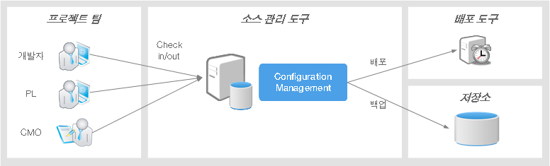

# 형상관리(Configuration Management)

## 개요

형상관리 도구는 시스템 형상 요소(개발 소스, 산출물 문서 등)의 기능적 특성이나 물리적 특성을 문서화하고 그들 특성의 변경을 관리하며, 변경의 과정이나 실현 상황을 기록·보고하여 지정된 요건이 충족되었다는 사실을 검증하는 것이나 또는 그 과정을 위한 기능을 제공한다.

## 주요 기술 및 개념 설명

**형상이란?**

* 구조도, 프로그램 코드, 코드를 담은 디스크, 설계 사양서, 지침서 등 소프트웨어 개발에 필요한 모든 것들을 의미한다.

**형상관리 프로세스란?**

1. 식별 : 소프트웨어가 변경될 만한 부분을 미리 정의한다.
2. 버전관리 : 변경전과 변경 후를 정확히 기록한다.
3. 변경관리 : 변경으로 인한 성능 및 품질을 평가한다.
4. 형상감사 : 제대로 변경됐는지 확인한다.
5. 보고 : 변경 사항을 문서화한다.

## 소스 버전관리 도구

소스 버전관리 도구(소스관리도구)는 관리 대상이 되는 형상 요소와 형상관리 절차를 소스(소스 코드, 이미지, 바이너리 파일 등)와 버전관리로 국한시켜 이에 대한 변경을 소스 버전관리 절차에 따라 관리하고, 효율적으로 처리 하기 위한 통제 환경을 의미한다.

일반적인 소스 버전관리 도구가 지닌 특징 및 기능은 다음과 같다.

* 형상 요소(소스)에 대한 변경 사항을 관리
* 버전 관리를 수행하고, 배포도구를 통해 변경사항을 배포
* 일정 주기에 백업 도구를 통해 백업을 수행

현재 대중적으로 많이 사용되는 오픈소스 기반의 소스 버전관리 도구로는 SVN, Git 등이 있다.
과거에는 손쉬운 설치와 단순한 관리정책 등으로 초기에는 CVS가 대중화되어 많이 사용되었지만, 이후 여러 문제점이 노출되었다.
현재는 Subversion과 Git이 대중적으로 사용되고 있다.

다음은 이들 오픈소스 기반의 소스 버전관리 도구를 비교한 표이다.

| 이름       | 설명                                                                                                                                                                                                                                                                                | 라이선스 정책                                     |
| ---------- | ----------------------------------------------------------------------------------------------------------------------------------------------------------------------------------------------------------------------------------------------------------------------------------- | ------------------------------------------------- |
| CVS        | 리비전 관리 시스템(Revision Control System)이라 불린 초기 버전 관리 시스템이 그 기원이며, 1989년 현재의 명칭인 CVS로 변경되었다.   버전관리의 대상으로써 각각의 파일을 관리하지만, 프로젝트 전체는 관리할 수 없는 등 초창기 버전관리 도구로써의 여러 제약 사항을 지니고 있다. | GNU Public License(GPL) → Non-GNU License로 변경 |
| Subversion | 서브버전 (Subversion, SVN)은 중앙 집중형 버전 관리 시스템(Centralized Version Control System)으로서, 중앙 저장소를 기반으로 한다.   하나의 중앙 저장소를 통해 모든 사용자가 데이터를 공유하며, 중앙 저장소에 직접 커밋한다.                                                   | Subversion License                                |
| Git        | Git은 분산 버전 관리 시스템(Distributed Version Control System)으로서, 분산형 구조를 기반으로 한다.    중앙 저장소 없이도 로컬 저장소에서 브랜치 생성과 병합이 자유로우며, 로컬 저장소에서 작업한 후 중앙 저장소와 동기화할 수 있다.                                           | GNU General Public License v2 (GPL-2.0)           |

이들 소스 버전관리 도구 중에서, 가장 많이 사용되는 Subversion(SVN)과 Git의 비교사항은 다음과 같다.

* 사용법 : SVN과 Git의 사용법은 많이 유사하여, 어느 하나의 소스 버전관리 도구의 사용자는 다른 도구를 쉽게 사용할 수 있다.
* Commit 단위 : SVN은 변경이 발생하는 체인지셋(Change Set)별로 리비전이 관리되어 commit되고, Git은 commit 자체가 SVN의 리비전의 역할을 한다.
* Atomic Commit : 여러 파일 커밋시, 어느 하나의 파일에서 커밋이 실패할 경우, SVN과 Git 모두 이전 상태로 롤백된다.
* 트리별, 파일별 접근 제어 리스트 지원 : SVN은 파일 및 디렉토리 단위의 접근 제어가 가능하다. Git은 기본적으로 전체 저장소에 대한 권한 관리만 제공하지만, 브랜치를 통해 간접적으로 접근 제어를 할 수 있다.
* 파일에 대한 이름변경/이동, 디렉터리 버전 관리 : SVN은 지원하나, Git은 지원하지 않는다.

Subversion은 위와 같은 특장점으로 인하여 기업 내부 보안 환경에서 유리하다. 따라서 전자정부 표준프레임워크의 개발환경에는 Subversion이 포함되어 제공된다.

### 소스관리도구 클라이언트(Subversion Client)

직접적인 시스템 콘솔 접근을 통해 Subversion을 사용할 수도 있지만, 운영자가 아닌 일반 사용자 입장에서 PC를 통한 Subversion 접근활용이 더 일반적인 활용 형태이다.
이러한 Subversion 클라이언트 환경을 위해 다양한 형태의 윈도우기반, Eclipse IDE 기반의 클라이언트가 개발되어 사용되고 있다.

전자정부 표준프레임워크 구축 사업에서는 개발자를 위한 Eclipse IDE 기반의 Subverion 클라이언트를 비교, 평가하는 작업을 수행하였으며, 이를 통해 Subversive Eclipse 플러그인을 Subversion의 클라이언트로 선정하여 전자정부 표준프레임워크 개발환경에 포함시켜 제공한다.

최종 선정된 Subversive Eclipse 플러그인의 특징을 그 비교 대상이 되었던 Subclipse Eclipse 플러그인과 비교하면 다음과 같다.

* Subversive

  * Polarion 커뮤니티 그룹에서 개발
  * Eclipse Ganymede 버전부터 SVN 클라이언트로 공식 채택
  * 빠른 update, 안정적인 동작
  * 공식 웹페이지: [http://www.eclipse.org/subversive/](http://www.eclipse.org/subversive/ "http://www.eclipse.org/subversive/")
* Subclipse

  * Tigris 커뮤니티 그룹(Subversion 개발 커뮤니티)에서 개발
  * Subversion 초창기 폭넓은 사용자 확보
  * Subversive 대비 느린 update, 다수의 버그로 불안정

## 참고자료

* Concurrent Versions System의 정의 (Wikipedia): [http://en.wikipedia.org/wiki/Concurrent_Versions_System](http://en.wikipedia.org/wiki/Concurrent_Versions_System "http://en.wikipedia.org/wiki/Concurrent_Versions_System")
* Subversion 오픈소스 프로젝트 사이트: [http://subversion.tigris.org/](http://subversion.tigris.org/ "http://subversion.tigris.org/")
* Git 사이트 : [https://git-scm.com/about/distributed](https://git-scm.com/about/distributed "https://git-scm.com/about/distributed")
