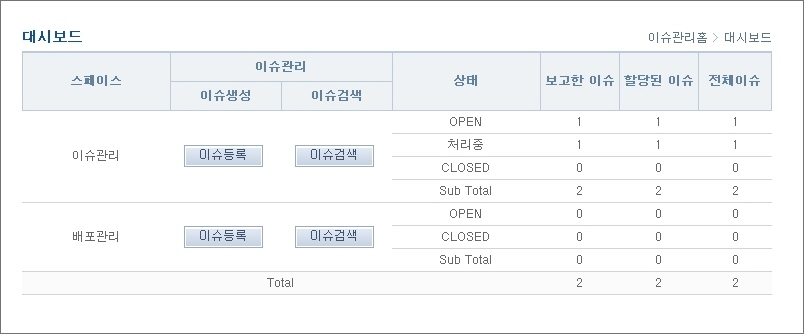

# 대시보드

## 개요

본인이 속해있는 스페이스별로 등록된 이슈상태를 조회하는 기능이다.

## 설명

### 대시보드

1. 스페이스별 이슈상태를 조회한다.
2. 보고한 이슈, 할당된 이슈, 전체 이슈를 조회한다.

* 스페이스 : 본인이 속해있는 스페이스
* 이슈생성 : 이슈등록 화면으로 이동
* 이슈검색 : 이슈검색 화면으로 이동
* 상태 : 스페이스별로 상태가 다르며, 각 상태별 이슈 건수를 조회
* 보고한 이슈 : 본인이 등록한 이슈 건수
* 할당된 이슈 : 본인이 담당자로 할당된 이슈 건수. 즉, 본인이 처리해야할 이슈 건수를 의미
* 전체 이슈 : 전체 이슈 건수

3. '이슈등록' 버튼을 클릭하여 이슈등록 화면으로 이동한다.
4. '이슈검색' 버튼을 클릭하여 이슈검색 화면으로 이동한다.
