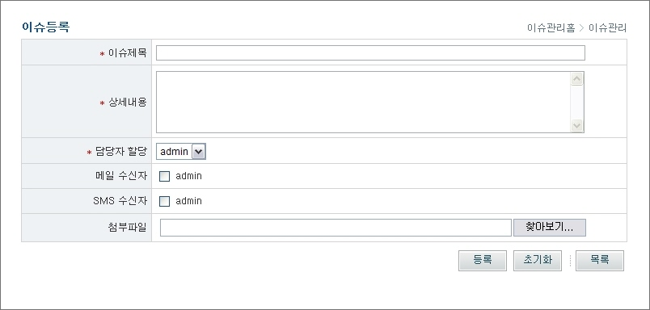
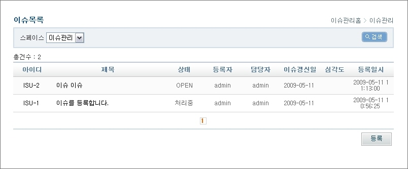
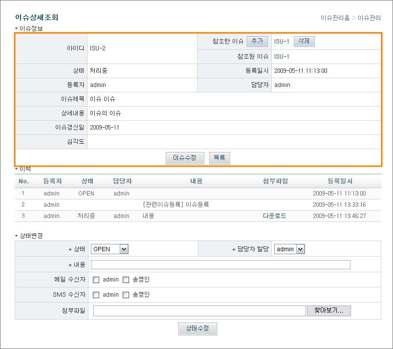
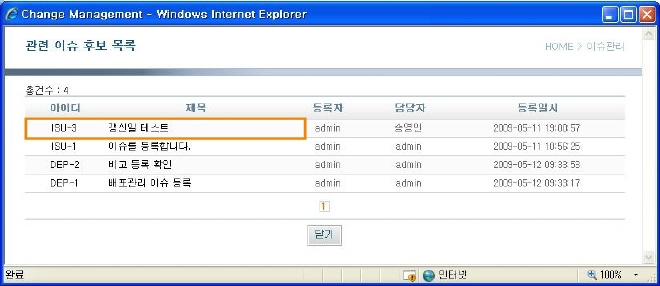
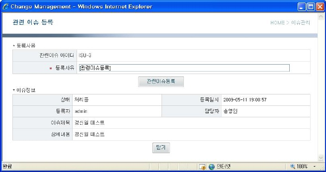
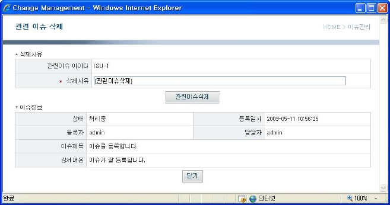
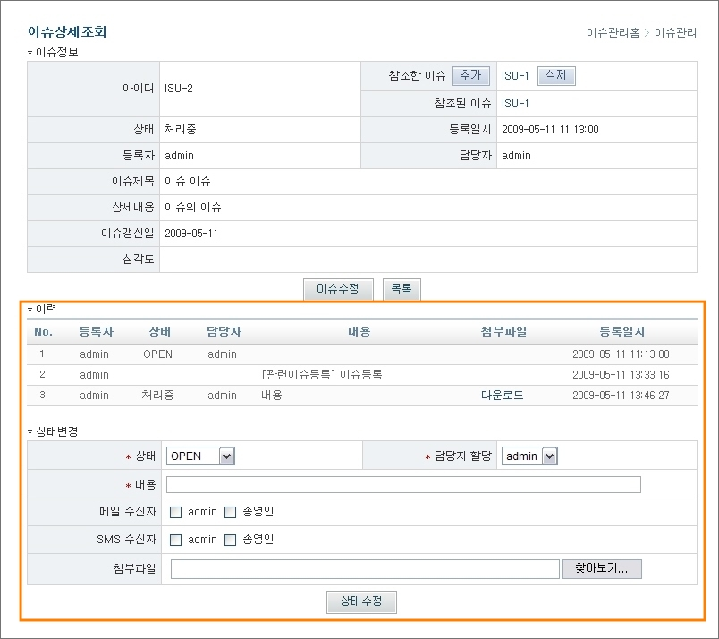
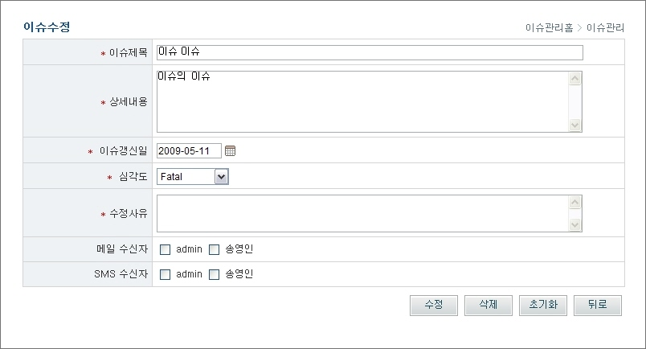

# 이슈관리

## 개요

이슈관리는 사용자가 이슈를 등록하고, 담당자가 해당 이슈 처리결과를 업데이트 하여 이슈를 관리하는 기능이다.

## 설명

### 이슈 등록

1. 이슈제목, 상세내용, 담당자 할당 등을 입력한 후 '등록' 버튼을 클릭하면 이슈 등록 후 목록 화면으로 이동한다.

* 이슈제목 : 이슈 제목 입력
* 상세내용 : 상세내용 입력
* 담당자 할당 : 이슈를 처리해야 할 담당자를 선택 (담당자 선택박스에는 해당 스페이스에 할당된 사용자만 조회됨)
* 메일 수신자 : 메일 수신자를 선택할 경우 선택된 사용자에게 메일이 발송
* SMS 수신자 : SMS 수신자를 선택할 경우 선택된 사용자에게 메일이 발송
* 첨부파일 : 첨부파일 등록

✔ 이슈제목, 상세내용, 담당자 할당, 메일 수신자 선택, SMS 수신자 선택, 첨부파일은 default 항목이고, 나머지 항목은 [스페이스관리 > 필드관리] 메뉴에서 관리자가 추가한 항목으로 구성된다.

2. '초기화' 버튼을 클릭하여 작성한 내용을 초기화한다.
3. '목록' 버튼을 클릭하여 이슈 목록 화면으로 이동한다.

### 이슈 목록

1. 스페이스를 선택한 후 '검색' 버튼을 클릭하여 이슈 목록을 조회한다.

* 아이디 : 이슈 고유 아이디 (자동으로 생성됨)
* 제목 : 이슈 제목
* 상태 : 이슈의 현재 처리 상태
* 등록자 : 이슈 등록자
* 담당자 : 이슈를 처리해야 할 담당자
* 등록일시 : 이슈 등록일시

✔ 아이디, 제목, 상태, 등록자, 담당자, 등록일시를 제외한 나머지 항목은 [스페이스관리 > 필드관리] 메뉴에서 관리자가 추가한 항목으로 구성된다.

2. 아이디 또는 이슈제목을 클릭하여 이슈 상세조회 화면으로 이동한다.
3. '등록' 버튼을 클릭하여 이슈 등록 화면으로 이동한다.

### 이슈 상세조회

1. 이슈 기본정보를 조회한다.

* 아이디 : 이슈 고유 아이디 (자동으로 생성됨)
* 참조한 이슈 : 현재 이슈에서 참조한 이슈를 등록
* 참조된 이슈 : 현재 이슈를 참조하고 있는 이슈를 조회
* 상태 : 이슈의 현재 처리 상태
* 등록일시 : 이슈 등록일시
* 등록자 : 이슈 등록자
* 담당자 : 이슈를 처리해야 할 담당자
* 이슈제목 : 이슈 제목 입력
* 상세내용 : 이슈 상세내용

2. 관리자일 경우에는 '이슈수정' 버튼을 클릭하여 이슈 수정 화면에서 이슈를 수정할 수 있다.
3. '목록' 버튼을 클릭하여 이슈 목록 화면으로 이동한다.

### 관련이슈 참조

1. 이슈상세조회 화면에서 참조한이슈의 '추가' 버튼을 클릭하여 참조할 수 있는 이슈 목록을 조회하는 관련이슈후보목록 팝업 화면을 조회한다.

* 아이디 : 이슈 고유 아이디 (자동으로 생성됨)
* 제목 : 이슈 제목
* 등록자 : 이슈 등록자
* 담당자 : 이슈를 처리해야 할 담당자
* 등록일시 : 이슈 등록일시

2. '닫기' 버튼을 클릭하여 관련 이슈를 등록하지 않고 팝업창을 닫는다.

3. 관련이슈후보목록 화면에서 아이디 또는 제목을 클릭하여 관련이슈를 등록할 수 있는 화면을 조회한다.

* 관련이슈 아이디 : 선택된 이슈의 고유 아이디 (자동으로 생성됨)
* 등록사유 : 관련이슈 등록 사유
* 상태 : 선택된 이슈의 현재 처리 상태
* 등록일시 : 이슈 등록일시
* 등록자 : 이슈 등록자
* 담당자 : 이슈를 처리해야 할 담당자
* 이슈제목 : 이슈 제목 입력
* 상세내용 : 이슈 상세내용

4. 관련이슈 등록 화면에서 등록사유를 입력 후 '관련이슈등록' 버튼을 클릭하여 관련이슈를 등록한다.
5. '닫기' 버튼을 클릭하여 관련 이슈를 등록하지 않고 팝업창을 닫는다.

6. 이슈상세조회 화면에서 참조한이슈의 '삭제' 버튼을 클릭하여 참조한 이슈를 삭제하는 팝업 화면을 조회한다.

* 관련이슈 아이디 : 선택된 이슈의 고유 아이디 (자동으로 생성됨)
* 삭제사유 : 관련이슈 등록 사유
* 상태 : 선택된 이슈의 현재 처리 상태
* 등록일시 : 이슈 등록일시
* 등록자 : 이슈 등록자
* 담당자 : 이슈를 처리해야 할 담당자
* 이슈제목 : 이슈 제목 입력
* 상세내용 : 이슈 상세내용

7. 관련이슈 삭제 화면에서 삭제사유를 입력 후 '관련이슈삭제' 버튼을 클릭하여 관련이슈를 삭제한다.
8. '닫기' 버튼을 클릭하여 관련 이슈를 삭제하지 않고 팝업창을 닫는다.

### 이슈 상태변경

1. 이슈 내 변경 이력을 조회한다.

* 등록자 : 이슈 등록자
* 상태 : 이슈의 현재 처리 상태
* 담당자 : 이슈를 처리해야 할 담당자
* 내용 : 이력 변경 내용
* 첨부파일 : 첨부파일 등록
* 등록일시 : 이슈 등록일시

2. 이슈정보 및 이슈 이력 조회화면에서 상태, 담당자 할당, 내용을 입력한 후 '상태수정' 버튼을 클릭하여 이슈 상태를 변경한다.

* 상태 : 이슈 처리상태를 의미하는 것으로, 현재상태를 제외한 모든 상태로 변경 가능
* 담당자 할당 : 이슈를 처리해야 할 담당자를 선택 (담당자 선택박스에는 해당 스페이스에 할당된 사용자만 조회됨)
* 내용 : 이력 변경 내용
* 메일 수신자 : 메일 수신자를 선택할 경우 선택된 사용자에게 메일이 발송
* SMS 수신자 : SMS 수신자를 선택할 경우 선택된 사용자에게 메일이 발송
* 첨부파일 : 첨부파일 등록

### 이슈 수정

1. 이슈제목, 상세내용, 수정사유 등을 입력한 후 '수정 버튼을 클릭하여 이슈를 수정하고, 이슈 상세조회 화면으로 이동한다.

* 이슈제목 : 이슈 제목 입력
* 상세내용 : 상세내용 입력
* 수정사유 : 이슈 수정사유 입력
* 메일 수신자 : 메일 수신자를 선택할 경우 선택된 사용자에게 메일이 발송
* SMS 수신자 : SMS 수신자를 선택할 경우 선택된 사용자에게 메일이 발송
* 첨부파일 : 첨부파일 등록

✔ 이슈 수정은 관리자만 가능하고, 이슈 처리 후 이슈 상태를 수정하는 것은 이슈에 할당된 사용자 모두 가능하다.
✔ 이슈제목, 상세내용, 수정사유, 메일 수신자, SMS 수신자, 첨부파일을 제외한 나머지 항목은 [스페이스관리 > 필드관리] 메뉴에서 관리자가 추가한 항목으로 구성된다.

2. '삭제' 버튼을 클릭하여 이슈를 삭제한 후 이슈 목록 화면으로 이동한다.
   ✔ 이슈 삭제는 데이터를 삭제하지 않고 삭제 상태로 변경하여 [이슈관리] 메뉴에서는 조회가 불가능하나 [이슈검색] 메뉴에서 '삭제된 이슈조회' 항목을 체크하면 삭제된 이슈 조회가 가능하다.
3. '초기화' 버튼을 클릭하여 작성한 내용을 초기화한다.
4. '뒤로' 버튼을 클릭하여 이전 페이지로 이동한다.
