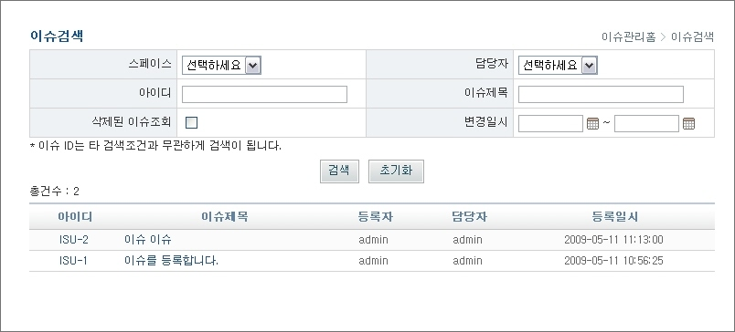

# 이슈검색

## 개요

등록된 이슈 및 삭제된 이슈를 검색하는 기능이다.

## 설명

### 이슈 검색

1. 검색조건을 입력한 후 '검색' 버튼을 클릭하여 검색조건에 해당하는 이슈 목록을 조회한다.

* 스페이스 : 본인이 할당되지 않은 스페이스를 포함하여 Change Management에 등록되어 있는 모든 스페이스에 등록된 이슈를 검색
* 담당자 : Change Management에 등록되어 있는 모든 사용자에서 담당자를 검색
* 아이디 : 다른 검색조건과 무관하게 일치되는 아이디를 검색
* 이슈제목 : 이슈제목 like 검색
* 삭제된 이슈조회 : 삭제된 이슈를 포함하여 검색
* 변경일시 : 변경일시가 검색기간에 포함된 날짜에 해당하는 것을 검색

2. '초기화' 버튼을 클릭하여 작성한 검색조건을 초기화한다.
3. 아이디 및 이슈제목을 클릭하여 이슈 상세조회 팝업창을 연다.
