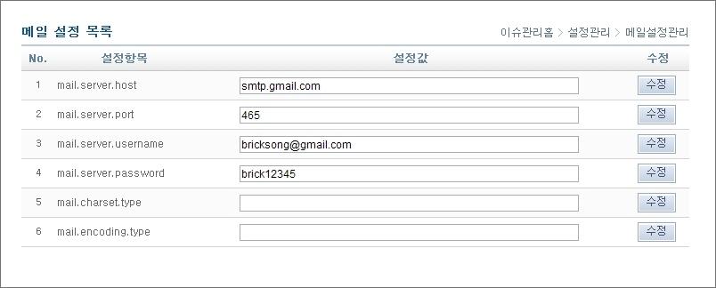
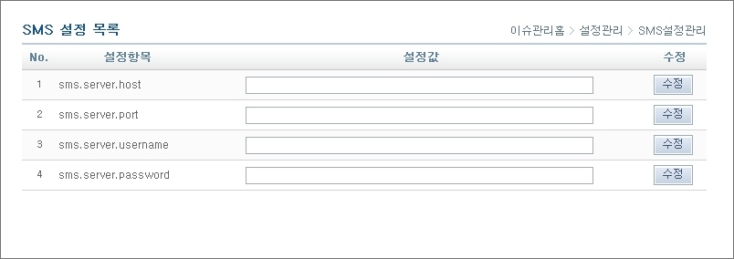
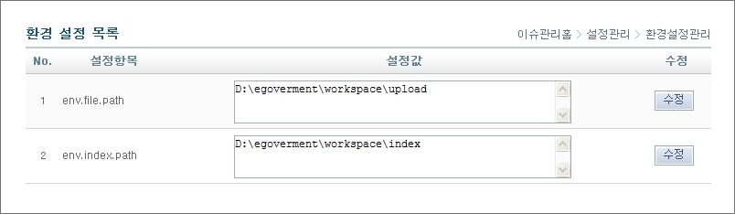

# 설정관리

## 개요

Change Management에 필요한 메일환경설정, 파일업로드 경로, 인덱스 생성경로 등 환경을 설정 한다.

## 설명

### 메일 설정

1. 메일 설정 목록을 조회한다.

* mail.server.host : 메일 서버의 호스트 서버 정보
* mail.server.port : 메일 서버 이용 포트
* mail.server.username : 메일 서버 아이디
* mail.server.password : 메일 서버 비밀번호
* mail.charset.type : 메일 캐릭터 타입
* mail.encoding.type : 메일 인코딩 타입

2. 설정값을 입력 후 '수정' 버튼을 클릭하여 수정한다.

✔ 수정은 같은 라인의 변경정보만 수정한다.

### SMS 설정

1. SMS 설정 목록을 조회한다.

* sms.server.host : SMS 서버의 호스트 서버 정보
* sms.server.port : SMS 서버 이용 포트
* sms.server.username : SMS 서버 아이디
* sms.server.password : SMS 서버 비밀번호

2. 설정값을 입력 후 '수정' 버튼을 클릭하여 수정한다.

✔ 수정은 같은 라인의 변경정보만 수정한다.

### 환경 설정

1. 환경 설정 목록을 조회한다.
2. 설정값을 입력 후 '수정' 버튼을 클릭하여 수정한다.

* env.file.path : File의 Upload Directory경로 (필수설정)
* env.index.path : 검색엔진의 Index Directory경로 (필수설정)
