# 스페이스관리

## 개요

스페이스 관리는 이슈가 등록될 수 있도록 스페이스 및 롤, 상태, 필드 등 이슈가 관리될 수 있는 범위를 관리하는 기능으로 관리자만 접근할 수 있다.
스페이스 관리는 프로젝트 구분을 의미하는 스페이스, 사용자 권한을 의미하는 롤, 이슈 처리상태를 의미하는 상태, 이슈관리항목을 의미하는 필드로 구성된다.

## 설명

### 스페이스 관리

#### 스페이스 등록

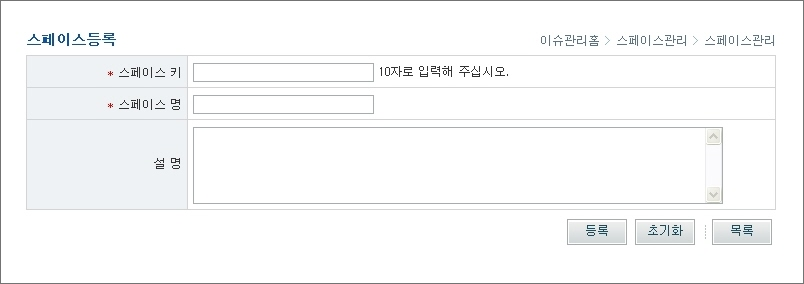

1. 스페이스키, 스페이스명, 설명을 입력한 후 '등록' 버튼을 클릭하여 스페이스를 등록한 후 스페이스 목록 화면으로 이동한다.

* 스페이스키 : 스페이스 고유키
* 스페이스명 : 스페이스 이름
* 설명 : 스페이스 설명

2. 스페이스가 등록된 후 스페이스목록 화면으로 이동한다.
3. '초기화' 버튼을 클릭하여 작성한 내용을 초기화한다.
4. '목록' 버튼을 클릭하여 스페이스목록 화면으로 이동한다.

#### 스페이스 목록

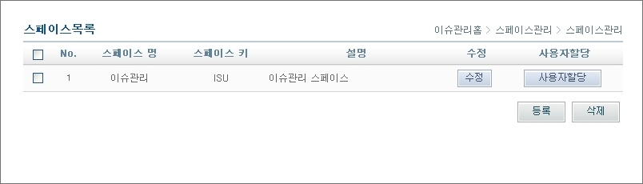

1. 스페이스 목록을 조회한다.

* 스페이스키 : 스페이스 고유키
* 스페이스명 : 스페이스 이름
* 설명 : 스페이스 설명
* 수정 : 스페이스 수정화면으로 이동
* 사용자할당 : 스페이스에 사용자 할당하는 화면으로 이동

✔ 본인이 할당된 스페이스와 무관하게 관리자가 전체 스페이스 목록을 조회한다.

2. '수정' 버튼을 클릭하여 스페이스수정 화면으로 이동한다.
3. '사용자할당' 버튼을 클릭하여 스페이스 사용자등록 화면으로 이동한다.
4. '등록' 버튼을 클릭하여 스페이스등록 화면으로 이동한다.
5. 삭제할 스페이스의 좌측 체크박스를 선택한 후 '삭제' 버튼을 클릭하여 삭제한다.

✔ 스페이스 삭제 시 관련 이슈 및 이슈 이력이 모두 삭제된다.

#### 사용자 할당

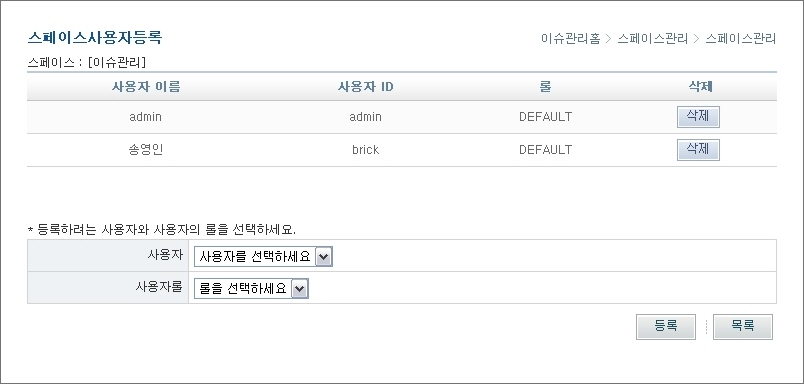

1. 사용자 및 사용자롤을 선택한 후 '등록' 버튼을 클릭하여 사용자 및 사용자롤을 등록한다.

* 사용자 이름 : 사용자 이름
* 사용자 ID : 사용자 ID
* 롤 : 사용자 롤
* 사용자 : Change Management 사용자 관리에 등록되어 있는 전체 사용자 중 선택
* 사용자롤 : 해당 스페이스에 등록되어 있는 롤 중 선택

✔스페이스에 사용자가 할당되면 할당된 사용자만 해당 스페이스를 조회하고, 이슈를 등록, 조회, 상태변경 할 수 있다.

2. '삭제' 버튼을 클릭하여 등록된 사용자의 롤을 삭제한다.
3. '목록' 버튼을 클릭하여 스페이스목록 화면으로 이동한다.

#### 스페이스 수정

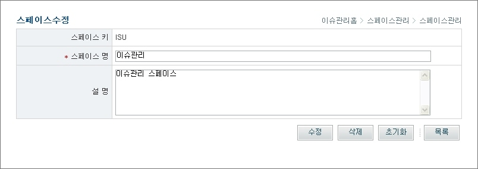

1. 설명을 수정한 후 '수정' 버튼을 클릭하여 스페이스를 수정한다.

* 스페이스키 : 스페이스 고유키
* 스페이스명 : 스페이스 이름
* 설명 : 스페이스 설명

2. '삭제' 버튼을 클릭하여 스페이스를 삭제한 후 스페이스목록 화면으로 이동한다.

✔ 스페이스 삭제 시 관련 이슈 및 이슈 이력이 모두 삭제된다.

3. '초기화' 버튼을 클릭하여 작성한 내용을 초기화한다. 4. '목록' 버튼을 클릭하여 스페이스목록 화면으로 이동한다.

### 필드관리

#### 개요

필드관리는 이슈를 관리할 때 필요한 항목을 추가하여 사용할 수 있도록 스페이스별로 사용자가 정의하는 것이다.
예를 들어, 이슈 관리하는 기본 항목이 제목, 내용, 담당자, 등록자, 등록일시일 때 중요도, 우선순위 등을 추가로 관리하고 싶다면
필드관리에서 중요도와 우선순위를 추가하여 이슈를 등록할 때 중요도와 우선순위도 등록하도록 할 수 있다.
필드타입에는 선택박스, 일반 텍스트, 숫자, 날짜 형태가 있다.

#### 필드 등록

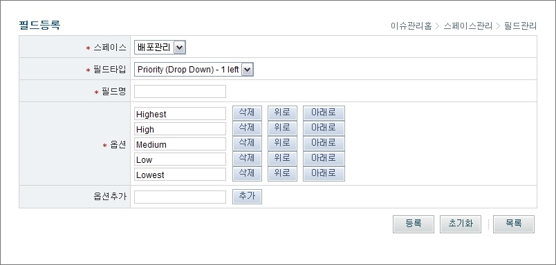

1. 스페이스, 필드타입을 선택하고 필드명 등을 입력한 후 '등록' 버튼을 클릭하여 필드를 등록하고, 필드목록 화면으로 이동한다.

* 스페이스 : 스페이스 전체 목록 중 선택
* 필드타입 : Priority(Drop Down), Severity(Drop Down), 선택박스(Drop Down List), 숫자(Decimal Number), 텍스트(Free Text Field), 날짜(Date Field)
* 필드명 : 이슈관리 항목으로 사용할 필드 이름
* 옵션 : Priority, Severity, 선택박스의 경우에는 옵션을 추가해야 하며 옵션내부의 순서 조정이 가능
  * '삭제' 버튼 클릭 시 해당 라인의 옵션 삭제
  * '위로' 버튼 클릭 시 옵션 내에서 한칸 위로 이동
  * '아래로' 버튼 클릭 시 옵션 내에사 한칸 아래로 이동
* 옵션추가 : 옵션을 추가하기 위해 옵션명을 입력
  * 옵션명을 입력하고 '추가' 버튼을 클릭하여 옵션 추가

✔ '삭제', '위로', '아래로', '추가' 버튼을 클릭하여 발생하는 이벤트는 '등록' 버튼 누르기 전까지 저장되지 않고, 화면에서만 보여진다.

2. '초기화' 버튼을 클릭하여 작성한 내용을 초기화한다.
3. '목록' 버튼을 클릭하여 필드목록 화면으로 이동한다.

#### 필드 목록

1. 스페이스를 선택한 후, '검색' 버튼을 클릭하여 스페이스별 필드목록을 조회한다.

* 스페이스 : 스페이스 전체 목록 중 선택
* 필드명 : 이슈관리 항목으로 사용되는 필드 이름
* 타입 : Priority(priority), Severity(Severity), 선택박스(custInt01\~custInt10), 숫자(custDbl01\~custDbl03), 텍스트(cusStr01\~cusStr05), 날짜(cusTim01\~cusTim03)
* 옵션리스트 : Priority, Severity, Drop Down List의 경우에 나타나는 옵션 목록

2. '수정' 버튼을 클릭하여 필드수정 화면으로 이동한다.
3. '삭제' 버튼을 클릭하여 필드를 삭제한다.

✔ 해당 스페이스에 이슈가 등록되어 있을 경우 필드 삭제가 불가능하다.

4. '위로' 버튼을 클릭하여 필드의 순서를 한칸 위로 수정한다.
5. '아래로' 버튼을 클릭하여 필드의 순서를 한칸 아래로 수정한다.

✔ 필드목록에서 위, 아래로 순서를 조정하여 필드가 보여지는 순서대로 이슈관리 화면에 조회된다.

6. '등록' 버튼을 클릭하여 필드등록 화면으로 이동한다.

#### 필드 수정

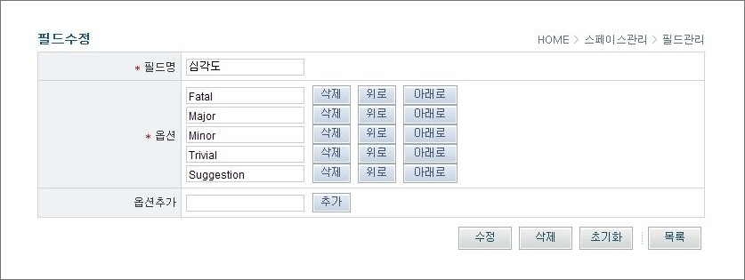

1. 필드타입은 변경할 수 없고, 필드명 등을 수정한 후 '수정' 버튼을 클릭하여 필드를 수정한다.

* 필드명 : 이슈관리 항목으로 사용할 필드 이름
* 옵션 : Priority, Severity, Drop Down List의 경우에는 옵션을 추가해야 하며 옵션내부의 순서 조정이 가능
* 옵션추가 : 옵션을 추가할 때 옵션명 입력 후 '추가' 버튼 클릭

2. '삭제' 버튼을 클릭하여 필드를 삭제한 후 필드목록 화면으로 이동한다.

✔ 필드를 삭제하려는 스페이스에 이슈가 등록 되어 있으면 필드 삭제가 불가능하다.

3. '초기화' 버튼을 클릭하여 작성한 내용을 초기화한다.
4. '목록' 버튼을 클릭하여 필드목록 화면으로 이동한다.

### 롤관리

#### 개요

Role는 스페이스에 할당된 사용자의 담당역할을 의미한다. 스페이스에 할당된 사용자에게 Role을 부여하면 사용자는 등록된 Role을 기반으로 스페이스의 이슈를 관리할 수 있다.
Change Management에서는 Role을 등록하여 관리할 수 있는 기능을 제공한다.

* 기본 Role : DEFAULT(스페이스 생성시 기본적으로 등록된 Role)
* 예상 Role : PROJECT MANAGER, ARCHITECT, MODELLER, PMO등의 Role을 등록하여 사용자의 롤을 구분할 수 있다.

#### 롤 등록

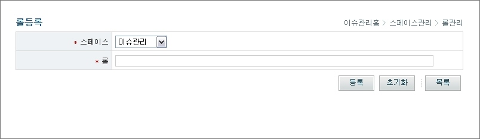

1. 스페이스를 선택하고 롤을 입력한 후 '등록'버튼을 클릭하여 롤을 등록하고, 롤 목록 화면으로 이동한다.

* 스페이스 : 스페이스 선택
* 롤 : 롤 이름

2. '초기화' 버튼을 클릭하여 작성한 내용을 초기화한다.
3. '목록' 버튼을 클릭하여 롤목록 화면으로 이동한다.

#### 롤 목록

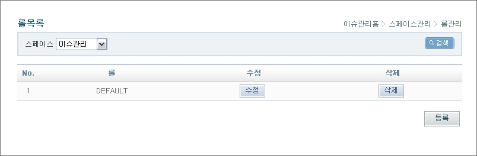

1. 스페이스를 선택한 후 '검색' 버튼을 클릭하여 스페이스별 롤 목록을 조회한다.

* 스페이스 : 선택된 스페이스
* 롤 : 롤 이름

2. '수정' 버튼을 클릭하여 롤수정 화면으로 이동한다.
3. '삭제' 버튼을 클릭하여 롤을 삭제한다.
4. '등록' 버튼을 클릭하여 롤등록 화면으로 이동한다.

✔ 롤은 반드시 한개 이상 등록되어 있어야 한다.

#### 롤 수정

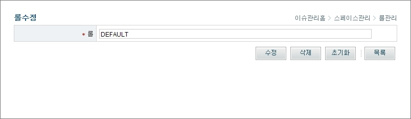

1. 롤을 입력한 후 '수정' 버튼을 클릭하여 롤을 수정한다.

* 롤 : 롤 이름

2. '삭제' 버튼을 클릭하여 롤을 삭제한 후 롤목록 화면으로 이동한다.
3. '초기화' 버튼을 클릭하여 작성한 내용을 초기화한다.
4. '목록' 버튼을 클릭하여 롤목록 화면으로 이동한다.

### 상태관리

#### 개요

상태는 이슈의 현재상태를 의미한다.
이슈의 등록, 할당, 해결, 삭제등의 상태(Status)를 임의로 추가하여 관리할 수 있다.
상태의 관리를 통해 이슈를 좀 더 체계적으로 관리할 수 있게 된다.

* 기본 Status : NEW, OPEN, CLOSED
* 예상 Status : ASSIGNED, SOLVED, REJECTED등의 Status를 등록하여 이슈를 좀 더 체계적으로 관리할 수 있다.

#### 상태 등록

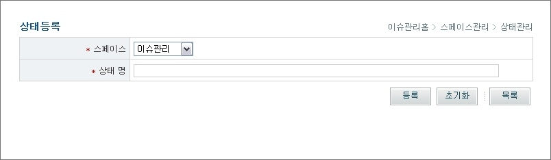

1. 스페이스를 선택하고 상태명를 입력한 후 '등록'버튼을 클릭하여 상태를 등록하고, 상태목록 화면으로 이동한다.

* 스페이스 : 스페이스를 선택
* 상태 : 상태 이름

2. '초기화' 버튼을 클릭하여 작성한 내용을 초기화한다.
3. '목록' 버튼을 클릭하여 상태목록 화면으로 이동한다.

#### 상태 목록

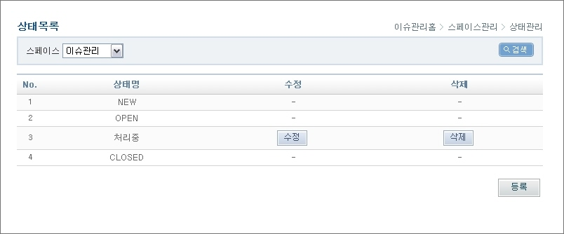

1. 스페이스를 선택한 후 '검색' 버튼을 클릭하여 스페이스별 상태목록을 조회한다.

* 스페이스 : 선택된 스페이스
* 상태 : 상태 이름

2. '수정' 버튼을 클릭하여 상태수정 화면으로 이동한다.
3. '삭제' 버튼을 클릭하여 상태를 삭제한다.
4. '등록' 버튼을 클릭하여 상태등록 화면으로 이동한다.

#### 상태 수정

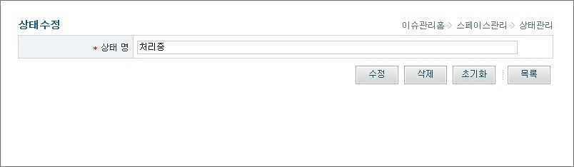

1. 상태을 입력한 후 '수정' 버튼을 클릭하여 상태를 수정한다.

* 상태 : 상태 이름

2. '삭제' 버튼을 클릭하여 상태를 삭제한 후 상태목록 화면으로 이동한다.
3. '초기화' 버튼을 클릭하여 작성한 내용을 초기화한다.
4. '목록' 버튼을 클릭하여 상태목록 화면으로 이동한다.
