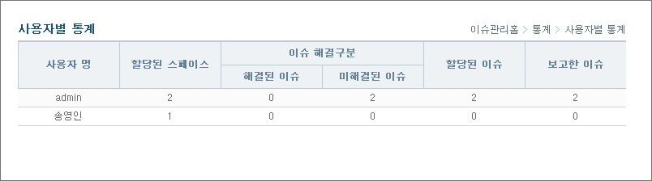

# 통계

## 개요

스페이스별 통계, 사용자별 통계를 조회한다.

## 설명

### 스페이스별 통계

1. 스페이스별로 할당된 사용자, 할당된 이슈, 해결된 이슈 등을 조회한다.

* 스페이스 명 : 전체 스페이스
* 할당된 사용자 : 각 스페이스에 할당된 사용자 명수
* 할당된 이슈 : 스페이스에서 사용자에게 할당된 이슈 건수
* 미할당된 이슈 : 스페이스에서 사용자에게 할당되지 않은 이슈 건수
* 해결된 이슈 : 상태가 'CLOSE' 된 이슈 건수
* 미해결된 이슈 : 상태가 'CLOSE' 아닌 이슈 건수
* 전체이슈 : 총 이슈 건수

2. 할당된 사용자, 할당된 이슈, 미할당된 이슈, 해결된 이슈, 미해결된 이슈, 전체이슈별로 그래프가 조회된다.

### 사용자별 통계

1. 사용자별로 할당된 스페이스, 할당된 이슈, 해결된 이슈 등을 조회한다.

* 사용자 명 : 전체 사용자
* 할당된 스페이스 : 각 사용자별 스페이스에 할당된 건수
* 해결된 이슈 : 상태가 'CLOSE' 된 이슈 건수
* 미해결된 이슈 : 상태가 'CLOSE' 아닌 이슈 건수
* 할당된 이슈 : 사용자에게 할당된 이슈 건수
* 전체이슈 : 총 이슈 건수

2. 할당된 스페이스, 할당된 이슈, 미할당된 이슈, 해결된 이슈, 미해결된 이슈, 보고한 이슈별로 그래프가 조회된다.
