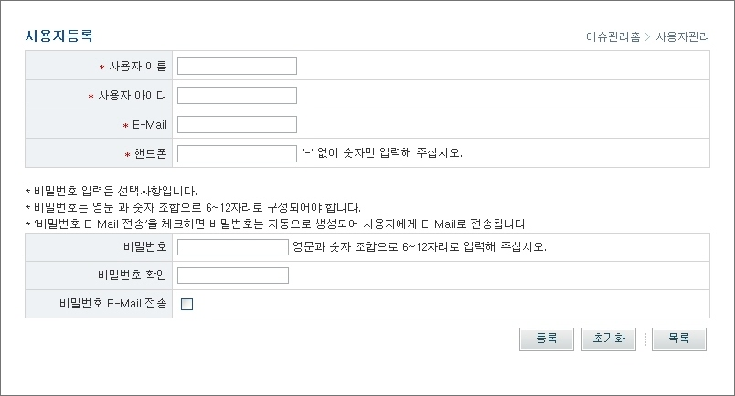
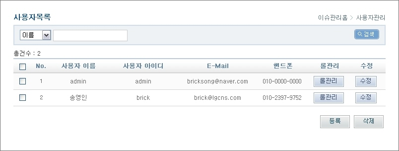
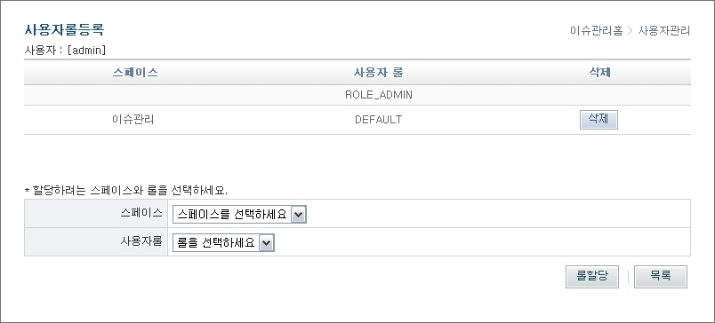
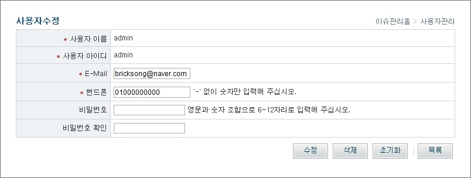

# 사용자관리

## 개요

사용자 정보를 등록, 수정, 삭제 관리하는 기능이다.

## 설명

### 사용자 등록

1. 사용자이름, 아이디, E-Mail, 핸드폰 번호등 사용자정보를 입력한 후 '등록' 버튼을 클릭하여 사용자 정보를 등록한다.

* 사용자 이름 : 사용자 이름
* 사용자 아이디 : 사용자 아이디
* E-Mail : E-Mail 주소
* 핸드폰 : 핸드폰 번호
* 비밀번호 : 비밀번호 입력
* 비밀번호 확인 : 비밀번호 확인 입력
* 비밀번호 E-Mail 전송 : 비밀번호를 입력하지 않고 '비밀번호 E-Mail 전송'을 체크하면 비밀번호가 자동으로 생성되어 사용자에게 E-Mail로 전송

2. '초기화' 버튼을 클릭하여 작성한 내용을 초기화한다.
3. '목록' 버튼을 클릭하여 사용자 목록 화면으로 이동한다.

### 사용자 목록

1. 이름, 아이디, E-Mail중 하나를 선택하여 검색어를 입력한 후 '검색' 버튼을 클릭하여 사용자 목록을 조회한다.

* 사용자 이름 : 사용자 이름
* 사용자 아이디 : 사용자 아이디
* E-Mail : E-Mail 주소
* 핸드폰 : 핸드폰 번호

2. '롤관리' 버튼을 클릭하여 스페이스에 해당 사용자를 등록하는 화면으로 이동한다.
3. '수정' 버튼 클릭하여 해당 사용자 정보를 수정하는 화면으로 이동한다.
4. '등록' 버튼을 클릭하여 사용자 정보 등록 화면으로 이동한다.
5. 목록의 체크박스를 선택하고, '삭제' 버튼을 클릭하여 선택된 사용자 정보를 삭제한다.

### 사용자 롤 관리

1. 사용자가 등록되어 있는 스페이스와 사용자 롤을 조회한다.

* 스페이스 : 할당된 스페이스
* 사용자롤 : 할당된 사용자 롤

2. 할당하려는 스페이스와 롤을 선택한 후 '롤할당' 버튼을 클릭하여 사용자롤을 등록한다.
3. '목록' 버튼을 클릭하여 사용자 목록 화면으로 이동한다.

### 사용자 수정

1. 사용자 이름, 사용자 아이디, E-Mail, 핸드폰 번호 등 사용자정보를 수정한다.

* 사용자 이름 : 사용자 이름
* 사용자 아이디 : 사용자 아이디
* E-Mail : E-Mail 주소
* 핸드폰 : 핸드폰 번호
* 비밀번호 : 비밀번호 입력
* 비밀번호 확인 : 비밀번호 확인 입력

2. '수정' 버튼을 클릭하여 사용자 정보를 등록한다.
3. '삭제' 버튼을 클릭하여 사용자 정보를 삭제한다.
4. '초기화' 버튼을 클릭하여 작성한 내용을 초기화한다.
5. '목록' 버튼을 클릭하여 사용자 목록 화면으로 이동한다.
