# 소스관리도구 클라이언트환경 사용

## 개요

전자정부 표준프레임워크에서는 개발환경의 소스관리도구로 오픈소스인 Subversion(SVN)을 사용하며, 다른 소스관리도구와 마찬가지로, 시스템의 콘솔을 통한 직접적인 사용 이외에 사용자의 PC에서 편리하게 사용할 수 있도록 GUI를 가진 다양한 클라언트가 존재한다.

전자정부 표준프레임워크 구축 사업을 통하여 여러 Subversion 클라이언트들을 검토하고 테스트하였으며, 이를 통해 타 SVN 클라이언트에 비하여 기능적으로 우수하고 상대적으로 안정적인 동작을 보인 Subversive Eclipse IDE 플러그인을 전자정부 표준프레임워크의 개발환경에 포함시켜 제공한다.
현재(2009년 5월) 기준으로, 전자정부 표준프레임워크 개발환경으로 제공되는 Subversive 플러그인의 설치버전은 다음과 같다.

* Polarion Subversive SVN Connectors 2.1.0

명시된 Subversive의 버전은 지속적인 전자정부 표준프레임워크 개발환경의 개선작업으로 인하여 향후 변경되어 배포될 수 있다.

## 설치

배포된 전자정부 표준프레임워크 개발환경에 포함된 Subversive의 플러그인의 버전을 확인하고 업데이트 하는 방법은 다음과 같은 순서로 진행한다.

* Subversive Eclipse 플러그인 버전 확인
  1. Eclipse IDE의 메뉴 줄에서 **Help** > **About**를 선택한다.
  2. 과 같은 모양의 아이콘에 마우스를 올려 버전을 확인한다.
* Subversive Eclipse 플러그인 업데이트
  1. Eclipse IDE의 메뉴 줄에서 **Help** >  **Software Update…** 를 선택한다.
  2. 팝업으로 뜬 창에서 **Available Software** 탭을 선택한다.
  3. 목록에서 Subversive Site를 찾고, 해당 항목의 체크박스를 선택한다.
  4. 오른쪽의 상단의 **Install…** 버튼을 클릭하여 업데이트를 진행한다.

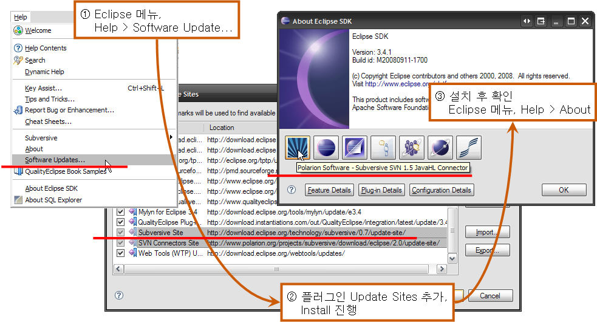

## 주요 개념

Subversive Eclipse IDE 플러그인의 사용방법은 Eclipse IDE에 기본으로 제공되는 CVS 클라이언트의 사용법과 크게 다르지 않으며, 소스변경관리 절차상에 따른 주요 사용법 및 개념들은 다음과 같다.

### 저장소(Repository)

SVN의 저장소는 다음과 같은 특징을 가지고 있다.

* 모든 프로젝트의 프로그램 소스들과 소스에 대한 변경 사항이 저장 됨
* 네트워크를 통해서 여러 사람이 접근
* SVN에서는 Berkeley DB(Default) 또는 파일시스템(Optional)을 저장소로 사용

#### 사용자의 PC에 저장소 정보 생성(연결)하기

1. 작업의 편의성을 위하여 Eclipse Perspective를 SVN 탐색용으로 전환한다.
   * Eclipse IDE의 메뉴에서, **Window** > **Open Perspective** > **Other…** > **SVN Repository Exploring** 을 차례로 선택
2. Eclipse IDE의 메뉴에서, **File** > **New** > **Repository Location**을 선택
3. 저장소 접근을 위한 URL과 인증정보를 입력하여 저장소 정보를 생성한다.
   * 첫번째 탭에서, ' **URL:** '에 프로젝트의 SVN 저장소 URL을 입력
   * Authentication 항목에 있는 **User**와 **Password**에 사용자의 SVN 저장소 접근 ID와 패스워드를 입력
   * **Finish** 버튼을 클릭하여 종료한다.

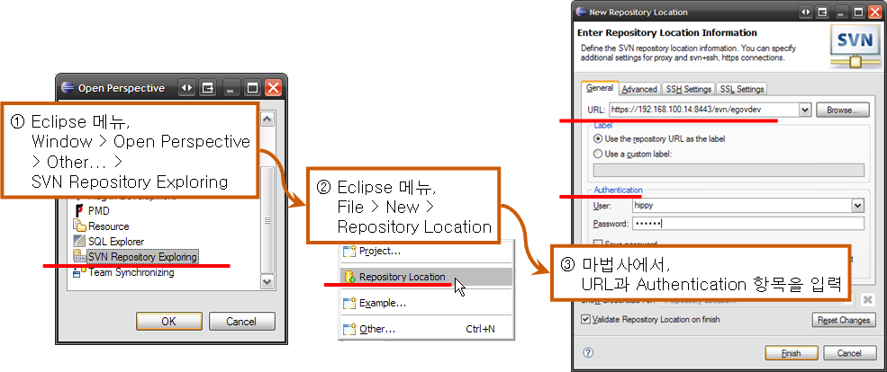

### 리비전(Revisions)

소스변경관리 절차를 통해 Subversion에 의해 생성되는 리비전은 다음과 같은 특징을 가지고 있다.

* 소스 파일 등을 수정하여 커밋하게 되면 일정한 규칙에 의해 숫자가 증가
* 저장소에 저장된 각각의 파일 버전이라 할 수 있음
* SVN의 경우 파일 별로 리비전이 매겨지지 않고 변경발생 단위로 전체 리비전이 매겨 짐
* 리비전을 보고 프로젝트 진행 상황을 알 수 있음

Subversion에서의 리비전 증가 방식은 다음의 그림의, 저장소를 통해 본 파일시스템 구조의 변경 과정의 예를 통해 이해할 수 있다.

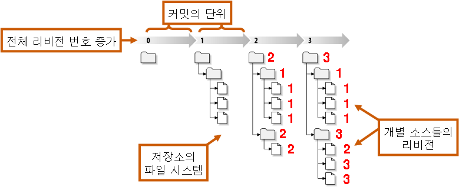

### 소스 공유

다른 사용자와 함께 최초의 프로젝트/소스를 공유하고자 하거나 신규 생성된 프로젝트/소스 공유는 다음과 같은 방법으로 할 수 있다.

#### 프로젝트 공유

새로운 프로젝트를 저장소에 추가하고자 할 때의 절차이다.

1. Eclpise IDE의 패키지 또는 네비게이션 뷰에서, 공유하고자하는(저장소에 추가하고자하는) 프로젝트를 선택한다.
2. 프로젝트를 선택한 상태에서 마우스 오른쪽 클릭하여 **Team** >  **Share Project…** 를 선택한다.
3. Share Project 마법사가 팝업으로 뜨고, 목록에서 **SVN** 항목을 선택하고 **Next** 버튼을 클릭한다.
4. 중앙의 두 개의 라디오 버튼에서, ' **Use existing repository location** '을 선택한다.
5. 마법사 하단의 목록에서, 앞서 생성(연결)시킨 저장소 URL을 선택하고 **Finish** 버튼을 클릭하여 종료한다.

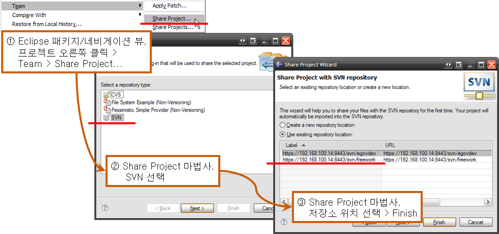

#### 소스 단위 공유

공유 중인 프로젝트 내에서 신규로 작성한 해당 소스들을 저장소에 추가하고자 할 때의 절차이다.

1. Eclpise IDE의 패키지 또는 네비게이션 뷰에서, 공유하고자하는(저장소에 추가하고자하는) 대상 소스들을 선택한다.
2. 소스를 선택한 상태에서 마우스 오른쪽 클릭하여 **Team** >  **Add to Version Control…** 를 선택한다.
3. 'Add to SVN Version Control' 팝업이 뜨고 저장소에 추가/공유하려는 항목들을 확인하고 **OK** 버튼을 클릭하여 종료한다.

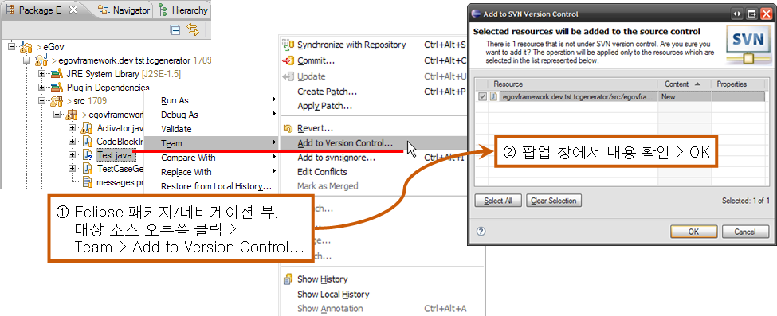

### Checkout

* 저장소에서 전체 소스의 최종 리비전을 받아오는 것
* 저장소 인증 정책에 따라 ID, Password 입력여부가 결정

일반적으로 프로젝트 개발초기에 1회성으로 실시하며, 개발 중간에 전체 소스를 다시 받아오고자 하는 특수한 경우에 수행하는 절차이다. 다음과 같은 순서로 수행한다.

1. 작업의 편의성을 위하여 Eclipse Perspective를 SVN 탐색용으로 전환한다.
   * Eclipse IDE의 메뉴에서, **Window** > **Open Perspective** > **Other…** > **SVN Repository Exploring** 을 차례로 선택
2. SVN Repositories 뷰에서, 여러 저장소 목록에서 해당 프로젝트에서 사용하는 저장소를 확장하여, trunk 아래에 있는 여러 프로젝트 중에서 원하는 프로젝트를 선택한다.
3. 프로젝트를 선택한 상태에서, 마우스 오른쪽 클릭하여 **Check Out**을 선택한다.
4. 패키지 뷰 또는 네비게이션 뷰에서, 저장소에서 사용자의 로컬로 체크아웃한 프로젝트의 소스들을 확인한다.

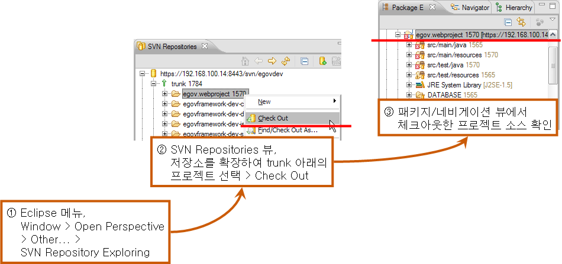

### Update

* 체크아웃을 한 이후의 타인에 의한 소스 변경사항을 확인
* 저장소에 있는 소스 중 로컬과 비교하여 변경된 항목의 최신 버전의 소스를 가져옴
* 변경된 항목의 최신 버전은 로컬 본에 통합됨

다음과 같은 방법으로 Update 절차를 수행한다.

1. Eclpise IDE의 패키지 또는 네비게이션 뷰에서, 업데이트하고자하는 프로젝트를 선택한다.
2. 프로젝트를 선택한 상태에서 마우스 오른쪽 클릭하여 **Team** > **Update**를 선택한다.

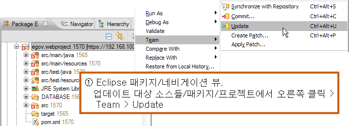

### Commit

* 로컬에 체크아웃 한 소스를 수정, 파일 추가, 삭제 등을 한 뒤 저장소에 저장하여 갱신 하는 것
* 커밋을 하면 전체 리비전이 1 증가(CVS의 경우 수정한 각각 파일의 리비전이 증가)

다음과 같은 방법으로 Commit 절차를 수행한다.

1. Eclpise IDE의 패키지 또는 네비게이션 뷰에서, 커밋하고자하는 대상 소스들, 패키지 또는 프로젝트를 선택한다.
2. 커밋 대상들을 선택한 상태에서 마우스 오른쪽 클릭하여 **Team** >  **Commit…** 를 선택한다.
3. 팝업 창에서 반영 항목들을 확인하고, Comment를 입력하고 **OK** 버튼을 클릭하여 종료한다.

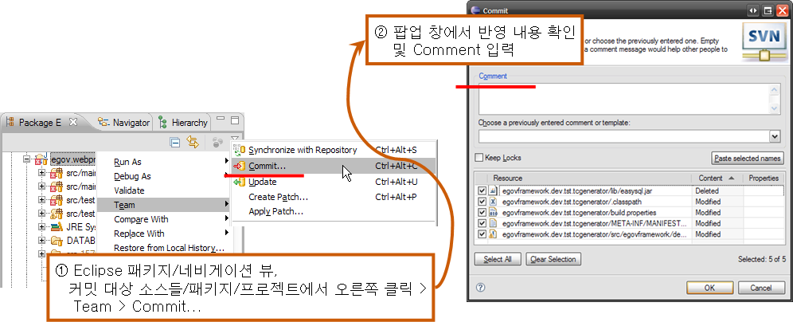

### History

* SVN에 의해 관리되는 특정 소스와 관련된 과거 모든 리비전의 내역

#### History 조회

Eclipse IDE의 기본 카테고리인 ‘ **Team** ’의 ‘ **History** ’ 뷰를 통해 조회할 수 있으며, 다음과 같은 순서로 수행한다.

1. Eclpise IDE의 패키지 또는 네비게이션 뷰에서, History를 확인하고자 하는 대상 소스를 선택한다.
2. 확인 대상들을 선택한 상태에서 마우스 오른쪽 클릭하여 **Team** > **Show History**를 선택한다.
3. History 뷰에, 선택한 대상 소스의 History 내역이 조회되고 이를 확인한다.

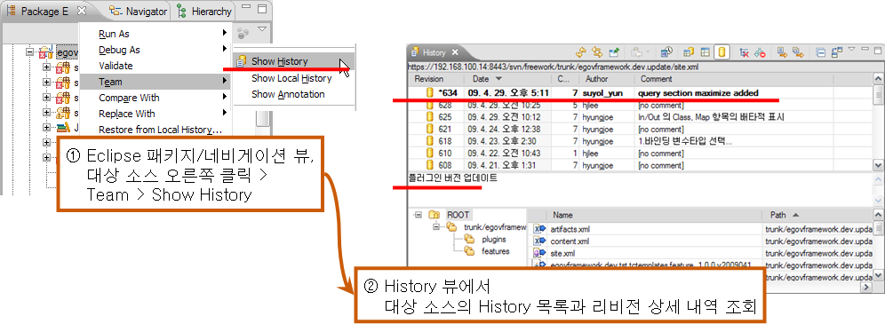

### 충돌

* 로컬에 체크아웃 이후 수정한 소스를 저장소에 커밋할 때, 저장소의 리비전이 더 높을 경우 충돌 발생 (타인에 의해 수정되고 커밋된 상태)

다음의 그림은 Synchronize 뷰에서 확인한 충돌 발생상황의 예이다.
그림에서처럼, 특정 소스(그림에서 site.xml)의 사용자 로컬 리비전이 597일 때, 저장소의 리비전이 그보다 큰 634의 경우 해당 소스에서 충돌이 발생하게 된다. 즉, 사용자(사용자 A)가 리비전이 597인 해당 소스를 저장소에서 받아 수정하고 있는 동안, 다른 사용자(사용자 B)가 해당 소스를 변경하여 저장소 커밋하고(이때 해당 소스의 리비전이 올라간다), 이어 리비전 597을 수정한 사용자(사용자 A)가 커밋하려고 할때 발생한다.

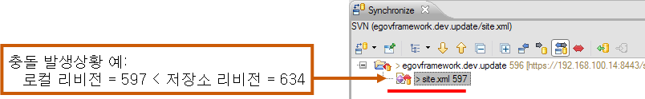

#### 충돌 해결 방안

충돌에 대한 해결 방안은 다음과 같은 것들이 있다.

* postpone: 즉시 반영없이, 소스 코드를 계속 수정. 수정이 완료된 시점에 다시 시도(충돌 해결 안함)
* diff: 충돌된 상황을 비교. 로컬과 저장소의 소스의 차이를 비교
* edit: 로컬의 파일을 다시 열어 수정
* mine-full: 저장소의 리비전 내용을 무시하고, 로컬의 내용으로 커밋.
* theirs-full: 로컬의 수정 내역을 무시하고, 저장소의 리비전으로 대체하여 업데이트

다음 그림은 이러한 충돌 해결 방안의 예 들이다.

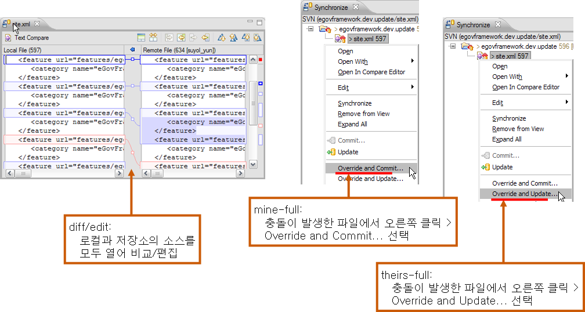

## 참고자료

* Subversion 오픈소스 프로젝트 사이트: [http://subversion.tigris.org/](http://subversion.tigris.org/)
* Subversion 온라인 도움말: [http://svnbook.red-bean.com/](http://svnbook.red-bean.com/)
