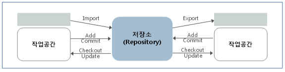

# 소스관리도구 서버환경 운영

## 개요

전자정부 표준프레임워크에서는 개발환경의 소스관리도구로 오픈소스인 Subversion을 사용한다. Subversion(SVN, 버전관리 시스템)은 프로젝트 전반적으로 사용하는 파일들을 관리하기 위한 시스템이다.
Subversion은 다수의 개발자가 프로그램을 개발할 때 개발된 버전 관리는 통해 History 를 관리할 수 있도록 하며 전체 팀의 공통 모듈을 일관성 있게 관리할 수 있도록 한다.
현재(2009년 5월) 기준으로, 본 온라인 메뉴얼의 설명이 되는 대상과 전자정부 표준프레임워크의 개발환경에 포함되어 제공되는 Subversion의 설치 버전은 다음과 같다.

* 서버 환경: Subversion 1.4.6

명시된 Subversion의 버전은 지속적인 전자정부 표준프레임워크 개발환경의 개선작업으로 인하여 향후 변경되어 배포될 수 있다

## 설명

Subversion은 실제의 작업용 디렉터리(작업공간) 이외에, 저장소(repository)라고 하는 영역에 최초의 데이터와 그 이후의 갱신 이력이나 변경 분 정보를 저장한다.



* 저장소는 복수 개 생성 가능
* 사용할 수 있는 파일이나 디렉터리는 import 로 저장소에 등록
* checkout을 실행하면 저장소 내용이 작업공간에 복사됨과 동시에 관리 정보를 수록하는 .svn 디렉터리가 생성되며, 이 작업은 최초 1회만 필요하다.
* 파일이나 디렉터리를 수정하면 commit 로 변경분이 저장소에 등록되며, 저장소에 있는 다른 변경 분을 작업 디렉터리에 반영하고 싶을 때는 update를 수행한다.
* 관리 정보 없이 저장소 내용을 가져오고 싶을 때는 export 를 수행한다.

### Subversion의 아키텍처

저장소(Subversion Repository)에서는 버전화 된 모든 데이터를 관리하며, 클라이언트 프로그램은 로컬 환경의 복사된 데이터를 관리한다. 이 사이에는 다양한 저장소 액세스(RA) 층을 통하여 통신 한다.


### Subversion의 구성요소

* svn : 커맨드라인 클라이언트 프로그램
* svnversion : 작업복사의 상태를 관리를 하는 프로그램
* svnlook : Subversion의 저장소를 조사하기 위한 툴
* svnadmin : Subversion의 저장소를 조정하거나 복원하기 위한 프로그램으로 시스템 관리자에 의해 사용됨
* svndumpfilter : Subversion 저장소의 덤프 파일 형식의 데이터에 대한 필터 프로그램
* mod_dav_svn : Apache HTTP 서버용의 플러그 인 모듈로 저장소를 네트워크상 다른 사용자가 사용할 수 있도록 함
* svnserve : demon으로 또는 SSH로부터 기동되는 독립 서버 프로그램으로 네트워크에 있는 저장소를 사용할 수 있도록 하는 다른 방법

## 사용법

### 주요 기능

1. 디렉터리의 버전 관리
   * Subversion는 시간과 함께 디렉터리 트리 전체의 변경에 확인할 수 있는 가상적인 버전관리 시스템을 구현하고 있다.
   * 디렉터리에도 버전정보가 추가된다.
2. 버전 이력 기능 강화
   * Subversion 에서는 파일과 디렉터리의 모두에 대해서 추가, 삭제, 복사, 명칭 변경을 할 수 있다.
   * 신규 추가되는 모든 파일은, 거기로부터 새롭게 시작되는 이력을 갖는다.
3. Atomic Commit
   * 변경점의 모임은, 그것 전체가 저정소에 완전하게 반영되는지, 전혀 반영되지 않는가 중 하나이다.
   * 개발자는 논리적으로 한 묶음의 변경을 만들어 Commit 할 수 있어 일부만이 저장소에 반영되어 버리는 문제가 발생하지 않는다.
4. 메타데이타 버전관리
   * 파일과 디렉터리는 각각 관련한 속성 키와 값의 조합이며 임의의 키/값의 조합를 생성해 보존할 수 있다.
   * 속성도 파일의 내용과 동일하게 버전관리 된다.
5. 네트워크층의 선택
   * Subversion은 저장소에 액세스용의 추상 레이어가 있어, 새로운 네트워크 프로그램을 간단하게 구현 할 수 있다.
   * Subversion은 HTTP 서버의 확장 모듈로서 플러그인 될 수도 있으며, 신뢰성이나 상호호환성에 대해 매우 유리하게 되어 서버가 제공하고 있는 기존의 기능(인증, 인가, 데이터 압축 등)을 곧바로 이용할 수 있다.
   * 보다 간단하고 쉬운 단독 Subversion 프로세스도 이용할 수 있다. 이 서버는 독자적인 프로토콜에 의해서 SSH 를 이용한 터널 통신을 간단하게 실행할 수 있다.
6. 데이터 처리의 일관성
   * Subversion은 동일한 알고리즘을 사용해 파일의 변경분을 표현한다.
   * 텍스트(읽을 수 있는 데이터)에도, 바이너리(간단하게 읽을 수 없는 데이터)에 대해서도 같은 방법으로 동작한다.
7. 효율적인 브랜치, 태그의 작성
   * 브랜치와 태그를 작성하는 비용은 프로젝트의 크기에 비례하지 않는다. Subversion은 하드 링크로서 알려져 있는 방법과 비슷한 방법을 사용하여 단지 프로젝트를 복사하는 것으로 브랜치와 태그를 만든다. 따라서 브랜치, 태그의 작성은 매우 짧은 시간이 걸린다.
8. 확장하기 쉬움
   * Subversion는 잘 설계된 API로 완성된 C의 공유 라이브러리의 모임으로 구현되어 있으며, 이는 유지보수나 다른 어플리케이션이나 언어와 연동하여 사용하기가 쉽다.

### 주요 명령어

시스템의 콘솔을 통하여 아래에 나열된 명령어를 활용하여 소스의 형상관리(버전관리) 및 저장소들을 관리할 수 있다.

1. 체크 아웃(check-out)
   * 저장소를 체크아웃하면 로컬 컴퓨터에 원하는 프로젝트의 사본을 생성하며 이 사본은 지정된 저장소의 최신 개정판을 포함함
   * 최신 버전이 아닌 원하는 버전으로 checkout하는 것도 가능함
2. 커밋(commit)
   * 체크인(check-in)이라고도 하며 check-out한 소스를 수정, 파일 추가, 삭제한 후 로컬 사본에 대한 변경 사항을 저장소에 갱신하는 것임
   * 커밋을 하면 Subversion의 경우 전체 리비전이 1 증가하게 됨
   * 커밋을 수행하면 커밋이후로 사용자는 “update” 이후 특정 파일의 최신 버전을 볼 수 있음
3. 업데이트(update)
   * 사용자의 가장 최근 변경 사항이 있는 작업 사본을 저장소와 동기화하는 것으로, 파일의 가장 최근 작업 사본을 로컬 드라이브로 가져옴(바뀐 부분만 가져옴)
   * 파일을 변경하기 전에 언제나 갱신을 수행하는 것이 최우선 원칙임
4. 임포트(import)
   * 아무것도 들어있지 않은 저장소에 맨 처음 소스를 넣는 작업임
5. 익스포트(export)
   * checkout과는 달리 버전 관리 파일들을 뺀 순수한 소스 파일을 받아올 수 있음
   * 오픈소스 프로젝트의 경우 소스를 압축하여 릴리즈 할 때 사용함
6. 충돌(conflict)
   * 한 파일의 일부 행을 두 명 이상의 사용자가 변경했을 때 또는 저장소에 파일을 갱신할 때 충돌이 발생함
7. 리비전(revision)
   * 소스파일 등을 수정하여 커밋하게 되면 일정한 규칙에 의해 숫자가 증가하게 되는데, 이 숫자가 저장소에 저장된 각각의 파일 버전임
   * 여러개의 파일 중 하나만 변하여 commit 하더라도 모든 파일의 버전은 올라가며 버전은 프로젝트 단위로 증가함
8. 트렁크(trunk)
   * 프로젝트에서 가장 중심이 되는 디렉터리로 모든 프로그램 개발 작업은 trunk 디렉터리에서 이루어짐
   * trunk 디렉터리 아래에는 바로 소스들의 파일과 디렉터리가 들어가게 됨
9. 브랜치(branches)
   * trunk 디렉터리에서 프로그램을 개발하다 보면 큰 프로젝트에서 또 다른 작은 분류로 빼서 따로 개발해야 할 경우가 생기는데, 이 때 branches 디렉터리 안에 또 다른 디렉터리를 두어 그 안에서 개발함
   * 브랜치는 대부분 주요 개발 브랜치를 컴파일러 오류나 버그로 방해하지 않고 새로운 기능을 테스트할 경우에 생성함
10. 태그(tag)
    * 태그 디렉터리는 프로그램을 개발하면서 정기적으로 릴리즈를 할 때 그때그때 발표한 소스를 따로 저장하는 공간임
    * 태깅은 기본적으로 개정판 번호(Revision Number)와 상관없이 각 파일에 라벨을 붙이는 것이며 이 작업은 작업 사본에 할 수도 있고 저장소 자체에 할 수도 있음
11. 후크(hook)
    * 후크는 새로운 개정판의 생성이나 버전 관리가 되지 않은 속성의 수정과 같은 저장소 이벤트에 의해 실행되는 프로그램임
    * 후크는 그 이벤트가 무엇인지, 어떤 목표로 작동하는지, 이벤트를 실행한 사람의 사용자 이름이 무엇인지 알려줌
12. 잠금(lock)
    * 사용자가 작업 사본 파일을 수정할 독점적 권리를 요구하는 장치임
13. 병합(merge)
    * 병합은 하나의 브랜치에 대한 변경 사항을 다른 브랜치와 합쳐서 트렁크로 반영하는 것(반대의 경우도 가능)
    * 이때의 다른 브랜치 역시 트렁크일 수 있음

### 서버 운영관리

1. 저장소 만들기
   Subversion repository는 향후 repository의 추가와 관리가 용이하도록 복수 개의 repository 구성을 추천한다.
   * Root Repository 를 위한 directory를 생성한다.
     ```bash
     > mkdir repository
     ```
   * 각각의 Repository를 생성한다.
     ```bash
     > cd repository
     > svnadmin create --fs-type fsfs repo1
     > svnadmin create --fs-type fsfs repo2
     ```
2. 인증/권한 정보 설정 (conf/svnserve.conf)
   * 각 repository conf 폴더(또는 디렉토리)의 svnserve.conf 파일에서 해당 repository의 사용권한을 설정한다.
   * anon-access (익명사용자), auth-access (인증된 사용자)에 대한 설정을 하지 않는 경우, default로 익명사용자는 읽기권한, 인증된 사용자는 쓰기권한이 부여된다.
   * 다음은 svnserve.conf 작성의 예이다.
     ```ini
     [general]
     ### These options control access to the repository for unauthenticated
     ### and authenticated users.  Valid values are "write", "read",
     ### and "none".  The sample settings below are the defaults.
     # anon-access = read
     # auth-access = write
     # 익명 사용자는 접근을 허용하지 않고 인증된 사용자만 쓰기 권한을 부여한다.
     anon-access = none
     auth-access = write
     ### The password-db option controls the location of the password
     ### database file.  Unless you specify a path starting with a /,
     ### the file's location is relative to the conf directory.
     ### Uncomment the line below to use the default password file.
     # 패스워드 파일은 기본값인 conf/passwd 파일을 사용한다.
     password-db = passwd
     ### The authz-db option controls the location of the authorization
     ### rules for path-based access control.  Unless you specify a path
     ### starting with a /, the file's location is relative to the conf
     ### directory.  If you don't specify an authz-db, no path-based access
     ### control is done.
     ### Uncomment the line below to use the default authorization file.
     # 리포지토리의 디렉토리별, 사용자 그룹별 권한관리를 하지 않는 경우, 추가적인 권한
     # 설정을 사용하지 않는다.
     # authz-db = authz
     ### This option specifies the authentication realm of the repository.
     ### If two repositories have the same authentication realm, they should
     ### have the same password database, and vice versa.  The default realm
     ### is repository's uuid.
     # 이 리포지토리의 인증 시 나타나는 타이틀을 지정한다.
     realm = eGovFrame SVN Repository
     ```
3. 저장소 만들기
   각 repository conf 폴더(또는 디렉토리)의 passwd 파일에서 사용자를 등록한다. 형식은 사용자 'id = 패스워드'이며, 패스워드는 현재 평문 형식이다.
   ```ini
   ### This file is an example password file for svnserve.
   ### Its format is similar to that of svnserve.conf. As shown in the
   ### example below it contains one section labelled [users].
   ### The name and password for each user follow, one account per line.
   [users]
   # harry = harryssecret
   # sally = sallyssecret
   developer01 = 123qwe
   developer02 = 123qwe
   ```
4. 백업 및 복구
   * Dump : 표준 입출력을 통해서 저장소의 내용을 파일로 생성한다. svnadmin dump 명령을 사용하며 이 명령은 저장소 디렉토리 바깥에서 사용해야 한다.
     ```bash
     > ls
      repository
     > svnadmin dump repository > repository.dump
     ```
   * Load : 저장소 백업 파일을 이용해서 저장소를 복구한다. svnadmin load 명령을 사용하며, 빈 저장소를 생성한 뒤 백업 파일을 이용해서 복구 한다.
     ```bash
     > svnadmin create repository
     > ls
      repository   repository.dump  
     > svnadmin load repository < sample.dump
     ```

## 참고자료

* Subversion 오픈소스 프로젝트 사이트: [http://subversion.tigris.org/](http://subversion.tigris.org/)
