## 표준프레임워크 Boot Sample 프로젝트를 Gradle로 빌드환경 전환

### 빌드 환경 전환

1. Eclipse Gradle Plugin 설치

   * Buildship : [설치가이드](./gradle-buildship.md)
   
2. Sample 프로젝트 생성

   * 개발환경 > eGovFrame > New Boot Web Project > [프로젝트 정보 입력-Next] > Generate Example 체크 [Finish] (또는)
   * 개발환경 > file > New > eGovframe Boot Web Project > [프로젝트 정보 입력-Next] > Generate Example 체크 [Finish]

     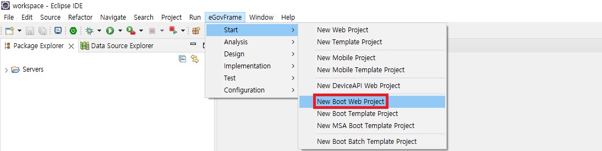

     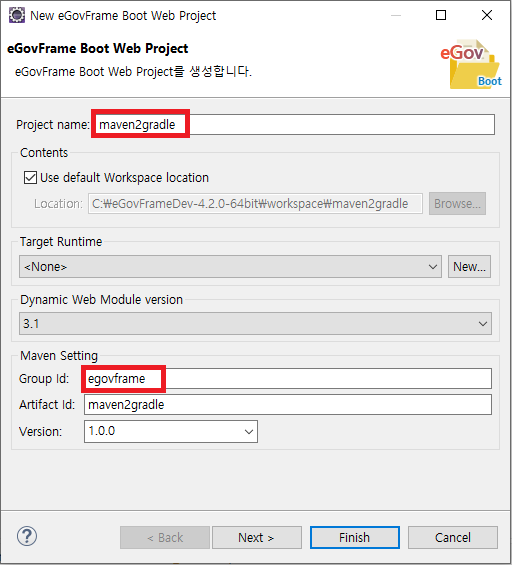
     
     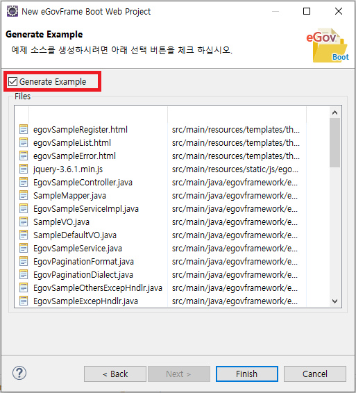

     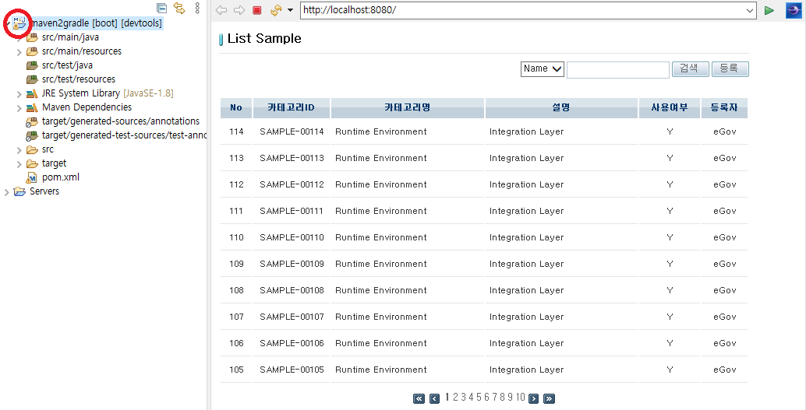

3. build.gradle 파일 추가

   * [build.gradle](#buildgradle-파일)

     

     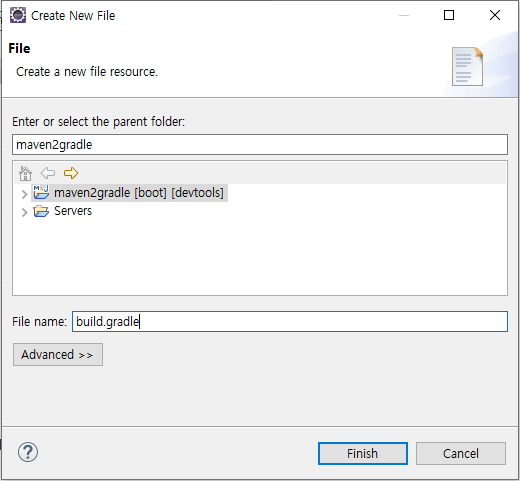

4. 기존 Maven Nature 삭제

   * Mavne > Disable Maven Nature

     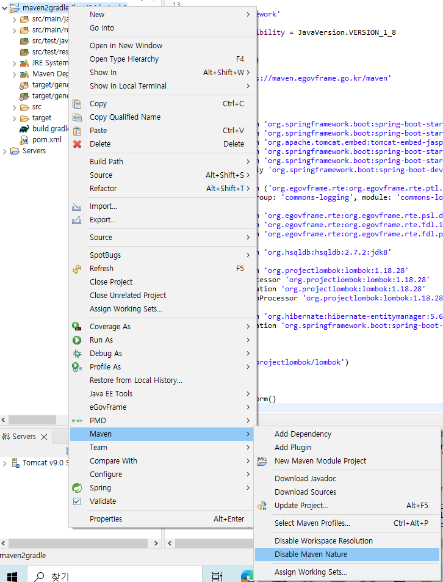 
     
     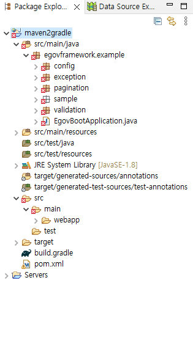

5. Gradle Nature 추가

   * Configure > Add Gradle Nature

     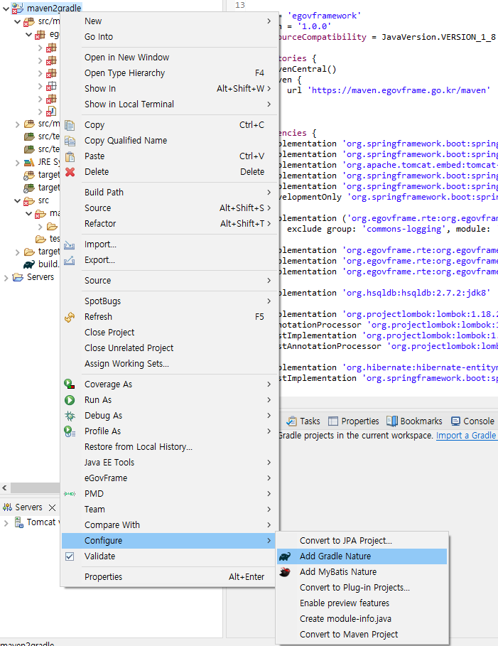 
     
     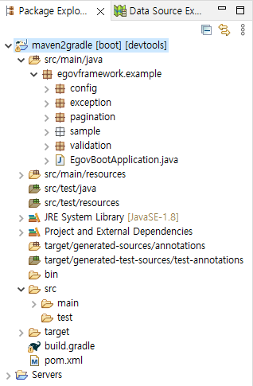

6. pom.xml 삭제

7. Gradle 설정 확인

   * Gradle > Refresh Gradle Project

     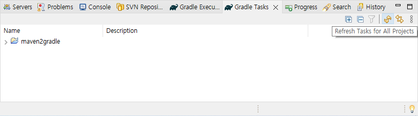

8. Gradle Tasks View 열기

   * Window > Show View > Gradle > Gradle Tasks

     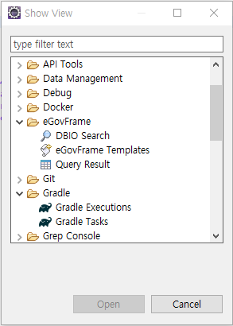

9. Gradle Tasks View에 표시된 프로젝트 Build

   * 프로젝트에 구성된 Task를 시작메뉴를 이용하여 빌드실행

     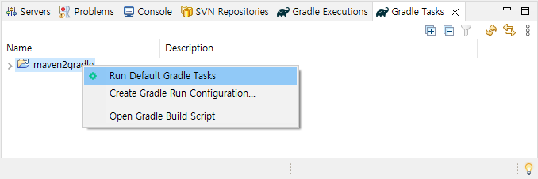

     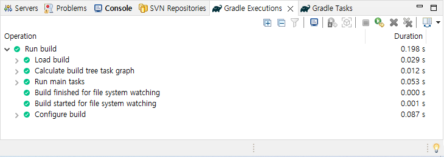
     
10. Gradle 프로젝트 실행

    * Run As > Spring Boot App

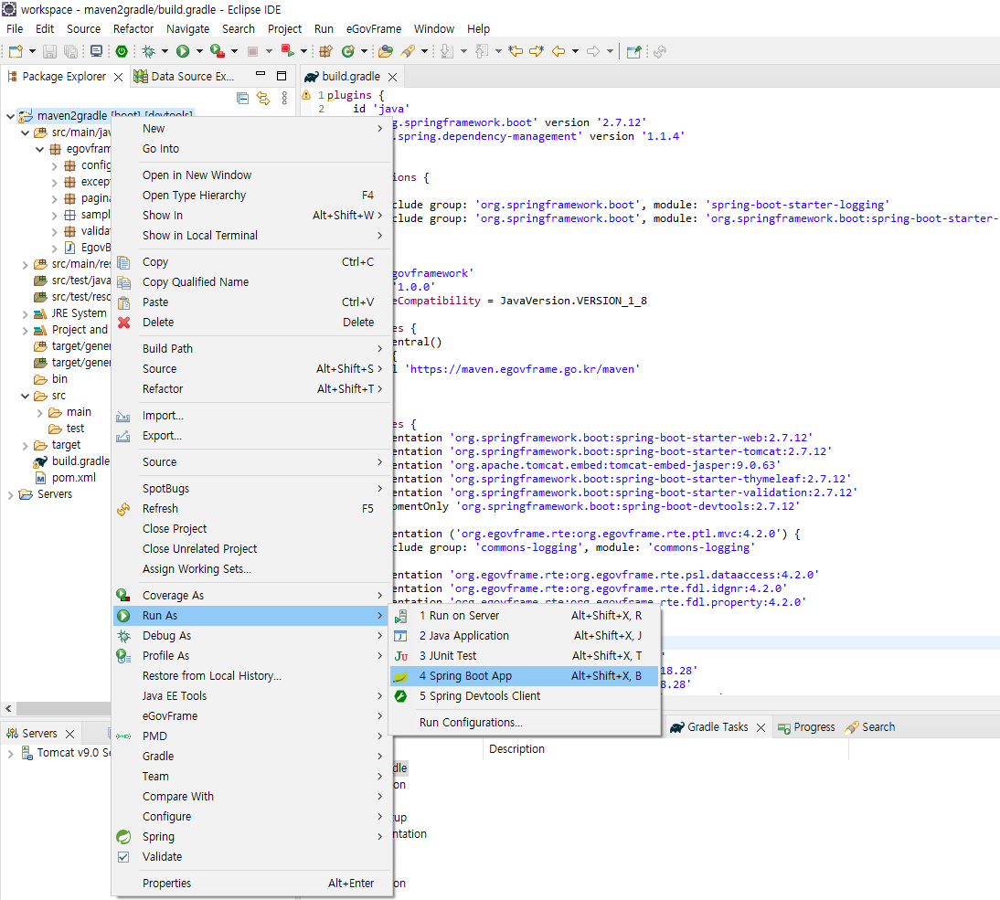

### build.gradle 파일

```groovy
plugins {
    id 'java'
    id 'org.springframework.boot' version '2.7.18'
    id 'io.spring.dependency-management' version '1.1.4'
}
 
configurations {
	all {
		exclude group: 'org.springframework.boot', module: 'spring-boot-starter-logging'
		exclude group: 'org.springframework.boot', module: 'org.springframework.boot:spring-boot-starter-logging'
	}
}
 
group = 'egovframework'
version = '1.0.0'
java.sourceCompatibility = JavaVersion.VERSION_1_8
 
repositories {
    mavenCentral()
    maven {
        url 'https://maven.egovframe.go.kr/maven'
    }
}
 
dependencies {
    implementation 'org.springframework.boot:spring-boot-starter-web'
    implementation 'org.springframework.boot:spring-boot-starter-thymeleaf'
    implementation 'org.springframework.boot:spring-boot-starter-validation'
    developmentOnly 'org.springframework.boot:spring-boot-devtools'
 
    implementation 'org.springframework.boot:spring-boot-starter-tomcat'
 
    implementation ('org.egovframe.rte:org.egovframe.rte.ptl.mvc:4.3.0') {
        exclude group: 'commons-logging', module: 'commons-logging'
    }
    implementation 'org.egovframe.rte:org.egovframe.rte.psl.dataaccess:4.3.0'
    implementation 'org.egovframe.rte:org.egovframe.rte.fdl.idgnr:4.3.0'
    implementation 'org.egovframe.rte:org.egovframe.rte.fdl.property:4.3.0'
 
    implementation 'org.hsqldb:hsqldb:2.7.3:jdk8'
 
    implementation 'org.projectlombok:lombok:1.18.34'
    annotationProcessor 'org.projectlombok:lombok:1.18.34'
    testImplementation 'org.projectlombok:lombok:1.18.34'
    testAnnotationProcessor 'org.projectlombok:lombok:1.18.34'
 
    implementation 'org.hibernate:hibernate-entitymanager:5.6.15.Final'
    testImplementation 'org.seleniumhq.selenium:selenium-java:4.13.0'
    testImplementation 'org.springframework.boot:spring-boot-starter-test'
}
 
bootJar {
    exclude('org/projectlombok/lombok')
}
 
test {
    useJUnitPlatform()
}
```
