## 표준프레임워크 Boot Sample 프로젝트를 Gradle로 빌드환경 전환

### 빌드 환경 전환

1. Eclipse Gradle Plugin 설치

   * Buildship : [설치가이드](./gradle-buildship.md)
   
2. Sample 프로젝트 생성

   * 개발환경 > eGovFrame > New Boot Web Project > [프로젝트 정보 입력-Next] > Generate Example 체크 [Finish] (또는)
   * 개발환경 > file > New > eGovframe Boot Web Project > [프로젝트 정보 입력-Next] > Generate Example 체크 [Finish]

     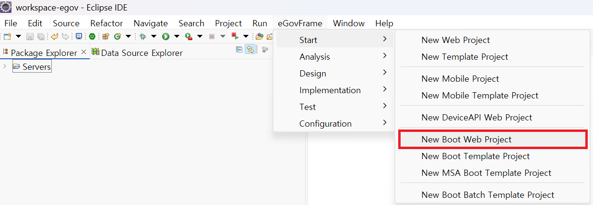

     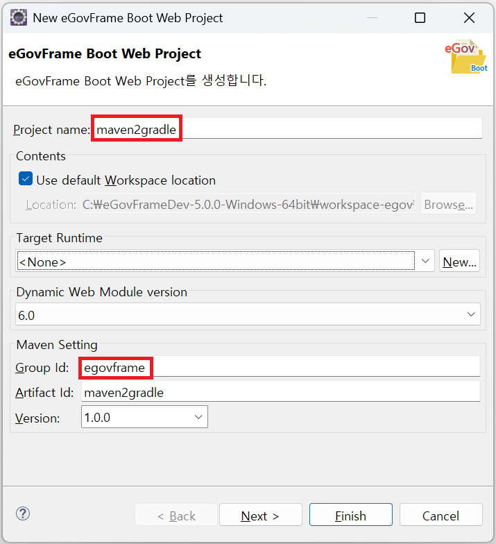
     
     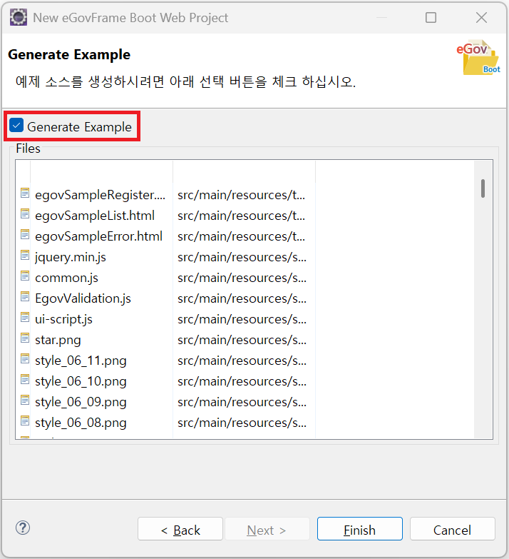

     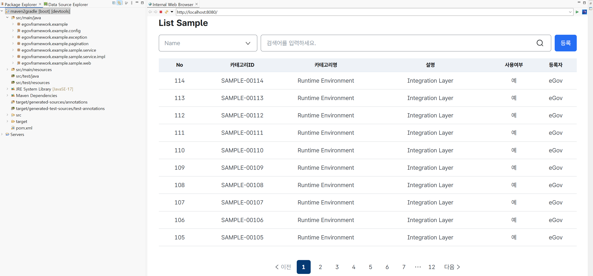

3. build.gradle 파일 추가

   * [build.gradle](#buildgradle-파일)

     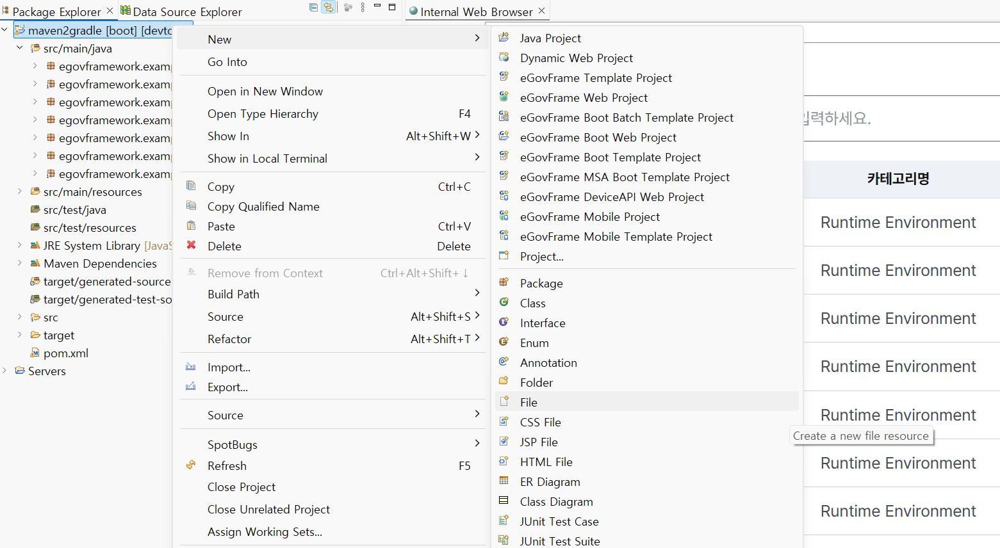

     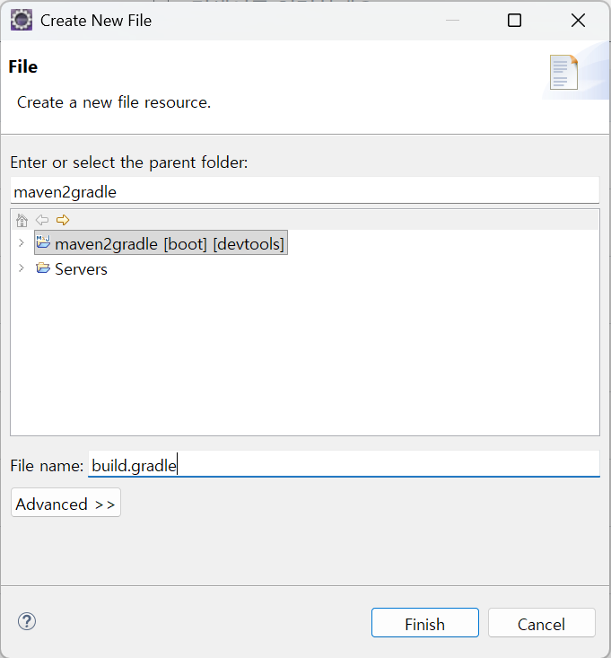

4. 기존 Maven Nature 삭제

   * Mavne > Disable Maven Nature

     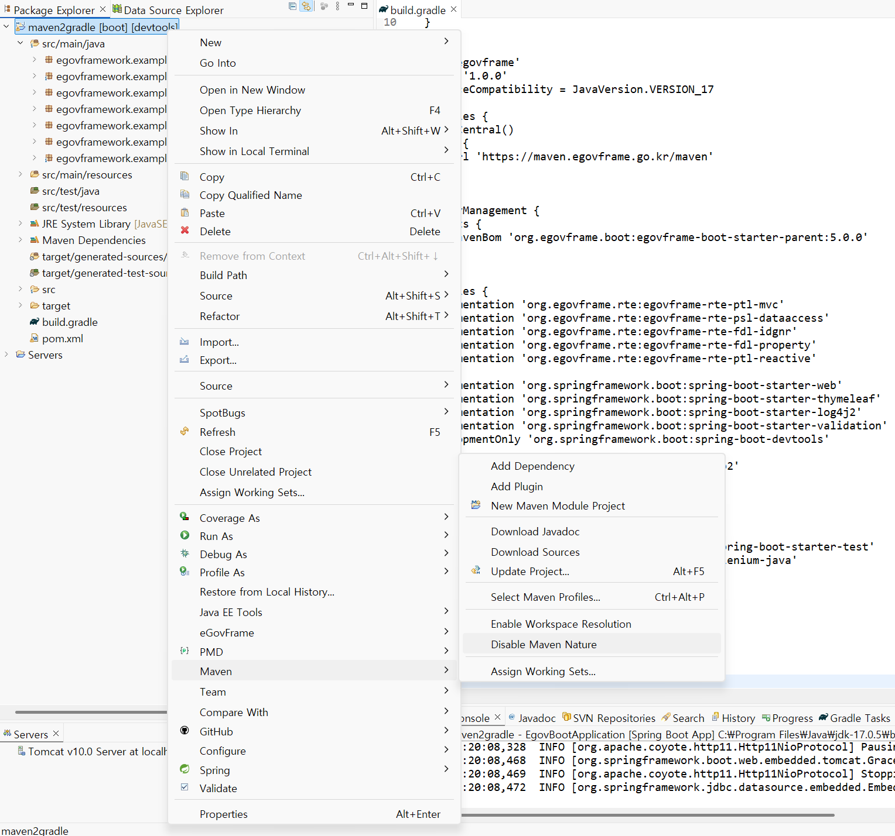 
     
     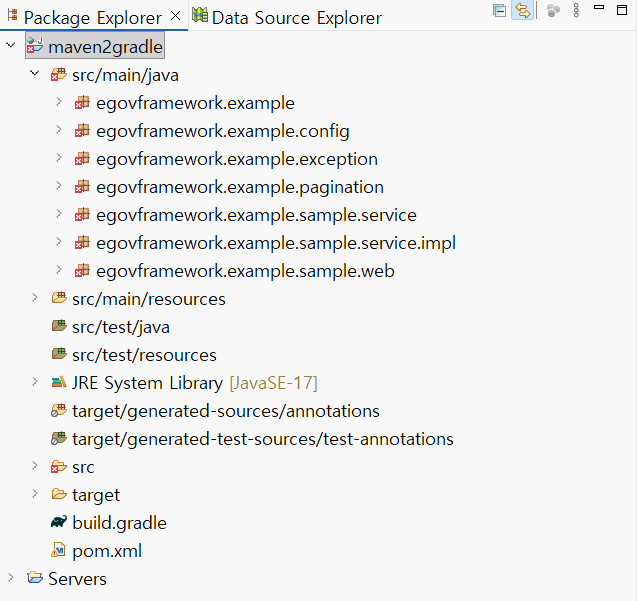

5. Gradle Nature 추가

   * Configure > Add Gradle Nature

     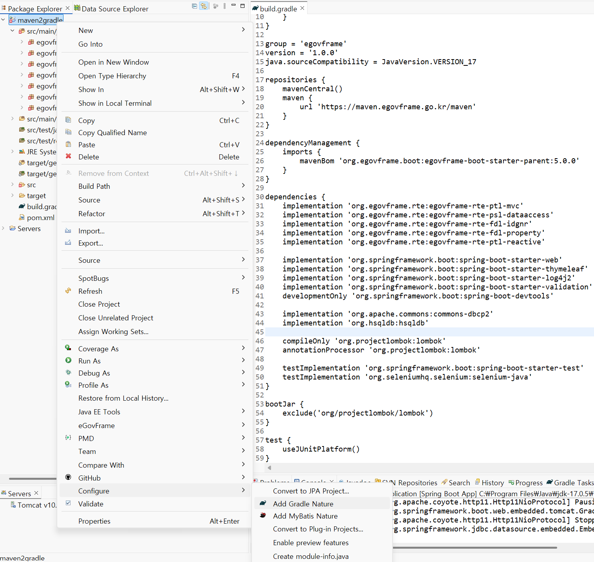 
     
     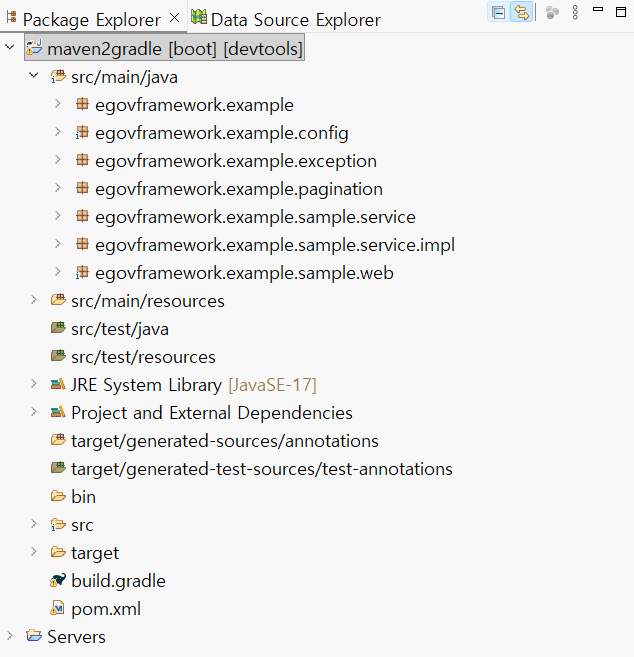

6. pom.xml 삭제

7. Gradle 설정 확인

   * Gradle > Refresh Gradle Project

     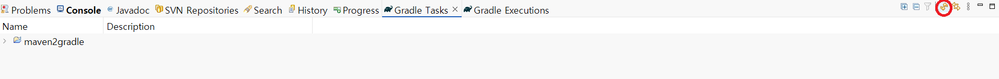

8. Gradle Tasks View 열기

   * Window > Show View > Gradle > Gradle Tasks

     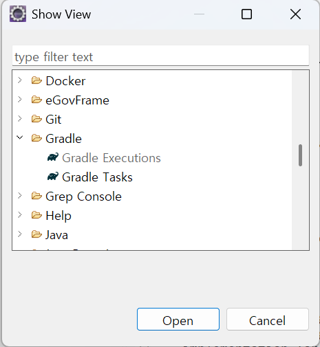

9. Gradle Tasks View에 표시된 프로젝트 Build

   * 프로젝트에 구성된 Task를 시작메뉴를 이용하여 빌드실행

     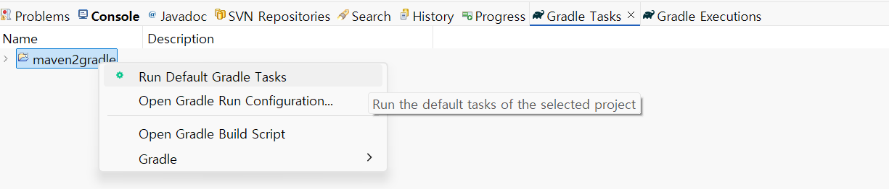

     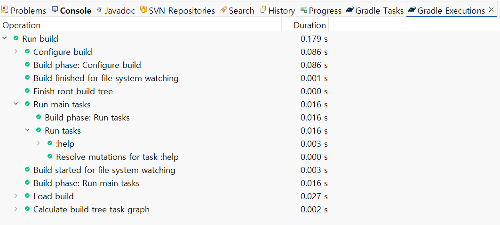
     
10. Gradle 프로젝트 실행

    * Run As > Spring Boot App

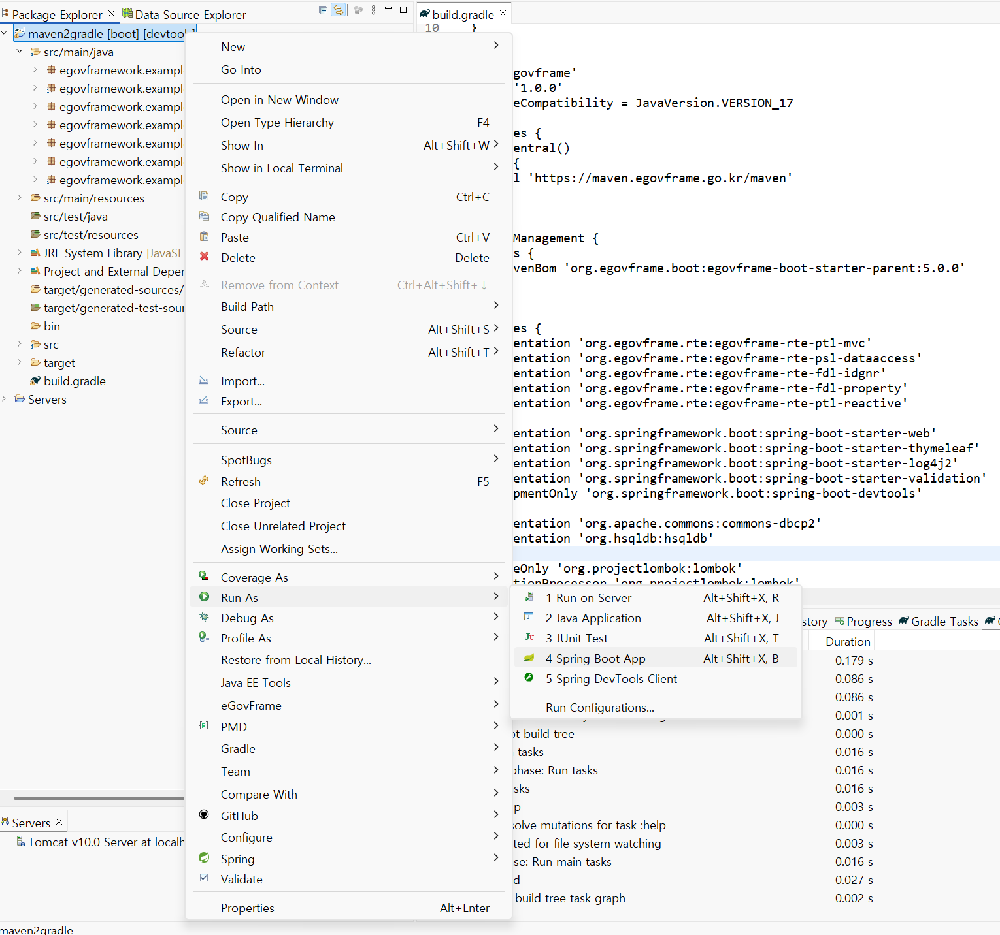

### build.gradle 파일

```groovy
plugins {
    id 'java'
    id 'org.springframework.boot' version '3.5.6'
    id 'io.spring.dependency-management' version '1.1.7'
}

configurations {
    all {
        exclude group: 'org.springframework.boot', module: 'spring-boot-starter-logging'
    }
}

group = 'egovframe'
version = '1.0.0'
java.sourceCompatibility = JavaVersion.VERSION_17

repositories {
    mavenCentral()
    maven {
        url 'https://maven.egovframe.go.kr/maven'
    }
}

dependencyManagement {
    imports {
        mavenBom 'org.egovframe.boot:egovframe-boot-starter-parent:5.0.0'
    }
}

dependencies {
    implementation 'org.egovframe.rte:egovframe-rte-ptl-mvc'
    implementation 'org.egovframe.rte:egovframe-rte-psl-dataaccess'
    implementation 'org.egovframe.rte:egovframe-rte-fdl-idgnr'
    implementation 'org.egovframe.rte:egovframe-rte-fdl-property'
    implementation 'org.egovframe.rte:egovframe-rte-ptl-reactive'

    implementation 'org.springframework.boot:spring-boot-starter-web'
    implementation 'org.springframework.boot:spring-boot-starter-thymeleaf'
    implementation 'org.springframework.boot:spring-boot-starter-log4j2'
    implementation 'org.springframework.boot:spring-boot-starter-validation'
    developmentOnly 'org.springframework.boot:spring-boot-devtools'

    implementation 'org.apache.commons:commons-dbcp2'
    implementation 'org.hsqldb:hsqldb'

    compileOnly 'org.projectlombok:lombok'
    annotationProcessor 'org.projectlombok:lombok'

    testImplementation 'org.springframework.boot:spring-boot-starter-test'
    testImplementation 'org.seleniumhq.selenium:selenium-java'
}

bootJar {
    exclude('org/projectlombok/lombok')
}

test {
    useJUnitPlatform()
}
```
