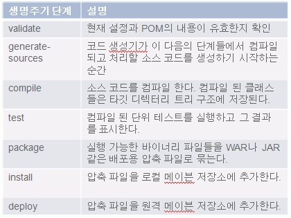
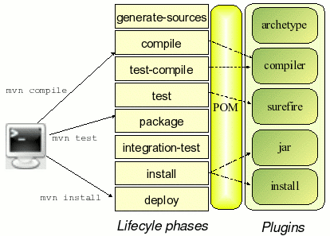

# 빌드 Lifecycle

## 개요

메이븐 빌드는 소프트웨어 프로젝트의 핵심적인 빌드 라이프 사이클 개념을 따르고 있으며 빌드 초기화 단계부터
artifact의 배포까지의 생명 주기를 정의하고 있다.

## 설명

Maven 생명 주기 단계는 각각의 플러그인과 바인딩 되어 플러그인이 명령을 실행 하며 생명주기 단계 순서에 따라 순차적으로 빌드가 실행되어
개발자가 실행한 명령을 수행한다.

> 예) `mvn install` 명령을 실행하면 generate-sources 단계부터 compile, test 명령 등을 거쳐 install 명령을 실행한다.  





> 예) 자바 컴파일: `$mvn complile` 명령을 실행한다.

### 메이븐2 기본 생명주기 단계

| 생명주기 단계           | 설명                                                                                                                                                      |
| ----------------------- | --------------------------------------------------------------------------------------------------------------------------------------------------------- |
| validate                | 현재 설정과 POM의 내용이 유효한지 확인한다. 이 과정은 POM.XML 파일 트리 구조를 검증한다.                                                                  |
| initialize              | 빌드 사이클에서 수행할 주요 작업 이전에 초기화를 할 수 있는 순간                                                                                          |
| generate-sources        | 코드 생성기가 이 다음의 단계들에서 컴파일 되고 처리할 소스 코드를 생성하기 시작하는 순간                                                                  |
| process-sources         | 소스의 파싱, 수정, 변경을 제공한다. 일반 코드 또는 생성된 코드 모두 여기서 처리한다.                                                                      |
| generate-resources      | 소스 코드가 아닌 리소스를 생성하는 단계. 보통 메타데이터 파일과 설정 파일을 포함한다.                                                                     |
| process-resources       | 이전 과정의 소스 코드가 아닌 리소스 파일들을 다룬다. 이 단계에서 리소스 파일들이 수정, 변경, 재배치 된다.                                                 |
| compile                 | 소스 코드를 컴파일한다. 컴파일된 클래스들은 타깃 디렉터리 트리 구조에 저장된다.                                                                           |
| process-classes         | 클래스 파일 변환과 개선 단계를 다룬다. 바이트 코드 위버(weaver)와 instrument 도구가 동작하는 단계다.                                                      |
| generate-test-sources   | 단위 테스트 코드를 생성하는 모조가 동작하는 순간                                                                                                          |
| process-test-sources    | 컴파일하기 전에 테스트 소스 코드에 필요한 작업을 수행한다. 이 단계에서 소스 코드는 수정, 변환 또는 복사될 수 있다.                                        |
| generate-test-resources | 테스트 관련 리소스 생성을 허용한다.                                                                                                                       |
| process-test-resources  | 테스트 관련 리소스의 처리, 변환, 재배치가 가능하다.                                                                                                       |
| test-compile            | 단위 테스트 소스 코드를 컴파일한다.                                                                                                                       |
| test                    | 컴파일된 단위 테스트를 실행하고 그 결과를 표시한다.                                                                                                       |
| package                 | 실행 가능한 바이너리 파일들을 JAR나 WAR 같은 배포용 압축 파일로 묶는다.                                                                                   |
| pre-integration-test    | 통합 테스트를 준비한다. 이 경우 통합 테스트는 실제 배치 환경의 코드를 테스트 하는 것을 말한다. 이 단계에서 위에서 묶은 압축 파일을 서버에 배치할 수 있다. |
| integration-test        | 실제 통합 테스트를 수행한다.                                                                                                                              |
| post-integration-test   | 통합 테스트 준비 상태를 해제한다. 이것은 테스트 환경의 리셋 또는 재초기화 과정을 포함할 수 있다.                                                          |
| verify                  | 배치 가능한 압축 파일의 무결성과 유효성을 검증한다. 이 과정 이후에 압축 파일들이 설치 된다.                                                               |
| install                 | 압축 파일을 로컬 메이븐 디렉터리에 추가한다. 이로 인해 이것에 의존하는 다른 모듈들을 사용할 수 있게 된다.                                                 |
| deploy                  | 압축 파일을 원격 메이븐 디렉터리에 추가한다. 더 많은 사용자들이 이 artifact를 사용할 수 있게 된다.                                                        |

## 환경 설정

기본적인 Maven 플러그인은 Maven 배포 파일에 같이 패키징 되어 있으며 추가적인 Maven 플러그인이 거의 필요가 없다.
만약 기본으로 제공하고 있지 않는 플러그인을 사용해야 할 경우 [사용 가능한 Maven Plugin 리스트](http://maven.apache.org/plugins/) 에서 확인 후 추가해 사용할 수 있다.

## 사용법

1. 생명주기 단계에서 정의한 모든 빌드 작업을 수행하기 위해서는 맨 마지막 단계인 deploy 명령을 실행하면 된다.
   validate 단계부터 install 단계를 거쳐 deploy 명령을 실행하게 된다.

```bash
  mvn deploy
```

2. 2개 이상의 maven 명령을 순차적으로 실행 시킬 수 있으며 target 디렉토리 밑의 내용을 삭제하고 새롭게 빌드하여
   로컬 repository에 패키지를 배포하는 명령으로 프로젝트 빌드 시 주로 사용 되는 명령은 아래와 같다.

```bash
  mvn clean install
```

## 참고 자료

[Maven Build Lifecycle](http://maven.apache.org/guides/introduction/introduction-to-the-lifecycle.html)
