# 구현도구 플러그인(m2eclipse)

## 개요

전자정부 개발 프레임워크의 개발환경 IDE에서는 메이븐 통합 플러그인으로 m2eclipse을 사용하고 있으며
m2eclipse를 통한 보다 효율적인 Maven 프로젝트 개발 편의성을 제공하고 있다.

## 설명

### m2eclipse의 특징

1. 이클립스에서의 maven build 실행
2. pom.xml에 기반한 이클립스 빌드 패스의 의존성(dependency) 관리
3. 리모트 리포지토리로부터 pom.xml에서 선언한 dependency의 자동 다운로드
4. Maven 프로젝트 생성 위자드(wizards) 제공
5. Maven 리포트 리포지토리 연동을 통한 dependency quick search 기능 제공

## 환경 설정

전자정부 개발 프레임워크의 개발환경 IDE에 메이븐 통합 플러그인인 m2eclipse가 설치되어 있다.
구현 도구의 IDE 참조: [IDE](https://www.egovframe.go.kr/wiki/doku.php?id=egovframework:dev2:imp:editor:ide "egovframework:dev2:imp:editor:ide")

**Maven 설정 파일 세팅**

1. settings.xml에서 별다른 설정이 없다면, 아래 이미지와 같이 기본 설정이 적용될 것이다.

   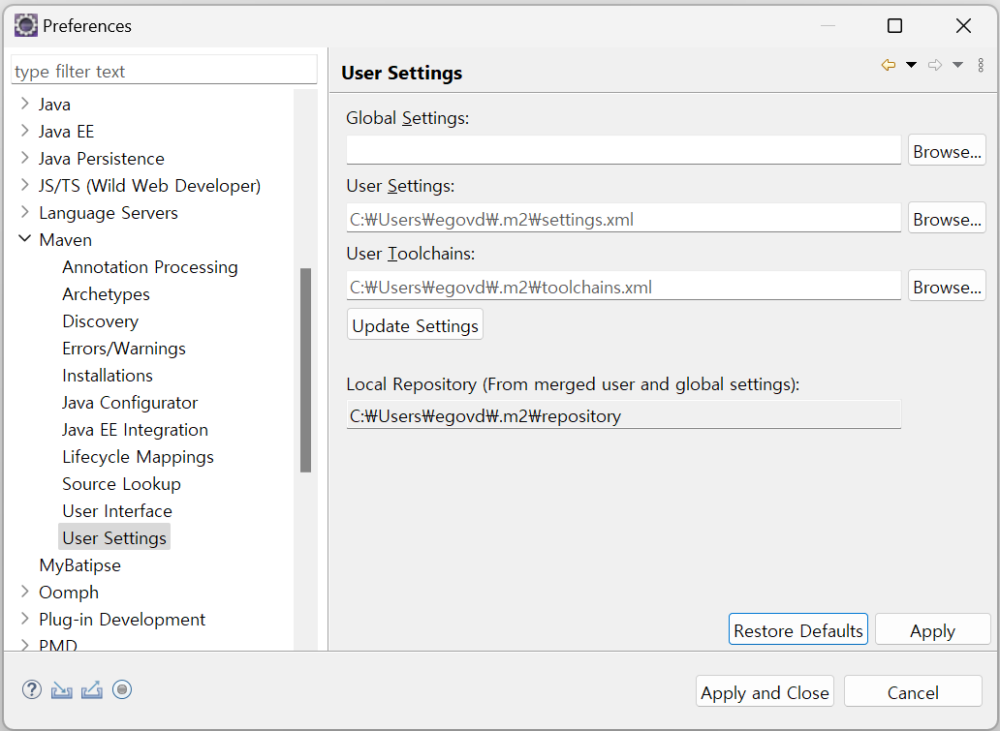

2. Maven 설정 파일인 settings.xml 파일을 생성한 것이 있다면, User Settings에 settings.xml 파일 위치를 지정한다.
   settings.xml에서 Local Repository를 지정했다면 아래 이미지와 같이 나올 것이다.

   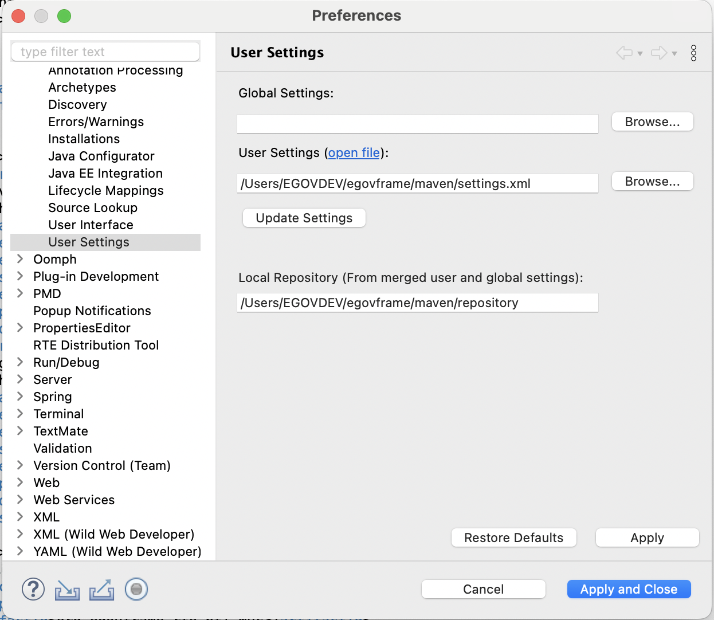

## 사용법

### 메이븐 프로젝트 생성

전자정부 표준 프레임워크 개발환경에서는 Maven 프로젝트를 생성하기 위한 방법으로 eGovFramework perspective을 활용하고 있으며,
구체적인 생성 방법은 개발 환경 구현도구 매뉴얼에서 확인할 수 있다.

* Maven 프로젝트 생성 마법사: [구현도구 - IDE](https://www.egovframe.go.kr/wiki/doku.php?id=egovframework:dev2:imp:editor:ide "egovframework:dev2:imp:editor:ide")

### M2Eclipse 메이븐 명령

생성한 메이븐 프로젝트에서 오른쪽 마우스 클릭 후 maven 메뉴를 선택하면 m2eclipse에서 제공하는 기본적인 메이븐 명령어들을 수행할 수 있습니다.

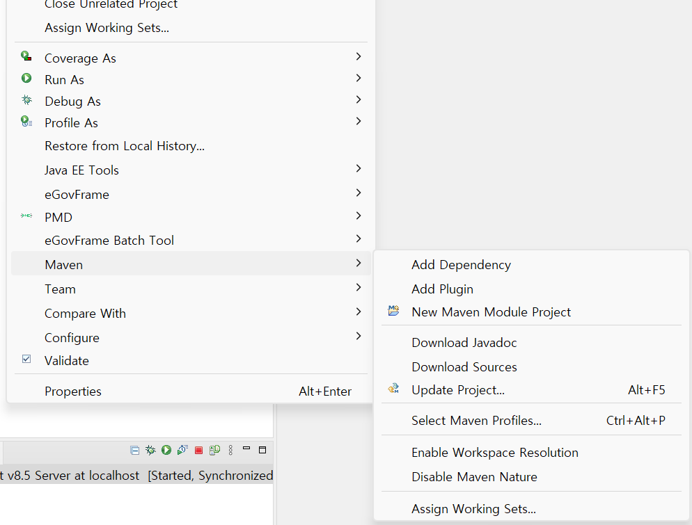

#### m2eclipse 메뉴에서 제공하는 기능

1. dependency 및 메이븐 플러그인 추가
   - pom.xml 에디터 제공
2. dependency, snapshots, 소스 폴더 업데이트
3. 메이븐 모듈 생성
   - module 프로젝트 생성 마법사 기능 제공
4. 소스 코드 다운로드
   - 리모트 리포지토리에서 artifact 소스 코드를 다운로드 할 수 있다. 디버깅 시에 효과적으로 이용할 수 있다.
5. 이클립스 workspace resolution 기능 제어
   - workspace에 등록된 메이븐 프로젝트 들간의 연동에 대해 제어할 수 있다.
   - disable 시킬 경우 로컬 리포지토리에 연동하고자 하는 프로젝트를 install하고 dependency 선언을 통해 참조하여야 한다.

* **사용팁**

> 메이븐 프로젝트를 check out, 생성 또는 불러온 후 Maven -> 'Update Project...' 를 클릭하면,
> 해당 메이븐 프로젝트의 환경 및 dependencies를 업데이트 시켜준다.

### 메이븐 빌드 실행

메이븐의 빌드 명령어를 Run As 또는 debug as 메뉴에서 실행할 수 있으며 'Maven build…' 명령어 선택을 통해 직접 빌드의 Goal을 정의할 수 있다.

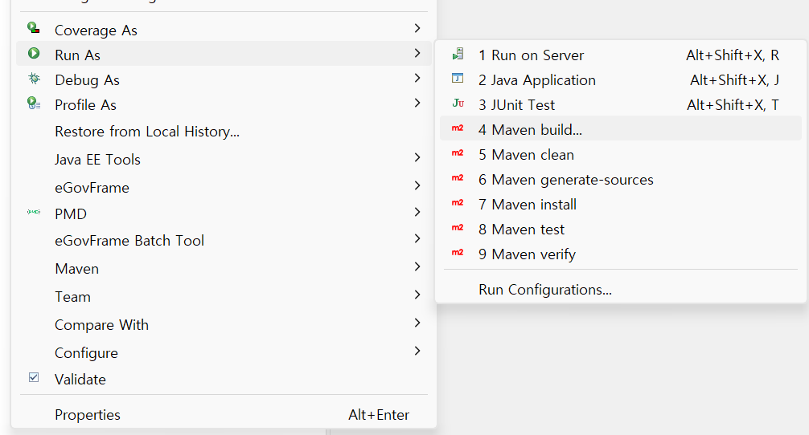

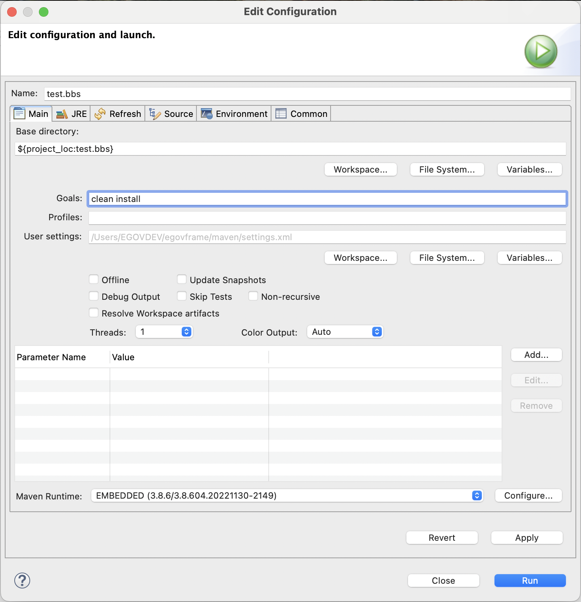

### 메이븐 프로젝트 실행

Run AS → clean install 명령으로 메이븐 웹 프로젝트를 빌드한 후에 Run On Server 명령으로 웹 프로젝트를 실행한다.

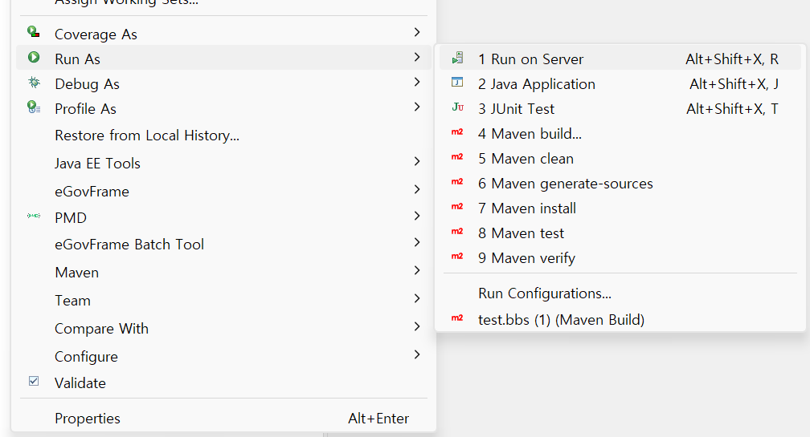

### 예제 프로젝트 실행 가이드

개발 환경에서는 가이드 프로그램으로 web project 를 제공하고 있다.

#### 1. 예제 프로젝트 생성

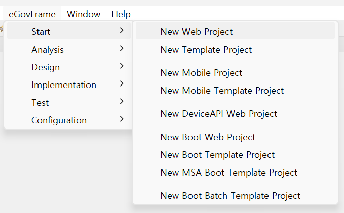

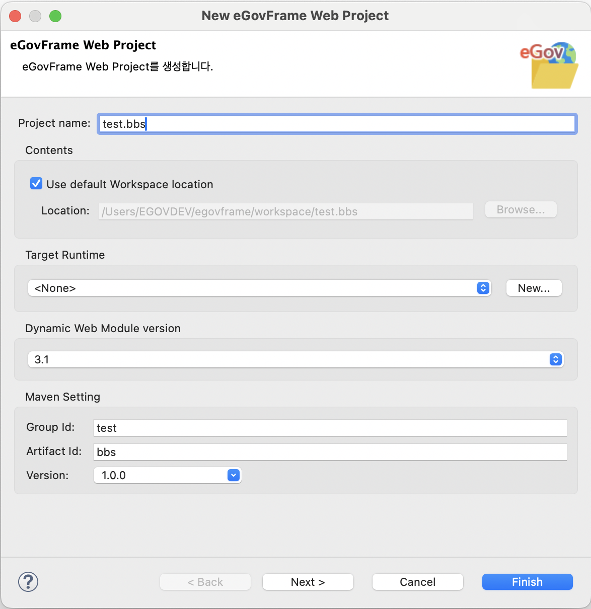

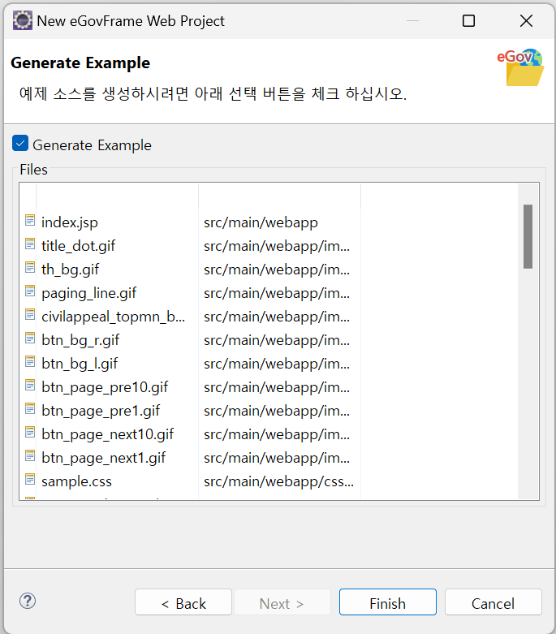

#### 2. 의존성 업데이트

프로젝트 우클릭 → maven → Update Project를 실행한다.

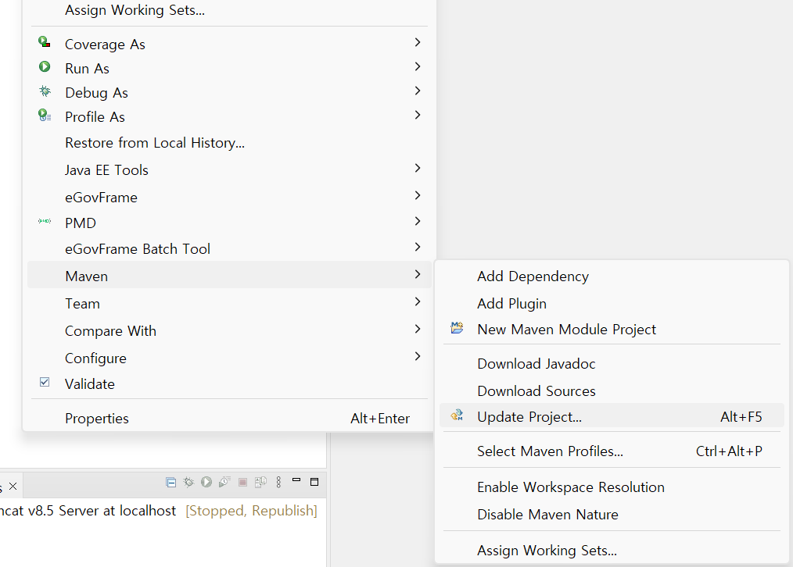

#### 3. build &amp; install

Run As → install 명령을 실행시켜 예제 프로젝트 빌드 작업 및 패키징 작업을 수행한다.
target 디렉토리 밑에서 Maven 빌드 산출물들을 확인할 수 있다.

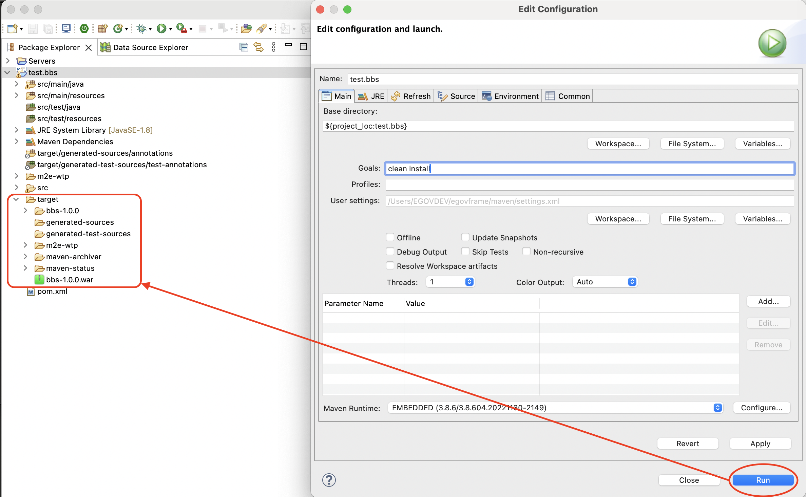

#### 4. 실행

Run As → Run On Server 명령으로 예제 프로젝트를 실행한다.

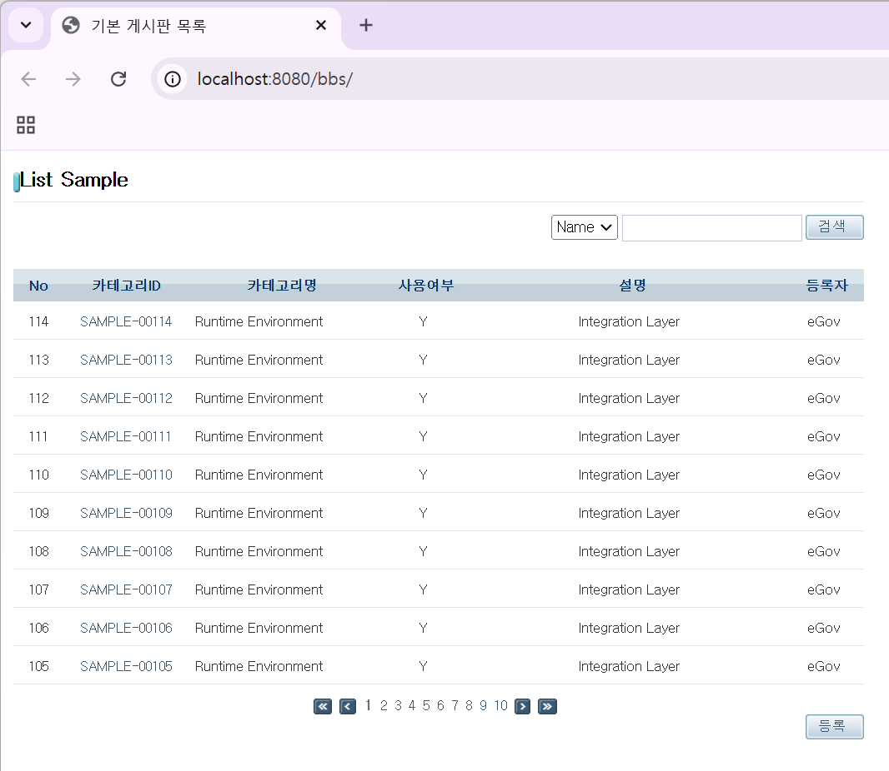