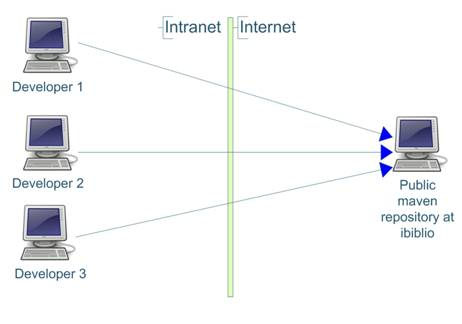
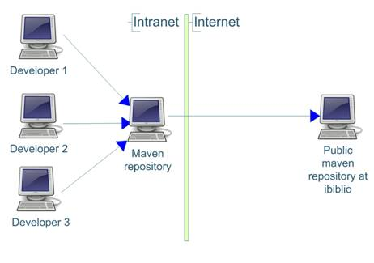
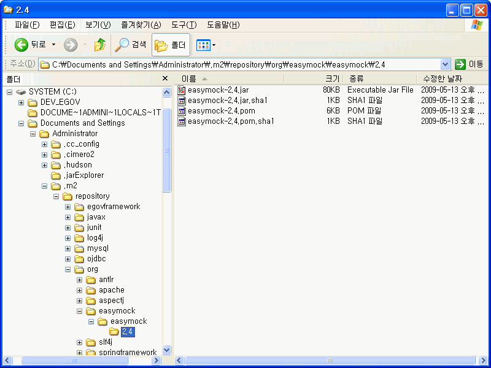
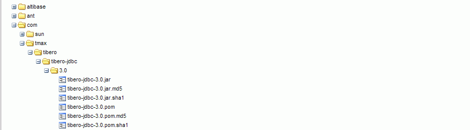

# 빌드 레퍼지토리

## 개요

Maven Repository는 artifact들의 저장소로 로컬 및 리모트 repository로 구성되며 프로젝트의 pom.xml에서 선언한 dependency들을 저장소로부터 불러와서 사용한다.

## 설명

* Maven 설치 시 로컬에 Maven artifact들을 저장하고 관리하는 repository가 자동으로 구성된다.기본 설정은 C:\Documents and Settings\Administrator\.m2\repository 디렉토리에 구성된다.
* Maven 리모트 repository
  Maven에서 제공하는 central respositoty와 각 기업 또는 organization에서 제공하고 있는 리모트 repository들이 있으며
  개발자는 환경 설정을 통해 하나 이상의 외부 repository에서 필요로 하는 artifact들을 다운로드 받아 사용할 수 있다.

**리포지토리 구성도**

| 기본 구성도                                       | Repository 관리도구(Nexus) 연동 구성도                     |
| ------------------------------------------------- | ---------------------------------------------------------- |
|  |  |

* 로컬 repository : artifact들을 로컬 파일 시스템에 cache하는 기능으로 원격 repository에서 다운로드 받아 artifact들을 저장하고 관리한다.
* 원격 repository : 주로 HTTP 서버로 3rd 파티에서 제공하는 artifact들을 제외한 거의 모든 artifact들을 제공한다.

## 환경설정

Maven의 환경 설정 파일인 settings.xml 파일에서 로컬 repository의 위치 변경 및 리모트 repository에 대한 설정을 할 수 있다.

### 로컬 리포지토리 위치 변경

```xml
<settings>
  <!-- localRepository
   | The path to the local repository maven will use to store artifacts.
   |
   | Default: ~/.m2/repository-->
  <localRepository>C:/java/.m2/repository</localRepository>
</settings>
```

### Nexus 연동 세팅

[NEXUS 활용을 통한 Maven Repository 관리](./nexus.md)

## 사용법

### Maven Repository 호출 프로세스

일반적인 개발 시에 주로 사용되는 라이브러리 관리 메커니즘은 필요로 하는 라이브러리를 프로젝트 내부 디렉터리에 담고 path 설정을 통해 사용하고 있으나 Maven에서는 의존성 설정 메커니즘(라이브러리를 설정 파일에 선언하여 사용함)을 통해 사용하고 관리한다.

1. 프로젝트의 pom.xml에서 라이브러리 선언
2. 개발자 로컬 리포지토리에서 선언한 라이브러리 검색1. 존재 시 프로젝트에 라이브러리 cache
3. 존재하지 않을 경우 리모트 리포지토리에 요청
4. 리모트 리포지토리에서 선언한 라이브러리 검색
5. 로컬 리포지토리는 리모트 리포지토리에서 검색된 artifact를 내려 받아 저장한다.

### 로컬 repository의 디렉토리 구조

**artifact가 저장되는 디렉토리 구조**
: groupId / artifact name / version / artifact name-version.jar & artifact name-version.pom

> 예) groupId: org.easymock
> artifactId: easymock
> version: 2.4
>
> - 저장 위치: org/easymock/easymock/2.4/easymock-2.4.jar & easymock-2.4.pom



### 로컬 repository에 artifact 추가 하기

**3rd 파티에서 제공하는 Tibero jdbc artifact를 로컬 repository에 추가 하기**

실제 3rd 파티에서 제공하는 라이브러리는 각 기업 또는 organization에서 배포하는 라이브러리 파일을 다운로드하여 사용한다. 다운로드한 라이브러리의 이름 및 버전 정보를 확인한다.받은 라이브러리를 Maven의 artifact로 등록하기 위해서는 3가지 필수 항목을 준수 하여야 한다. - [Maven Dependency Management](./maven.md#dependency-management) 참조

* groupId다운로드 받은 라이브러리는 groupId 정보를 가지고 있지 않으며 임의로 groupId를 만들어 주어야 한다.
  예) com.tmax.tibero
* artifactIdartifactId는 다운로드 받은 라이브러리 이름을 사용한다.예) tibero-jdbc
* version
  다운로드 받은 라이브러리의 버전을 확인한다.
  예) 3.0

1. [로컬 repository의 디렉토리 구조](#로컬-repository의-디렉토리-구조)에서 설명한 구조로 메이븐 repository에 폴더들을 생성한다.

* 디렉토리 구조: com/tmax/tibero/tibero-jdbc/3.0 이 디렉토리 밑에 다운로드 받은 라이브러리와 프로젝트 정보를 기술한 pom 파일을 넣는다.

> 예) 일반적인 artifactId는 라이브러리 이름-버전으로 구성되고 pom 파일의 이름은 artifactId.pom 파일 형태가 된다.
> 따라서 tibero jdbc의 artifactId는 tibero-jdbc-3.0.jar가 되고 pom 파일 이름은 tibero-jdbc-3.0.pom 이 된다.

2. artifactId.pom 파일을 작성한다.
   pom 파일에 기술 되어야 할 정보는 위에서 언급한 groupId, artifactId, version 정보이다. **tibero-jdbc-3.0.pom**

```xml
<project>
  <modelVersion>4.0.0</modelVersion> 
  <groupId>com.tmax.tibero</groupId> 
  <artifactId>tibero-jdbc</artifactId> 
  <version>3.0</version> 
  <description>POM was created by Sonatype Nexus</description> 
</project>
```



✔artifact를 추가 하기 위한 네이밍 룰은 중요하게 다루어져야 하며 네이밍 룰 오류로 인한 artifact 저장 및 사용에 있어 dependency dismissing 오류가 발생할 수 있다.

## 참고 자료

[Maven Central Repository](http://mvnrepository.com/ "http://mvnrepository.com/")
