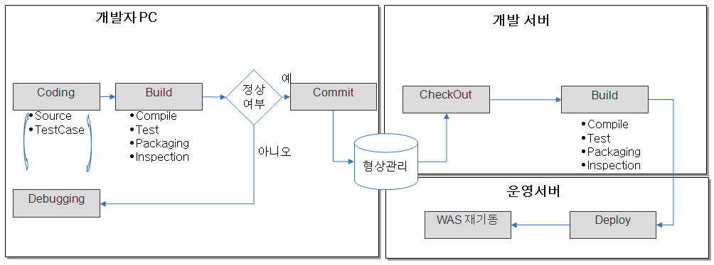

# Build Tool

## 개요

빌드 도구는 개발자 PC에서 빌드를 실행시켜 작동 가능한 코드를 생성하는 개인 빌드와 개발 서버에서 프로젝트의 개발자들이
작성한 코드를 통합하여 빌드를 수행하는 통합 빌드로 구성되며 전자정부 표준 프레임워크에서는 개인빌드와 통합 빌드를 위해 Maven과 오픈 소스 CI 서버인 Hudson을 빌드 도구로 제공하고 있다.

## 설명

**소프트웨어 프로젝트 빌드 프로세스**

* 개인 빌드
  1. 개발자가 소프트웨어 소스 코드를 작성한다.
  2. 개인 빌드를 통해 실행 가능한 바이너리 코드를 생성한다.
  3. 정상 코드 여부를 판별후 형상 관리 서버로 작성한 코드를 commit한다.
* 통합 빌드
  1. 개발 서버는 형상 관리 서버로부터 최신의 소스 코드를 check out 받는다.
  2. 주기적 자동 빌드 프로세스를 통해 코드 빌드 후 동작 가능한 소프트웨어 패키지를 생성한다.
  3. 운영 서버로 패키징한 소프트웨어를 배포한다.
* 운영서버의 WAS 재기동 작업을 통하여 작성한 소프트웨어를 실행시킨다.

