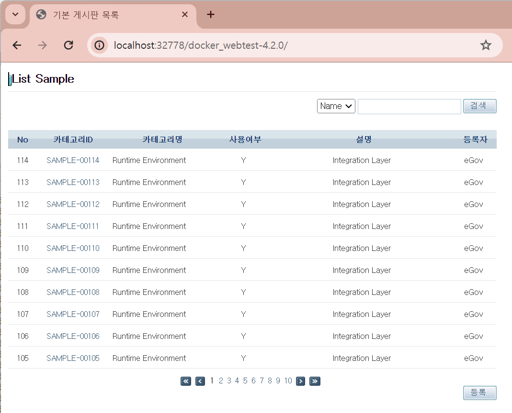

## 개요

본 가이드는 이클립스 플러그인 Docker Tooling 사용 가이드를 제공한다.

사용자는 기본 도커(Docker)에 대한 기본적인 지식 있는다는 것을 가정하였다.

* 도커 관련 기본 내용은 도커사이트에서 [https://www.docker.com](https://www.docker.com/) 확인 가능하다.

## 들어가기 전에

본 가이드의 환경은 다음과 같다.

- WIndows 11 home
- 표준프레임워크 개발자용 개발환경 4.2.0
- Windows Docker Desktop v4.26.0 (Docker Engine 24.0.7) - Eclipse Docker Tooling 5.9.0

✔ 표준프레임워크 개발자용 개발환경에는 Docker tooling이 이미 설치되어있어 별도의 설치가 필요 없다.

## 설치

### 1. Docker Tooling 플러그인 설치

Eclipse에서 Help > Eclipse Marketplace 클릭

Find 상자에 “Docker”를 입력 Docker Tooling 을 찾아 Install을 클릭

설치 마법사의 지시에 따라 설치를 완료한다.

설치가 완료되면 Eclipse를 재시작하여 Docker 도구 기능을 활성화한다.

### 2. Docker Desktop 설치

Docker Desktop은 개발자가 컨테이너를 쉽게 만들고 관리할 수 있도록 도와주는 애플리케이션이다.

설치 링크 :

* [https://docs.docker.com/desktop/release-notes/](https://docs.docker.com/desktop/release-notes/)

OS에 맞는 버전을 설치한다.

✔ Docker Tooling이 최신의 Docker Engine과 호환이 되지 않을 수 있다.

본 가이드에서는 Docker Desktop 4.26.0 (Docker Engine 24.0.7)을 설치하여 진행하였다.

다운로드한 Docker Desktop Installer.exe 또는 Docker.dmg 파일을 실행 후

설치 마법사를 따라 설치를 진행한다.

Docker 데몬을 TLS 없이 로컬 호스트에서 2375 포트를 통해 TCP로 노출하기 위해

Docker 설정에서 아래 구문의 체크박스를 체크한다.

* Expose daemon on tcp://localhost:2375 without TLS 

Docker 데몬은 기본적으로 Unix 소켓을 통해 통신하지만, TCP 포트를 사용하여 외부에서 접근 가능하도록 설정할 수 있다.

하지만 TLS 없이 노출하면 원격 코드 실행 공격에 취약해질 수 있으니 주의해야 한다.

설정 후 반드시 Docker restart를 진행한다.

## 사용법

### 1. Docker 연결

#### 1. Docker Explorer View

Window > Show View > Other…로 이동

Show View 대화상자에서 Docker를 확장하고 Docker Explorer를 선택한다.

Docker Tooling이 자동으로 Docker를 감지한다.

자동으로 설정이 되지 않을 경우, 직접 설정한다.

Docker Explorer에서 New connection…을 클릭한다.

#### 2. Docker Connection

* Connection name : 연결 이름을 입력한다.
* Use custom connection settings : 이 옵션을 체크하여 사용자 지정 연결 설정을 사용한다.
* Unix socket : Unix 소켓 주소를 입력한다.
  Linux / Mac 사용자에게는 로컬 데몬이 실행 중인 경우 기본적으로 Unix 소켓이 설정된다.

> 예) unix:///var/run/docker.sock

* 단, Linux 사용자가 Docker의 기본 엔진이 아닌 Docker Desktop의 엔진과 연결하려는 경우, 다음의 Unix 소켓과의 연결을 추가해야 한다.

> 예) unix:///home/{USER}/.docker/desktop/docker.sock

  

  

  

* TCP Connection : Windows 시스템에서는 TCP 주소를 입력한다.

> 예) tcp://localhost:2375

* Enable authentication : 인증이 필요한 경우 체크박스를 클릭하고 인증 파일의 경로를 입력한다.
* Test Connection : 설정이 완료되면 Test Connection 버튼을 클릭하여 연결이 제대로 설정되었는지 확인한다.
* Finish : 테스트가 성공하면 Finish 버튼을 클릭하여 연결을 완료한다.

### 2. Docker 메뉴 소개

#### 1. Docker Explorer View

* Show in > Properties : 선택한 항목의 속성 확인
* Edit : 연결 설정을 수정
* Enable : 연결을 활성화
* Refresh : 연결 새로 고침
* Remove : 연결 제거
* Pull : Docker 저장소에서 이미지를 가져오기

* Start : 시작
* Pause : 일시 중지
* Unpause : 일시 중지 해제
* Stop : 중지
* Kill : 강제 종료
* Restart : 재시작
* Show in > Properties View : 속성 보기에서 표시
* Open Image Hierarchy : 이미지 계층 열기
* Execute Shell : 쉘 실행
* Copy from Container : 컨테이너에서 복사
* Copy to Container : 컨테이너로 복사
* Remove : 제거
* Commit : 컨테이너를 이미지로 커밋
* Display Log : 로그 표시
* Remove Log : 로그 제거

* Run : 컨테이너를 빌드하고 실행
* Show in > Properties View : 속성 보기에서 표시
* Open Image Hierarchy : 이미지 계층 열기
* Remove : 제거
* Push : 이미지를 레지스트리에 푸시
* Add Tag : 이미지에 태그 추가
* Remove Tag : 여러 태그가 있는 Docker 이미지에서 특정 태그를 제거한다.

#### 2. Docker Images View

1. Pull : 저장소에서 이미지 가져오기
2. Push : 이미지를 저장소로 푸시
3. Create : 이미지로부터 컨테이너 생성
4. Build : Dockerfile로부터 이미지 빌드
5. Tag : 이미지에 태그 추가
6. Delete : 이미지 삭제
7. Refresh : 이미지 목록 새로 고침

#### 3. Docker Containers View

1. Start : 중지된 컨테이너 시작
2. Pause : 일시 중지
3. Unpause : 일시 중지 해제
4. Stop : 실행 중인 컨테이너 중지
5. Kill : 실행 중인 컨테이너 강제 종료
6. Restart : 컨테이너 재시작
7. Remove : 중지된 컨테이너 삭제
8. Refresh : 컨테이너 목록 새로 고침

### 3. 이미지 관리

#### Pull Image

* Registry account : 기본적으로 Docker Hub 레지스트리가 사용된다.
* Add a registry account… : 추가 개인 레지스트리를 지정할 수 있다.
* Image name 또는 Search… : 다운로드할 이미지의 전체 이름을 입력하거나 Search 버튼을 사용하여 이미지를 검색할 수 있다.

* Search 버튼을 클릭하여 검색어를 입력한다. 예를 들어, “httpd”를 검색하면 “httpd”와 관련된 모든 리포지토리가 나열된다.
* 검색 결과에서 원하는 리포지토리를 선택한다.
* Next 버튼을 클릭한다.

* 해당 리포지토리에서 사용할 수 있는 모든 태그들이 표시된다. 원하는 태그를 선택 후 Finish 버튼을 클릭한다.

#### Push Image

* 외부 또는 로컬 레지스트리를 지정하려면 Tag Image 기능을 사용하여 레지스트리 지정자와 함께 기존 이미지에 새 태그를 추가한 후 해당 태그를 푸시한다.
* 지정된 리포지토리에 대한 인증이 필요한 경우, Window → Preferences → Docker → Registry Accounts에서 레지스트리 계정을 추가할 수 있다.
* force taggind image with selected registry : 클라이언트에 태그를 강제로 적용한다.
* keep tagged image upon completion : 새 태그로 이미지를 푸시할 때, 푸시 완료 후에도 태그를 유지할지 여부를 지정한다.

#### Run Image

* Image : 실행하려는 이미지
* Container Name : 컨테이너의 이름을 지정
* EntryPoint : 컨테이너를 실행 가능한 파일로 설정하는 옵션
* Command : 컨테이너가 시작될 때 실행할 명령어 (이미지에 기본 명령이 있는 경우, 비워 두어도 됨)
* Ports : 컨테이너의 포트를 노출 및 설정
* Links : 다른 컨테이너에 링크
* Keep Stdin Open to Console even if not attached : 콘솔에서 입력을 허용하도록 설정
* Allocate pseudo-tty from Console : 컨테이너에 TTY를 할당
* Automatically remove the Container when it exits : 종료 시 컨테이너를 자동으로 제거
* Give extended privileges to this container : 컨테이너에 추가 권한을 부여
* Use unconfined seccomp profile : ptrace와 같은 특수 시스템 호출을 사용하는 프로그램을 실행할 때 사용
* Add basic security : 악성 응용 프로그램으로부터 보호하기 위해 몇 가지 권장 옵션을 추가

* Data Volumes : 호스트 볼륨을 컨테이너에 마운트하거나 다른 컨테이너의 볼륨을 마운트할 수 있다.
* Environment Variables : 컨테이너에서 사용할 환경 변수를 지정한다.
* Labels : 컨테이너에 라벨을 제공하여 컨테이너 보기에서 필터링할 수 있다.
* Enable Resource Limits : 컨테이너의 메모리 또는 CPU 우선 순위를 제한하는 데 사용한다.

* 네트워크 모드 설정

#### Build Image

* Name : repo:tag 형식으로 새 이미지의 이름을 지정
* Directory : Dockerfile이 포함된 디렉토리를 지정하고 “Browse” 및 “Edit” 버튼을 사용하여 파일을 선택 및 수정

### 4. 컨테이너 관리

* Commit : 컨테이너의 모든 변경 사항을 새로운 이미지로 커밋
* Restart : 컨테이너 재시작
* Display Log : 로그 보기
* Remove Log : 로그 제거
* Open Image Hierarchy : 컨테이너의 이미지 계층표시
* Copy from Container : 컨테이너에서 호스트로 파일 복사
* Copy to Container : 호스트에서 컨테이너로 파일 복사
* Execute Shell : 실행 중인 컨테이너에서 셸을 실행

##### 로그 보기

* 컨테이너 선택 > 마우스 오른쪽 버튼 > Display Log
* TTY 플래그 설정 여부에 따라 Terminal View 또는 Console View에 로그가 표시된다.
* 로그 설정 변경 : Window → Preferences → Docker → Logging 에서 로그 설정을 변경할 수 있다.

### 5. 프로젝트와 통합

#### 1. Dockerfile

* 참고 : Docker를 활용한 표준프레임워크 기반 프로그램의 도커 이미지 제작 - [docker](./docker.md)

#### Step 1. 표준프레임워크 개발환경에서 템플릿 샘플 프로젝트를 생성한다

##### 생성 과정은 위 “Docker 파일(Dockerfile)을 활용한 이미지 제작”을 참조하여 프로젝트 및 Dockerfile을 생성한다.

#### Step 2. Docker Image 생성

1. Docker Images View에서 Build 버튼을 클릭한다.

   
2. 이미지 빌드

   

   * Image Name : 필드에 새 이미지의 이름을 입력한다. ('repo:tag' 형식으로 지정한다.)
   * Directory : DockerFile이 포함된 디렉토리를 지정한다.

     * Edit Dockerfile 클릭하면 파일 수정이 가능하다.

     
3. Finish 클릭한다. Console에서 결과를 확인할 수 있다.

   

#### Step 3. Docker Image 실행 및 테스트

1. 제작된 이미지를 실행한다.

   
2. 콘솔에서 실행결과를 확인할 수 있다.

   
3. 웹 브라우저에서 해당 사이트를 확인 및 테스트를 한다.

   

#### 2. Docker Compose

1. Docker Preference에서 설정할 수 있다. (Window > Preferences > Docker)
2. Docker-compose의 위치를 지정한다.
   (defalut - Linux and Mac : /usr/local/bin Win : C:\Program Files\Docker\Docker\resources\bin)

   
3. docker-compose.yml 파일을 선택하고 Run > Docker Compose를 실행한다.

   

## 참고

* [https://marketplace.eclipse.org/content/eclipse-docker-tooling?mpc=true&amp;mpc_state=](https://marketplace.eclipse.org/content/eclipse-docker-tooling?mpc=true&mpc_state=)
* [https://help.eclipse.org/latest/index.jsp?topic=%2Forg.eclipse.linuxtools.docker.docs%2FLinux_Tools_Project%2FDocker_Tooling%2FUser_Guide%2FUser-Guide.html](https://help.eclipse.org/latest/index.jsp?topic=%2Forg.eclipse.linuxtools.docker.docs%2FLinux_Tools_Project%2FDocker_Tooling%2FUser_Guide%2FUser-Guide.html)
