# 컨테이너 가상화(Docker)를 활용한 전자정부 표준프레임워크 기반 프로그램의 도커 이미지 제작

## 1. 개요

본 가이드는 컨테이너 가상화 기술인 도커(Docker)를 활용하여 전자정부 표준프레임워크의 기반 응용프로그램(Web Application)의 도커 이미지 제작 가이드를 제공한다.

본 가이드의 사용자는 기본 도커(Docker)에 대한 기본적인 지식 있는다는 것을 가정하였다.

* 도커 관련 기본 내용은 도커사이트에서 [https://www.docker.com](https://www.docker.com/) 확인 가능하다.

### 특징

표준프레임워크 개발환경에 도커 이미지 제작을 통하여 아래와 같은 특징으로 적용 효과를 제시한다.

* 호스트 OS 와 서비스 운영 환경 분리
* 다양한 환경의 플랫폼 실행 가능
* 컨테이너 호환성 및 경량화
* 클라우드보다 진보된 Container 서비스
* 마이크로서비스 기반의 Container로 자원 효율성 향상

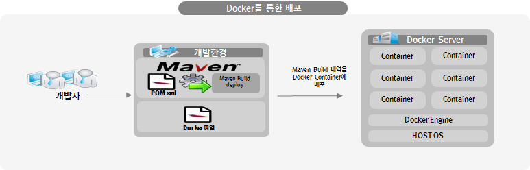

### 도입 효과

* 각종 컴포넌트의 독립적인 실행환경 보장으로 콤포넌트의 가용성 향상
* 마이크로서비스 기반 독립성 보장으로 여러 서비스에 대한 실행 및 가용성 향상
* 도커(Docker) 기반으로 서비스를 제공 시 서버 구축 비용절감 효과
* 도커(Docker) 기반 서비스 개발 및 운용 시 각 서비스의 통일성 보장

### 가이드 진행

##### 본 가이드는 아래와 같은 단계에 따라 순서대로 진행된다.

1. 전자정부 표준프레임워크 기반 응용프로그램의 도커(Docker) 이미지 제작

* 도커파일(Dockerfile)을 활용한 이미지 제작
* 메이븐(Maven) 빌드 시 플러그인(docker-maven-plugin)을 활용한 도커 이미지 제작

2. 제작된 도커 이미지 실행 및 테스트

본 가이드를 진행한 구현도구 및 환경정보는 다음과 같다.

| 항목 | 설명                                                   | 비고                                                        |
| ---- | ------------------------------------------------------ | ----------------------------------------------------------- |
| OS   | Windows 11 home                                        |                                                             |
| 도커 | 윈도우용 Docker Desktop v4.26.0 (Docker Engine 24.0.7) | 윈도우 환경의 경우 Docker Toolbox를 통한 가상 도커환경 설정 |

## 2. 전자정부 표준프레임워크 기반 응용프로그램의 Docker 이미지 제작

응용프로그램의 Docker 이미지화를 위하여 2가지의 방법을 제시한다.

##### 1. Docker파일(Dockerfile)을 통하여 베이스 이미지와 같이 실행 가능한 환경을 구성하며, Docker 데몬에서 Docker파일 빌드를 통한 도커 이미지를 제작 및 테스트를 진행한다.

##### 2. 메이븐(Maven) 빌드 시 플러그인(docker-maven-plugin)을 활용하여 도커 이미지를 제작과 Docker 이미지를 주입하여 테스트를 진행한다.

* [주의] 도커 메이븐 플러그인(docker-maven-plugin)은 도커의 정식 지원 버전이 아닌 도커 커뮤니티의 개인 개발자 오픈 소스이므로 안전성 및 기술지원(bug patch) 사항은 도입 전 충분한 검증을 통하여 도입이 되어야 한다.

### 테스트 환경의 도커 버전 확인

#### Step 1. 도커 버전 확인

##### 실습이전 OS환경에 맞추어 도커를 설치하며 설치 자료 및 문서는 도커 사이트 [[https://www.docker.com]] 에서 제공 받아 설치한다.

##### 도커 콘솔에서 아래의 명령어로 버전을 확인 할 수 있다.

```
$ docker version

```

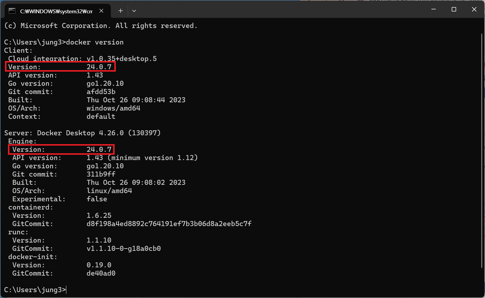

[참고] 본 가이드의 도커 버전과 동일 할 필요는 없으나 이하 버전 및 최신 버전에서 가이드에서 사용한 API 및 구조가 변경 될 수 있으며, 도커 버전별 상이한 API 및 구조는 도커 사이트에서 확인 할 수 있다.

### Docker 파일(Dockerfile)을 활용한 이미지 제작

표준프레임워크 응용프로그램은 표준프레임워크의 템플릿을 활용하며, Docker파일(Dockerfile)을 추가 및 실행가능한 이미지를 제작하여 테스트를 한다.

#### Step 1. 표준프레임워크 개발환경에서 제공하는 템플릿 웹 응용프로그램 제작

##### 1. 개발환경에서 eGovframe &gt; Start &gt; New Web Project 선택한다.

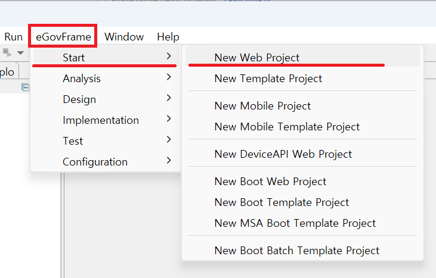

##### 2. 프로젝트 이름을 기입 후 (예: docker.webtest) 하단의 “Next” 버튼 클릭한다.

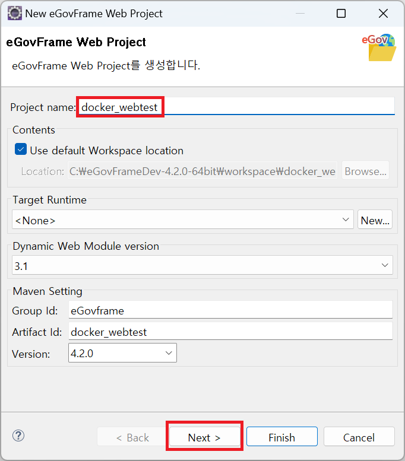

##### 3. “Generate Exmple”을 선택 후 하단의 “Finish” 버튼을 클릭하여 템플릿 프로잭트를 생성한다.

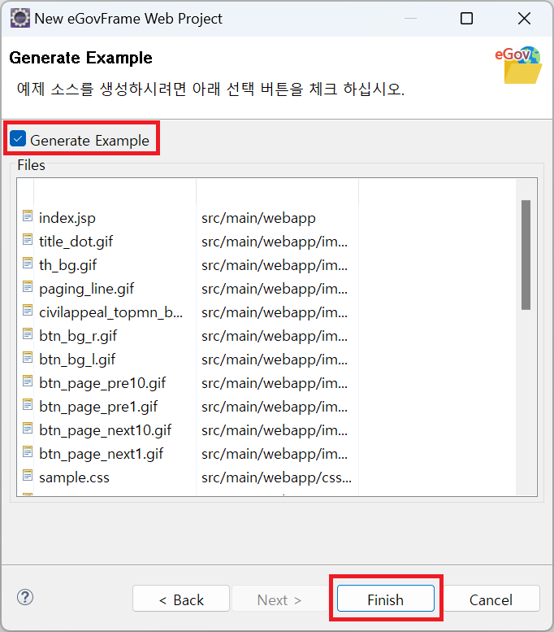

##### 4. 생성된 템플릿 프로젝트를 아래와 같이 확인 할 수 있다.

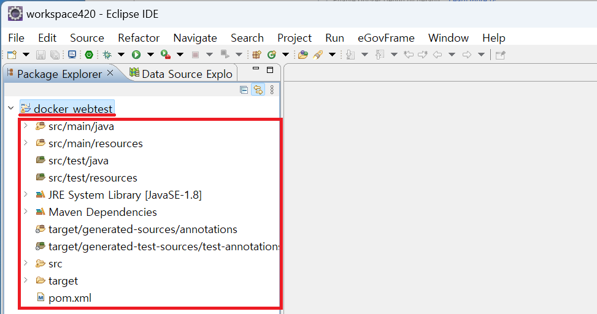

##### 5. 메이븐 빌드를 통해 war파일 생성한다.

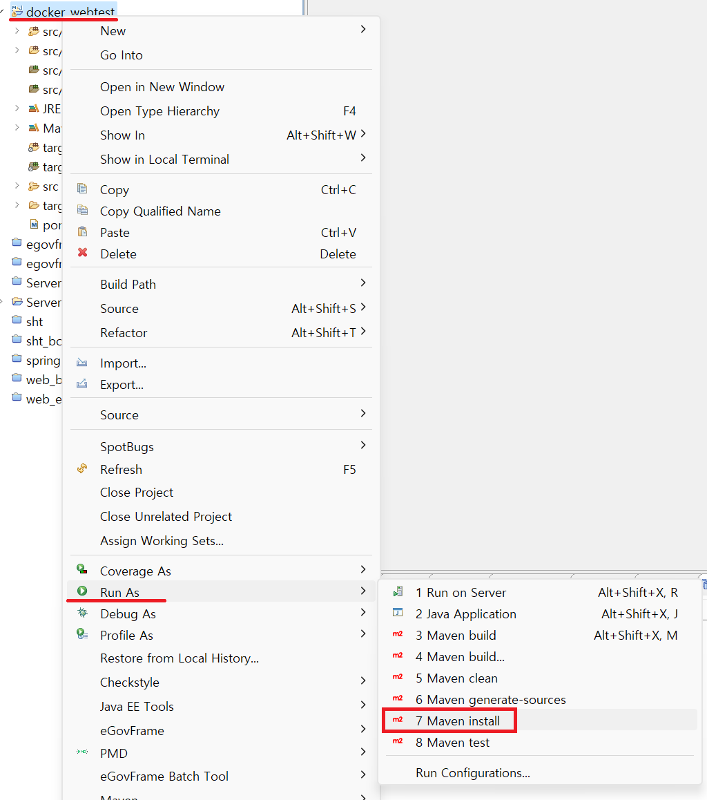

##### 6. 정상적으로 빌드가 되면 war파일의 이름과 위치를 확인한다.

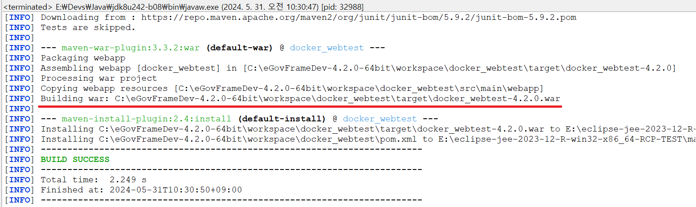

#### Step 2. 도커 이미지를 제작을 위한 Docker 파일(Dockerfile) 생성 및 스크립트 제작

##### 1. 프로젝트 내에 Docker파일을 생성한다.

(프로젝트명 마우스 오른쪽 버튼 클릭 후 “New” > “File”을 선택한다.)

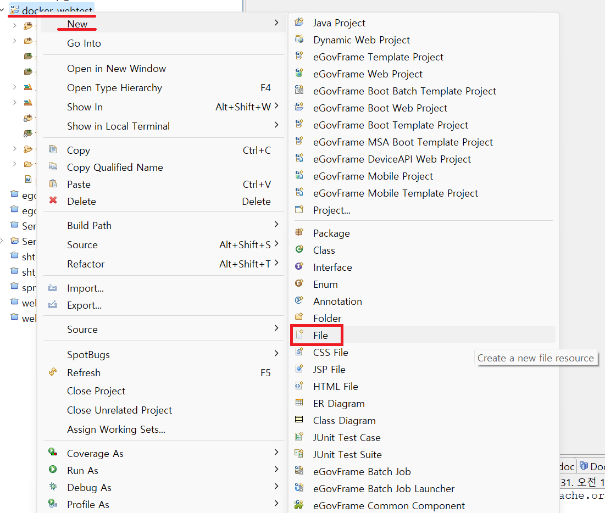

##### 2. 파일 이름(예:Dockerfile)을 지정하고 “Finish” 버른을 클릭하여 파일을 생성한다.

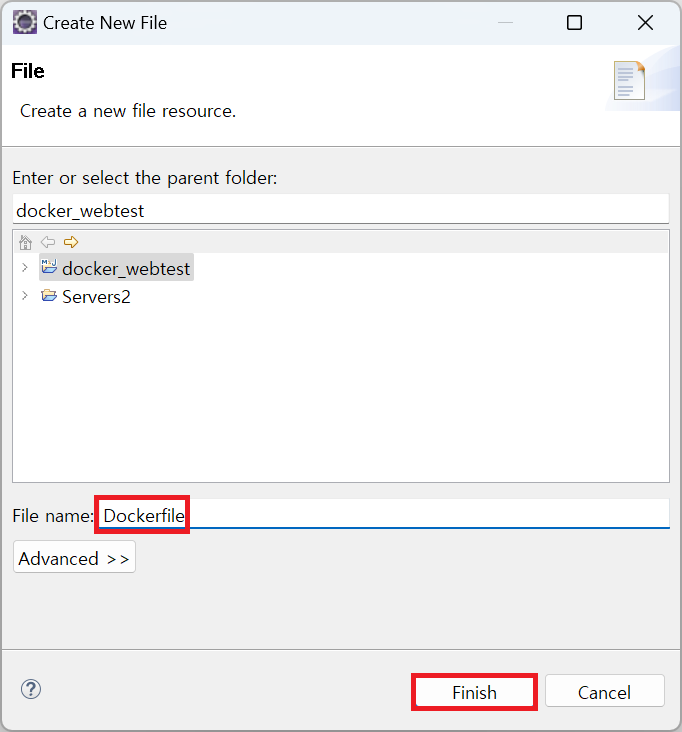

##### 3. 생성된 Docker파일에 아래와 같은 스크립트를 추가 한다.

```dockerfile
# 베이스 이미지 설정
FROM tomcat:9.0

# 작성자 정보
LABEL eGovframe Center

# WAR 파일을 Tomcat의 웹 애플리케이션 디렉터리에 추가
COPY ./target/docker_webtest-4.2.0.war /usr/local/tomcat/webapps/

# Tomcat을 포어그라운드에서 실행
CMD ["catalina.sh", "run"]
```

* [참고] docker_webtest-4.2.0.war 파일은 Step 1에서 빌드 시 생성된 파일명을 사용한다.

#### Step 3. Docker에서 Docker파일을 빌드하여 도커 이미지 제작

##### 1. 도커콘솔에서 Docker파일이 있는 디렉토리로 이동하여 Docker파일을 확인한다.

```bash
$ cd path-to-workspace/docker_webtest

$ ls

Dockerfile pom.xml src/ target/
```

##### 2. Docker파일을 아래와 같은 명령어로 빌드하여 이미지를 제작한다.

(예: 도커 이미지명을 egovframe/webtest 이며, 태그를 v1로 설정한다.)

```bash
$ docker build –t egovframe/webtest:v1 .
```

* -t 옵션을 사용하여 태그를 설정한다.
* 자세한 옵션 설정은 docker build –help를 통하여 확인 가능하다.
* 명령어 마지막 뒤의 점(.)을 꼭! 잊지 말고 입력하여야 한다.

##### 3. 빌드가 성공적으로 이루어지면 아래와 같이 이미지를 확인 할 수 있다.

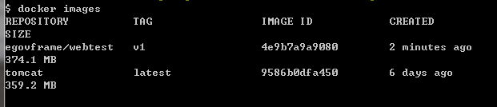

#### Step 4. 도커이미지 실행 및 테스트

##### 1. 제작된 이미지를 아래와 같은 명령어로 실행한다.

(예: Tomcat의 기본 포트를 8080 사용하여 컨테이너에서도 동일한 포트를 사용하도록 설정한다.)

```bash
$ docker run –t –i –p 8080:8080 egovframe/webtest:v1
```

* Run 에 대한 옵션은 –help통하여 상세한 정보를 확인 할 수 있다.

##### 2. 도커 이미지를 통하여 정상적으로 웹 어플리케이션이 실행되는지 확인 할 수 있다.

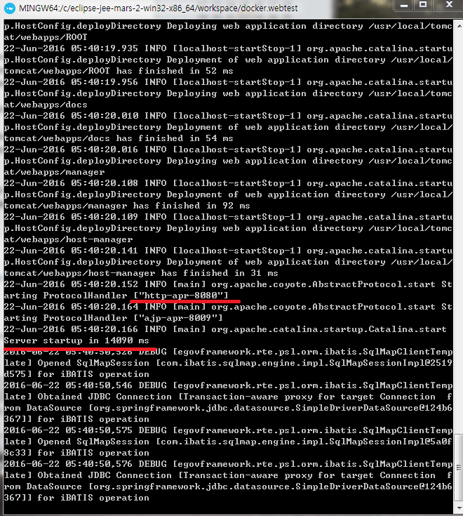

##### 3. 웹 브라우저에서 해당 사이트를 확인 및 테스트를 한다.

> (예: http://192.168.99.100:8080/sample-3.5.0/)

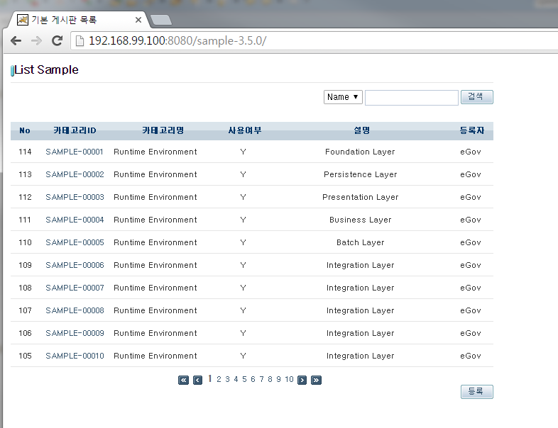

### 메이븐(Maven) 빌드 시 플러그인(docker-maven-plugin)을 활용하여 도커 이미지 제작

메이븐 빌드 시 플러그인을 사용하여 빌드된 war파일과 베이스 이미지를 docker daemon에 직접 주입한다.

#### Step 1. 표준프레임워크 개발환경에서 템플릿 샘플 프로젝트를 생성한다.

  생성 과정은 위 “Docker 파일(Dockerfile)을 활용한 이미지 제작”을 참조한다.

#### Step 2. POM의 `<build>` 태그 내에 아래와 같은 플러그인 스크립트를 추가한다.

```xml
 
<!-- Docker Maven Plugin -->
 
<plugin>
 
    <groupId>com.spotify</groupId>
    <artifactId>docker-maven-plugin</artifactId>
    <version>0.4.10</version>
 
    <configuration>
 
        <imageName>egovframe/webtest</imageName>
        <baseImage>tomcat</baseImage>
        <entryPoint>["catalina.sh", "run"]</entryPoint>
 
        <resources>
            <resource>
                <targetPath>/usr/local/tomcat/webapps/</targetPath>
                <directory>${project.build.directory}</directory>
                <include>${project.build.finalName}.war</include>
            </resource>
        </resources>
 
        <dockerHost>https://192.168.99.100:2376</dockerHost>
        <dockerCertPath>C:\\Users\\[컴퓨터사용자이름]\\.docker\\machine\\certs</dockerCertPath>			                 
 
    </configuration>
 
</plugin> 
 
<!-- end Docker Maven Plugin -->
```

* 메이븐 도커 플러그인은 com.spotify 플러그인을 사용하였으며 아래 주소를 통하여 상세한 정보를 확인 할 수 있다. [https://github.com/spotify/docker-maven-plugin](https://github.com/spotify/docker-maven-plugin)
* Spotify/docker-maven-plugin은 정식 지원 버전이 아닌 개인 개발자 OSS이므로 버전별 지원사항 및 기능이 임의로 변경 및 삭제될 수 있으므로 주의하여 사용하여야 한다.
* 메이븐 플러그인(도커)는 TLS통신 통하여 Romote로 API를 사용하므로 TLS통신을 위한 ip:port 정보와 인증서를 사용하여 접속이 이루어 진다. (기본포트:2376)
* 윈도우용 도커 TLS인증서는 윈도우용 도커 설치시 아래와 같은 경로에 자동으로 설정된다.

> (예: C:\Users\[컴퓨터사용자이름]\.docker\machine\certs)


#### Step 3. 메이븐(Maven) 빌드를 통하여 docker daemon에 이미지 제작

##### 1. 샘플 프로젝트에서 메이븐 빌드를 시작한다.

> (예: 프로젝트명 마우스 오른쪽 클릭 > Run As > Maven build)

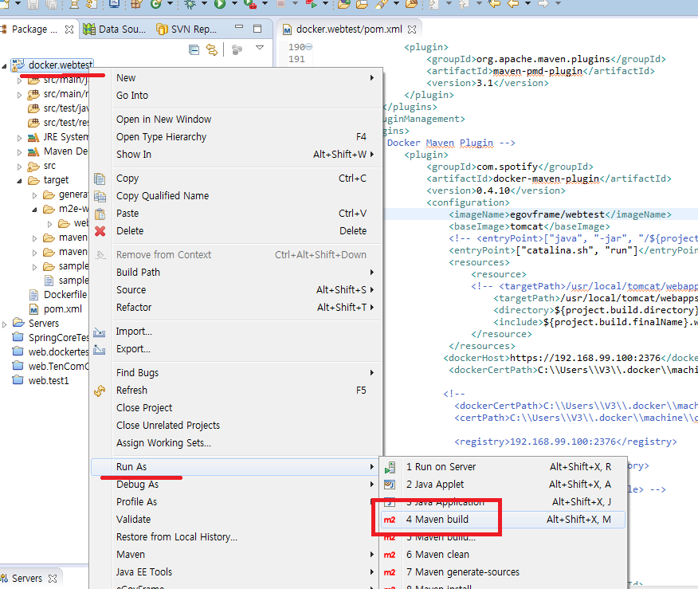

##### 2. 빌드 Goals에 “clean package docker:build” 명령어를 추가하여 실행한다.

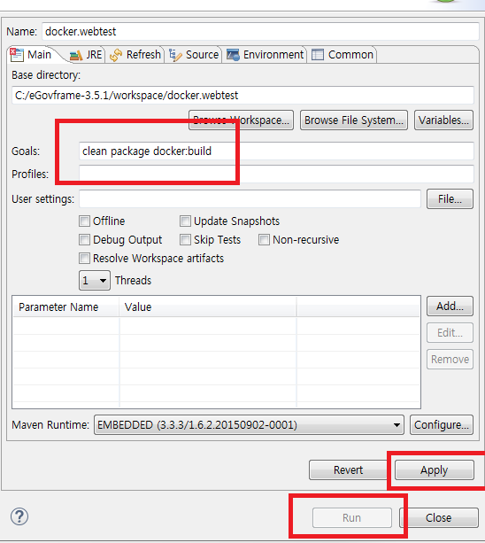

##### 3. 정상적으로 빌드 시 아래와 같은 메시지를 확인 할 수 있다.

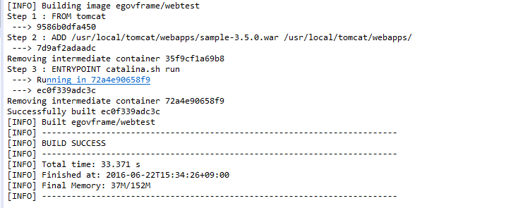

##### 4. Docker에도 아래와 같이 주입된 이미지를 확인 할 수 있다.

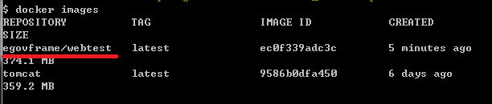

##### 5. 도커 이미지의 실행은 위 “Docker 파일(Dockerfile)을 활용한 이미지 제작”을 참조한다.

### 이클립스 플러그인 Docker Tooling을 활용하여 도커 이미지 제작

Docker Tooling을 활용한 도커 이미지 제작은 아래 링크의 “사용법 5. 프로젝트와 통합”을 참조한다.

[docker_tooling](./docker-tooling.md)

## 3. 참고 사항

### 우분투 환경에서 Docker 설치 및 Docker 계정에 Root 권한 부여

[https://docs.docker.com/engine/installation/linux/ubuntulinux/](https://docs.docker.com/engine/installation/linux/ubuntulinux/) 가이드에 맞추어 설치

* Docker 및 docker-engine 까지 설치
* 도커 그룹을 생성하고 root 권한을 부여 하여야함.
* 권한이 주어졌으면 아래와 같이 테스트로 확인함.

```bash
$ docker run hello-world
```

### 리눅스 환경의 도커에서 Romote API를 사용하여 docker daemon 통신하기

리눅스 환경의 도커에 SSL(HTTPS) 통신을 하기 위해서는 클라이언트 측에서 인증서(CA-Certification)가 있어야 하며 Openssl 통하여 서버키 및 클라이언트용 키를 생성하여 접속이 가능하다.

아래의 내용을 참조하여 리눅스 내 Docker 설정 및 인증서를 활용할 수 있다.

* Protect the Docker daemon socket [https://docs.docker.com/engine/security/https/](https://docs.docker.com/engine/security/https/)

## 4. 참고 자료

* 도커 사이트 [https://www.docker.com/](https://www.docker.com/)
* 도커 메이븐 플러그인 [https://dmp.fabric8.io/](https://dmp.fabric8.io/) , [https://github.com/fabric8io/docker-maven-plugin](https://github.com/fabric8io/docker-maven-plugin)
