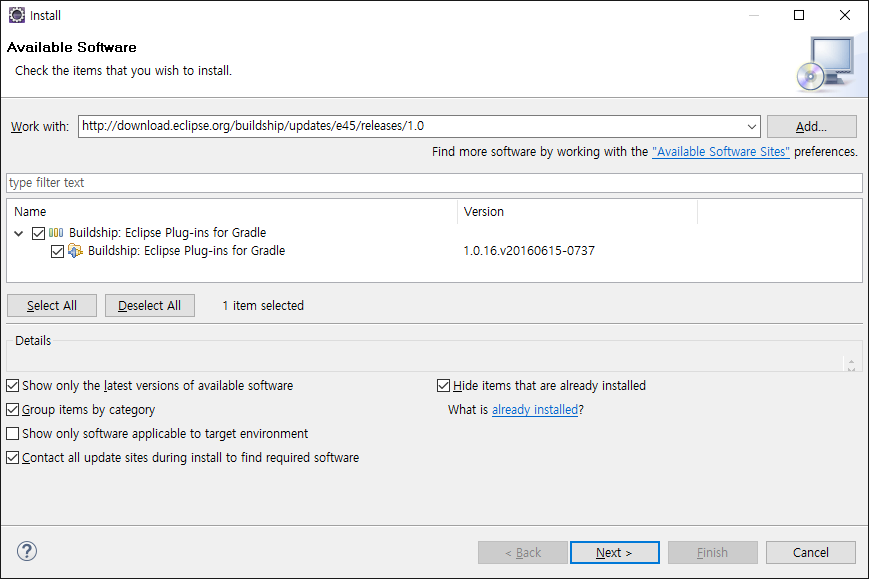
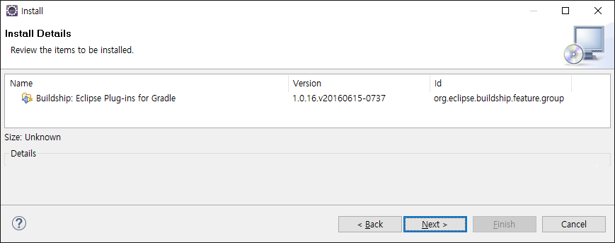
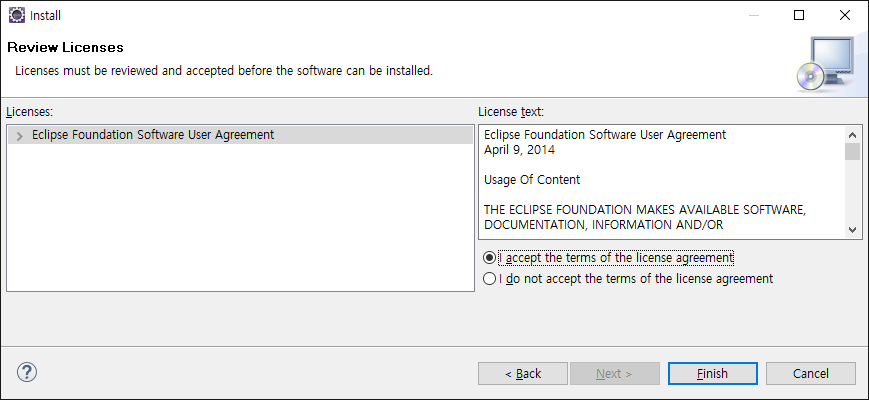
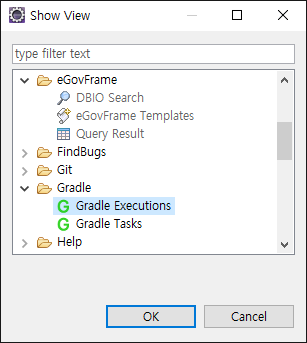
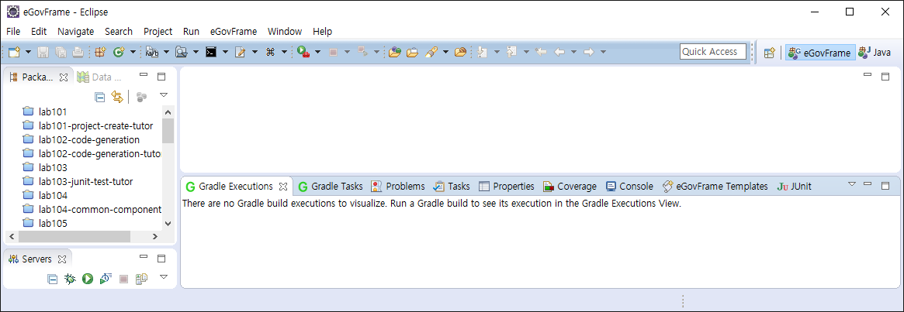
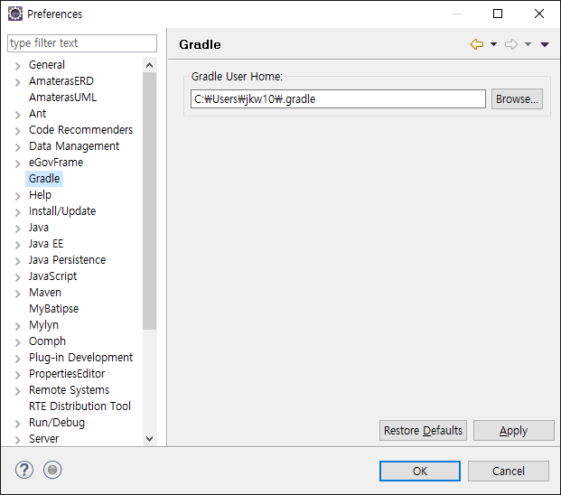
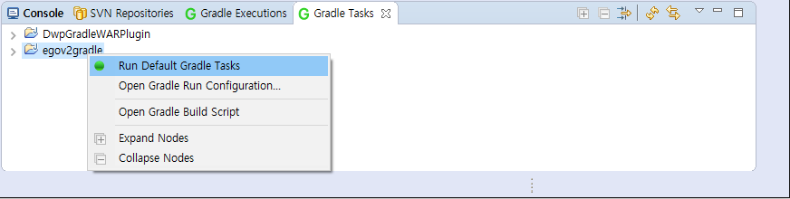
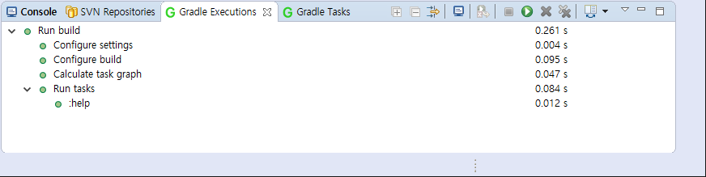

# 구현도구 플러그인(Buildship)

## 개요

전자정부 개발 프레임워크의 개발환경 IDE에서는 Gradle 빌드 플러그인으로 Buildship을 사용하고 있다.
Buildship 플러그인은 Eclipse에서 제공하는 플러그인으로서 Gradle 프로젝트 개발의 편의성을 제공하고 있다.

## 설명

### Buildship의 특징

1. 이클립스에서 gradle을 운영할 모듈 설정
2. Gradle 프로젝트 생성(craete), 등록(import) 위자드(wizards) 제공
3. 이클립스에서의 gradle build 실행 및 Task 조회(View), 실행(Execution) 등의 기능 제공

### Buildship의 설치

eclipse에서 제공하는 Buildship은 Help > Install New Software 에서 아래 업데이트 사이트를 이용해 설치한다.

* Eclipse Mars update site : [http://download.eclipse.org/buildship/updates/e45/releases/1.0](http://download.eclipse.org/buildship/updates/e45/releases/1.0)

* Eclipse Mars(4.5) 이전버전의 경우 다음 배포사이트 참고
  [https://github.com/eclipse/buildship/blob/master/docs/user/Installation.md](https://github.com/eclipse/buildship/blob/master/docs/user/Installation.md)

  

  

  

  * Gradle 퍼스팩트 뷰

  

  

* Neon(4.6) 버전 부터는 [http://download.eclipse.org/releases](http://download.eclipse.org/releases) 의 해당 배포버전을 따른다.

  > Neon : [http://download.eclipse.org/releases/neon](http://download.eclipse.org/releases/neon)

### Eclispe 설정

* Eclipse Preferences 설정창에서 Gradle의 실행 모듈의 위치를 지정할 수 있다.
  
  

### Task 작업

* Gradle Task 창을 이용한 Task 실행
  * Run Default Gradle Tasks : 기본 task 실행
  * Open Gradle Run Configuration… : gradle 실행 설정 마법사 열기
  * Open Gradle Build Scritp : 빌드 스크립트 파일(build.gradle) 열기
  * Expand Nodes : Tasks 노드 확장
  * Collapse Nodes : Tasks 노드 축소

    

* Gradle Excutions 창으로 실행결과 확인
  * gradle build 과정에서의 상태를 표시하며, 진행중인 작업을 취소할 수 있다.

    
