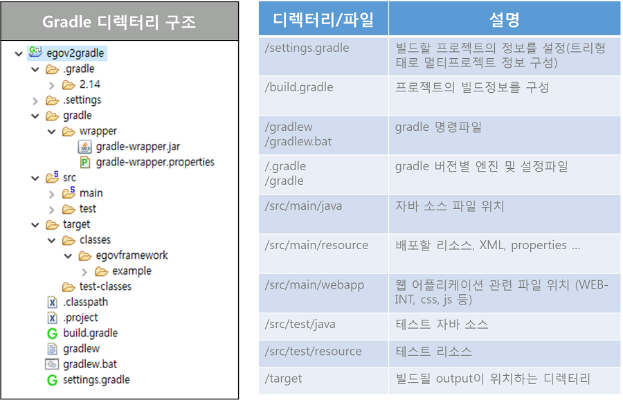

# 개인 빌드 (Gradle)

## 설명

Gradle은 Groovy를 기반으로 한 오픈소스 빌드 도구이다. Ant의 자유도와 Maven의 관례를 통한 접근성을 바탕으로 이전 빌드툴의 단점을 보완하여 개선된 서비스를 제공한다.

## 특징

* Ant처럼 매우 유연한 범용 빌드 도구.
* Maven과 같은 구조화 된 build프레임워크 (구조의 전환이 가능).
* Maven, Ivy등의 기존 저장소 인프라 또는 pom.xml 파일과 ivy.xml 파일에 대한 migration의 편이성 제공
* 멀티 프로젝트 빌드 지원.
* 의존성 관리의 다양한 방법 제공
* Build script를 xml이 아닌 Groovy 기반의 DSL(Domain Specific Language)을 사용
* 기존 Build를 구성하기 위한 풍부한 도메인 모델 제공.
* Gradle 설치 없이 Gradle Wrapper를 이용하여 빌드 지원

### 장점

Ant, Maven과 같은 기존의 빌드툴은 xml형식을 이용하여 정적인 설정정보를 구성했다.
Gradle은 Groovy라는 언어를 이용하여 코드로서 설정정보를 구성하기 때문에 구조적인 장점이 있다.

* xml의 구조적인 틀을 벗어나 코딩에 의한 간결한 정의가 가능하다.
* 프로젝트를 설정주입방식으로 정의하기 때문에 maven의 상속 구조보다 재사용에 용이하다.

## 기본구조

* 모든 Gradle script는 하나 이상의 project로 구성되며, 모든 프로젝트는 하나이상의 task로 구성된다.
  * Project : 소스를 jar로 모으거나, 자바 프로젝트를 컴파일하거나, 테스트를 실행하고, 어플리케이션을 배포하는 등의 업무로 구성된다.
  * Task : 작업의 최소단위이다.
    Task간 의존관계 설정과 함께 흐름에 따른 구성이 가능하며, 동적인 스크의 생성도 가능하다. Gradle Tasks
* Gradle은 자바6버전 이상의 VM환경에서 사용이 가능하며, 설치를 하거나 gradle wrapper를 이용하여 실행환경을 구성할 수 있다.

### Build Lifecycle

Build 3단계 [Gradle Build Lifecycle](https://docs.gradle.org/current/userguide/build_lifecycle.html)

1. 초기화(Initialization) : 빌드 대상 프로젝트를 결정하고 각각에 대한 Project 객체를 생성.
   settings.gradle 파일에서 프로젝트 구성 (멀티프로젝트, 싱글프로젝트 구분)
2. 구성(Configuration) : 빌드 대상이 되는 모든 프로젝트의 빌드 스크립트를 실행. (프로젝트 객체 구성)
   configured Task 실행
3. 실행(Execution) : 구성 단계에서 생성하고 설정된 프로젝트의 태스크 중에 실행 대상 결정.
   gradle 명령행에서 지정한 태스크 이름 인자와 현재 디렉토리를 기반으로 태스크를 결정하여 선택된 Task들을 실행

### Build 설정파일

* settings.gradle : 프로젝트 구성 설정.(싱글프로젝트의 경우 생략 가능)

  * Gradle은 멀티프로젝트를 구성하여 프로젝트간의 의존성 및 서브프로젝트, 교차 프로젝트를 구성할 수 있다. [Gradle MultiProject](http://www.gradle.org/docs/current/userguide/multi_project_builds.html)
* build.gradle : 빌드에 대한 모든 기능 정의.
* 표준프레임워크에 적용한 Gradle 빌드환경의 폴더구조
  gradle은 다양한 방식으로 시스템을 구성할 수 있으나, java플러그인을 이용한 표준 리소스 구성을 적용하여 기존 메이븐 프로젝트의 구성을 유지할 수 있다.



## 사용법

build.gradle 파일에 빌드정보를 정의하여 프로젝트에서 사용하는 환경 설정, 빌드방법, 라이브러리 정보 등을 기술함으로서 빌드 및 프로젝트의 관리환경을 구성한다.

### plugin 설정

plugin은 미리 구성해 놓은 task들의 그룹이며, 특정 빌드과정에 필요한 기본정보를 포함하고, 필요에 따라 정보를 수정하여 목적에 맞게 사용할 수 있다.

* plugin을 이용한 빌드파일 설정 [gradle plugin](https://docs.gradle.org/current/userguide/plugins.html)

```groovy
plugins {
    id 'java'
    id 'war'
}
 
// JDK version source compatibility
sourceCompatibility = 1.8
 
// project version
version = '1.0'
 
// War file name
war.baseName = 'sample'
 
// Web directory, this overrides the default value "webapp"
project.webAppDirName = 'src/main/webapp'
project.buildDir = 'target'
```

* Java 프로젝트를 위해 정의한 'JAVA 플러그인'에서는 compileJava, classes, test, jar 등의 task를 제공한다. [Gradle Java Plugin](https://docs.gradle.org/current/userguide/java_plugin.html)
* Web 프로젝트를 위한 'WAR 플러그인'에서는 어플리케이션 소스를 war파일로 묶어주는 war task를 제공한다. [Gradle War Plugin](https://docs.gradle.org/current/userguide/war_plugin.html)

### 저장소 설정

Gradle은 Maven repository, JCenter repository, Ivy directory 등 다양한 저장소를 지원한다. [Gradle repository](https://docs.gradle.org/current/userguide/artifact_dependencies_tutorial.html#N10660)

```groovy
repositories {
    mavenLocal() // maven 로컬 캐시 저장소
    mavenCentral() // maven 중앙 저장소
    maven { url 'https://maven.egovframe.go.kr/maven' } // maven 원격 저장소
}
```

* repositories로 다운로드 받은 jar는 $GRADLE_HOME$\caches\modules-2\files-2.1 경로에 캐시된다.

### 의존관계 설정

Gradle은 java의 의존성 관리를 위해 다양한 '구성'을 제공하고 있다. [Gradle Dependency manaement](https://docs.gradle.org/current/userguide/java_plugin.html#sec:java_plugin_and_dependency_management)

* implementation : 프로젝트 컴파일 및 실행 과정에서 필요한 라이브러리
* compileOnly : 프로젝트 컴파일 과정에서만 필요한 라이브러리
* runtimeOnly : 프로젝트 실행 과정에서 필요한 라이브러리.
* testCompileOnly : 프로젝트의 테스트 컴파일 과정에서만 필요한 라이브러리.
* testRuntimeOnly : 프로젝트의 테스트 실행 과정에서만 필요한 라이브러리.

의존관계는 group, name, version 순으로 의존성을 기술하며 콜론 (':')으로 구분한다.

```groovy
dependencies {
    implementation('org.egovframe.rte:org.egovframe.rte.ptl.mvc:4.3.0') {
        exclude(module: 'commons-logging')
    }
    implementation 'org.egovframe.rte:org.egovframe.rte.psl.dataaccess:4.3.0'
    implementation 'org.egovframe.rte:org.egovframe.rte.fdl.idgnr:4.3.0'
    implementation 'org.egovframe.rte:org.egovframe.rte.fdl.property:4.3.0'
	implementation 'javax.servlet.jsp.jstl:jstl-api:1.2'
    implementation 'org.apache.taglibs:taglibs-standard-impl:1.2.5'
	implementation 'org.antlr:antlr:3.5'
    implementation 'org.hsqldb:hsqldb:2.7.3'
    providedCompile 'javax.servlet:javax.servlet-api:4.0.1'
}
```

### 개발도구

Eclipse에서 제공하는 Buildship 플러그인 개발도구를 이용한다.

* [개발도구 플러그인(Buildship)](./gradle-buildship.md)
  * 프로젝트 생성, 가져오기, Task 확인, Task 실행, Test 실행, 실행취소 기능 지원

### Gradle 전환

* 표준프레임워크 Sample 프로젝트를 Maven 프로젝트에서 Gradle로 [Build 환경 전환](./to-gradle.md)
* 표준프레임워크 Boot Sample 프로젝트를 Maven 프로젝트에서 Gradle로 [Build 환경 전환](./boot-to-gradle.md)

## 참고자료

[http://gradle.org/](http://gradle.org/)
