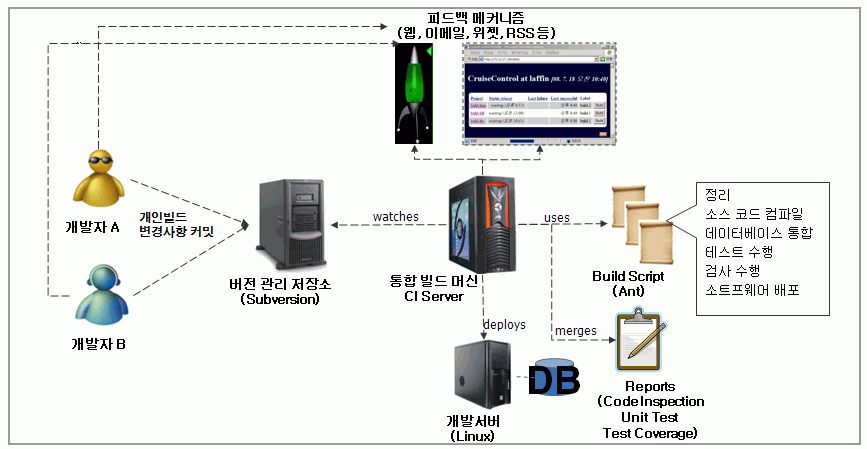

# 통합빌드

## 개요

각 개발자들이 개인 빌드 과정을 거쳐 작성한 코드들을 통합하여 실행 가능한 산출물로 만들어 내는 일련의 과정을 통합 빌드라 하며 지속적이고 자동화된 통합을 위하여  
CI를 사용하며 Continous Integration이란 여러 명으로 구성된 팀이 작업한 것을 자주 각 팀원이 하루에 한 번 이상, 매일 여러 번-통합하는 것을 가리키는 소프트웨어 개발 Practice를 말한다.

## 설명

CI 효과와 특징

* 효과

  1. 흔히 발생하는 일반적인 위험을 줄여준다.
  2. 에러를 초기에 발견할 수 있다. 자주 통합할수록 에러가 발생하는 범위가 좁아 에러를 잡는 것이 수월해진다.
  3. 잘 동작하고 에러가 거의 없는 S/W를 유지할 수 있다.
  4. 언제 어느 때라도 배포할 수 있는 S/W를 생성해낸다.
  5. 반복적인 수작업을 줄여준다.
  6. 프로젝트 가시성을 좋게 해준다.
  7. 개발 팀이 S/W 제품에 대해 보다 큰 자신감을 갖게 해준다.
  
* 특징

  1. 소스 코드 일관성 유지 : 소스 관리 시스템이 필요하다.
  2. 자동 빌드 : 빌드는 CI 툴에 의해 자동으로 이루어져야 한다.
  3. 자동 테스트 : 소스 검증과 함께 기능/비기능 테스팅을 매번 검증함으로써 코드의 품질을 높일 수 있다.
  4. 일일 체크아웃과 빌드 : 빌드 주기가 길어질수록 개발자 소스의 오류 발생 확률이 높아지고 그 만큼 시간을 낭비하게 된다.

CI(Continuous Integration)는 개발자, 버전 관리 저장소, CI시스템, 빌드 스크립트, 의사소통 장치, 통합 빌드 머신 등으로 구성 된다.

CI 서버는 형상관리 서버로부터 개발자들이 commit 한 소스 코드를 check out 받아 CI 서버의 로컬 파일 시스템에 저장하고
그 코드를 바탕으로 빌드를 실행 후 동작하는 코드 산출물(WAR, JAR 등의 working 패키지)을 생성해 낸다.

### 오픈소스 CI서버: Jenkins

Jenkins은 오픈 소스 CI 서버로 소스와 빌드 스크립트를 사용한 자동 빌드 및 빌드 결과를 개발자에게 피드백 하는 메커니즘을 제공한다.

**Jenkins의 특징 및 주요 기능**

#### Jenkins 특징

1. 쉬운 Installation : Jenkins.war 형태로 servlet container에 배포
2. 웹 기반 UI를 통한 쉬운 설정 및 즉각적인 피드백
3. 플러그인 기반의 확장성 제공
4. 깔끔하고 잘 정의된 문서 및 API

#### Jenkins 주요 기능

1. 소프트웨어 자동 빌드
   * 빌드 주기에 따른 일일 빌드 또는 주간 빌드 기능 제공
2. 지속적이고 자동화된 빌드 검증
   * SCM 폴링(polling) 기능을 통한 최신 코드 기반의 빌드 수행
3. 지속적이고 자동화된 빌드 테스트
   * 테스트 슈트 실행을 통한 코드 품질 검증
4. 빌드 후속 절차 자동화
   * 컴파일 된 코드의 패키징 및 테스트 리포팅 기능 제공

## Jenkins 설치

[서버 개발환경 설치 가이드](../install-guide/server-environment-install-guide.md)의 Jenkins 부분을 참고하여 Jenkins를 설치한다.

## Jenkins 사용법

### 기본 시스템 설정

Jenkins 의 새 작업 등록 전, Jenkins 의 기본 시스템 설정한다. 설정에 JDK, ANT, Maven, SVN 서버 정보를 등록하여 프로젝트를 Compile 및 Deploy 할 수 있다.
시스템 설정은 Jenkins 관리 → System Configure 메뉴를 통해서 할 수 있다.

#### 메뉴에서 Tools로 접속

#### 서버 개발환경에 포함된 Maven의 경로를 지정

인터넷 외부망과의 연결이 단절된 환경에서도 가능한 설정이다.

#### Jenkins가 직접 Maven을 관리하도록 하는 설정

인터넷 외부망과의 연결이 허용된 환경에서 가능한 설정이다.
Install automatically를 클릭하면 된다.

#### 사용자 정의 settings.xml 지정

### 새 작업 생성

통합 환경에서 프로젝트를 자동으로 Compile 하기 위해 아래와 같이 새 작업(item)을 생성한다.

Item 이름을 입력하고, Maven project를 생성한다.

SVN의 최신 version 소스코드를 읽어오기 위해, Source Code Management에서 SVN에 등록된 프로젝트 정보와 사용자 정보를 아래와 같이 설정한다.

빌드 유발 케이스와 빌드 환경을 프로젝트 성격에 적합하게 설정한다.

프로젝트의 pom.xml 경로와 Goals를 입력한다.

만약 프로젝트(item)의 Maven 설정을 개별적으로 관리하고 싶다면,
고급(Advancded)을 클릭한 후 아래 이미지와 같이 설정하면 된다.

이후 저장을 누르면 끝난다.

### 작업 Build

아래와 같이 Build Now 메뉴를 통해 Maven Build를 실행한다.
빌드 실행시 콘솔을 통해 빌드 프로세스를 확인할 수 있다.

빌드가 완료되면, 아래와 같이 작업 아이콘 또는 콘솔의 정보로 빌드 결과를 확인할 수 있다.

빌드를 통해 만들어진 war(servlet 웹프로젝트의 경우) 또는 jar(Java 프로젝트의 경우) 파일을 workspace에서 확인할 수 있다.

