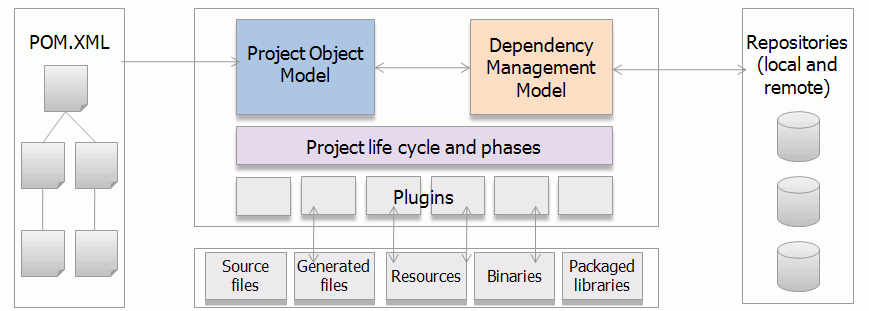
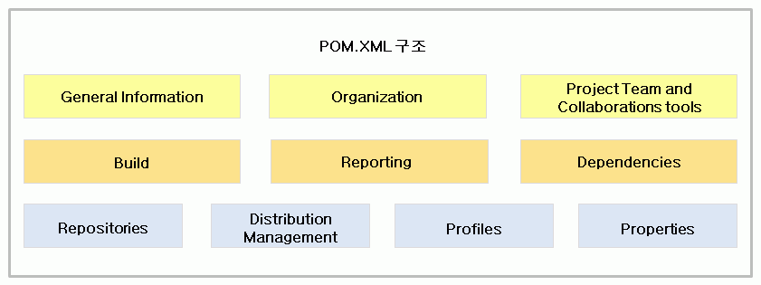
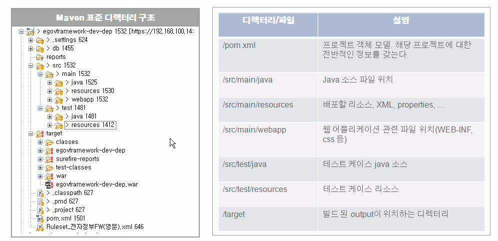

# 개인 빌드

## 개요

개인 빌드란 소프트웨어 개발자가 소프트웨어 소스 코드를 작성하고 이를 자신의 로컬 PC에서 컴파일 하여 실행 코드로 변환하는 일련의 과정을 말하며 주로 빌드 도구를 사용하여 실행한다.

## 설명

대표적인 오픈소스 빌드 도구로는 make, ant, maven 등이 있으며 **전자정부 표준 프레임워크에서는 maven을 기본 빌드 도구로 사용**한다.

### 오픈 소스 빌드 도구

* [GNU Make](http://www.gnu.org/software/make/)
  make는 소프트웨어 개발에서 Unix계열 OS에서 주로 사용되는 프로그램 빌드 도구이다.
* [Apache Ant](http://ant.apache.org/)
  Ant는 **자바 기반의 빌드 도구**로 자바 언어를 사용하는 프로젝트에서 make를 사용하면서 겪게되는 많은 어려움을 줄여주고 더 많은 기능을 제공한다.
  * 자바 소스 파일 컴피일
  * jar, war, ear, zip 파일의 생성
  * javadoc을 실행하여 도움말 생성
  * 각각의 작업에 대한 의존성 설정
* [Maven - 전자정부 표준 프레임워크 기본 빌드 도구](http://maven.apache.org/)
  Maven은 **프로젝트 관리 도구**로 빌드 기능의 수행 뿐 아니라 프로젝트 리포팅, documentation 생성 기능을 제공한다.
* [Gradle](http://gradle.org/)
  Gradle은 groovy 언어로 개발된 **프로젝트 관리 도구**로 코드기반의 스크립트를 이용하여 빌드, 배포, 리포팅, documentation 생성 기능을 제공한다.

### Maven

메이븐은 프로젝트 객체 모델(Project Object Model : POM)이라는 개념을 바탕으로 프로젝트 의존성 관리, 라이브러리 관리, 프로젝트 생명 주기 관리 기능 등을 제공하는 **프로젝트 관리 도구**이다. 또한 플러그인을 기반으로 소스 코드로부터 배포 가능한 산출물을 만들어 내는 **빌드 기능** 뿐만 아니라 레포팅 및 documentation 작성 기능 등을 제공한다.

### Maven 특징

| Maven 장점                                                                                                                                                                                                                                                                                                                                                                                                                                                                                         | Maven 단점                                                                                                                                                                                                                                                                                                                                                                                                                                                                                                                                                                     |
| -------------------------------------------------------------------------------------------------------------------------------------------------------------------------------------------------------------------------------------------------------------------------------------------------------------------------------------------------------------------------------------------------------------------------------------------------------------------------------------------------- | ------------------------------------------------------------------------------------------------------------------------------------------------------------------------------------------------------------------------------------------------------------------------------------------------------------------------------------------------------------------------------------------------------------------------------------------------------------------------------------------------------------------------------------------------------------------------------ |
| • 뛰어난 의존성 관리 <br> - 의존성 자동 업데이트  <br> - 저장소를 통한 라이브러리 일괄 관리  <br> • 모든 프로젝트에 걸쳐 쉽게 적용 가능한 일관적인 사용법  <br> • 라이브러리 및 메타 데이터 저장을 위한 지속적으로 확장 되고 있는 저장소  <br> • 쉽게 작성 가능한 플러그 인을 통한 확장성  <br> • 동시에 다수의 프로젝트를 핸들링 할 수 있는 쉬운 설정 기반의 메커니즘  <br> • 간단한 설정을 통한 배포 관리  <br> • Java, C++ 등 다수의 프로그래밍 언어 지원 | • Repository 관리의 불편함<br> - Maven 프로젝트의 급속한 발전으로 central repository가 제공하는 라이브러리들이  <br> 빠르게 증가하고 있으나 아직 3rd 파티 라이브러리 등 미제공 라이브러리들이 있음  <br> • pom.xml 파일 관리  <br> - 메이븐 프로젝트 관리에 대한 모든 내용이  <br> pom.xml 파일에 담기게 됨으로 길고 장황하게 될 수 있음  <br> • 프로젝트에 특화된 복잡한 빌드 기능 제약  <br> - 메이븐 프로젝트 특성상 소프트웨어 빌드에 통용되는  <br> 라이프 사이클을 제공하고 있어 세부 항목 또는 특화된 빌드 환경에 대한 지원이 미약함 |

### Maven 아키텍처

Maven은 프로젝트 전체 내용에 대한 기술 및 설정을 담당하는 POM과 라이브러리(Maven에서는 artifact라 호칭함)관리에 대한 dependency/repository 관리 모델 그리고 컴파일, 테스트, 패키징 등의 빌드 생명 주기를 다루는 lifecycle 및 관련된 plugin들과의 연동을 다루는 부분으로 구성된다.


| Maven 아키텍쳐           | 내용 |
| ----------------------- | ------------------------------------------------------------------------------------------------------------ |
| POM                     | 메이븐 엔진 내장 + POM.XML 파일에서 선언적으로 제공한다. - 참조:[POM(프로젝트 객체 모델)](#pom)                 |
| 의존성 관리 모델        | 로컬 및 리모트 저장소를 이용 - 참조:[Dependency Management](#dependency-management)                                                   |
| 프로젝트 생명 주기 모듈 | 메이븐 엔진은 플러그인을 통해 파일을 다루는 거의 모든 작업을 수행 - 참조:[빌드 lifecycle](./build-lifecycle.md) |

### POM

POM은 프로젝트 관리 및 빌드에 필요한 환경 설정, 의존성 관리 등의 프로젝트 정보들을 담고 있으며 이는 메이븐 프로젝트 생성 시 기본 설정 파일로 생성되는 pom.xml 파일에 기술된다.

#### 설명

pom.xml 파일은 프로젝트의 세부 메타 데이터 정보를 포함하며 크게 10개의 항목으로 구성된다.
프로젝트 일반 정보, 버전 및 설정 관리, 빌드 환경, 라이브러리 저장소 및 의존성 등의 내용을 포함한다.



* **General Information**  
  프로젝트 이름, 설명, 버전 정보 등을 기술한다. - [프로젝트 정보 생성](#프로젝트-정보-생성)) 참조
* Organization : 프로젝트 조직 정보: 이름, 홈페이지 URL
* Project Team and Collaborations tools  
  형상관리 서버, 이슈 트랙커, 통합 빌드 서버 정보 등
* **Build**  
  인코딩 정보 등 [빌드 Lifecycle](./build-lifecycle.md) 환경 설정
* **Reporting**  
  리포트 생성 기능을 설정한다.
* **Dependencies**  
  프로젝트에서 사용하는 *라이브러리*를 선언하여 Build Path에 포함시킨다. - [Dependency(의존성) 설정](#dependency의존성-설정) 참조
* Repositories  
  라이브러리 저장소 위치 설정
* Distribution Management  
  배포 환경 설정
* Profiles  
  이기종 환경에서의 이식성을 높여 주기 위한 빌드 설정
  [Maven 빌드 profile 소개](http://maven.apache.org/guides/introduction/introduction-to-profiles.html)
* Properties - 프로젝트 property를 설정한다.

### Maven 디렉터리 구조

메이븐은 Best practices을 기반으로 정규화된 디렉터리 구조를 제공하고 있으며 모든 소스 파일들은 /src 디렉터리 밑에, 빌드 된 output은 /target 디렉터리 밑에 위치한다.
Maven 프로젝트는 개발자에 의한 특정한 source/resource path 설정 없이 정규화된 디렉토리 구조를 기반으로 프로젝트 자원에 대한 접근 메커니즘을 제공한다. Maven은 소스 또는 리소스에 대한 path 설정이 필요하지 않다.



### Dependency Management

메이븐은 POM에서 선언적인 dependency 설정으로 빌드 및 배포 시에 필요한 라이브러리들을 관리하고 로컬 및 원격 [저장소]()에서 선언된 라이브러리들을 다운로드 받아 사용한다.

#### 설명

메이븐의 가장 큰 장점 중의 하나로 라이브러리 의존성 관리를 들 수 있다. 일반적인 프로젝트 수행 시 개발자들은 라이브러리 설정을 위해 프로젝트 내부 디렉터리에 직접 라이브러리를 받아와 위치 시키고 path 설정을 통해 이를 이용한다. 이럴 경우 개발자들이 직접 라이브러리를 찾고 설정하는 번거로움과 프로젝트 내부에서 사용하는 라이브러리 종류와 버전을 컨트롤 하는데 문제가 발생할 수 있다. 특히 통합 빌드 과정에서 라이브러리 관련 문제들이 빈번히 발생할 수 있다. 메이븐은 이를 효과적으로 처리하기 위해 의존성 관리 메커니즘을 제공하고 있으며 메이븐 개발자들은 프로젝트의 pom.xml에 dependency 선언만으로 필요한 라이브러리들을 받아와 편하게 사용할 수 있다. 프로젝트 관리자의 경우 사용되고 있는 라이브러리와 버전을 효과적으로 컨트롤할 수 있으며 개발자들에게 검증되고 통일된 버전의 라이브러리를 제공할 수 있다.

예) 아래와 같이 선언하여 junit 테스트를 위한 라이브러리를 사용할 수 있다.

```xml
  <project>
    ......
    <dependencies>
      <dependency>
        <groupId>junit</groupId>
        <artifactId>junit</artifactId>
        <version>4.4</version>
        <scope>test</scope>
      </dependency>
    </dependencies>
  </project
```

#### 의존성 분석 순서

1. 로컬 저장소에서 의존성 확인
2. 원격 저장소 리스트에서 의존성 확인
3. 1과 2가 실패하면 의존성 에러 보고

#### 의존성 필수 선언 항목

1. `<groupId>`: 부분적인 프로젝트나 조직에서의 라이브러리 집합을 식별하기 위해 제공한다.
2. `<artifactId>`: 프로젝트의 실제 이름으로 groupId와 합쳐져 프로젝트 식별에 쓰인다.
3. `<version>`: 선언한 의존성 artifact의 버전으로 프로젝트 내에서 사용하는artifact의 일관성을 추구할 수 있다.

#### 의존성 SCOPE

1. compile: 기본값으로 모든 클래스 패스에서 사용 가능하다.
2. provided: 컴파일과 유사하나 패키지에는 포함되지 않는다. 컨테이너나 JDK에서 제공한다. 예) Servlet API for web apps
3. runtime: 컴파일러가 아닌 런타임 시에 사용된다. 예) JDBC drivers
4. test: 테스트 단계에서만 사용된다. 예)Junit
5. system: provided와 유사하나 개발자가 직접 JAR 파일을 제공해야 하고 저장소에서 지정한 dependency를 찾지 않는다.

의존성 SCOPE은 선언이 안되어 있을 경우 기본값으로 compile이 적용된다. JDK나 WAS에서 제공하는 라이브러리와 dependency에서 선언한 라이브러리 간의 충돌이 일어나는 경우가 발생할 수 있으므로 사용하고자 하는 라이브러리의 SCOPE을 잘 명시해야 한다.

## 사용법

[pom.xml](#pom)파일에 프로젝트 이름, 패키징 방법, 버전 정보, 프로젝트 설명 등의 파일을 기술하며 프로젝트에서 사용하는 환경 설정, 빌드 방법, 사용하는 라이브러리 정보 등을 기술하여 빌드 및 프로젝트 관리 환경을 조성한다.

### 프로젝트 정보 생성

프로젝트 groupId, artifactId, 패키징 타입, 버전 정보 및 프로젝트 설명을 기술한다.

```xml
<project xmlns="http://maven.apache.org/POM/4.0.0" xmlns:xsi="http://www.w3.org/2001/XMLSchema-instance"
  xsi:schemaLocation="http://maven.apache.org/POM/4.0.0 http://maven.apache.org/maven-v4_0_0.xsd">
  <modelVersion>4.0.0</modelVersion>
  <groupId>egovframework.guideprogram</groupId>
  <artifactId>egovframework.guideprogram.basicsample</artifactId>
  <packaging>war</packaging>
  <version>1.0.0-SNAPSHOT</version>
  <name>egovframework.guideprogram.basicsample</name>
  <url>http://maven.apache.org</url>
 
  <properties>
    <!-- Spring version -->   
    <spring.maven.artifact.version>2.5.6</spring.maven.artifact.version>
    <compileSource>1.5</compileSource>
    <encoding>UTF-8</encoding>
  </properties>  
  ...................
  <dependencies>
    <!-- Spring Framework -->
    <dependency>
      <groupId>org.springframework</groupId>
      <artifactId>spring-aop</artifactId>
      <version>${spring.maven.artifact.version}</version>  
    </dependency>     
    <dependency>
      <groupId>org.springframework</groupId>
      <artifactId>spring-beans</artifactId>
      <version>${spring.maven.artifact.version}</version>   
    </dependency>   
  </dependencies>
  ...................
</project>
```

### Repository 설정

사용할 리포지토리 정보를 설정한다. 주로 프로젝트에서 Nexus와 같은 로컬 리포지토리를 사용할 경우
접속 정보를 설정해서 Nexus에 접속하여 artifact들을 다운로드 받을 수 있다.

```xml
  <repositories>
    <repository>
      <id>central</id>
      <releases>
        <enabled>true</enabled>
      </releases>
      <url>http://192.168.100.15:8081/nexus/content/groups/public</url>
    </repository>
    <repository>
      <id>snapshots</id>
      <snapshots>
        <enabled>true</enabled>
      </snapshots>
      <url>http://192.168.100.15:8081/nexus/content/groups/public-snapshots</url>
    </repository>
  </repositories>
```

### Dependency(의존성) 설정

프로젝트에서 사용할 라이브러리(Maven에서는 artifact라 함)을 선언한다.

```xml
  <dependencies>
    <dependency>
      <groupId>org.springframework</groupId>
      <artifactId>spring</artifactId>
      <version>${spring.maven.artifact.version}</version>
    </dependency>
    <dependency>
      <groupId>org.springframework</groupId>
      <artifactId>spring-webmvc</artifactId>
      <version>2.5</version>
      <type>jar</type>
    </dependency>
  </dependencies>
```

### System Dependency(의존성) 설정

system scope을 가지는 dependency는 다른 scope과 달리 리포지토리에서 찾지 않는 artifact로 항상 사용 가능해야 한다. 주로 JDK 또는 VM에서 제공하는 dependency들을 제공한다. 전형적인 예로 JDBC standard extensions나 Java Authentication and Authorization Service(JAAS)를 들 수 있다.

#### jdbc standard extension 예

```xml
<project>
  ...
  <dependencies>
    <dependency>
      <groupId>javax.sql</groupId>
      <artifactId>jdbc-stdext</artifactId>
      <version>2.0</version>
      <scope>system</scope>
      <systemPath>${java.home}/lib/rt.jar</systemPath>
    </dependency>
  </dependencies>
  ...
</project>
```

#### JDK's tools.jar 선언 예

```xml
<project>
  ...
  <dependencies>
    <dependency>
      <groupId>sun.jdk</groupId>
      <artifactId>tools</artifactId>
      <version>1.5.0</version>
      <scope>system</scope>
      <systemPath>${java.home}/../lib/tools.jar</systemPath>
    </dependency>
  </dependencies>
  ...
</project>
```

### Reporting 설정

메이븐은 프로젝트 정보에 대한 기본 report 뿐만 아니라 플러그인 설정을 통해 emma, JavaDoc 등의 문서 생성 기능을 제공한다.

```xml
  <reporting>
    <outputDirectory>${basedir}/target/site</outputDirectory>
    <plugins>
      <plugin>
        <artifactId>maven-project-info-reports-plugin</artifactId>
        <version>2.0.1</version>
      </plugin>
      <!-- JUnit Test Results & EMMA Coverage Reporting -->
      <plugin>
        <groupId>org.codehaus.mojo</groupId>
	<artifactId>emma-maven-plugin</artifactId>
	<inherited>true</inherited>
      </plugin>
      <plugin>
	<groupId>org.codehaus.mojo</groupId>
	<artifactId>surefire-report-maven-plugin</artifactId>
	<inherited>true</inherited>
      </plugin>
      <!-- Generating JavaDoc Report -->
      <plugin>
        <groupId>org.apache.maven.plugins</groupId>
	<artifactId>maven-javadoc-plugin</artifactId>
	<configuration>
	  <minmemory>128m</minmemory>
	  <maxmemory>512m</maxmemory>
	  <encoding>UTF-8</encoding>
	  <docencoding>UTF-8</docencoding>
	  <charset>UTF-8</charset>
	</configuration>
      </plugin>
    </plugins>
  </reporting>
```

## 샘플

### pom.xml 예제

```xml
<project xmlns="http://maven.apache.org/POM/4.0.0" xmlns:xsi="http://www.w3.org/2001/XMLSchema-instance"
xsi:schemaLocation="http://maven.apache.org/POM/4.0.0http://maven.apache.org/maven-v4_0_0.xsd">
  <modelVersion>4.0.0</modelVersion>
  <groupId>egovframework.dev.com</groupId>
  <artifactId>egovframework-dev-com</artifactId>
  <version>1.0</version>
  <packaging>war</packaging>
  <name>egovframework-dev-com Maven Webapp</name>
  <dependencies>
    <dependency>
      <groupId>junit</groupId>
      <artifactId>junit</artifactId>
      <version>4.4</version>
      <scope>test</scope>
    </dependency>
  </dependencies>
  <plugins>
    <plugin>
      <groupId>org.apache.maven.plugins</groupId>
      <artifactId>maven-compiler-plugin</artifactId>
      <configuration>
        <source>1.5</source>
        <target>1.5</target>
      </configuration>  
    </plugin>
  </plugins>
</project>
```

### pom.xml 예제 (Hudson에서의 사용 예)

```xml
<project xmlns="http://maven.apache.org/POM/4.0.0" xmlns:xsi="http://www.w3.org/2001/XMLSchema-instance" 
  xsi:schemaLocation="http://maven.apache.org/POM/4.0.0 http://maven.apache.org/maven-v4_0_0.xsd">
  <modelVersion>4.0.0</modelVersion>
  <parent>
    <groupId>org.jvnet.hudson</groupId>
    <artifactId>hudson</artifactId>
    <version>1.6</version>
    <relativePath>../pom.xml</relativePath>
  </parent>
 
  <groupId>org.jvnet.hudson.main</groupId>
  <artifactId>pom</artifactId>
  <version>1.274</version>
  <packaging>pom</packaging>
 
  <name>Hudson main module</name>
  <description>The module that constitutes the main hudson.war</description>
 
  <modules>
    <module>remoting</module>
    <module>core</module>
    <module>maven-agent</module>
    <module>maven-interceptor</module>
    <module>war</module>
    <module>test</module>
  </modules>
 
  <scm>
    <connection>scm:svn:https://svn.dev.java.net/svn/hudson/tags/hudson-1_274</connection>
    <developerConnection>scm:svn:https://svn.dev.java.net/svn/hudson/tags/hudson-1_274</developerConnection>
    <url>https://hudson.dev.java.net/source/browse/hudson/tags/hudson-1_274</url>
  </scm>
 
  <build>
    <defaultGoal>install</defaultGoal>
    <plugins>
      <plugin>
        <artifactId>maven-release-plugin</artifactId>
        <version>2.0-beta-8</version>
        <configuration>
          <!-- enable release profile during the release, create IPS package, and sign bits. -->
          <prepareVerifyArgs>-P release,ips,sign</prepareVerifyArgs>
          <!--
            also run assembly during the release.
            http://www.nabble.com/Release-Plugin%3A-Include-assemblies-for-deploying-tf2642295s177.html#a7377938
           -->
          <goals>install javadoc:javadoc animal-sniffer:check assembly:attached deploy</goals>
        </configuration>
      </plugin>
      <plugin>
        <artifactId>maven-assembly-plugin</artifactId>
        <inherited>false</inherited>
        <configuration>
          <finalName>hudson-${version}</finalName>
          <descriptors>
            <descriptor>assembly-src.xml</descriptor>
          </descriptors>
        </configuration>
      </plugin>
      <plugin>
        <artifactId>maven-remote-resources-plugin</artifactId>
        <executions>
          <execution>
            <goals>
              <goal>process</goal>
            </goals>
            <configuration>
              <resourceBundles>
                <resourceBundle>org.jvnet.hudson:license:1.0</resourceBundle>
              </resourceBundles>
            </configuration>
          </execution>
        </executions>
      </plugin>
      <plugin>
        <!-- make sure our code doesn't have 1.6 dependencies except where we know it -->
        <groupId>org.jvnet</groupId>
        <artifactId>animal-sniffer</artifactId>
        <version>1.2</version>
        <configuration>
          <signature>
            <groupId>org.jvnet.animal-sniffer</groupId>
            <artifactId>java1.5</artifactId>
            <version>1.0</version>
          </signature>
        </configuration>
      </plugin>
 
      <!--<plugin>
        <groupId>org.jvnet.fix1600</groupId>
        <artifactId>fix1600</artifactId>
        <executions>
          <execution>
            <goals>
              <goal>fix</goal>
            </goals>
          </execution>
        </executions>
      </plugin>-->
    </plugins>
  </build>
 
  <dependencies>
    <dependency>
      <!-- for JRE requirement check annotation -->
      <groupId>org.jvnet</groupId>
      <artifactId>animal-sniffer-annotation</artifactId>
      <version>1.0</version>
      <optional>true</optional><!-- no need to have this at runtime -->
    </dependency>
  </dependencies>
 
  <properties>
    <maven.version>2.0.4</maven.version>
  </properties>
 
  <profiles>
    <profile>
      <id>debug</id>
      <activation>
        <activeByDefault>true</activeByDefault>
      </activation>
      <properties>
        <hudson.sign.alias>hudson</hudson.sign.alias>
        <hudson.sign.keystore>../dummy.keystore</hudson.sign.keystore>
        <hudson.sign.storepass>hudson</hudson.sign.storepass>
      </properties>
    </profile>
  </profiles>
 
  <repositories>
    <repository>
      <id>m.g.o-public</id>
      <url>http://maven.glassfish.org/content/groups/public/</url>
      <releases>
        <enabled>true</enabled>
      </releases>
      <snapshots>
        <enabled>false</enabled>
      </snapshots>
    </repository>
  </repositories>
 
  <pluginRepositories>
    <pluginRepository>
      <id>m.g.o-public</id>
      <url>http://maven.glassfish.org/content/groups/public/</url>
      <releases>
        <enabled>true</enabled>
      </releases>
      <snapshots>
        <enabled>false</enabled>
      </snapshots>
    </pluginRepository>
  </pluginRepositories>
 
  <licenses>
    <license>
      <name>The MIT license</name>
      <url>http://www.opensource.org/licenses/mit-license.php</url>
      <distribution>repo</distribution>
    </license>
  </licenses>
 
  <distributionManagement>
    <site>
      <id>hudson-www</id>
      <url>java-net:/hudson/trunk/www/maven-site/</url>
    </site>
  </distributionManagement>
</project>
```

## 참고자료

[아파치 메이븐 프로젝트](http://maven.apache.org/)
