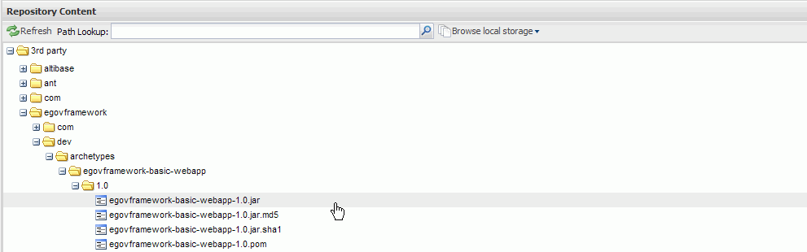

# Nexus

## 개요

Maven 프로젝트 시에 Maven central repository에서 제공하는 다양한 장점에도 불구하고 사용성 측면에서 내부 repository manager의 사용을 권고하고 있다. 실제 기업 또는 organization에서는 하나 이상의 central repository를 제공 하고 있으며 Nexus는 이런 여러 개의 외부 리포지토리를 Proxy 개념으로 연결해서 효율적으로 내부 개발자들에게 virtual한 하나의 repository 연결 포인트를 제공한다. 실제 내부 개발자들은 Nexus 리포지토리만을 바라보고 필요한 artifact들을 요청한다.

Maven을 사용할 때 유용한 오픈소스인 Nexus의 사용법에 대해 설명한다.

## 설명

Nexus는 **Maven repository manager**로 프로젝트 또는 기업에서 필요로 하는 **내부 리포지토리 구성을 위한 도구**이다.

### Nexus 사용효과

1. Proxy적용을 통한 빠른 라이브러리 다운로딩
   - Central 리포지토리에서 직접 다운로딩하는 방식보다 효과적임
2. 공개된 리포지토리에 올릴 수 없는 라이브러리의 효과적인 관리
   - 라이선스 문제로 공개 배포할 수 없는 라이브러리 사용
   - 3rd 파티에서 제공하는 라이브러리
   - 내부 프로젝트 산출물로 생성되는 라이브러리
3. 프로젝트 개발자간의 일관된 라이브러리 사용 관리
   - 프로젝트 내에서 사용되는 라이브러리 버전 관리

### Nexus 특징

1. 직관적이고 뛰어난 사용성의 UI
2. 빠르고 쉬운 설치 - war 파일 형태의 배포 파일
3. artifact들에 대한 index 기능 및 효과적인 search 기능
4. m2eclipse와의 연동 기능
5. 웹 UI를 통한 artifact 등록 및 관리 기능

### Nexus 구성도


## 환경설정

### Nexus 다운로드 및 설치

[서버 개발환경 4.3.0 설치가이드](../install-guide/server-environment-install-guide.md)의 Nexus 관련 내용을 참고한다.

### Maven 로컬 리포지토리 settings.xml 파일 수정

Maven 설정 파일인 settings.xml 파일의 `<servers>` 및 `<mirrors>` 부분에 Nexus 연결 설정을 추가한다. 
> `<servers>` Tag : 특정 repository에 접속하기 위한 인증 정보들의 list
특정 repository에 접근 권한에 제한이 있는 경우(username, password 필요)에 작성한다.

```xml
  <servers>
    <server>
      <id>release</id>
      <username>deployment</username>
      <password>**********</password>
    </server>
  </servers>
```

✔ Nexus에서 설정한 배포 유저의 설정값으로 username과 password 값을 수정해야 한다.

> `<mirrors>` Tag : 원격 리포지토리에서 artifact들을 다운로드 할 때 사용되는 mirror들의 리스트

```xml
  <mirrors>
    <mirror>
      <id>nexus</id>
      <mirrorOf>central</mirrorOf>
      <url>http://[domain]:[port]/nexus/content/repositories/releases/</url>
    </mirror>
    <mirror>  
      <id>snapshots</id>  
      <mirrorOf>public-snapshots</mirrorOf>  
      <url>http://[domain]:[port]/nexus/content/groups/public-snapshots/</url>  
    </mirror>  
  </mirrors>
```

✔ Nexus를 설치한 경로로 URL 설정을 바꾸어 준다.

### 프로젝트 pom.xml 파일의 `<distributionManagement>` 파트 설정

생성한 패키지(war, jar 등)를 배포하기 위한 대상 서버를 정의한다.
예를 들어 배포할 서버가 앞서 Maven 설정 파일인 settings.xml에서 정의한 repository라면, 아래와 같이 id를 맞춰서 작성한다.

```xml
  <distributionManagement>  
    <!-- use the following if you're not using a snapshot version. -->  
    <repository>  
      <id>release</id>  
      <url>http://[domain]:[port]/nexus/content/repositories/releases/</url>  
    </repository>  
    <!-- use the following if you ARE using a snapshot version. -->  
    <snapshotRepository>  
      <id>snapshots</id>  
      <url>http://[domain]:[port]/nexus/content/repositories/snapshots/</url>  
    </snapshotRepository>  
  </distributionManagement>
```

✔ Nexus를 설치한 경로로 URL 설정을 바꾸어 준다.

## 사용법

### 1. 로그인 하기

인터넷 브라우저를 통해 설치한 Nexus의 웹 화면을 열고 오른쪽 상단의 Log in 링크를 클릭한다. 
기본 세팅은 admin/admin123으로 하나의 계정만을 제공하고 있으며 접속한 후 보안 설정을 통해 비밀번호 변경 작업을 수행한다. 


### 2. 사용자 생성 및 권한 부여

Admin 계정으로 접속하여 좌측의 security 메뉴에서 제공하는 users, roles 그리고 privilege 메뉴를 통해 접근 제어 설정을 할 수 있다. 


### 3. Repository 추가하기

Nexus는 다수의 central repository들을 관리할 수 있으며 Proxy 개념을 통해 개발자들에게 보다 쉬운 repository 연동 편의성을 제공한다.

3.1 메뉴의 Add 버튼을 클릭하고 Proxy 리포지토리를 선택한다.


3.2 추가할 repository의 설정값을 입력한다.

* 대표적인 Maven Central Repository들 중의 하나로 ibiblio 리포지토리를 등록한다.


### 4. artifact 등록하기

프로젝트에서 사용하는 3rd party 라이브러리들이나 프로젝트에서 생성한 war, jar 등의 패키징된 Maven artifact들을 Nexus 리포지토리에 등록하여 사용한다. 

4.1 upload하기 위한 리포지토리 선택
 * 3rd party 리포지토리에 전자정부 표준 프레임워크 개발 시 생성한 egovframework-basic-web artifact를 등록한다.


3rd party 리포지토리 선택 후 오른쪽 마우스 메뉴의 Upload Artifact 메뉴를 선택한다.

4.2 Upload 하고자 하는 artifact 파일 및 pom.xml 파일을 설정한다.

Browser 버튼 클릭을 통해 개발자 PC에 위치한 upload할 파일을 탐색하여 지정할 수 있다. 


개발자의 Maven 로컬 리포지토리에서 Nexus에 배포하고자 하는 artifact 파일 및 pom.xml 파일을 선택한다. 


리포지토리 브라우징을 통해 새로 등록된 artifact을 확인한다.   



### 5. Dependency 설정을 위한 artifact의 pom.xml 확인하기

3rd party 또는 프로젝트에서 생성한 artifact를 프로젝트에서 설정하기 위해서는 pom.xml에 dependency 정보를 설정해 주어야 한다. 설정할 artifact의 dependency 정보를 nexus 브라우징을 통해 확인할 수 있다.

* 예)jeus artifact를 사용하기 위한 depencey 정보 확인하기

5.1. 3rd party 리포지토리를 선택 후 content 화면에서 jeus 디렉토리의 jeus-6.0.pom 파일을 선택한다.


5.2. 오른쪽 마우스 클릭 후 download 메뉴를 선택하여 dependency 정보를 확인한다.


확인한 pom.xml 파일의 정보를 복사/붙여넣기를 통해 프로젝트의 pom.xml 파일에 선언하여 jeus 라이브러리를 사용한다. 

## 샘플

### Central Repository에서 다운로딩한 artifact들의 관리

개발자가 요청하는 artifact들을 Central Repository에서 Cache하여 Nexus 리포지토리에서 관리한다.


### 프로젝트 내부에서 생성한 artifact들의 관리

프로젝트 내의 각 파트에서 생성한 maven artifact들을 nexus에 배포하고 다른 파트에서 배포된 artifact들을 참조해 프로젝트를 진행할 수 있다. 


✔ Nexus에 '3rd Party'라는 임의의 repository를 추가하고 전자정부 표준프레임워크에서 개발한 산출물들을 이 repository에 배포하고 개발 시에 dependency로 참조하여 사용하였다.

## 참고자료

[Nexus: Maven Repository Manager](http://nexus.sonatype.org/)
