## 표준프레임워크 Sample 프로젝트를 Gradle로 빌드환경 전환

### 빌드 환경 전환

1. Eclipse Gradle Plugin 설치

   * Buildship : [설치가이드](./gradle-buildship.md)

2. Sample 프로젝트 생성
   * 개발환경 > eGovFrame > New Web Project > [프로젝트 정보 입력-Next] > Generate Example 체크 [Finish] (또는)
   * 개발환경 > file > New > eGovfroame Web Project > [프로젝트 정보 입력-Next] > Generate Example 체크 [Finish]

     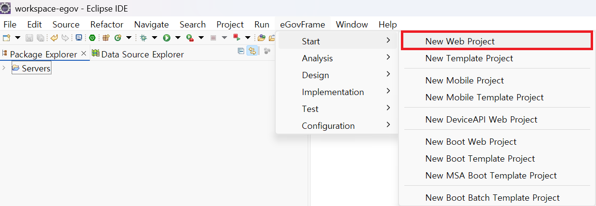

     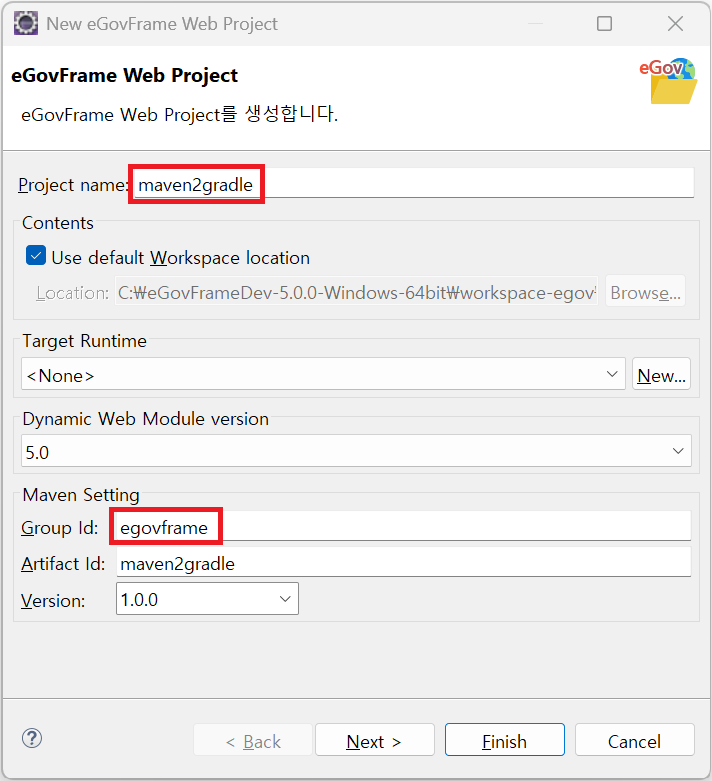
     
     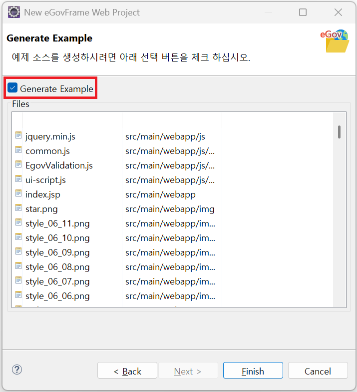

     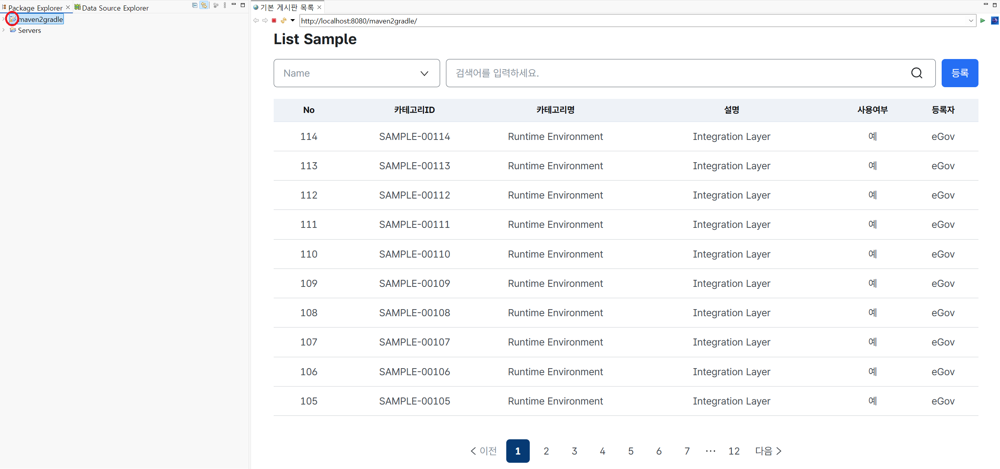

3. build.gradle 파일 추가
   * [build.gradle](#buildgradle-파일)

     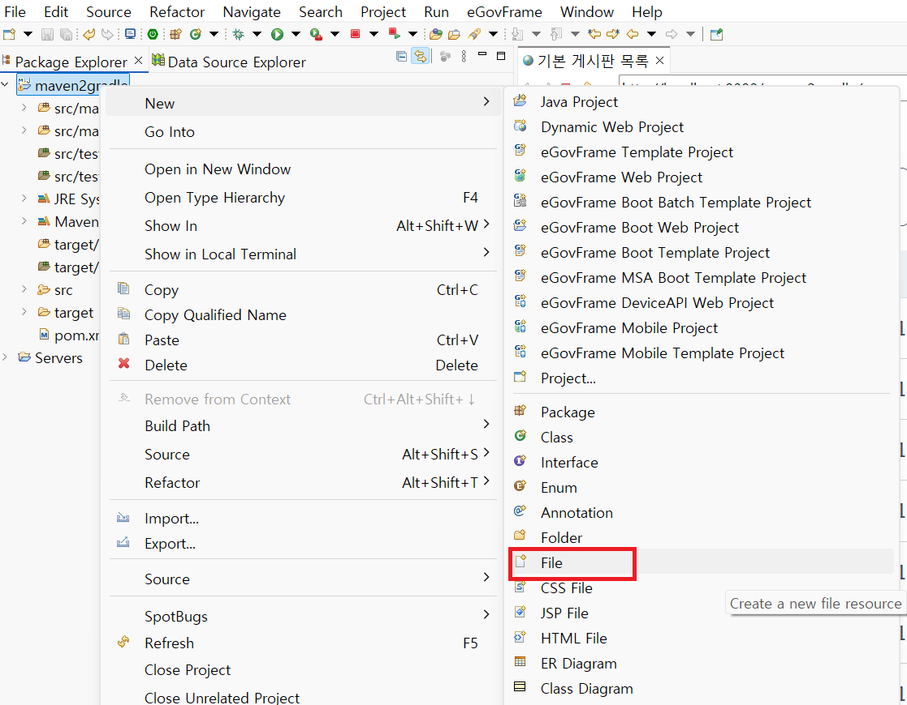

     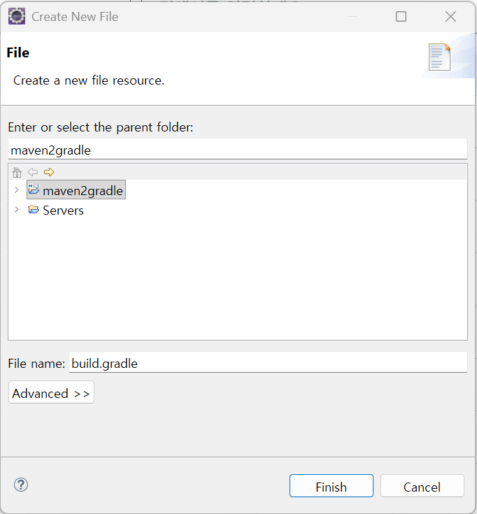

4. 기존 Maven Nature 삭제
   * Mavne > Disable Maven Nature

     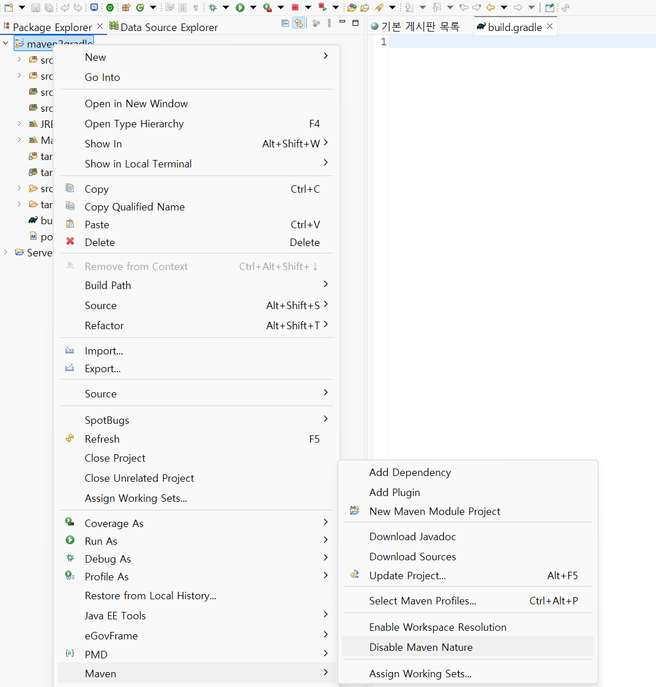
     
     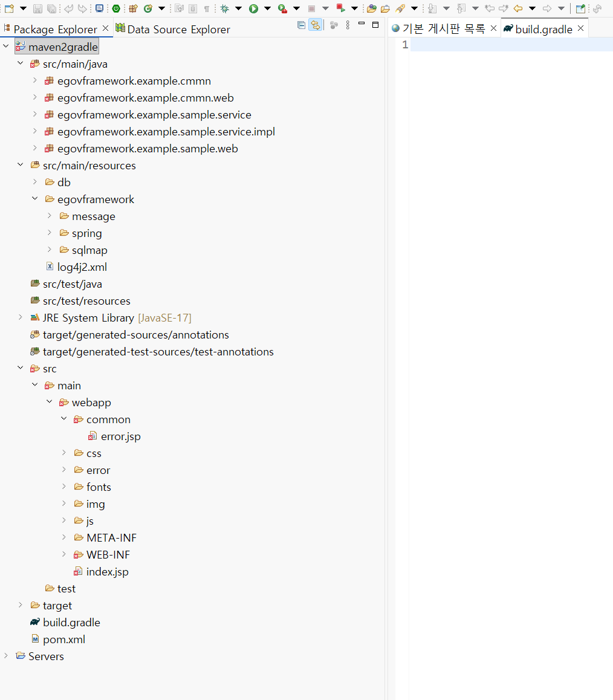

5. Gradle Nature 추가
   * Configure > Add Gradle Nature

     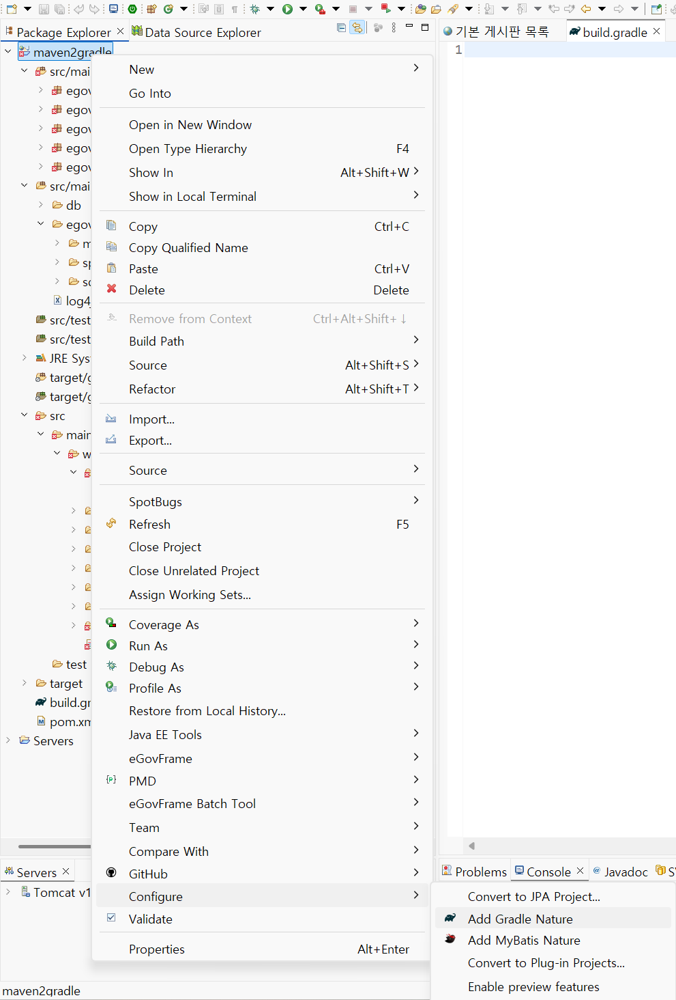
     
     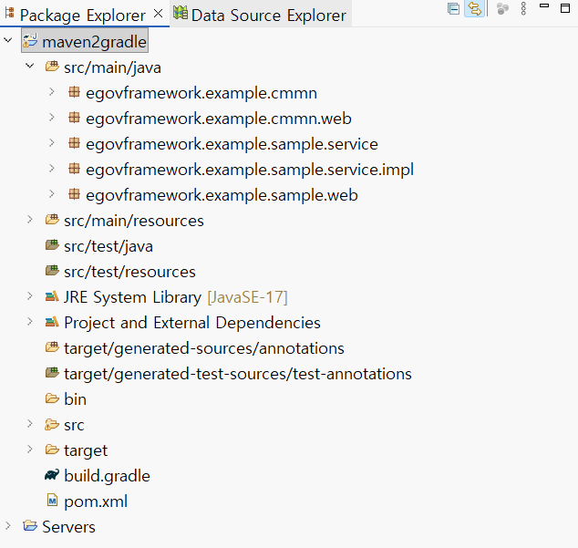

6. Dynamic Web Module 퍼셋 버전 변경
   * Maven Nature 제거 시 Dynamic Web Module 버전이 기본값(2.4)으로 초기화되므로, 수동으로 변경이 필요하다.
   * Project Properties > Project Facets > Dynamic Web Module을 `5.0`으로 변경

     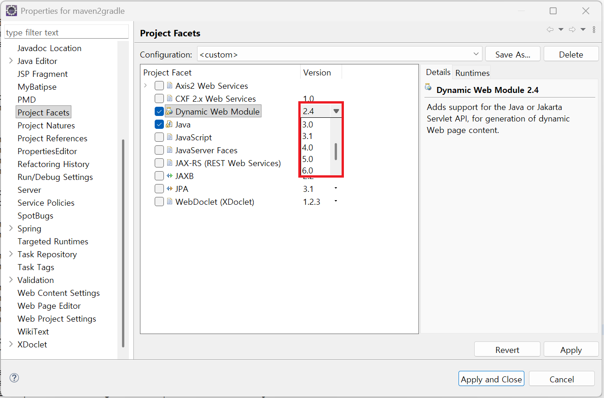

7. pom.xml 삭제

8. Gradle 설정 확인
   * Gradle > Refresh Gradle Project

     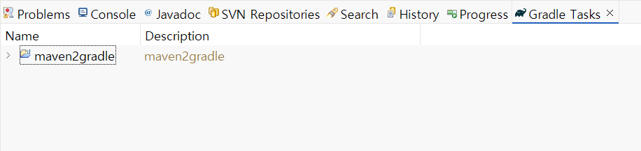

9. Gradle Tasks View 열기
   * Window > Show View > Gradle > Gradle Tasks

     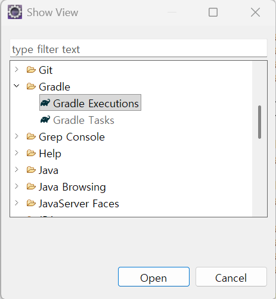

10. Gradle Tasks View에 표시된 프로젝트 Build
    * 프로젝트에 구성된 Task를 시작메뉴를 이용하여 빌드실행

      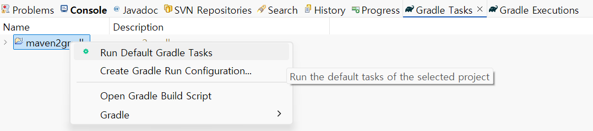

      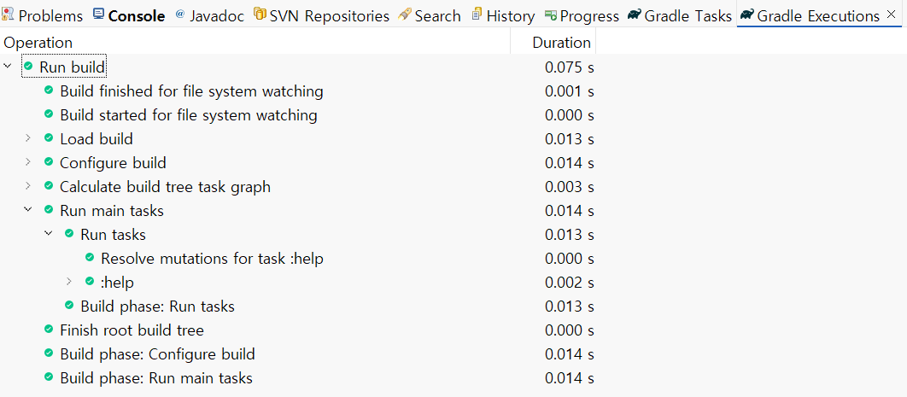

11. Gradle 프로젝트 실행
    * Run As > Run On Server

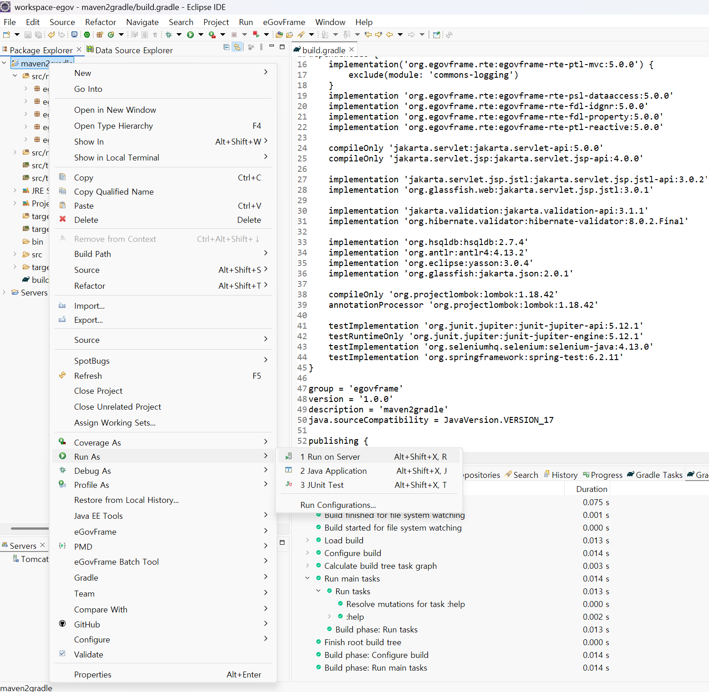

### build.gradle 파일

```groovy
plugins {
    id 'java-library'
    id 'maven-publish'
    id 'war'
    id 'project-report'
}

repositories {
    mavenCentral()
    maven {
        url 'https://maven.egovframe.go.kr/maven'
    }
}

dependencies {
    implementation('org.egovframe.rte:egovframe-rte-ptl-mvc:5.0.0') {
        exclude(module: 'commons-logging')
    }
    implementation 'org.egovframe.rte:egovframe-rte-psl-dataaccess:5.0.0'
    implementation 'org.egovframe.rte:egovframe-rte-fdl-idgnr:5.0.0'
    implementation 'org.egovframe.rte:egovframe-rte-fdl-property:5.0.0'
    implementation 'org.egovframe.rte:egovframe-rte-ptl-reactive:5.0.0'

    compileOnly 'jakarta.servlet:jakarta.servlet-api:5.0.0'
    compileOnly 'jakarta.servlet.jsp:jakarta.servlet.jsp-api:4.0.0'

    implementation 'jakarta.servlet.jsp.jstl:jakarta.servlet.jsp.jstl-api:3.0.2'
    implementation 'org.glassfish.web:jakarta.servlet.jsp.jstl:3.0.1'

    implementation 'jakarta.validation:jakarta.validation-api:3.1.1'
    implementation 'org.hibernate.validator:hibernate-validator:8.0.2.Final'

    implementation 'org.hsqldb:hsqldb:2.7.4'
    implementation 'org.antlr:antlr4:4.13.2'
    implementation 'org.eclipse:yasson:3.0.4'
    implementation 'org.glassfish:jakarta.json:2.0.1'

    compileOnly 'org.projectlombok:lombok:1.18.42'
    annotationProcessor 'org.projectlombok:lombok:1.18.42'

    testImplementation 'org.junit.jupiter:junit-jupiter-api:5.12.1'
    testRuntimeOnly 'org.junit.jupiter:junit-jupiter-engine:5.12.1'
    testImplementation 'org.seleniumhq.selenium:selenium-java:4.13.0'
    testImplementation 'org.springframework:spring-test:6.2.11'
}

group = 'egovframe'
version = '1.0.0'
description = 'maven2gradle'
java.sourceCompatibility = JavaVersion.VERSION_17

publishing {
    publications {
        maven(MavenPublication) {
            from(components.java)
        }
    }
}
```

### 참고

3rd party 라이브러리로 별도의 설치가 필요한 경우에는 다음을 참고한다.

```groovy
def libDir='src/main/webapp/WEB-INF/lib/project'

repositories {
    flatDir {
        dirs libDir
    }
}

dependencies {

// 3rd party 라이브러리로 별도의 설치 필요
    implementation files("${libDir}/smeapi/2.7.0/smeapi-2.7.0.jar")
    implementation files("${libDir}/OmniEnt-SDK-Core/1.0.3.18/OmniEnt-SDK-Core-1.0.3.18.jar")
    implementation files("${libDir}/OmniEnt-SDK-ServerCore/1.0.3.22/OmniEnt-SDK-ServerCore-1.0.3.22.jar")
    implementation files("${libDir}/OmniEnt-SDK-Verifier/1.0.3.21/OmniEnt-SDK-Verifier-1.0.3.21.jar")
    implementation files("${libDir}/RSLicenseSDK/1.0.4/RSLicenseSDK_jdk16-1.0.4.jar")

}
```
