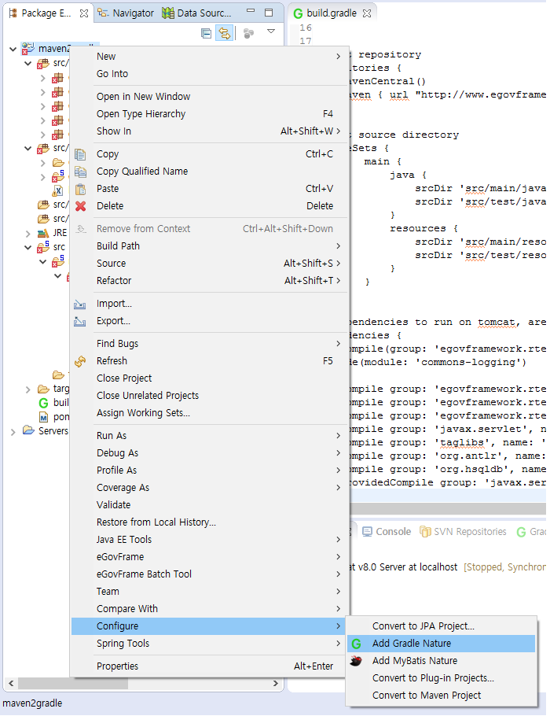

## 표준프레임워크 Sample 프로젝트를 Gradle로 빌드환경 전환

### 빌드 환경 전환

1. Eclipse Gradle Plugin 설치

   * Buildship : [설치가이드](./gradle-buildship.md)

2. Sample 프로젝트 생성
   * 개발환경 > eGovFrame > New Web Project > [프로젝트 정보 입력-Next] > Generate Example 체크 [Finish] (또는)
   * 개발환경 > file > New > eGovfroame Web Project > [프로젝트 정보 입력-Next] > Generate Example 체크 [Finish]

     

     
     
     

     

3. build.gradle 파일 추가
   * [build.gradle](#buildgradle-파일)

     

     

4. 기존 Maven Nature 삭제
   * Mavne > Disable Maven Nature

     
     
     

5. Gradle Nature 추가
   * Configure > Add Gradle Nature

     
     
     

6. pom.xml 삭제

7. Gradle 설정 확인
   * Gradle > Refresh Gradle Project

     

8. Gradle Tasks View 열기
   * Window > Show View > Gradle > Gradle Tasks

     

9. Gradle Tasks View에 표시된 프로젝트 Build
   * 프로젝트에 구성된 Task를 시작메뉴를 이용하여 빌드실행

     

     

10. Gradle 프로젝트 실행
    * Run As > Run On Server


### build.gradle 파일

```groovy
plugins {
    id 'java-library'
    id 'maven-publish'
    id 'war'
    id 'project-report'
}
 
repositories {
    mavenCentral()
    maven {
        url 'https://maven.egovframe.go.kr/maven'
    }
}
 
dependencies {
    implementation 'org.egovframe.rte:org.egovframe.rte.ptl.mvc:4.3.0'
    implementation 'org.egovframe.rte:org.egovframe.rte.psl.dataaccess:4.3.0'
    implementation 'org.egovframe.rte:org.egovframe.rte.fdl.idgnr:4.3.0'
    implementation 'org.egovframe.rte:org.egovframe.rte.fdl.property:4.3.0'
 
    implementation 'javax.servlet.jsp.jstl:jstl-api:1.2'
    implementation 'org.apache.taglibs:taglibs-standard-impl:1.2.5'
 
    implementation 'org.antlr:antlr:3.5'
    implementation 'org.hsqldb:hsqldb:2.7.3'
    implementation 'org.eclipse:yasson:1.0.2'
    implementation 'org.glassfish:javax.json:1.1.4'
 
    compileOnly 'org.projectlombok:lombok:1.18.34'
    annotationProcessor 'org.projectlombok:lombok:1.18.34'
 
    compileOnly  'javax.servlet:javax.servlet-api:4.0.1'
 
    testImplementation 'org.junit.jupiter:junit-jupiter-api:5.11.0'
    testRuntimeOnly 'org.junit.jupiter:junit-jupiter-engine:5.11.0'
    testImplementation 'org.seleniumhq.selenium:selenium-java:4.13.0'
    testImplementation 'org.springframework:spring-test:5.3.37'
}
 
group = 'egovframe'
version = '1.0.0'
description = 'maven2gradle'
java.sourceCompatibility = JavaVersion.VERSION_1_8
 
publishing {
    publications {
        maven(MavenPublication) {
            from(components.java)
        }
    }
}
```

### 참고

3rd party 라이브러리로 별도의 설치가 필요한 경우에는 다음을 참고한다.

```groovy
def libDir='src/main/webapp/WEB-INF/lib/project'
 
repositories {
    flatDir {
        dirs libDir
    }
}
 
dependencies {
 
// 3rd party 라이브러리로 별도의 설치 필요
    implementation files("${libDir}/ojdbc6/11.2.0.3/ojdbc6-11.2.0.3.jar")
    implementation files("${libDir}/altibase/7.1.0/altibase-7.1.0.jar")
    implementation files("${libDir}/tibero5/5.0.0/tibero5-5.0.0.jar")
    implementation files("${libDir}/cubrid/10.2.0/cubrid-10.2.0.jar")
    implementation files("${libDir}/goldilocks8/8.0.0/goldilocks8-8.0.0.jar")
    implementation files("${libDir}/smeapi/2.7.0/smeapi-2.7.0.jar")
    implementation files("${libDir}/gpkisecureweb/1.0.4.9/gpkisecureweb-1.0.4.9.jar")
    implementation files("${libDir}/libgpkiapi/1.4.0/libgpkiapi-1.4.0.jar")
    implementation files("${libDir}/onepass/2.0.0/onepass-2.0.0.jar")
    implementation files("${libDir}/OmniEntSDKCore/1.0.3.5/OmniEntSDKCore-1.0.3.5.jar")
    implementation files("${libDir}/OmniEntSDKServerCore/1.0.3.5/OmniEntSDKServerCore-1.0.3.5.jar")
    implementation files("${libDir}/OmniEntSDKVerifier/1.0.3.6/OmniEntSDKVerifier-1.0.3.6.jar")
    implementation files("${libDir}/RSLicenseSDK/1.0.4/RSLicenseSDK-1.0.4.jar")
 
}
```
