# Intellij 사용 가이드

## 개요
본 가이드는 Intellij 환경에서 프로젝트를 구성하는 방법을 제공한다.
전자정부 표준프레임워크의 개발환경과는 달리 상용 프로그램 의존적으로 플러그인을 제공 할 수 없어 기존 전자정부 실행환경 기반 프로젝트를 Intellij에서 개발할 수 있는 간단한 활용 가이드만 제공한다.
이후 제공하는 예제는 포털의 All-in-one 공통컴포넌트 프로젝트를 활용하는 예제이다.

※ 커뮤니티 버전의 경우 일부 기능에 제한이 있을 수 있습니다.

## 들어가기 전에
* 기본적으로 Eclipse 계열과 Intellij 계열에서 사용 용어에 차이가 있을 수 있는 바 이는 필요시 언급하며 가이드 하도록 한다.

* All-in-one 프로젝트내의 DB 데이터는 script 디렉터리 아래에 ddl,과 dml 파일들이 포함되어 있으니, 이를 기반으로 우선 DB를 구성해야 한다.

* 기본 Encoding을 설정한다.
  1. File > settings.. 로 들어갑니다.
  2. Editor > File Encodings로 갑니다.
  3. Project Encoding, Default encoding for properties files 등의 인코딩을 설정해 줍니다.
    ※ 특히 .properties 파일등 Unicode로 표시 되는 경우 Transparent native-to-ascii conversion 을 체크 해 줍니다.
    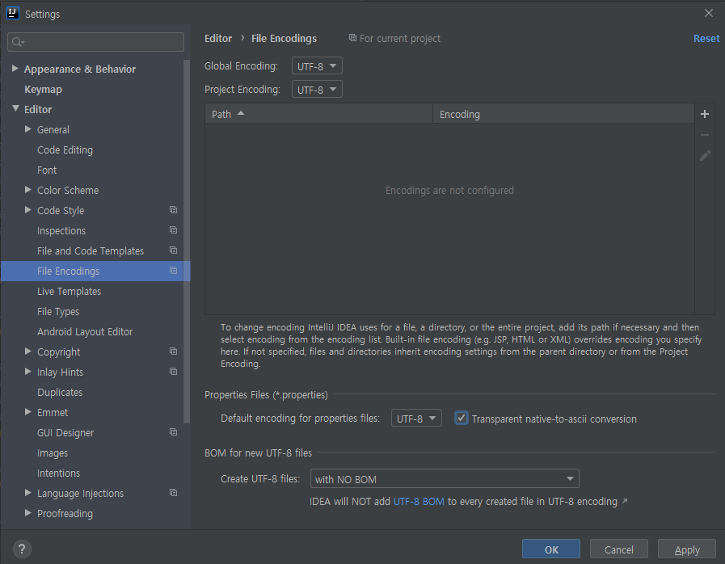

## STEP1. 프로젝트 생성
- File > New > Project 에서 Empty Project 생성
  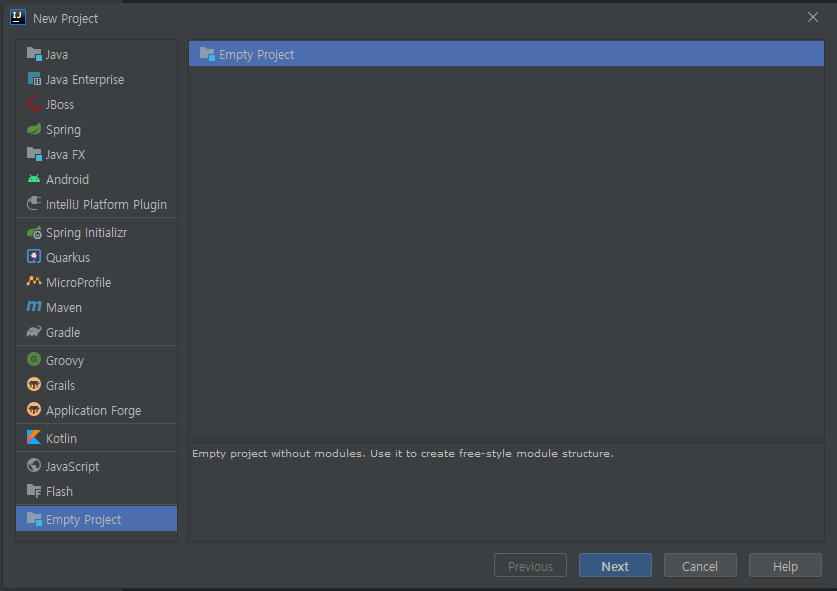
  ※ Eclipse 계열에서 사용하는 'project'라는 용어와 IntelliJ 에서 사용하는 'project'의 개념에는 차이가 있으므로 구분 할 필요가 있다.

  | Eclipse            | IntelliJ       |
  | ------------------ | -------------- |
  | WorkSpace          | Project        |
  | Project            | Module         |
  | Classpath variable | Path Variable  |

  👉 [Migrate from Eclipse](https://www.jetbrains.com/help/idea/migrating-from-eclipse-to-intellij-idea.html#workflows)

- Project 이름과 경로를 확인합니다.
  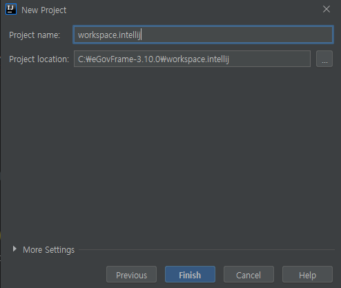

- Project Settings의 Project를 선택합니다. Project SDK와 Project language level을 설정합니다.
  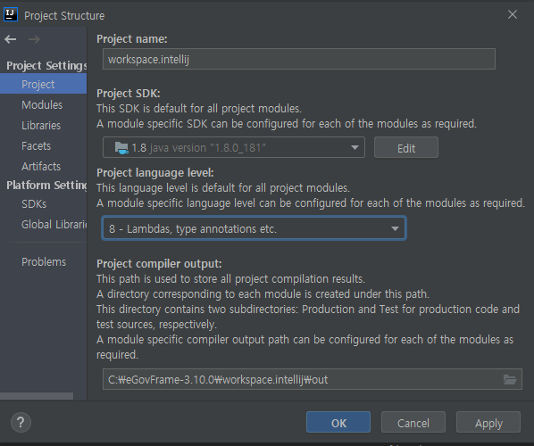

- Modules의 추가 버튼(+)을 눌러 New Module을 선택합니다.
  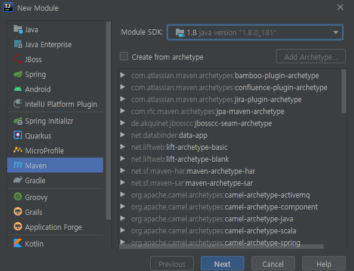

- Next를 누릅니다.

- GroupId, ArtifactId, Version을 기입합니다. (Pom.xml은 이후 수정 가능)
  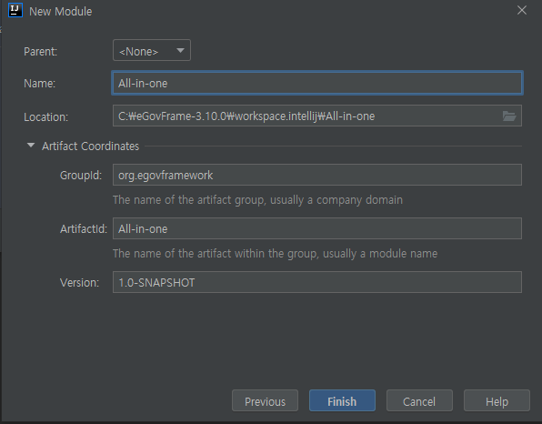

- Finish를 누릅니다.

- OK를 누릅니다.
  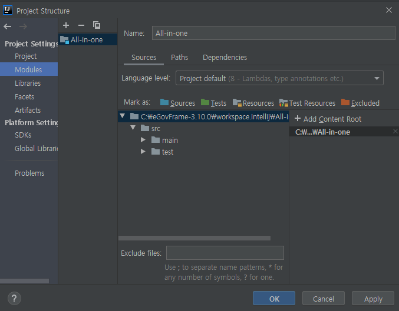

- maven Project가 생성되었습니다.
  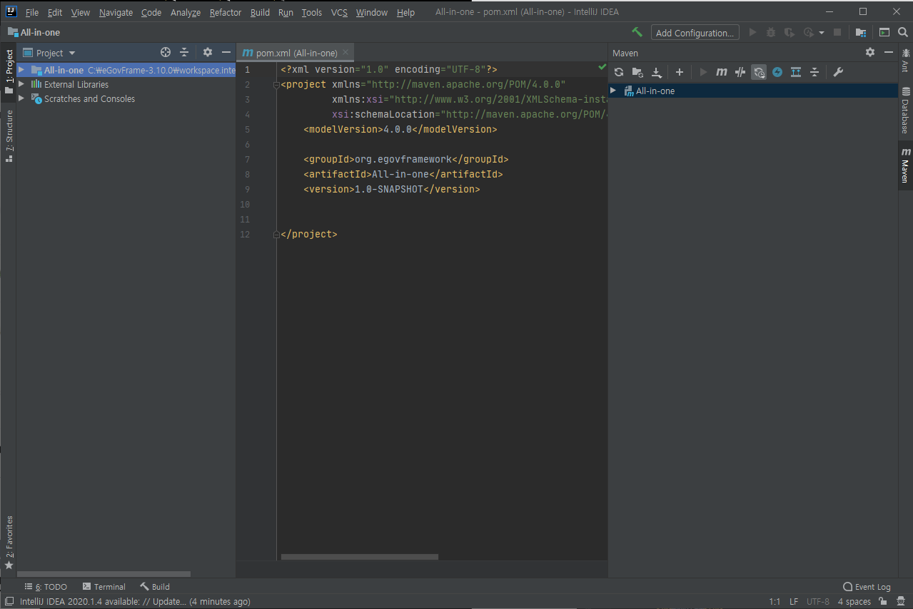

## STEP2. 소스 가져오기

- 포털에서 공통컴포넌트를 다운로드 받습니다.
  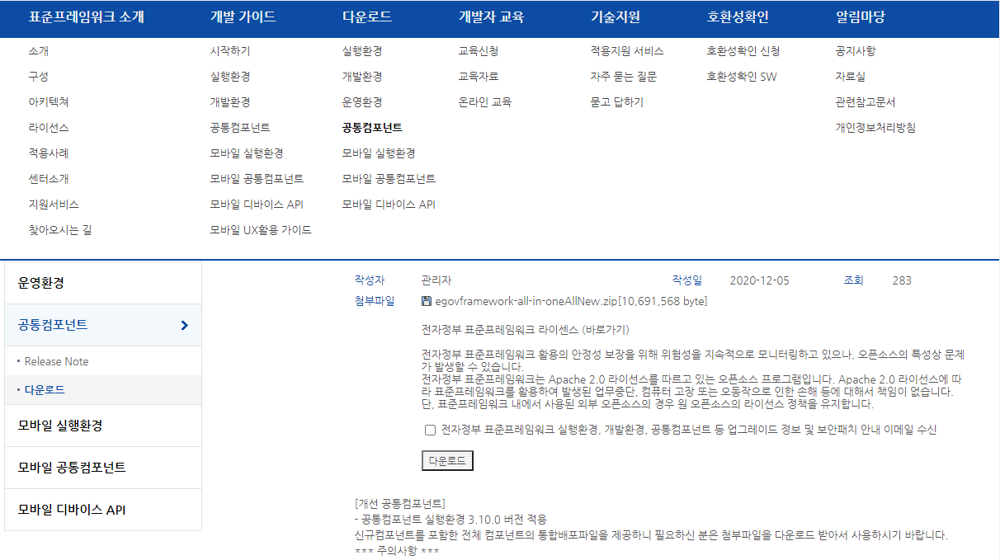

- 다운받은 소스에서 `pom.xml`, `java`, `resources`, `webapp`을 각각의 경로에 복사합니다.
  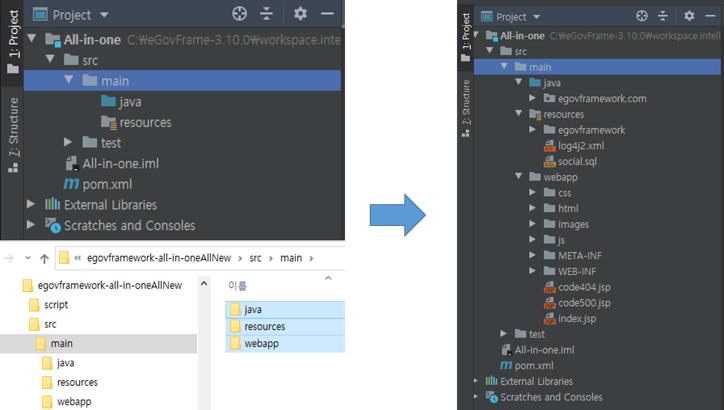

## STEP3. 모듈 설정하기

※ 만약 module의 설정이 되어 있지 않다면 우측 하단에 *Spring Configuration Check* 안내 메시지가 뜰 수 있다.
이 경우 module 환경을 수동으로 설정해야 한다.

- File > Project Structure..를 엽니다.
  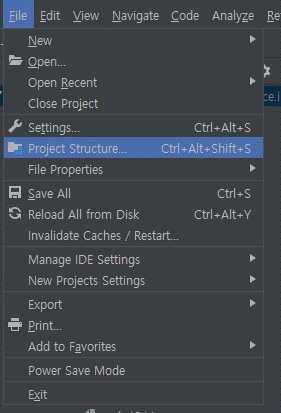

- Project Settings > Modules > [모듈 명] > Spring > + 버튼을 클릭합니다.
  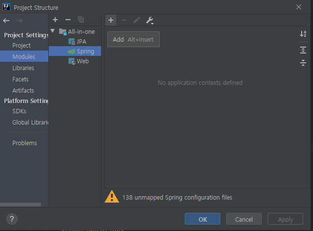

- 필요한 Content들을 선택한다. 본 예제에서는 모든 Content들을 선택해 준다.
  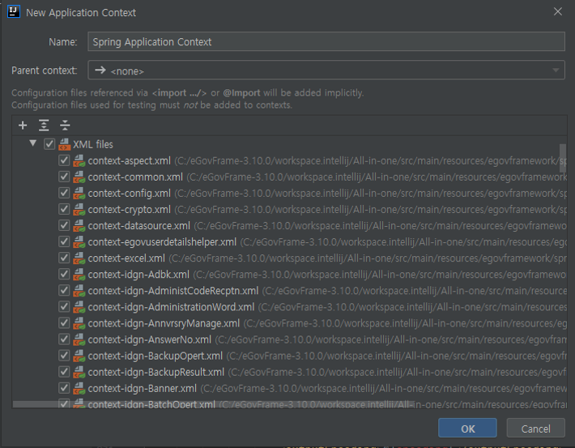

- `webapp`을 복사했다면 Deployment Descriptors와 Web Resource Directories 설정이 자동으로 되어 있을 것이다. 만약 설정되어 있지 않다면 +를 눌러 Deployment Descriptor에 web.xml을, Web Resource Directories에 Webapp 경로를 설정해 준다.
  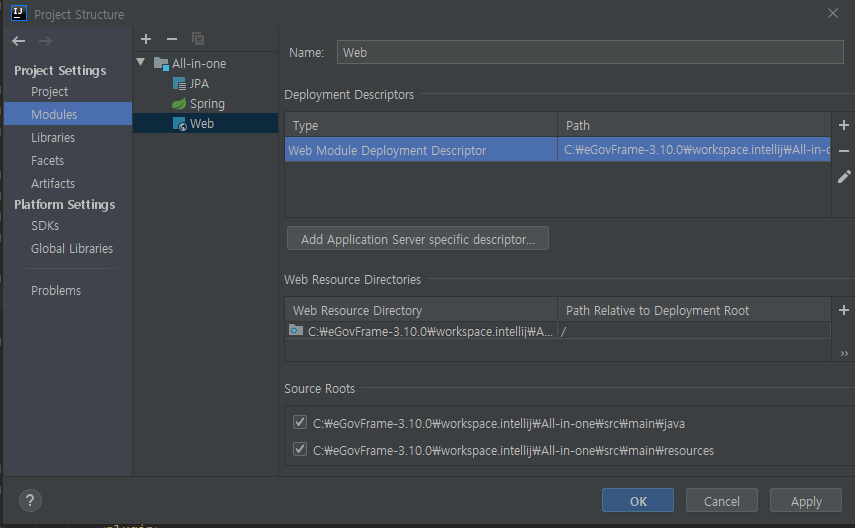

# STEP4. 서버 설정

※ 커뮤니티 버전의 경우 이 기능을 지원하지 않는다. 무료 IDE인 이클립스를 권장합니다.

- 본 과정은 서버를 설정하는 과정이다. Tomcat을 예로 진행한다.
  우선 우측 상단의 Add Configuration..을 클릭한다.
  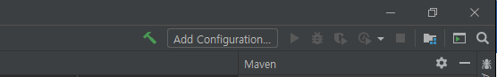

- 좌측 상단의 + 버튼을 클릭하면 아래 Configuration 리스트가 나온다. Tomcat Server의 local을 선택해 설정 정보들을 입력한다.
  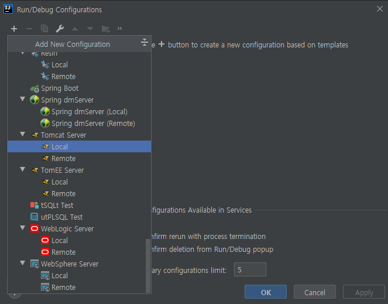

- 포트 및 서버 정보들을 등록해 준다.
  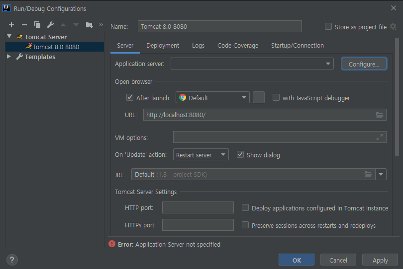
    - Application server : 서버 프로필을 선택합니다. 등록되어있지 않다면 Tomcat 경로를 입력해 서버 프로필을 만듭니다.

- 우측 아래 fix 버튼이 뜬다면 Deploy at the server startup에 +를 선택한뒤 Artifact에서 해당 war선택한다.
  Application context 도 이곳에서 수정이 가능하다.
  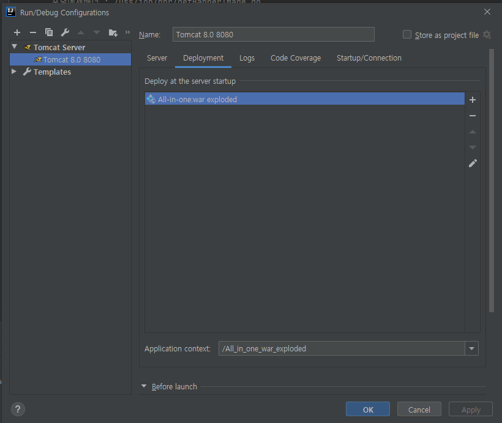

OK를 클릭하고 우측 상단의 서버 시작 버튼을 눌러 서버를 시작합니다.
