# VS Code 프로젝트 구동 가이드

## 개요

VS Code 만으로 표준프레임워크 프로젝트를 생성하고, 빌드하고, 서버 구동까지 하는 과정을 살펴보겠다.

## 프로젝트 생성(프로젝트 편집 단계)

[eGovFrame Initializr in VSCode - Project Generation]() 문서를 참조한다.

## 프로젝트 설정

### Project Settings 창 열기

Project Settings 창을 여는 방법은 2가지가 있다.
- 명령 팔레트 방법
  - 명령 팔레트(Command Palette)를 열고 `Java: Open Project Settings` 명령을 실행한다.
    - Windows/Linux : `ctrl + shift + p` → `Java: Open Project Settings`
    - macOS : `cmd + shift + P` → `Java: Open Project Settings`

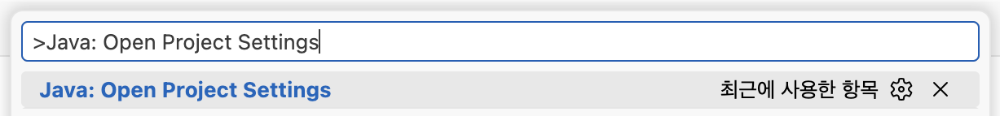

- GUI 방법
  - VS Code 탐색기창 하단 JAVA PROJECTS 뷰 우측 "···(기타 작업)" → "Configure Java Runtime" 또는 "Configure Classpath" 메뉴

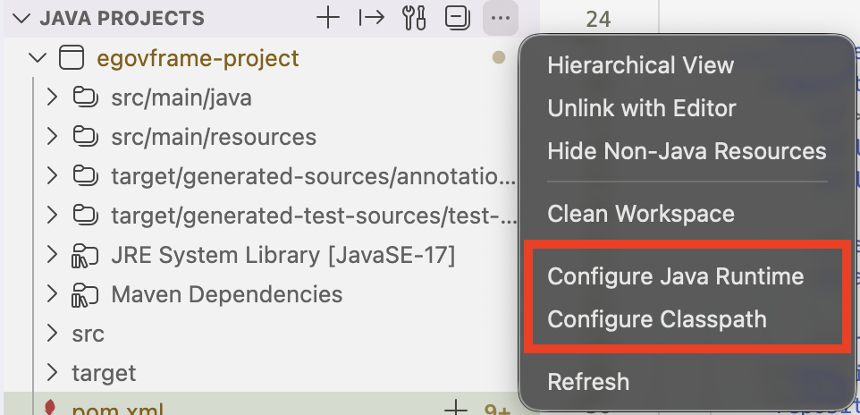

그러면 다음과 같은 Project Settings 창이 열린다.

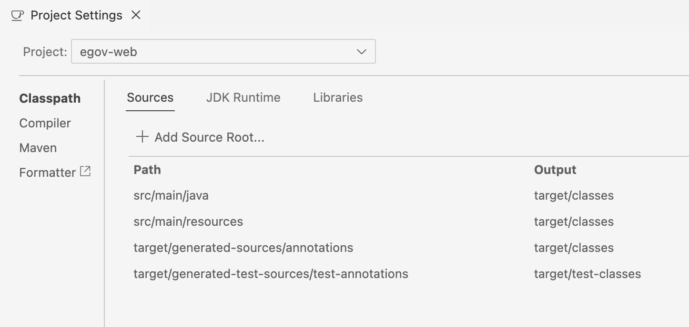

각 프로젝트 별로 설정을 진행할 수 있다.

### Classpath 설정

빌드시 소스코드, 테스트코드, 리소스 등이 어떤 경로에 생성될지를 설정할 수 있다.

### JDK Runtime 설정

런타임시 JDK가 무엇인지를 설정할 수 있다.

JDK 목록은 다음 내용들로 자동으로 구성된다.
- 로컬에 Java가 설치되는 기본 경로에 있는 항목들
- VS Code의 User Settings에서 정의한 java.configuration.runtimes 배열 내 항목들
- Language support for Java™ for Visual Studio Code 확장의 내장 JRE
  - 단 VS Code가 macOS - Universal 버전이라면 해당 확장의 내장 JRE는 없다.

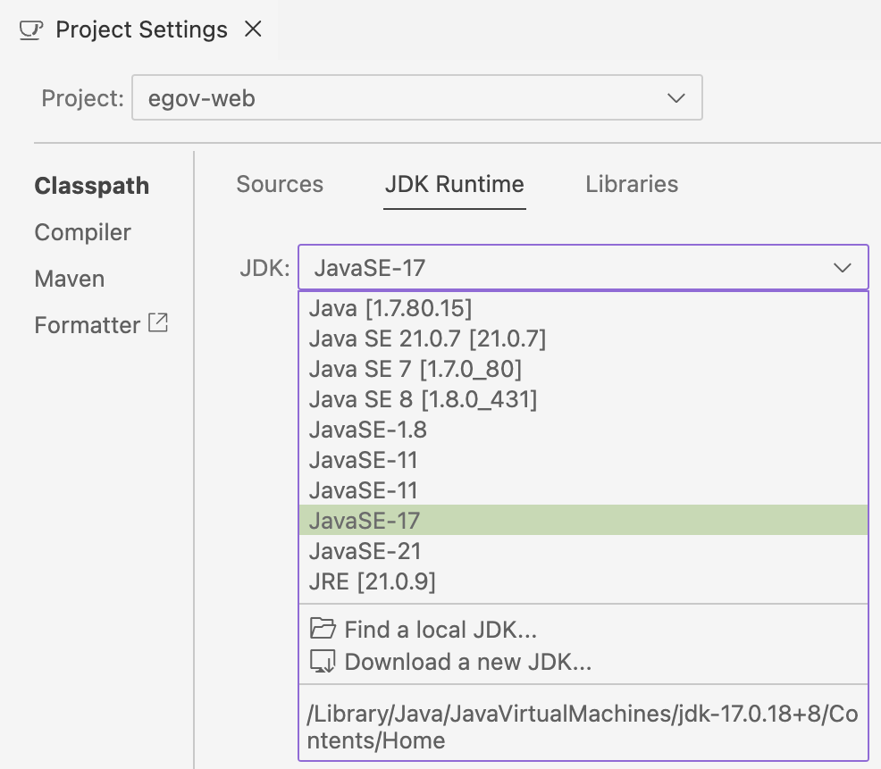

### Compiler 설정

프로젝트가 자동으로 컴파일될 때 어떤 Java 버전으로 컴파일할지를 설정할 수 있다.

> ※ 주의사항
>
> Language support for Java™ for Visual Studio Code 확장은 JDK 8 이상만 지원한다.

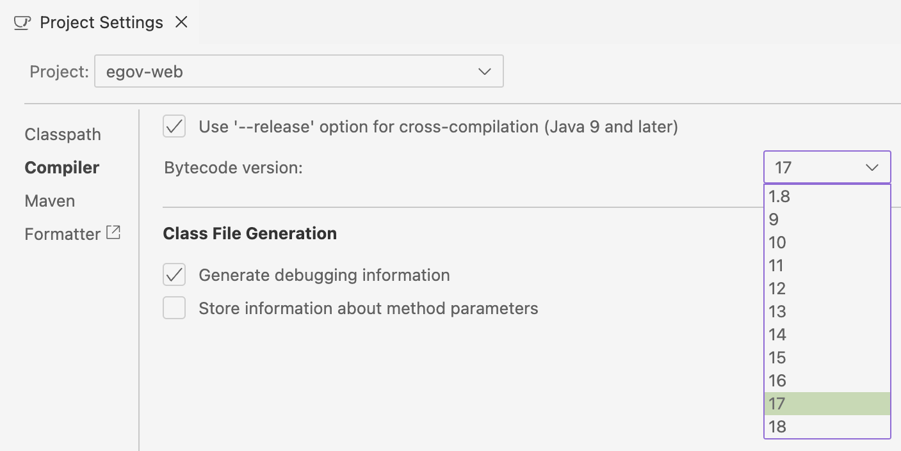

### Classpath 또는 Compile 오류 해결

빌드가 단순히 꼬였을 경우 다음과 같은 방법으로 간단히 해결되는 경우가 많다.

1. VS Code 탐색기창 하단 JAVA Projects 뷰 → 대상 프로젝트 우클릭 → Rebuild Project

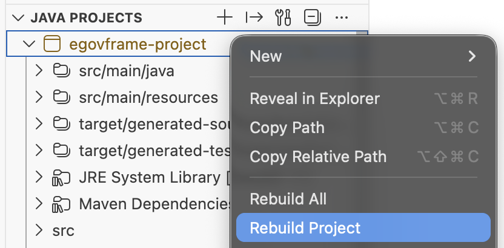

2. VS Code 탐색기창 하단 JAVA Projects 뷰 → 대상 프로젝트 우클릭 → Maven → Reroad Project

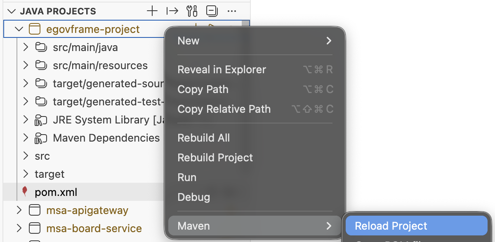

3. VS Code 탐색기창 하단 JAVA PROJECTS 뷰 우측 "···(기타 작업)" → Clean Workspace

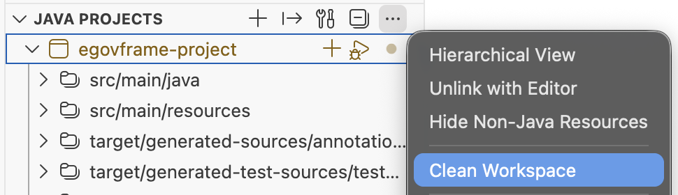

## Maven 기능

### Maven 빌드

터미널에서 Maven 명령을 실행하지 않더라도, Maven 뷰에서 간편하게 Maven 명령을 실행할 수 있다.
- 탐색기 하단 Maven 뷰 → 대상 프로젝트 펼치기 → Lifecycle → 각 Lifecycle 항목 우측 "▷(Run)" 실행

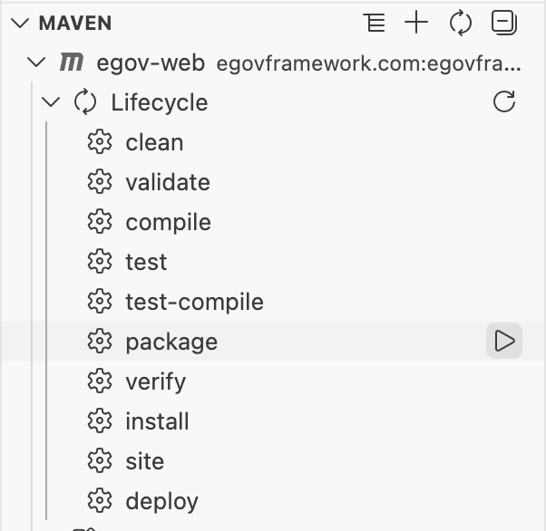

> ※ 참고
>
> Spring Boot가 아닌 일반 Spring Framework가 적용된 프로젝트의 경우 서버를 구동하기 위해 Maven Lifecycle 중 Package 또는 Install을 미리 실행해야 한다.

### Dependency Hierachy

어떠한 Maven 라이브러리가 어떤 의존성 트리 속에 있는지 확인하는 방법은 아래 2가지가 있다. 의존성 충돌로 인해 관련 내용을 살펴봐야 할 때 유용한 기능이다.
- 에디터 창으로 보기 : 탐색기 하단 Maven 뷰 → 대상 프로젝트 우클릭 → Show Dependencies
- Maven 뷰에서 보기 : 탐색기 하단 Maven 뷰 → 대상 프로젝트 펼치기 → Dependencies

## 서버 구동(프로젝트 실행)

### Spring 프로젝트

일반 Spring Framework 프로젝트는 실행을 위해 외부 서버를 활용해야 한다. 본 가이드는 Tomcat을 예시로 설명한다.

#### Maven 빌드 실행

앞서 설명한 Maven 빌드 기능 중 Package 또는 Install을 실행하여 WAR 파일을 만든다.

#### 서버 등록

RSP Provider를 실행한다.
- 탐색기 좌측 사이드바 하단에 "SERVERS" 뷰 → Community Server Connector를 우클릭 → "Start / Connect to RSP Provider" 클릭

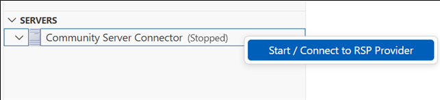

신규 서버 등록 절차를 시작한다.
- Community Server Connector를 우클릭 → "Create New Server" 클릭

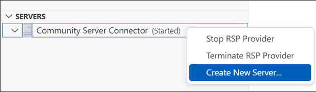

Tomcat을 어디에서 가져올지를 설정한다.
- "Yes" : 외부 인터넷망을 통해 Tomcat을 다운로드
- "No, use server on disk" : 이미 다운받아서 로컬에 있는 Tomcat을 활용

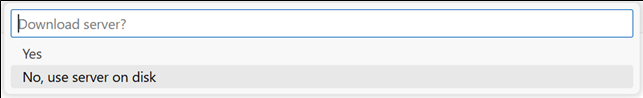

Server 정보를 설정하고 Finish를 클릭하여 서버를 생성한다.

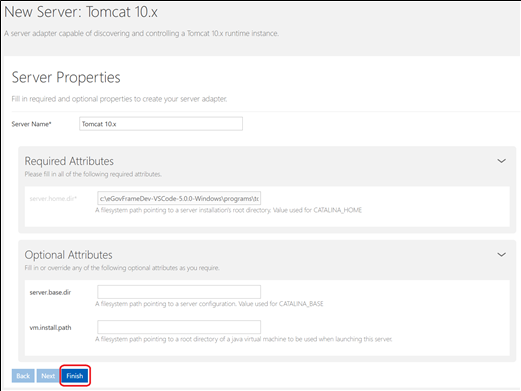

생성되어 등록된 서버는 다음과 같이 확인 가능하다.

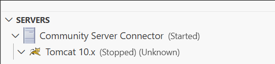

#### 서버 실행

서버가 Stopped 상태라면 Started 상태로 변경한다.

Maven 빌드 결과 `web-project-1.0.0.war` 파일이 생성되었다면, `web-project-1.0.0.war` 파일 또는 `web-project-1.0.0` 폴더를 우클릭하고, Run on Server 메뉴를 클릭한다.

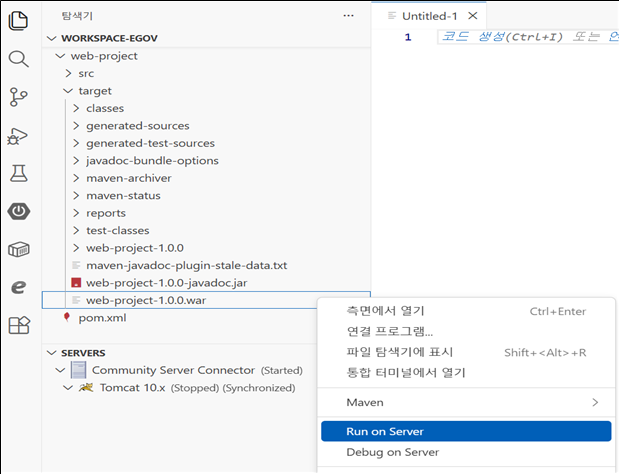

실행할 Tomcat 서버 버전을 선택한다.

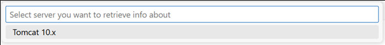

서버 파라미터를 설정한다. 별도의 파라미터 설정이 필요 없다면 No를 클릭하여 넘어간다.

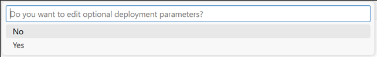

서버 실행이 완료된다.

#### 서버 종료

Tomcat에서 배포파일(war파일)을 제거한다.
- 하단 Servers 뷰에서 Tomcat 10.x 우클릭 → war 파일 우클릭 → Remove Deployment 메뉴

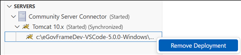

Tomcat 서버를 종료한다.
- 하단 Servers 뷰에서 Tomcat 10.x 우클릭 → Stop Server

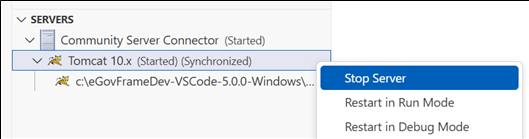

### Spring Boot 프로젝트

Spring Boot 프로젝트는 실행을 위해 외부 서버가 불필요하다.

#### 서버 실행

프로젝트를 실행한다.
- Spring Boot Dashboard Extension 창 열기 → APPS 뷰 → 대상 프로젝트의 “▷(Run)” 버튼을 클릭

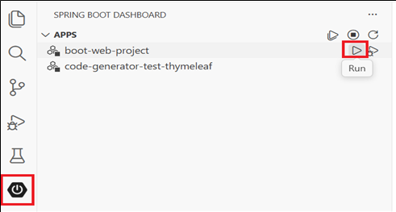

#### 서버 종료

프로젝트를 종료한다.
- Spring Boot Dashboard Extension 창 열기 → APPS 뷰 → 대상 프로젝트의 “□(Stop)” 버튼을 클릭
- 또는 팝업 창 → 대상 프로젝트의 “□(Stop)” 버튼을 클릭

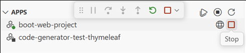