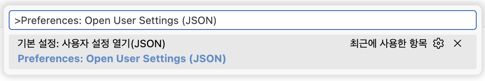

# VS Code 환경 설정 가이드

## 개요

VS Code의 설정은 다음 4가지로 나뉘며, 적용 우선순위는 다음과 같다.

Workspace Settings > User Settings > Application Settings > Default Settings
- Workspace Settings : 현재 VS Code 창이 열린 탐색기(Workspace)에 적용할 설정
- **User Settings** : 현재 VS Code 창을 사용 중인 Profile에 적용할 설정
- Application Settings : 현재 구동중인 VS Code app 전역에 적용할 설정
- Default Settings : VS Code 설치시 기본적으로 내장된 설정 (사용자 수정 불가)

주로 Workspace 또는 User Settings를 설정한다.
본 가이드에서는 User Settings에서 필수적인 설정을 적용하는 방법을 안내한다.

## User Settings 환경 설정

### User Settings 창 열기

명령 팔레트(Command Palette)를 열고 `Preferences: Open User Settings (JSON)` 명령을 실행한다.
- Windows/Linux : `ctrl + shift + p` → `Preferences: Open User Settings (JSON)`
- macOS : `cmd + shift + P` → `Preferences: Open User Settings (JSON)`



이제 각 목차를 살펴보며 필요한 설정을 추가한다.

### Compile 설정

Java 프로젝트를 컴파일하기 위해 필요한 설정이다.
java.configuration.runtimes 배열에 name, path 키를 가진 객체를 여러 개 설정할 수 있다.

```json
{

    "[java]": {
        "editor.defaultFormatter": "redhat.java"
    },
    // Language support for Java™ for Visual Studio Code - Java for compilation of projects
    "java.configuration.runtimes": [
        {
            "name": "JavaSE-17",
            "path": "{로컬에 설치된 JDK 17의 절대경로}",
            "default": true
        },
        {
            "name": "JavaSE-XX",
            "path": "{로컬에 설치된 JDK XX의 절대경로}",
            "default": false
        },
    ],

}
```

### Java Language Server 로드용 JDK 설정

Language support for Java™ for Visual Studio Code 확장이 Java Language Server를 띄우기 위해 사용하는 JDK이다.

> ※ macOS 주의사항
>
> macOS의 경우 VS Code app이 Universal 버전과 non-universal 버전(darwin-x64, darwin-arm64)으로 나뉘며, 다음과 같은 주의사항이 있다.
> - 설치된 VS Code가 universal version이라면, 해당 설정에 반드시 JDK 21 이상이 등록되어야 한다.
> - 설치된 VS Code가 non-universal version이라면, 내장 JRE 21이 사용되므로 해당 설정은 불필요하다.

macOS에 설치된 VS Code의 universal/non-universal version을 확인하는 방법은 다음과 같다.
- macOS : 상단 "Code" 메뉴 클릭 → "Visual Studio Code 정보" 메뉴 클릭 → OS
    - Universal일 경우 OS의 값 : universal
    - Non-universal일 경우 OS의 값 : darwin-x64 또는 darwin-arm64

설치시 칩셋별 선택을 안 했다면, 다운로드 기본값은 Universal 버전이다.

```json
{
    // Language support for Java™ for Visual Studio Code - Java Tooling JDK (Java for loading the Java Language Server)
    "java.jdt.ls.java.home": "{로컬에 설치된 JDK 21 이상의 절대경로}",
}
```

### Maven 실행 파일 설정

Maven for Java 확장의 각 기능은 결국 터미널에서 mvn 명령을 사용한다. 이 설정은 이때 활용될 mvn 실행 파일의 경로이다.

이 설정이 있다면 Maven for Java 확장은 `PATH`에 등록된 mvn을 이 설정으로 덮어쓰지만, 이 설정이 없다면 Maven for Java 확장은 `PATH`에 등록된 mvn을 사용한다.

`MAVEN_HOME` 경로가 아니라, `MAVEN_HOME`/bin 안에 있는 mvn 실행파일의 경로를 지정해야 한다.

```json
{
    // Maven for Java - mvn path (If this value is empty, the extension will use the mvn in PATH. If this value is set, it will override the PATH)
    "maven.executable.path": "{로컬에 설치된 Maven-3.9.9의 mvn 파일의 절대경로}",
}
```

### Maven용 JDK 설정

Maven for Java 확장이 터미널에서 실행할 mvn 명령은 `JAVA_HOME`이 필요하다. 이 설정은 이때 활용될 `JAVA_HOME`을 앞서 설정한 `java.jdt.ls.java.home`으로 대체할지 여부를 지정한다.

만약 이 설정이 false라면, 기본 `PATH`에 등록된 `JAVA_HOME`이 사용되며, 이마저도 없다면 오류가 발생한다.

```json
{
    // Maven for Java - Use java.jdt.ls.java.home as JAVA_HOME to run Maven in the terminal
    "maven.terminal.useJavaHome": true,
}
```

> ※ macOS 주의사항
>
>기본 터미널이 bash가 아닌 zsh를 사용하면서 zshrc 파일에 `JAVA_HOME`을 `PATH`에 등록하여 사용중이라면, 이 설정을 true로 등록하더라도 VS Code에서 Maven이 `java.jdt.ls.java.home`을 사용하는 것이 아니라 zshrc에서 설정한 `JAVA_HOME`이 적용된다.
>
>VS Code 터미널의 환경변수 초기화 시점보다 zsh의 환경변수 초기화 시점이 더 뒤에 이루어지기 때문일 것으로 추정한다.
>
>따라서 이 경우 zshrc에서 JAVA_HOME PATH를 Maven 3.9.9와 호환되는 JDK 버전으로 지정해야 한다(JDK 17 권장).

### Maven용 settings.xml 설정

Maven for Java 확장에 적용할 settings.xml 파일의 경로이다. 만약 이 설정이 없다면, `~/.m2/settings.xml`이 기본값으로 적용된다.

```json
{
    // Maven for Java - settings.xml file path
    "maven.settingsFile": "{Maven settings.xml 파일의 절대경로}",
}
```

### Runtime Server용 JDK 설정

이 설정은 Runtime Server Protocol(RSP) UI 확장이 서버 구동을 위해 사용할 `JAVA_HOME`의 경로를 지정한다.
JDK 11 이상만 지원한다.

```json
{
    // Runtime Server Protocol UI(RSP UI) - JAVA_HOME for Runtime Server Protocol server processes
    "rsp-ui.rsp.java.home": "{로컬에 설치된 JDK 17의 절대경로}",
}
```

### Runtime Server가 자동으로 실행할 Server 설정

이 설정은 Runtime Server Protocol(RSP) UI 확장이 활성화되어 있는 동안 자동으로 시작할 RSP 서버 목록을 지정한다.
Tomcat은 Community Server Connector 확장을 통해 구동할 수 있다.

하지만 따로 해당 설정을 지정하지 않더라도, RSP UI를 활용하게 되면 자동으로 설정이 생성된다.

```json
{
    // Runtime Server Protocol UI(RSP UI) - Mapping RSP Server Connectors to start on activation
    "rsp-ui.enableStartServerOnActivation": [
        {
            "id": "redhat.vscode-community-server-connector",
            "name": "Community Server Connector",
            "startOnActivation": true
        }
    ]
}
```

## 환경 설정 적용(재시작)

명령 팔레트(Command Palette)를 열고 `Developer: Reload Window` 명령을 실행한다.
- Windows/Linux : `ctrl + shift + p` → `Developer: Reload Window`
- macOS : `cmd + shift + P` → `Developer: Reload Window`


