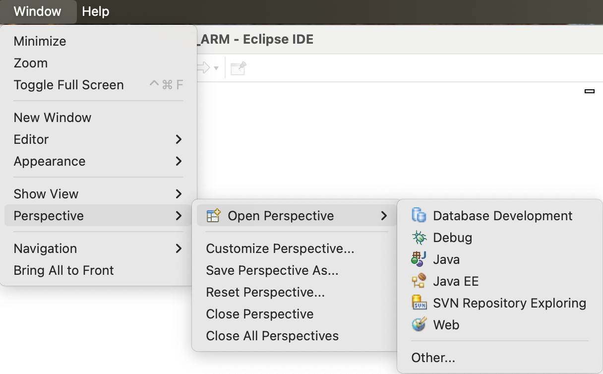
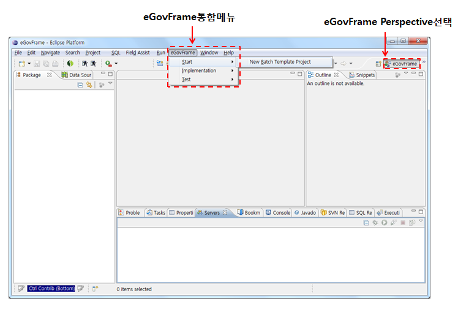
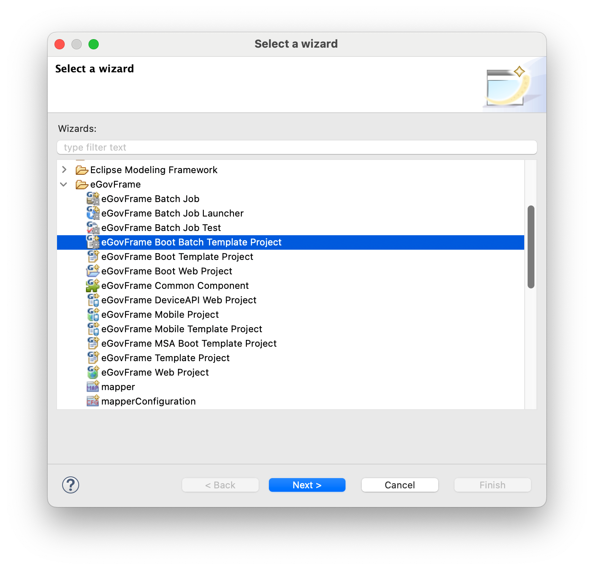
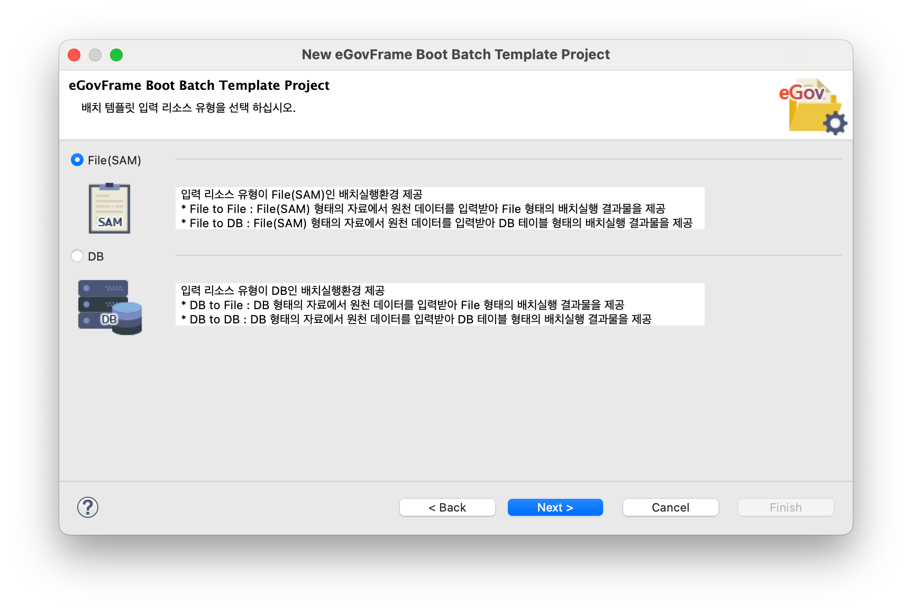
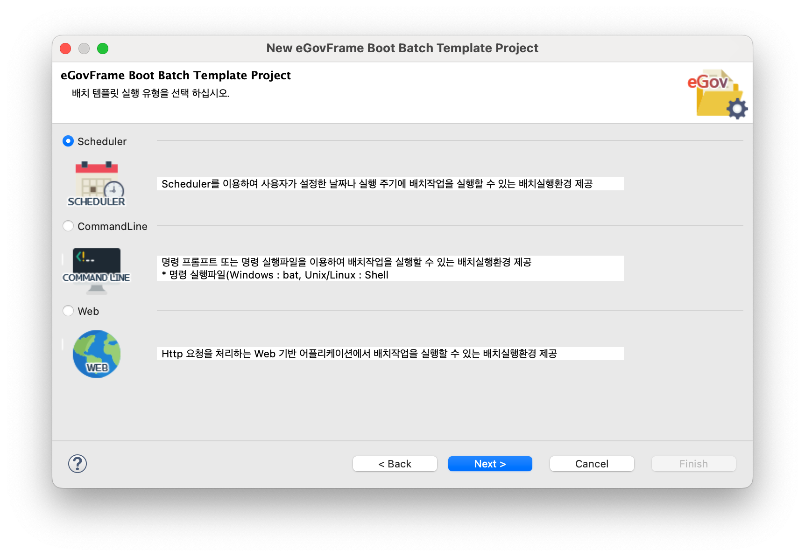

# Batch IDE

## 개요

eGovFrame기반의 배치 어플리케이션 개발 시 개발자 편의성을 위하여 eclipse기반의 Perspective, Menu, 배치 템플릿 생성 마법사 등을 제공한다.

## 설명

기본 eGovFrame Batch IDE 기반에 배치 어플리케이션 개발을 위한 메뉴, 배치 템플릿 생성 마법사 등을 추가하였고, 상세 내용은 다음과 같다.

##### Perspective

eGovFrame Batch IDE 기반으로 배치 메뉴가 추가되며 배치 어플리케이션 개발을 위한 메뉴를 제공한다.

##### Menu

eGovFrame Perspective에서만 활성화되는 메뉴로 eclipse내에서 분산되어 있는 플러그인들의 기능(eGovFrame에서 필히 사용되어지는 기능)을 빠르게 접근할 수 있는 통합 메뉴를 제공한다.

##### 배치 템플릿 소스 코드 생성 마법사

eGovFrame기반의 배치 어플리케이션을 생성 및 설정 후 테스트하기 위한 프로젝트 생성 마법사를 제공한다.

* Batch Template Project Wizard
  * eGovFrame기반의 배치 템플릿 생성 마법사를 제공한다.

## 사용법

#### 1. eGovFrame Perspective

1. Workbench 오른쪽 위의 바로가기 표시줄에 있는 **Open Perspective**단추 를 클릭한다. 메뉴 표시줄의 **Windows** > **Open Perspective** 메뉴와 동일한 기능을 제공한다.
2. Open Perspective 하위에 "Other…"를 선택한다.
3. **eGovFrame** Perspective를 선택한다.

   

4. 제목 표시줄이 변경되어 **eGovFrame**이 표시된다.

   

   ✔ 퍼스펙티브 변경 후에도 배치용 메뉴가 보이지 않을 경우 퍼스펙티브 선택 아이콘에서 **우클릭 > Reset** 을 실행한다.

#### 2. eGovFrame Menu

Perspective를 eGovFrame으로 변경하면 메뉴 표시줄에 **eGovFrame** 메뉴가 표시된다.

| 구분           | 메뉴                             | 설명                                                           |
| -------------- | -------------------------------- | -------------------------------------------------------------- |
| Start          | New Boot Batch Template Project  | New eGovFrame Boot Batch Template Project 생성 마법사 실행     |
| Implementation | New Batch Job                    | 배치 작업 파일 생성 마법사 실행                                |
|                | New Batch Job Launcher           | 배치 작업 실행 파일 생성 마법사 실행                           |
| Test           | Batch Job Test                   | 배치 관련 파일을 활용하여 간단히 테스트할 수 있는 테스트 마법사 실행 |

#### 3. eGovFrame Boot Batch Template Project 생성 마법사

##### 3.1. eGovFrame Boot Batch Template Project 생성 마법사 구동 방법

1. 메뉴 표시줄에서 **File** > **New** > **eGovFrame Boot Batch Template Project**를 선택한다. (단 eGovFrame Perspective내에서)
   또는, **Ctrl+N** 단축키를 이용하여 새로작성 마법사를 실행한 후 **eGovFrame** > **eGovFrame Boot Batch Template Project**을 선택하고 **Next**를 클릭한다.

   

2. 배치 템플릿 입력 리소스 유형(File(SAM), DB)을 선택하고, **Next**를 클릭한다.

   

3. 배치 템플릿 실행 유형(Scheduler, CommandLine, Web)을 선택하고, **Next**를 클릭한다.

   

4. 위의 2, 3 과정에서 선택한 입력 리소스 유형(File(SAM), DB)과 실행 유형(Scheduler, CommandLine, Web)에 따라 배치 템플릿 마법사 프로젝트 설정 단계를 계속 진행한다.

✔ 계속되는 상세 사용법은 [Batch Template Project Wizard](./batch-ide-batch-template-wizard.md#계속-진행)를 참고한다.