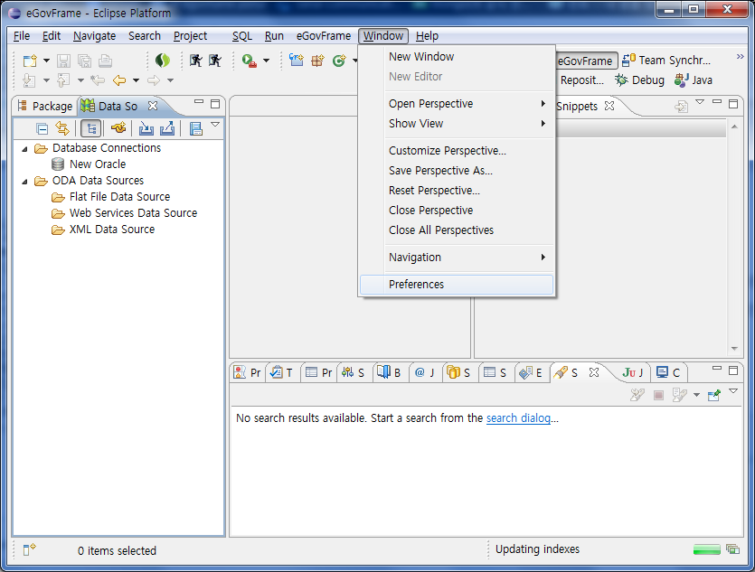

# Batch Configuration

## 개요

배치개발환경을 이용할 경우 배치 관련 설정 사항들인 Job Parameter, Job Reader/Writer, Listener를 편리하게 사용하기 위한 관리 환경을 제공한다.

## 설명

배치개발환경에서 제공하는 다수의 마법사 사용 중 설정 정보를 관리하는 환경을 제공한다.

* [Job Parameters 설정](../test-tool/batch-job-test-wizard.md)
* [Job Reader 설정](./batch-ide-batch-job-wizard.md) / [Job Writer 설정](./batch-ide-batch-job-wizard.md)
* [Listeners 설정](./batch-ide-batch-job-wizard.md)

✔ 다음의 메뉴를 통해 접근하여 사용 가능하다.

