# Batch Job Launcher Wizard

## 개요

개발자 편의성을 위하여 사용자 정의에 따라 배치 작업 실행 파일을 자동으로 생성해주는 마법사를 제공한다.

## 설명

배치 작업을 실행하기 위해 기본적으로 구성되어야 하는 JobLauncher, JobOperator, JobExplorer, JobRegistry등의 정보를 담은 파일을 생성하는 마법사를 제공한다.

* 배치 작업 실행 항목 설명

| 항목            | 설명                                                                                    | 기본값              |
| --------------- | --------------------------------------------------------------------------------------- | ------------------- |
| Launcher ID     | 배치작업을 실행시키는 역할을 한다.                                                      | jobLauncher         |
| Execution Type  | Job을 실행 설정으로 Synchronous, Asynchronous 중 선택하여 사용한다.                     | Synchronous 선택    |
| Operator ID     | Job을 제어하여 일반적인 모니터링 작업을 위해 사용한다.                                  | jobOperator         |
| Explorer ID     | Repository에 접근하여 배치작업에 대한 정보를 얻는다.                                    | jobExplorer         |
| Registry ID     | 생성된 Job을 Map 형태로 추가, 삭제 등의 관리한다.                                       | jobRegistry         |
| Repository Type | CRUD의 기능을 담고 있는 집합체로 DB(Reference), DB(New), Memory 중 선택하여 사용한다.   | DB(Reference) 선택  |

✔ **주의**

Repository Type은 JobRepository 설정이 프로젝트 내에 존재하지 않을 경우 사용 가능하다. 즉, JobRepository의 경우 프로젝트 당 하나만 존재할 수 있다.
왜냐하면 제공하는 context-batch-job-launcher.xml 은 내부적으로 SimpleJobLauncher를 갖고 있는데 여기서 빈 ID가 jobRepository 인 클래스를 사용하도록 설정되어 있다. 또한, Job과 Step의 수행에서 내부적으로 빈 ID가 jobRepository 인 클래스를 읽도록 설정되어 있기 때문이다.

✔ **Tip**

기존 전자정부 표준프레임워크 프로젝트를 사용하던 개발자들은 [Batch Nature](https://www.egovframe.go.kr/wiki/doku.php?id=egovframework:dev2:bdev:imp:add_batch_nature)만 추가시켜 배치개발환경을 사용할 수 있다.

## 사용법

1. 배치 작업 실행 생성 마법사 시작하기

   * 메뉴 표시줄에서 **File** > **New** > **eGovFrame Batch Job Launcher**를 선택한다. (단 eGovFrame Perspective내에서)

     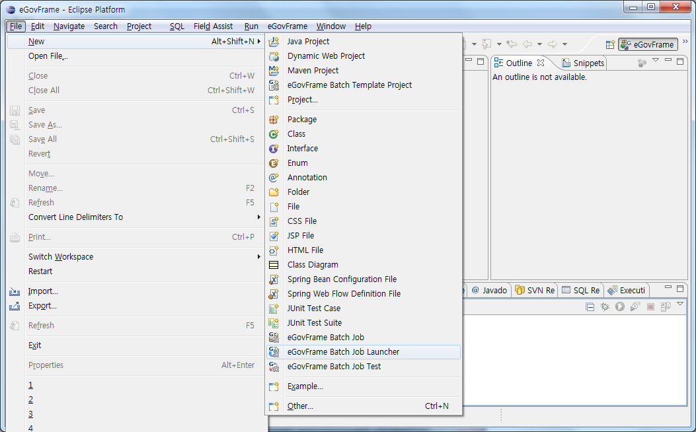

   * 또는, 메뉴 표시줄에서 **eGovFrame** > **Implementation** > **New Batch Job Launcher**를 선택한다. (단 eGovFrame Perspective내에서)

     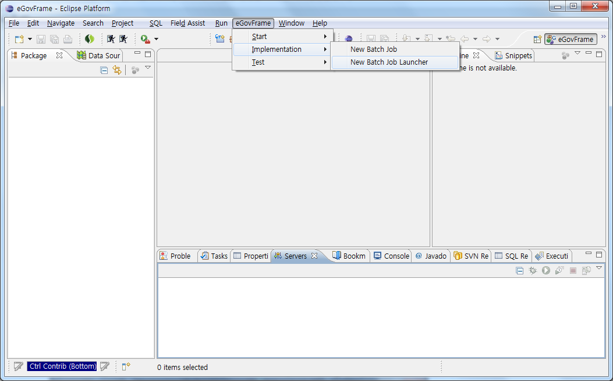

   * 또는, **Ctrl+N** 단축키를 이용하여 새로작성 마법사를 실행한 후 **eGovFrame** > **eGovFrame Batch Job Launcher**를 선택하고 **Next**를 클릭한다.

     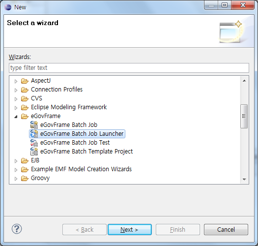

     ✔ File > New > eGovFrame Batch Job Launcher 메뉴가 보이지 않을 경우 **eGovFrame Perspective**를 **Reset**해주면 된다.

     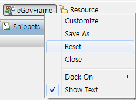

2. 배치 작업 실행 파일을 생성할 프로젝트 및 하위 경로를 선택하고 폴더를 생성한 후 파일명을 입력하고 **Next**를 클릭한다.

   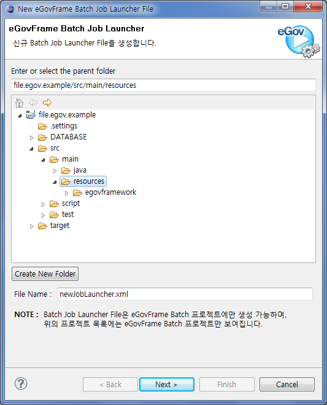

   ✔ 배치 작업 실행 파일의 경우 차후에 정상적인 테스트를 위해 프로젝트의 **src/main/resources 혹은 src/test/resources** 하위에 생성해야 한다.

3. 배치 작업 실행 파일의 각 항목을 입력한다.

   * (1) **Launcher ID**를 입력한다. (런쳐 파일 최초 생성 시 안내명을 따르도록 권장한다.)

     

   * (2) **Execution Type**을 설정한다. (Execution Type의 경우 TaskExecutor를 설정하여 Job을 동기실행 혹은 비동기실행으로 설정한다.)

     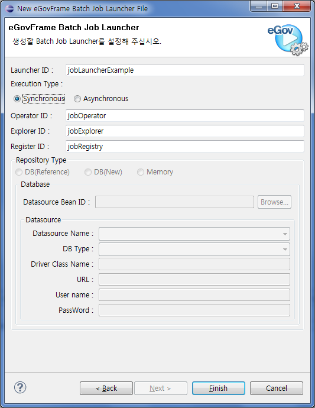

   * (3) **Operator ID**, **Explorer ID**, **Register ID**를 입력한다. (런쳐 파일 최초 생성 시 안내명을 따르도록 권장한다.)

     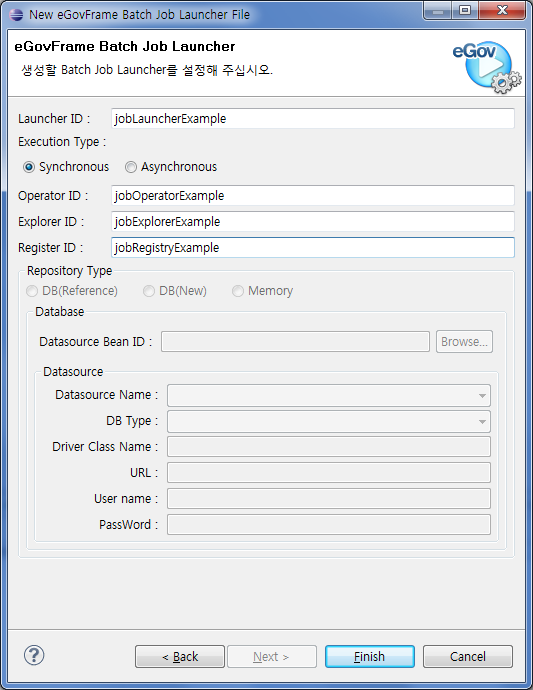

   * (4) **Repository Type**을 설정한다.

     * **DB(Reference)**: 선택한 프로젝트 내에 datasource를 등록하여 사용한 경우 사용자의 편리를 위하여 등록된 datasource를 찾아 바로 사용할 수 있는 기능을 제공하고 있다.

       * 처음 프로젝트 내에 datasource가 설정되어 있는 런쳐파일이 없을 경우 아래와 같은 위저드가 출력된다.

         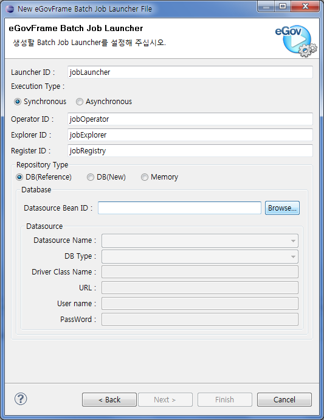

       * 프로젝트 내에 사용하고 있는 datasource 중 사용할 datasource를 선택한다.

         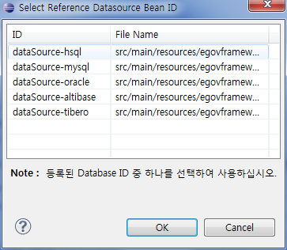

       * 사용 중인 datasource를 사용하겠다는 정보가 입력된다.

         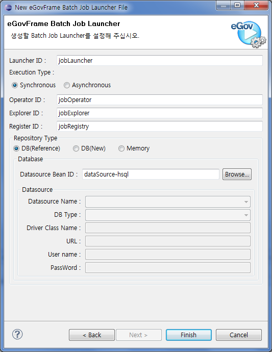

     * **DB(New)**: DB를 사용할 경우 Data Source Explorer에 등록한 사용자의 DB 중 하나를 선택하여 XML에 자동으로 [datasource](./dbio-editor-data-source-explorer.md)를 등록할 수 있는 기능을 제공하고 있다.

       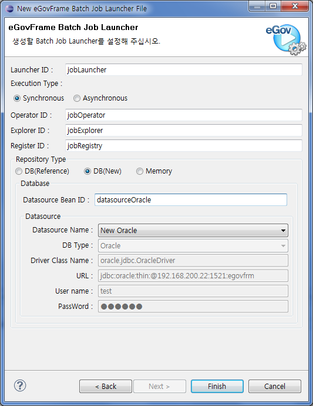

       ✔ 단, DB의 경우 5가지의 DB(HSQLDB, MySql, Oracle, Tibero, Altibase)외의 DB에 대해서는 지원하지 않는다.

     * **Memory**: Memory(주기억장치)를 사용하는 기능을 제공하고 있다.

       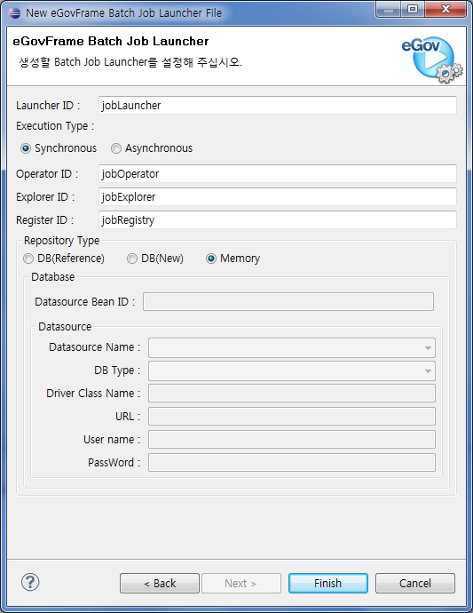

     * **Repository Type 비활성화**: 선택한 프로젝트에 JobRepository가 이미 존재하는 경우 아래와 같이 Repository Type이 비활성화 된다.

       

4. 입력을 완료한 후 **Finish**를 클릭하여 생성된 배치 작업 실행 XML 파일을 확인한다.

```xml
.
.
.
<bean id="newJobLauncher.egovBatchRunner" class="egovframework.brte.core.launch.support.EgovBatchRunner">
    <constructor-arg ref="jobRepository" />
    <constructor-arg ref="jobOperatorExample" />
    <constructor-arg ref="jobExplorerExample" />
</bean>
<bean id="jobLauncherExample" class="org.springframework.batch.core.launch.support.SimpleJobLauncher">
    <property name="jobRepository" ref="jobRepository" />
</bean>
<bean id="jobRegistryExample" class="org.springframework.batch.core.configuration.support.MapJobRegistry" />
<bean class="org.springframework.batch.core.configuration.support.JobRegistryBeanPostProcessor">
    <property name="jobRegistry" ref="jobRegistryExample" />
</bean>
<bean id="jobOperatorExample" class="org.springframework.batch.core.launch.support.SimpleJobOperator" p:jobLauncher-ref="jobLauncherExample" p:jobExplorer-ref="jobExplorerExample" p:jobRepository-ref="jobRepository" p:jobRegistry-ref="jobRegistryExample" />
<bean id="jobExplorerExample" class="org.springframework.batch.core.explore.support.JobExplorerFactoryBean" />
.
.
.
```

### 참고사항

* 배치 작업 실행에 대해 더 자세한 설명이 필요한 경우 전자정부 표준프레임워크 배치 핵심 [Job Launcher](./batch-ide-batch-job-launcher-wizard.md) 가이드를 참고한다.
* Spring의 경우 bean id 중복을 불허하기 때문에 전자정부 프레임워크 배치개발환경에서도 기존에 등록된 bean id의 중복 등록을 방지하고 있다.
* 생성한 배치 작업 실행 파일의 경우 [Batch Job Test에서 신규 Test 구성시 활용](https://www.egovframe.go.kr/wiki/doku.php?id=egovframework:dev2:bdev:tst:batch_job_test_wizard#설명)된다.