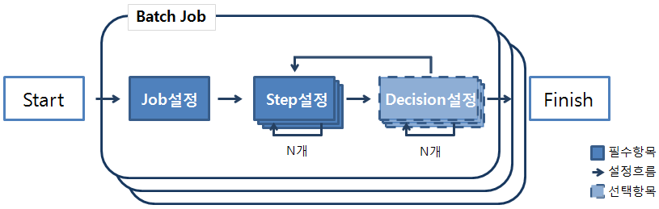
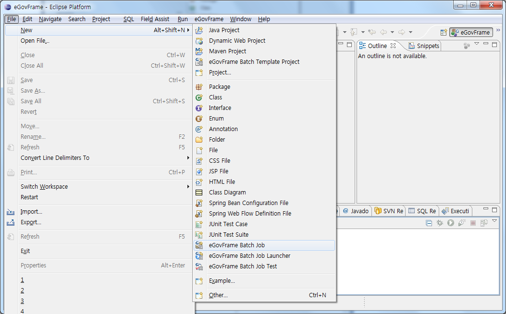
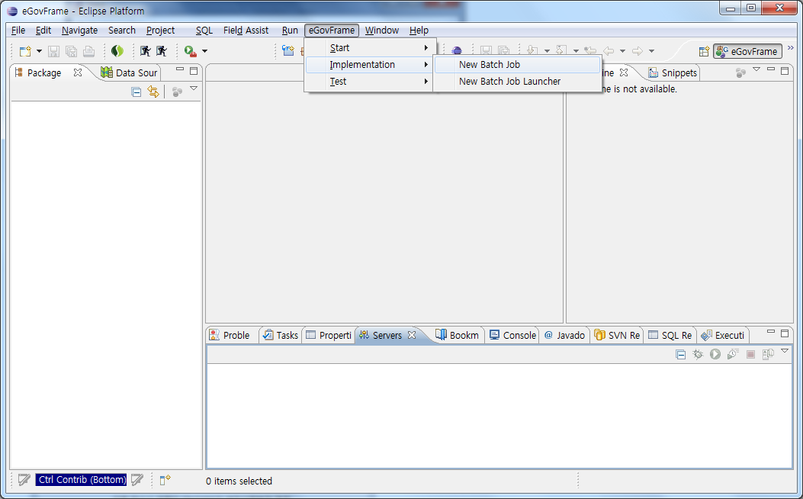
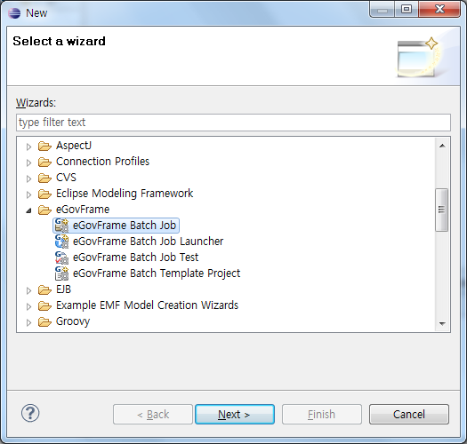
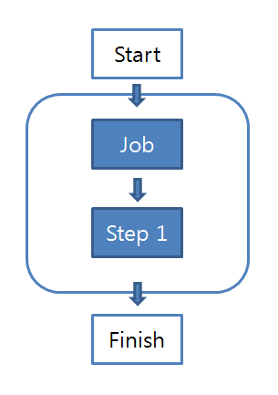
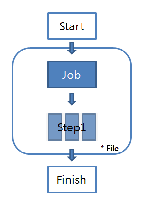
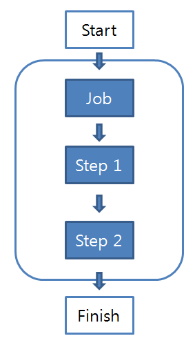
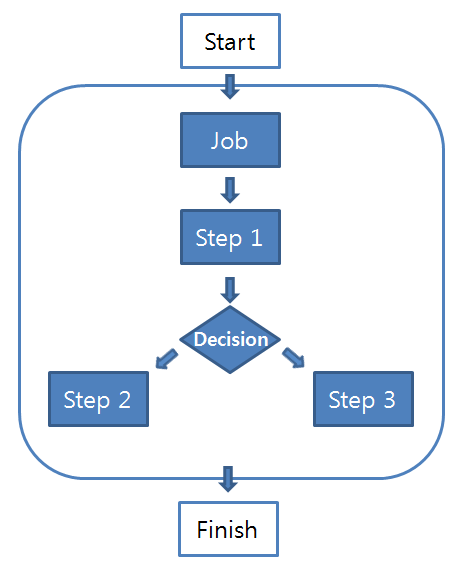

# Batch Job Wizard

## 개요

개발자 편의성을 위하여 사용자 정의에 따라 기본적인 배치 작업 파일 템플릿을 자동으로 생성해주는 마법사를 제공한다.

## 설명

배치 작업을 위해 Job, Step, Decision 등의 항목을 추가하여 파일을 생성하는 마법사를 제공한다.

* 배치 작업 흐름

  

* 배치 작업 구성 항목 별 설명

  하단의 각 항목 선택 시 항목별 제공하는 마법사의 상세 설명을 볼 수 있다.

  | 항목     | 설명                                                                                | 항목의 하위 구성 요소                                                                                                                                                   |
  | -------- | ----------------------------------------------------------------------------------- | ----------------------------------------------------------------------------------------------------------------------------------------------------------------------- |
  | [Job](../../egovframe-runtime/batch-layer/batch-core-job.md)      | 배치 전반적 프로세스를 포괄하고 있는 객체                                           | Job ID, Restartable, [Job Listeners](https://www.egovframe.go.kr/wiki/doku.php?id=egovframework:dev2:bdev:imp:create_batch_job_wizard:listener_mgmt#배치_작업_파일_생성시_job_listener_적용)                                                                                                                                      |
  | [Step](../../egovframe-runtime/batch-layer/batch-core-step.md)     | 배치 실행시 Job 내부에서 각 단계별로 분리되어 독립적으로 일어나는 하나의 프로세스   | Step Type, Step ID, next, [Reader](https://www.egovframe.go.kr/wiki/doku.php?id=egovframework:dev2:bdev:imp:create_batch_job_wizard:job_reader_mgmt#배치_작업_파일_생성시_job_reader_적용), [Writer](https://www.egovframe.go.kr/wiki/doku.php?id=egovframework:dev2:bdev:imp:create_batch_job_wizard:job_writer_mgmt#배치_작업_파일_생성시_job_writer_적용), Commit-Interval, [Step Listeners](https://www.egovframe.go.kr/wiki/doku.php?id=egovframework:dev2:bdev:imp:create_batch_job_wizard:listener_mgmt#배치_작업_파일_생성시_step_listener_적용), [Chunk Listeners](https://www.egovframe.go.kr/wiki/doku.php?id=egovframework:dev2:bdev:imp:create_batch_job_wizard:listener_mgmt#배치_작업_파일_생성시_chunk_listener_적용), Shared values                                                               |
  | [Decision](https://www.egovframe.go.kr/wiki/doku.php?id=egovframework:dev2:bdev:imp:create_batch_job_wizard:decision_info_mgmt) | 배치 실행시 사용자가 분기점을 지정하여 Step의 흐름 조정 가능                        | Decision ID, Next(on, to), End(on, exit-code), Fail(on, exit-code), Stop(on, restart)                                                                                  |

**주의**

✔ 모든 Job에는 최소 한 개 이상의 Step을 등록해야 한다.
✔ 하나의 Job 내에 두 개 이상의 Step을 등록할 경우 반드시 Next를 지정해주어야 한다.

**Tip**

✔ 배치 작업 파일을 생성하지 전에 **input 파일을 미리 준비**해두면 마법사에서 Resource 등에 input 파일의 경로 입력을 손쉽게 할 수 있다.
✔ DB를 사용하는 배치 작업을 구성할 경우 배치 작업 파일을 생성하지 전에 **데이터를 객체화 할 클래스인 VO class**를 우선적으로 구성해 놓아야한다.
✔ **기존 전자정부 표준프레임워크 프로젝트를 사용하던 개발자들**은 [Batch Nature](https://www.egovframe.go.kr/wiki/doku.php?id=egovframework:dev2:bdev:imp:add_batch_nature)만 추가시켜 배치개발환경을 사용할 수 있다.

## 사용법

1. 배치 작업 생성 마법사 시작하기

   * 메뉴 표시줄에서 **File** > **New** > **eGovFrame Batch Job**을 선택한다. (단 eGovFrame Perspective내에서)

     

   * 또는, 메뉴 표시줄에서 **eGovFrame** > **Implementation** > **New Batch Job**을 선택한다. (단 eGovFrame Perspective내에서)

     

   * 또는, **Ctrl+N** 단축키를 이용하여 새로작성 마법사를 실행한 후 **eGovFrame** > **eGovFrame Batch Job**을 선택하고 **Next**를 클릭한다.

     

2. 원하는 형태의 배치 작업 파일을 생성하기 위해 다양한 형태로 입력값을 작성한다.

   각 예제 보기를 클릭할 경우 생성하는 과정을 안내 받을 수 있다.

   | 예제1 | 예제2 | 예제3 | 예제4 |
   | ---- | ---- | ---- | ---- |
   | - Job:1개 - Normal\_Step:1개 | - Job:1개 - Partition(File)\_Step:1개 | - Job:1개 - Normal\_Step:2개 | - Job:1개 - Normal:Step:3개 - Decision:1개 |
   |  |  |  |  |
   | [예제1](https://www.egovframe.go.kr/wiki/doku.php?id=egovframework:dev2:bdev:imp:create_batch_job_wizard:create_job_example_one) | [예제2](https://www.egovframe.go.kr/wiki/doku.php?id=egovframework:dev2:bdev:imp:create_batch_job_wizard:create_job_example_two) | [예제3](https://www.egovframe.go.kr/wiki/doku.php?id=egovframework:dev2:bdev:imp:create_batch_job_wizard:create_job_example_three) | [예제4](https://www.egovframe.go.kr/wiki/doku.php?id=egovframework:dev2:bdev:imp:create_batch_job_wizard:create_job_example_four) |
   

### 참고사항

* 배치 작업에 대해 더 자세한 설명이 필요한 경우 전자정부 표준프레임워크 배치 핵심 Job 가이드를 참고한다.
* Spring의 경우 bean id 중복을 불허하기 때문에 전자정부 프레임워크 배치개발환경에서도 기존에 등록된 bean id의 중복 등록을 방지하고 있다.